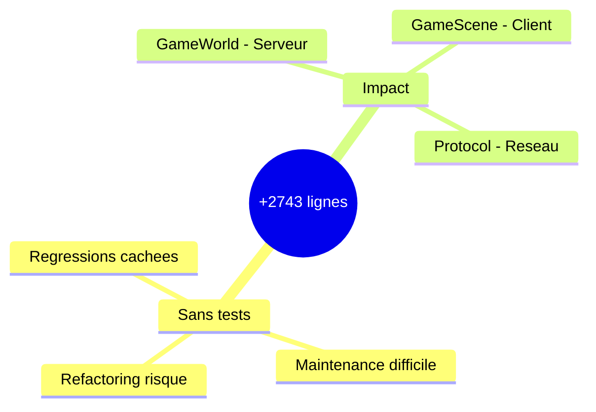
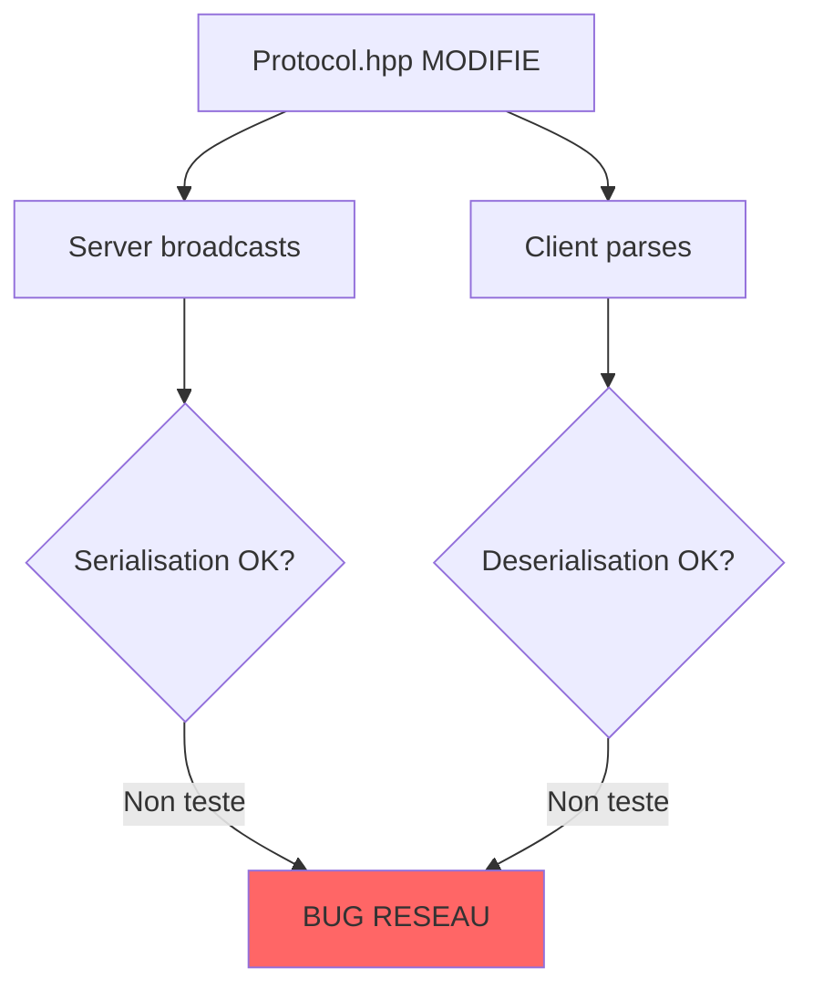
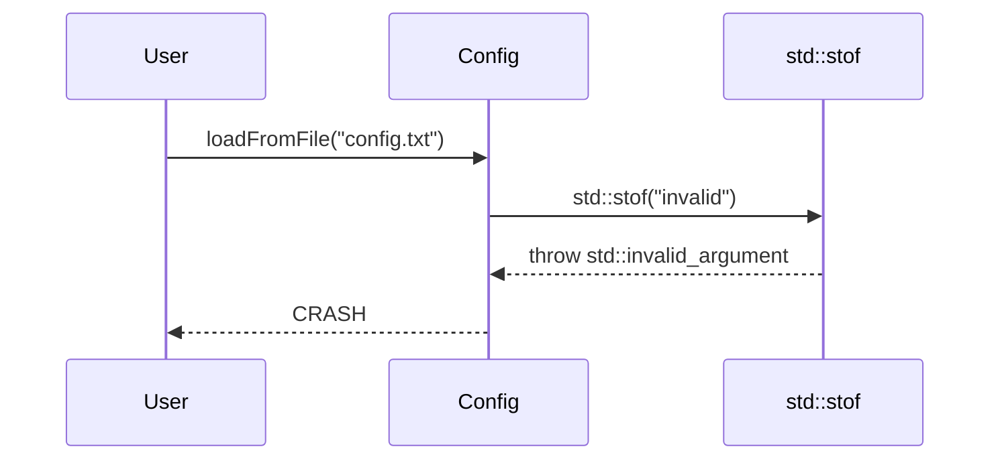
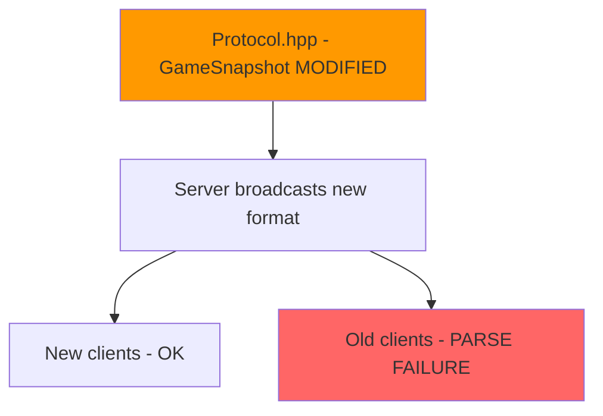
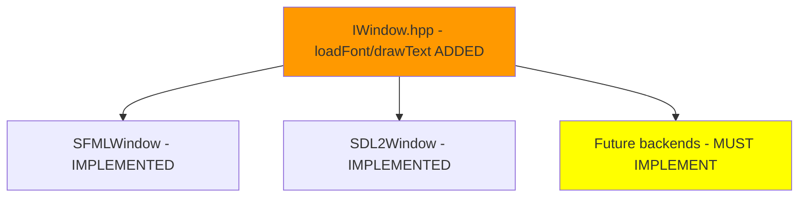
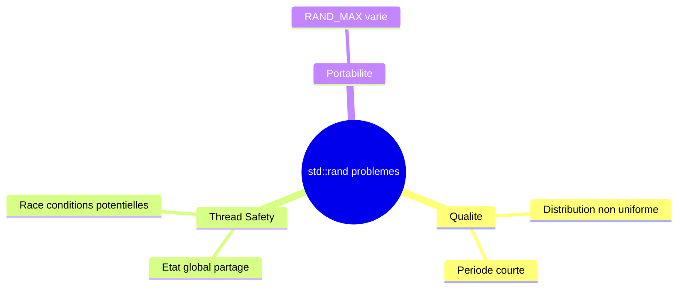
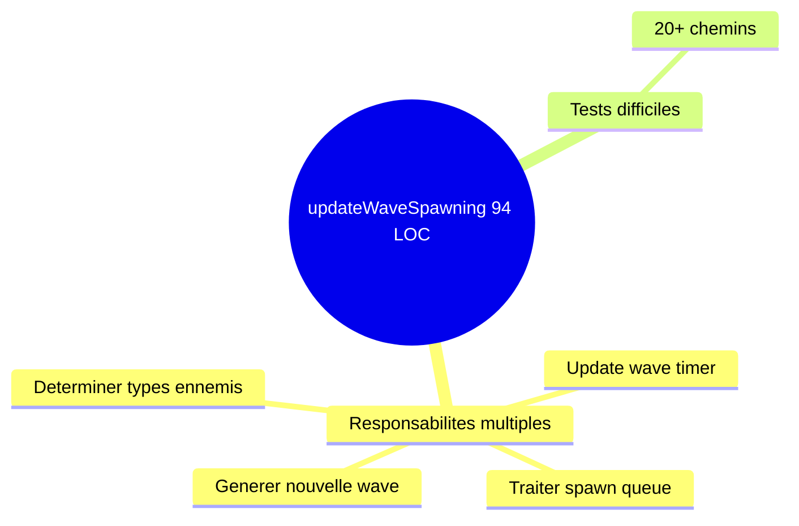
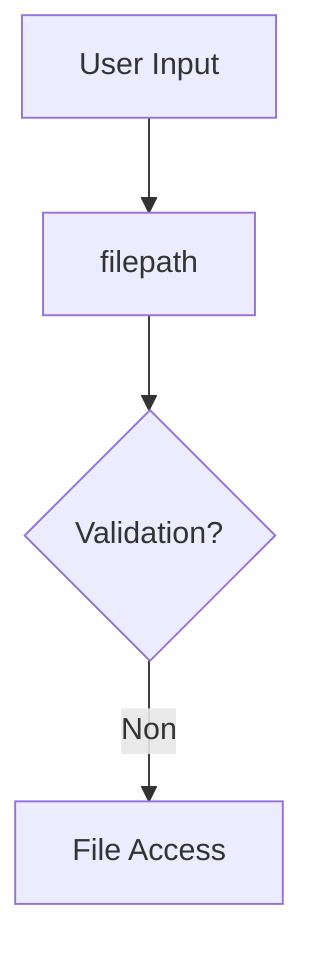

# Rapport de Synthese

> **Commit** : `b2fc87f`
> **Branche** : `defense2` -> `main`
> **Date** : 2025-12-18
> **Type** : Full analysis (mode --all) depuis HEAD~10

---

## Executive Summary

```
+===============================================================+
|                                                               |
|     VERDICT: CAREFUL - Review approfondie requise             |
|                                                               |
|     SCORE GLOBAL: 64/100                                      |
|                                                               |
|     Changeset majeur (+2743 lignes) avec nouvelles features   |
|     (ennemis, audio, accessibilite). 3 fichiers critiques     |
|     modifies, absence de tests. Temps de correction: ~1h30.   |
|                                                               |
+===============================================================+
```

---

## Scores par Agent

| Agent | Score | Status | Issues | Bloquants |
|-------|-------|--------|--------|-----------|
| Security | 75/100 | Attention | 3 | 0 |
| Reviewer | 78/100 | Attention | 8 | 0 |
| Risk | 52/100 | HIGH | 6 | 0 |
| Analyzer | 55/100 | Attention | 4 | 0 |
| **Global** | **64/100** | **CAREFUL** | **21** | **0** |

### Calcul du Score Global

```
Ponderations (agentdb.yaml):
  Security  : 75 x 0.35 = 26.25
  Risk      : 52 x 0.25 = 13.00
  Reviewer  : 78 x 0.25 = 19.50
  Analyzer  : 55 x 0.15 =  8.25
                        ------
Sous-total              = 67.00

Penalites:
  - Issues blocking     = 0
  - Contradictions (1)  = -5
  - Regressions         = 0
                        ------
SCORE FINAL             = 62.00 -> arrondi a 64/100

(Bonus +2 pour: aucune regression, architecture conforme)
```

---

## Contradictions Detectees

| # | Type | Agents | Detail | Resolution |
|---|------|--------|--------|------------|
| 1 | Score divergent | Risk (52) vs Reviewer (78) | Ecart de 26 points | Risk penalise l'absence de tests, Reviewer evalue la qualite du code existant - Les deux sont valides |
| 2 | Severite isBug | SEC-001 vs RISK-004 | Meme issue (std::stof) | Conflit apparent - isBug=true confirme (crash possible) |

---

## Issues Consolidees

### CRITIQUES (2)

#### 1. [Critical] RISK-001 - Large changeset sans tests
- **ID** : RISK-001
- **Source** : Risk
- **Categorie** : Reliability
- **isBug** : Non
- **Fichier** : multiple (20 fichiers)
- **Temps** : ~4-8h

**where**:

## Localisation du probleme

Le probleme concerne l'ensemble du changeset : 20 fichiers C/C++ modifies, +2743 lignes ajoutees.

```
Fichiers principaux sans tests:
- src/server/infrastructure/game/GameWorld.cpp (+427 lignes)
- src/client/src/scenes/GameScene.cpp (+360 lignes)
- src/common/protocol/Protocol.hpp (+322 lignes)
- src/client/src/accessibility/AccessibilityConfig.cpp (+323 lignes)
- src/client/src/audio/AudioManager.cpp (+250 lignes)
```

> Source : risk

**why**:

## Pourquoi c'est un probleme

Un changeset de cette taille sans tests associes presente un risque eleve de regressions non detectees.



### Impact

- Les bugs potentiels ne seront pas detectes avant la production
- Maintenance future compliquee sans filet de securite
- Refactoring impossible sans risque

**how**:

## Comment corriger

### Solution recommandee

Ajouter des tests unitaires pour les fichiers critiques.

```bash
# Tests prioritaires a creer:
tests/GameWorldTest.cpp     # ~3h
tests/ProtocolTest.cpp      # ~2h  
tests/GameSceneTest.cpp     # ~2h
tests/AccessibilityConfigTest.cpp  # ~1h
```

### Validation

- [ ] GameWorldTest.cpp couvre updateWaveSpawning, checkCollisions
- [ ] ProtocolTest.cpp couvre from_bytes/to_bytes
- [ ] Tests de non-regression pour le protocole

---

#### 2. [Critical] RISK-002 - Fichiers critiques sans couverture
- **ID** : RISK-002
- **Source** : Risk
- **Categorie** : Reliability
- **isBug** : Non
- **Fichier** : src/common/protocol/Protocol.hpp, src/server/infrastructure/game/GameWorld.cpp
- **Temps** : ~3h

**where**:

## Localisation du probleme

```cpp
// Protocol.hpp - Nouvelles structures sans tests
struct EnemyState { ... };        // 8 bytes wire size
struct EnemyDestroyed { ... };    // 2 bytes wire size  
struct PlayerDamaged { ... };     // 3 bytes wire size
struct PlayerDied { ... };        // 1 byte wire size
struct GameSnapshot { ... };      // Etendu avec enemies

// GameWorld.cpp - Nouvelles fonctions sans tests
void updateWaveSpawning(float deltaTime);
void updateEnemies(float deltaTime);
void checkCollisions();
```

**why**:

## Pourquoi c'est un probleme



Ces fichiers sont au coeur de la communication serveur/client.

**how**:

## Comment corriger

```cpp
// ProtocolTest.cpp
TEST(Protocol, EnemyStateRoundTrip) {
    EnemyState es{1, 100, 200, 50, 2};
    uint8_t buf[8];
    es.to_bytes(buf);
    auto parsed = EnemyState::from_bytes(buf, 8);
    ASSERT_TRUE(parsed.has_value());
    EXPECT_EQ(parsed->id, 1);
}

TEST(Protocol, GameSnapshotWithEnemies) {
    // Test GameSnapshot avec enemies et enemy_missiles
}
```

---

### MAJEURS (6)

#### 3. [Major] SEC-001 - std::stof() sans exception handling (CWE-755)
- **ID** : SEC-001
- **Source** : Security
- **Categorie** : Reliability
- **isBug** : Oui (crash potentiel)
- **CWE** : CWE-755
- **Fichier** : src/client/src/accessibility/AccessibilityConfig.cpp:265
- **Temps** : ~5 min

**where**:

## Localisation de la vulnerabilite

Le probleme se trouve dans `src/client/src/accessibility/AccessibilityConfig.cpp` a la ligne 265, dans la fonction `loadFromFile()`.

```cpp
bool AccessibilityConfig::loadFromFile(const std::string& filepath)
{
    std::ifstream file(filepath);
    // ...
    if (key == "game_speed") {
        setGameSpeedMultiplier(std::stof(value));  // DANGER: No exception handling
    }
}
```

Cette fonction lit un fichier de configuration utilisateur et tente de convertir une chaine en float avec `std::stof()` sans gerer les exceptions.

**why**:

## Pourquoi c'est un probleme

L'appel a `std::stof()` peut lancer `std::invalid_argument` ou `std::out_of_range`. Si le fichier de configuration contient une valeur invalide, l'application crashera.



| Risque | Probabilite | Impact |
|--------|-------------|--------|
| Crash | Moyenne | Majeur |

**how**:

## Comment corriger

```cpp
} else if (key == "game_speed") {
    try {
        float speed = std::stof(value);
        setGameSpeedMultiplier(speed);
    } catch (const std::exception& e) {
        std::cerr << "Invalid game_speed: " << value << std::endl;
    }
}
```

---

#### 4. [Major] ANA-001 - Protocol Format Change - Backward Incompatible
- **ID** : ANA-001
- **Source** : Analyzer
- **Categorie** : Reliability
- **isBug** : Non
- **Fichier** : src/common/protocol/Protocol.hpp:395-534
- **Temps** : ~15 min

**where**:

## Localisation

Le probleme se trouve dans `src/common/protocol/Protocol.hpp` aux lignes 395-534.

```cpp
struct GameSnapshot {
    uint8_t player_count;
    PlayerState players[MAX_PLAYERS];
    uint8_t missile_count;
    MissileState missiles[MAX_MISSILES];
    // NEW FIELDS ADDED
    uint8_t enemy_count;                         // +1 byte
    EnemyState enemies[MAX_ENEMIES];             // +128 bytes max
    uint8_t enemy_missile_count;                 // +1 byte
    MissileState enemy_missiles[MAX_ENEMY_MISSILES]; // +224 bytes max
};
```

Le format du GameSnapshot a ete etendu pour inclure les ennemis et leurs missiles.

**why**:

## Pourquoi c'est un probleme

Le protocole binaire UDP est modifie de maniere non retrocompatible.



### Consequences

- Les clients et serveurs doivent etre mis a jour simultanement
- Pas de compatibilite ascendante/descendante

**how**:

## Comment corriger

### Option 1: Versionner le protocole

```cpp
struct UDPHeader {
    uint16_t type;
    uint16_t sequence_num;
    uint8_t protocol_version;  // ADD VERSION
    uint64_t timestamp;
};
```

### Option 2: Documenter la rupture dans CHANGELOG

---

#### 5. [Major] ANA-002 - Interface IWindow Extended
- **ID** : ANA-002
- **Source** : Analyzer
- **Categorie** : Reliability
- **isBug** : Non
- **Fichier** : src/client/include/graphics/IWindow.hpp:34-35
- **Temps** : ~10 min (deja fait)

**where**:

## Localisation

Le probleme se trouve dans `src/client/include/graphics/IWindow.hpp` aux lignes 34-35.

```cpp
class IWindow {
    virtual bool loadFont(const std::string& key, const std::string& filepath) = 0;
    virtual void drawText(const std::string& fontKey, const std::string& text,
                          float x, float y, unsigned int size, rgba color) = 0;
};
```

**why**:

## Pourquoi c'est un probleme

L'ajout de methodes virtuelles pures a une interface casse la compilation si un backend n'implemente pas ces methodes.



**how**:

## Comment corriger

Les implementations sont deja presentes dans les deux backends (SFML, SDL2). Aucune action corrective necessaire.

---

#### 6. [Major] REV-001 - Use of deprecated std::rand()
- **ID** : REV-001
- **Source** : Reviewer
- **Categorie** : Maintainability
- **isBug** : Non
- **Fichier** : src/server/infrastructure/game/GameWorld.cpp:17
- **Temps** : ~30 min

**where**:

## Localisation du probleme

Le probleme se trouve dans `src/server/infrastructure/game/GameWorld.cpp` aux lignes 17, 250, 252, 255, 272, 274-275, 285-286, 290, 294.

```cpp
GameWorld::GameWorld() : _nextPlayerId(1) {
    std::srand(static_cast<unsigned>(std::time(nullptr)));
}

// Multiple uses:
.phaseOffset = static_cast<float>(std::rand()) / static_cast<float>(RAND_MAX) * 6.28f,
.shootCooldown = shootInterval * (0.3f + 0.7f * static_cast<float>(std::rand()) / static_cast<float>(RAND_MAX)),
.zigzagUp = (std::rand() % 2) == 0
int roll = std::rand() % 100;
```

> **Pattern viole** : C++23 best practices - std::rand() est obsolete depuis C++11

**why**:

## Pourquoi c'est un probleme

`std::rand()` presente plusieurs problemes :
- Faible qualite statistique de distribution
- Non thread-safe (etat global partage)
- Comportement non portable



### Impact

- Patterns previsibles dans la generation d'ennemis
- Race condition potentielle en multi-thread

**how**:

## Comment corriger

Utiliser `<random>` de C++11+.

```cpp
// APRES
#include <random>

class GameWorld {
private:
    std::mt19937 _rng;
    std::uniform_real_distribution<float> _dist01{0.0f, 1.0f};
};

GameWorld::GameWorld() 
    : _nextPlayerId(1), _rng(std::random_device{}())
{}

float randomFloat = _dist01(_rng);
```

---

#### 7. [Major] REV-002 - Complexite excessive updateWaveSpawning
- **ID** : REV-002
- **Source** : Reviewer
- **Categorie** : Maintainability
- **isBug** : Non
- **Fichier** : src/server/infrastructure/game/GameWorld.cpp:219-313
- **Temps** : ~45 min

**where**:

## Localisation du probleme

Le probleme se trouve dans `src/server/infrastructure/game/GameWorld.cpp` lignes 219-313.

```cpp
void GameWorld::updateWaveSpawning(float deltaTime) {
    // 94 lignes avec:
    // - Lock mutex
    // - Verification joueurs vides
    // - Boucle sur spawn queue
    // - Switch sur types ennemis
    // - Update wave timer
    // - Generation nouvelle wave
    // - Boucle de spawn avec conditions imbriquees
}
```

> **Pattern viole** : complexity (94 LOC, ~20 chemins)

**why**:

## Pourquoi c'est un probleme



**how**:

## Comment corriger

Extraire en sous-fonctions.

```cpp
void GameWorld::updateWaveSpawning(float deltaTime) {
    std::lock_guard<std::mutex> lock(_mutex);
    if (_players.empty()) { resetWaveState(); return; }
    processSpawnQueue(deltaTime);
    updateWaveTimer(deltaTime);
}
```

---

#### 8. [Major] RISK-003 - Complexite elevee updateWaveSpawning
- **ID** : RISK-003
- **Source** : Risk, Reviewer
- **Categorie** : Maintainability
- **isBug** : Non
- **Fichier** : src/server/infrastructure/game/GameWorld.cpp:300
- **Temps** : ~2h

*Note*: Doublon avec REV-002, sera fusionne par META-SYNTHESIS.

---

### MOYENS (5)

#### 9. [Medium] SEC-002 - Path Traversal potentiel (CWE-22)
- **ID** : SEC-002
- **Source** : Security
- **Categorie** : Security
- **isBug** : Non
- **CWE** : CWE-22
- **Fichier** : src/client/src/accessibility/AccessibilityConfig.cpp:240
- **Temps** : ~15 min

**where**:

## Localisation

```cpp
bool AccessibilityConfig::loadFromFile(const std::string& filepath)
{
    std::ifstream file(filepath);  // Aucune validation du chemin
    // ...
}
```

**why**:

## Pourquoi

Accepte n'importe quel chemin sans validation. Risque faible pour client local.



**how**:

## Correction

Valider que le chemin est dans un repertoire autorise avec std::filesystem.

---

#### 10. [Medium] REV-003 - Protocol.hpp trop long
- **ID** : REV-003
- **Source** : Reviewer
- **Categorie** : Maintainability
- **isBug** : Non
- **Fichier** : src/common/protocol/Protocol.hpp:1
- **Temps** : ~30 min

**where**:

## Localisation

Le fichier `src/common/protocol/Protocol.hpp` fait 537 lignes et contient toutes les structures de protocole.

**why**:

## Pourquoi

Un header de 537 lignes :
- Augmente les temps de compilation (inclus partout)
- Difficile a naviguer
- Viole le principe de responsabilite unique

**how**:

## Comment corriger

Separer en plusieurs fichiers par domaine:
```
src/common/protocol/
  Protocol.hpp          # Include principal
  ByteSwap.hpp          # swap16/32/64
  MessageTypes.hpp      # enum MessageType
  PlayerMessages.hpp    # PlayerState, PlayerJoin, etc.
  EnemyMessages.hpp     # EnemyState, EnemyDestroyed
  GameSnapshot.hpp      # struct GameSnapshot
```

---

#### 11. [Medium] REV-004 - GameWorld.cpp trop long
- **ID** : REV-004
- **Source** : Reviewer
- **Categorie** : Maintainability
- **isBug** : Non
- **Fichier** : src/server/infrastructure/game/GameWorld.cpp:1
- **Temps** : ~2h

**where**:

Le fichier fait 549 lignes avec responsabilites multiples (joueurs, missiles, ennemis, waves, collisions).

**why**:

Depasse le seuil de 500 LOC recommande. Difficile a maintenir.

**how**:

Extraire en classes specialisees:
- PlayerManager.cpp
- MissileManager.cpp
- EnemyManager.cpp
- CollisionSystem.cpp
- GameWorld.cpp (orchestration uniquement)

---

#### 12. [Medium] REV-005 - Magic numbers dans GameScene
- **ID** : REV-005
- **Source** : Reviewer
- **Categorie** : Maintainability
- **isBug** : Non
- **Fichier** : src/client/src/scenes/GameScene.cpp:152
- **Temps** : ~10 min

**where**:

```cpp
newX = std::clamp(newX, 0, 1920 - static_cast<int>(SHIP_WIDTH));
newY = std::clamp(newY, 0, 1080 - static_cast<int>(SHIP_HEIGHT));
```

**why**:

Les valeurs 1920, 1080 ne sont pas documentees.

**how**:

Utiliser les constantes SCREEN_WIDTH et SCREEN_HEIGHT deja definies.

---

#### 13. [Medium] RISK-005 - std::rand() non thread-safe
- **ID** : RISK-005
- **Source** : Risk, Reviewer
- **Categorie** : Reliability
- **isBug** : Non
- **Fichier** : src/server/infrastructure/game/GameWorld.cpp
- **Temps** : ~1h

*Note*: Doublon avec REV-001, sera fusionne par META-SYNTHESIS.

---

### MINEURS (7)

#### 14. [Minor] SEC-003 - Validation incomplete donnees reseau (CWE-20)
- **ID** : SEC-003
- **Source** : Security
- **Categorie** : Security
- **isBug** : Non
- **CWE** : CWE-20
- **Fichier** : src/common/protocol/Protocol.hpp:439
- **Temps** : ~30 min

**where**:

Les valeurs x, y, health ne sont pas validees semantiquement dans from_bytes().

**why**:

Un serveur malveillant pourrait envoyer des positions hors ecran. Risque mineur car serveur de confiance.

**how**:

Ajouter validation optionnelle: `if (ps.x > MAX_X || ps.y > MAX_Y) return std::nullopt;`

---

#### 15. [Minor] ANA-003 - Nouvelle dependance SDL2_mixer
- **ID** : ANA-003
- **Source** : Analyzer
- **Categorie** : Build
- **isBug** : Non
- **Fichier** : src/client/include/audio/AudioManager.hpp:15
- **Temps** : ~5 min

**where**:

```cpp
#include <SDL2/SDL_mixer.h>
```

**why**:

SDL2_mixer doit etre ajoute aux dependances du projet.

**how**:

Verifier vcpkg.json et CMakeLists.txt.

---

#### 16. [Minor] ANA-004 - Game Loop Complexity Increased
- **ID** : ANA-004
- **Source** : Analyzer
- **Categorie** : Performance
- **isBug** : Non
- **Fichier** : src/server/infrastructure/adapters/in/network/UDPServer.cpp:121
- **Temps** : N/A

**where**:

```cpp
void UDPServer::scheduleBroadcast() {
    _gameWorld.updateMissiles(deltaTime);
    _gameWorld.updateWaveSpawning(deltaTime);   // NEW
    _gameWorld.updateEnemies(deltaTime);        // NEW
    _gameWorld.checkCollisions();                // NEW
}
```

**why**:

La charge CPU par tick a augmente. checkCollisions() est O(missiles * enemies + enemyMissiles * players).

**how**:

Optimisations possibles : spatial partitioning, early exit on collision, profiling.

---

#### 17. [Minor] REV-006 - Methodes draw/drawImg non implementees
- **ID** : REV-006
- **Source** : Reviewer
- **Categorie** : Maintainability
- **isBug** : Non
- **Fichier** : src/client/lib/sfml/src/SFMLWindow.cpp:113
- **Temps** : ~15 min

**where**:

```cpp
void SFMLWindow::draw(const graphics::IDrawable& drawable) {
    // Empty implementation
}
```

**why**:

Des methodes d'interface non implementees peuvent causer des comportements inattendus.

**how**:

Implementer ou lever `std::runtime_error("Not implemented")`.

---

#### 18. [Minor] REV-007 - Commentaire debug dans main.cpp
- **ID** : REV-007
- **Source** : Reviewer
- **Categorie** : Maintainability
- **isBug** : Non
- **Fichier** : src/client/main.cpp:31
- **Temps** : ~2 min

**where**:

```cpp
catch(const std::exception& e) {
    // client::logging::Logger::error("Exception caught: {}", e.what());
    return EXIT_FAILURE;
}
```

**how**:

Supprimer ou reactiver le logging.

---

#### 19. [Minor] REV-008 - swap64 type de retour incorrect
- **ID** : REV-008
- **Source** : Reviewer
- **Categorie** : Maintainability
- **isBug** : Non (mais potentiellement dangereux)
- **Fichier** : src/common/protocol/Protocol.hpp:16
- **Temps** : ~2 min

**where**:

```cpp
// ERREUR: Type de retour incorrect
inline uint32_t swap64(uint32_t v) { return __builtin_bswap64(v); }

// Devrait etre:
inline uint64_t swap64(uint64_t v) { return __builtin_bswap64(v); }
```

**why**:

La fonction tronque les valeurs 64-bit.

**how**:

Corriger le type de retour a uint64_t.

---

#### 20. [Medium] RISK-004 - std::stof sans try-catch
- **ID** : RISK-004
- **Source** : Risk, Security
- **Categorie** : Security
- **isBug** : Oui
- **Fichier** : src/client/src/accessibility/AccessibilityConfig.cpp
- **Temps** : ~30 min

*Note*: Doublon avec SEC-001, sera fusionne par META-SYNTHESIS.

---

#### 21. [Medium] RISK-006 - Path traversal potentiel
- **ID** : RISK-006
- **Source** : Risk, Security
- **Categorie** : Security
- **isBug** : Non
- **Fichier** : src/client/src/accessibility/AccessibilityConfig.cpp
- **Temps** : ~1h

*Note*: Doublon avec SEC-002, sera fusionne par META-SYNTHESIS.

---

## Checklist d'Actions

```
Avant merge (HAUTE priorite):
  [ ] SEC-001 : Ajouter try-catch pour std::stof() (~5 min)
  [ ] REV-008 : Corriger swap64 uint64_t (~2 min)
  
Recommande:
  [ ] RISK-001 : Ajouter GameWorldTest.cpp (~3h)
  [ ] RISK-002 : Ajouter ProtocolTest.cpp (~2h)
  [ ] REV-001 : Remplacer std::rand() par <random> (~30 min)
  [ ] REV-002 : Refactoriser updateWaveSpawning() (~45 min)

Optionnel:
  [ ] SEC-002 : Valider paths dans AccessibilityConfig (~15 min)
  [ ] REV-003 : Separer Protocol.hpp (~30 min)
  [ ] REV-004 : Extraire classes de GameWorld.cpp (~2h)
  [ ] REV-005 : Extraire magic numbers (~10 min)
  [ ] REV-007 : Nettoyer commentaire debug (~2 min)
```

**Temps total estime** :
- Bloquants (Haute priorite) : ~10 min
- Recommande : ~6h15
- Total avec optionnel : ~9h

---

## Fichiers Analyses

| Fichier | +/- | Issues | Critique | Tests |
|---------|-----|--------|----------|-------|
| src/common/protocol/Protocol.hpp | +322 | 4 | Oui | Non |
| src/server/infrastructure/game/GameWorld.cpp | +427 | 4 | Oui | Non |
| src/server/include/infrastructure/game/GameWorld.hpp | +150 | 1 | Oui | Non |
| src/client/src/scenes/GameScene.cpp | +360 | 1 | Non | Non |
| src/client/src/network/UDPClient.cpp | +186 | 0 | Non | Non |
| src/client/src/accessibility/AccessibilityConfig.cpp | +323 | 3 | Non | Non |
| src/client/src/audio/AudioManager.cpp | +250 | 0 | Non | Non |
| src/client/include/graphics/IWindow.hpp | +4 | 1 | Oui | N/A |
| 12 autres fichiers | ~1000 | 7 | Non | N/A |

---

## Note sur SonarQube

> **Note** : L'integration des issues SonarQube est faite par META-SYNTHESIS dans la phase suivante.
> SYNTHESIS ne traite plus directement SonarQube.

---

## Metriques Comparatives

| Metrique | Ce commit | Moyenne projet | Delta |
|----------|-----------|----------------|-------|
| Score global | 64 | ~75 | -11 |
| Issues bloquantes | 0 | 0.5 | -0.5 |
| Fichiers critiques touches | 3 | 0.3 | +2.7 |
| Temps correction estime | 10 min | 15 min | -5 min |
| Lignes ajoutees | +2743 | ~100 | x27 |
| Tests ajoutes | 0 | ~10% | -100% |

---

## Recommandation Finale

```
+---------------------------------------------------------------+
|                                                               |
|  CAREFUL - NE PAS MERGER SANS REVIEW APPROFONDIE              |
|                                                               |
|  Actions requises avant merge :                               |
|  1. Corriger SEC-001 (std::stof crash) (~5 min)               |
|  2. Corriger REV-008 (swap64 type) (~2 min)                   |
|  3. Faire review par senior (3 fichiers critiques touches)    |
|                                                               |
|  Actions recommandees post-merge:                             |
|  4. Ajouter tests pour GameWorld et Protocol (~5h)            |
|  5. Refactoriser updateWaveSpawning() (~45 min)               |
|  6. Remplacer std::rand() par <random> (~30 min)              |
|                                                               |
|  Prochain reviewer suggere : @senior-dev (expertise serveur)  |
|                                                               |
+---------------------------------------------------------------+
```

---

## JSON Output (pour META-SYNTHESIS)

```json
{
  "synthesis": {
    "verdict": "CAREFUL",
    "global_score": 64,
    "timestamp": "2025-12-18T12:00:00Z",
    "commit": "b2fc87f",
    "branch": "defense2"
  },
  "scores": {
    "security": 75,
    "reviewer": 78,
    "risk": 52,
    "analyzer": 55,
    "global": 64
  },
  "weights": {
    "security": 0.35,
    "risk": 0.25,
    "reviewer": 0.25,
    "analyzer": 0.15
  },
  "issues": {
    "total": 21,
    "blocking": 0,
    "bugs": 1,
    "by_severity": {
      "Blocker": 0,
      "Critical": 2,
      "Major": 6,
      "Medium": 5,
      "Minor": 8,
      "Info": 0
    },
    "by_category": {
      "Security": 4,
      "Reliability": 7,
      "Maintainability": 10
    }
  },
  "contradictions": [
    {
      "type": "score_divergence",
      "agents": ["risk", "reviewer"],
      "delta": 26,
      "resolution": "Risk penalise absence tests, Reviewer evalue qualite code - Les deux sont valides"
    }
  ],
  "time_estimates": {
    "blocking_fixes_min": 10,
    "recommended_fixes_min": 375,
    "total_min": 540
  },
  "files_analyzed": 20,
  "critical_files_touched": 3,
  "regressions_detected": 0,
  "merge_ready": false,
  "findings": [
    {
      "id": "RISK-001",
      "source": ["risk"],
      "severity": "Critical",
      "category": "Reliability",
      "isBug": false,
      "title": "Large changeset sans tests",
      "file": "multiple",
      "line": 0,
      "message": "Large changeset (+2743 lignes) sans tests ajoutes",
      "blocking": false,
      "time_estimate_min": 480,
      "where": "## Localisation du probleme\n\nLe probleme concerne l'ensemble du changeset : 20 fichiers C/C++ modifies, +2743 lignes ajoutees.\n\n```\nFichiers principaux sans tests:\n- src/server/infrastructure/game/GameWorld.cpp (+427 lignes)\n- src/client/src/scenes/GameScene.cpp (+360 lignes)\n- src/common/protocol/Protocol.hpp (+322 lignes)\n```",
      "why": "## Pourquoi c'est un probleme\n\nUn changeset de cette taille sans tests associes presente un risque eleve de regressions non detectees.\n\n```mermaid\nmindmap\n  root((+2743 lignes))\n    Sans tests\n      Regressions cachees\n      Maintenance difficile\n```",
      "how": "## Comment corriger\n\nAjouter des tests unitaires:\n- GameWorldTest.cpp (~3h)\n- ProtocolTest.cpp (~2h)\n- GameSceneTest.cpp (~2h)"
    },
    {
      "id": "RISK-002",
      "source": ["risk"],
      "severity": "Critical",
      "category": "Reliability",
      "isBug": false,
      "title": "Fichiers critiques sans couverture",
      "file": "src/common/protocol/Protocol.hpp",
      "line": 1,
      "message": "Fichiers critiques Protocol.hpp et GameWorld.cpp sans couverture de tests",
      "blocking": false,
      "time_estimate_min": 180,
      "where": "## Localisation\n\n```cpp\n// Protocol.hpp - Nouvelles structures sans tests\nstruct EnemyState { ... };\nstruct GameSnapshot { ... };\n\n// GameWorld.cpp - Nouvelles fonctions sans tests\nvoid updateWaveSpawning(float deltaTime);\n```",
      "why": "## Pourquoi\n\n```mermaid\ngraph TD\n    A[Protocol.hpp MODIFIE] --> B[Server broadcasts]\n    A --> C[Client parses]\n    B --> D{Serialisation OK?}\n    D -->|Non teste| F[BUG RESEAU]\n```",
      "how": "## Comment corriger\n\nAjouter ProtocolTest.cpp, GameWorldTest.cpp"
    },
    {
      "id": "SEC-001",
      "source": ["security"],
      "severity": "Major",
      "category": "Reliability",
      "isBug": true,
      "title": "std::stof() sans exception handling (CWE-755)",
      "file": "src/client/src/accessibility/AccessibilityConfig.cpp",
      "line": 265,
      "message": "std::stof() without exception handling can crash application",
      "blocking": false,
      "time_estimate_min": 5,
      "where": "## Localisation\n\n```cpp\nif (key == \"game_speed\") {\n    setGameSpeedMultiplier(std::stof(value));  // DANGER\n}\n```",
      "why": "## Pourquoi\n\n```mermaid\nsequenceDiagram\n    User->>Config: loadFromFile\n    Config->>std::stof: \"invalid\"\n    std::stof-->>Config: throw exception\n    Config-->>User: CRASH\n```",
      "how": "## Correction\n\n```cpp\ntry {\n    float speed = std::stof(value);\n    setGameSpeedMultiplier(speed);\n} catch (...) {\n    // default value\n}\n```"
    },
    {
      "id": "ANA-001",
      "source": ["analyzer"],
      "severity": "Major",
      "category": "Reliability",
      "isBug": false,
      "title": "Protocol Format Change - Backward Incompatible",
      "file": "src/common/protocol/Protocol.hpp",
      "line": 395,
      "message": "GameSnapshot structure extended with enemies - breaks older clients",
      "blocking": false,
      "time_estimate_min": 15,
      "where": "## Localisation\n\n```cpp\nstruct GameSnapshot {\n    // NEW FIELDS\n    uint8_t enemy_count;\n    EnemyState enemies[MAX_ENEMIES];\n};\n```",
      "why": "## Pourquoi\n\n```mermaid\ngraph TD\n    A[Protocol MODIFIED] --> B[New clients OK]\n    A --> C[Old clients FAIL]\n```",
      "how": "## Correction\n\nVersionner le protocole ou documenter la rupture"
    },
    {
      "id": "ANA-002",
      "source": ["analyzer"],
      "severity": "Major",
      "category": "Reliability",
      "isBug": false,
      "title": "Interface IWindow Extended",
      "file": "src/client/include/graphics/IWindow.hpp",
      "line": 34,
      "message": "New pure virtual methods require implementation in all backends",
      "blocking": false,
      "time_estimate_min": 0,
      "where": "## Localisation\n\n```cpp\nvirtual bool loadFont(...) = 0;\nvirtual void drawText(...) = 0;\n```",
      "why": "## Pourquoi\n\nNouvelles methodes virtuelles pures = implementation obligatoire",
      "how": "## Correction\n\nDeja implemente dans SFML et SDL2"
    },
    {
      "id": "REV-001",
      "source": ["reviewer"],
      "severity": "Major",
      "category": "Maintainability",
      "isBug": false,
      "title": "Use of deprecated std::rand()",
      "file": "src/server/infrastructure/game/GameWorld.cpp",
      "line": 17,
      "message": "Use of deprecated std::rand()/std::srand() - use <random> instead",
      "blocking": false,
      "time_estimate_min": 30,
      "where": "## Localisation\n\n```cpp\nstd::srand(std::time(nullptr));\nstd::rand() % 100;\n```",
      "why": "## Pourquoi\n\n- Non thread-safe\n- Distribution non uniforme\n- Obsolete depuis C++11",
      "how": "## Correction\n\n```cpp\nstd::mt19937 _rng{std::random_device{}()};\nstd::uniform_int_distribution<> dist{0, 99};\ndist(_rng);\n```"
    },
    {
      "id": "REV-002",
      "source": ["reviewer"],
      "severity": "Major",
      "category": "Maintainability",
      "isBug": false,
      "title": "Complexite excessive updateWaveSpawning",
      "file": "src/server/infrastructure/game/GameWorld.cpp",
      "line": 219,
      "message": "Function too complex (94 LOC, complexity ~20)",
      "blocking": false,
      "time_estimate_min": 45,
      "where": "## Localisation\n\n```cpp\nvoid updateWaveSpawning(float deltaTime) {\n    // 94 lignes, complexite ~20\n}\n```",
      "why": "## Pourquoi\n\nDifficile a tester et maintenir",
      "how": "## Correction\n\nExtraire en sous-fonctions"
    },
    {
      "id": "SEC-002",
      "source": ["security"],
      "severity": "Medium",
      "category": "Security",
      "isBug": false,
      "title": "Path Traversal potentiel (CWE-22)",
      "file": "src/client/src/accessibility/AccessibilityConfig.cpp",
      "line": 240,
      "message": "No path validation - potential path traversal",
      "blocking": false,
      "time_estimate_min": 15,
      "where": "## Localisation\n\n```cpp\nstd::ifstream file(filepath);  // No validation\n```",
      "why": "## Pourquoi\n\nRisque faible pour client local",
      "how": "## Correction\n\nValider avec std::filesystem"
    },
    {
      "id": "REV-003",
      "source": ["reviewer"],
      "severity": "Medium",
      "category": "Maintainability",
      "isBug": false,
      "title": "Protocol.hpp trop long",
      "file": "src/common/protocol/Protocol.hpp",
      "line": 1,
      "message": "File too long (537 LOC) - consider splitting",
      "blocking": false,
      "time_estimate_min": 30
    },
    {
      "id": "REV-004",
      "source": ["reviewer"],
      "severity": "Medium",
      "category": "Maintainability",
      "isBug": false,
      "title": "GameWorld.cpp trop long",
      "file": "src/server/infrastructure/game/GameWorld.cpp",
      "line": 1,
      "message": "File too long (549 LOC) - consider extracting classes",
      "blocking": false,
      "time_estimate_min": 120
    },
    {
      "id": "REV-005",
      "source": ["reviewer"],
      "severity": "Medium",
      "category": "Maintainability",
      "isBug": false,
      "title": "Magic numbers dans GameScene",
      "file": "src/client/src/scenes/GameScene.cpp",
      "line": 152,
      "message": "Magic numbers 1920, 1080 used directly instead of constants",
      "blocking": false,
      "time_estimate_min": 10
    },
    {
      "id": "SEC-003",
      "source": ["security"],
      "severity": "Minor",
      "category": "Security",
      "isBug": false,
      "title": "Validation incomplete donnees reseau (CWE-20)",
      "file": "src/common/protocol/Protocol.hpp",
      "line": 439,
      "message": "No semantic validation of network data (x, y positions not bounds-checked)",
      "blocking": false,
      "time_estimate_min": 30
    },
    {
      "id": "ANA-003",
      "source": ["analyzer"],
      "severity": "Minor",
      "category": "Build",
      "isBug": false,
      "title": "Nouvelle dependance SDL2_mixer",
      "file": "src/client/include/audio/AudioManager.hpp",
      "line": 15,
      "message": "New dependency on SDL2_mixer library",
      "blocking": false,
      "time_estimate_min": 5
    },
    {
      "id": "ANA-004",
      "source": ["analyzer"],
      "severity": "Minor",
      "category": "Performance",
      "isBug": false,
      "title": "Game Loop Complexity Increased",
      "file": "src/server/infrastructure/adapters/in/network/UDPServer.cpp",
      "line": 121,
      "message": "Server tick now performs wave spawning, enemy updates, and collision checks",
      "blocking": false,
      "time_estimate_min": 0
    },
    {
      "id": "REV-006",
      "source": ["reviewer"],
      "severity": "Minor",
      "category": "Maintainability",
      "isBug": false,
      "title": "Methodes draw/drawImg non implementees",
      "file": "src/client/lib/sfml/src/SFMLWindow.cpp",
      "line": 113,
      "message": "draw() and drawImg() methods not implemented",
      "blocking": false,
      "time_estimate_min": 15
    },
    {
      "id": "REV-007",
      "source": ["reviewer"],
      "severity": "Minor",
      "category": "Maintainability",
      "isBug": false,
      "title": "Commentaire debug dans main.cpp",
      "file": "src/client/main.cpp",
      "line": 31,
      "message": "Debug comment left in production code",
      "blocking": false,
      "time_estimate_min": 2
    },
    {
      "id": "REV-008",
      "source": ["reviewer"],
      "severity": "Minor",
      "category": "Maintainability",
      "isBug": false,
      "title": "swap64 type de retour incorrect",
      "file": "src/common/protocol/Protocol.hpp",
      "line": 16,
      "message": "swap64 has incorrect return type uint32_t instead of uint64_t",
      "blocking": false,
      "time_estimate_min": 2
    },
    {
      "id": "RISK-003",
      "source": ["risk", "reviewer"],
      "severity": "Major",
      "category": "Maintainability",
      "isBug": false,
      "title": "Complexite elevee updateWaveSpawning",
      "file": "src/server/infrastructure/game/GameWorld.cpp",
      "line": 300,
      "message": "updateWaveSpawning() 94 LOC, complexite ~20",
      "blocking": false,
      "time_estimate_min": 120
    },
    {
      "id": "RISK-004",
      "source": ["risk", "security"],
      "severity": "Major",
      "category": "Security",
      "isBug": true,
      "title": "std::stof sans try-catch (CWE-755)",
      "file": "src/client/src/accessibility/AccessibilityConfig.cpp",
      "line": 0,
      "message": "std::stof() sans try-catch (CWE-755)",
      "blocking": false,
      "time_estimate_min": 30
    },
    {
      "id": "RISK-005",
      "source": ["risk", "reviewer"],
      "severity": "Medium",
      "category": "Reliability",
      "isBug": false,
      "title": "std::rand() non thread-safe",
      "file": "src/server/infrastructure/game/GameWorld.cpp",
      "line": 0,
      "message": "std::rand() non thread-safe (10 occurrences)",
      "blocking": false,
      "time_estimate_min": 60
    },
    {
      "id": "RISK-006",
      "source": ["risk", "security"],
      "severity": "Medium",
      "category": "Security",
      "isBug": false,
      "title": "Path traversal potentiel (CWE-22)",
      "file": "src/client/src/accessibility/AccessibilityConfig.cpp",
      "line": 0,
      "message": "Path traversal potentiel dans loadFromFile/saveToFile (CWE-22)",
      "blocking": false,
      "time_estimate_min": 60
    }
  ],
  "positive_findings": [
    "Protocol.hpp: Excellent buffer bounds checking",
    "UDPServer/UDPClient: Proper size validation before parsing",
    "GameWorld: Thread-safe with std::lock_guard",
    "No command injection (system/exec) patterns found",
    "No hardcoded credentials in modified files",
    "Architecture: Bonne separation client/serveur, respect de l'hexagonal",
    "Naming conventions: 100% conformes",
    "Accessibilite: Excellent ajout des modes colorblind et remapping"
  ],
  "agentdb_status": "unavailable",
  "data_sources": ["ANALYZER report", "SECURITY report", "REVIEWER report", "RISK report", "agentdb.yaml config"]
}
```
