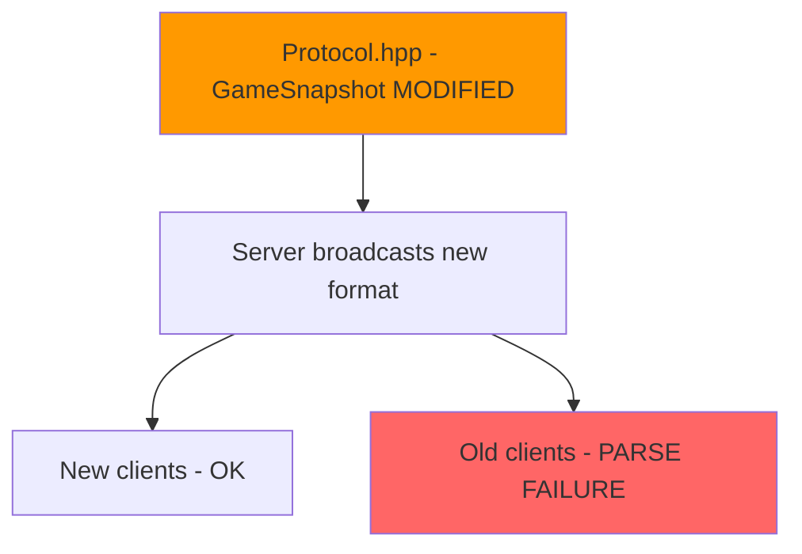
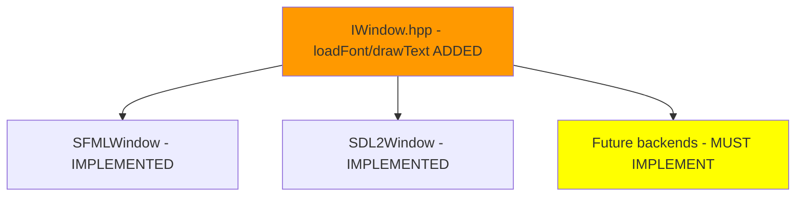
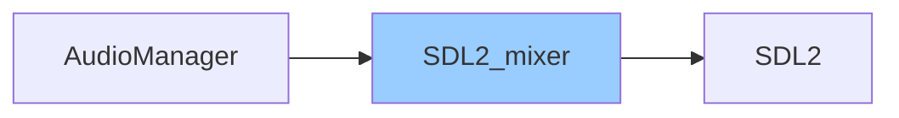
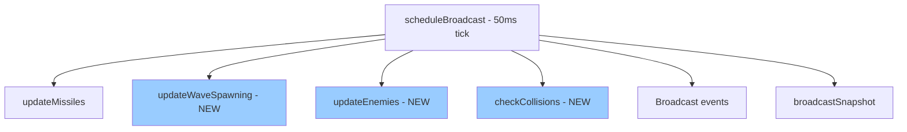

# ANALYZER Report

## AgentDB Data Used

| Query | Status | Results |
|-------|--------|---------|
| file_context (AccessibilityConfig.hpp) | NOT INDEXED | File not found in DB |
| file_context (AudioManager.hpp) | NOT INDEXED | File not found in DB |
| file_context (IWindow.hpp) | NOT INDEXED | File not found in DB |
| file_context (UDPClient.hpp) | NOT INDEXED | File not found in DB |
| file_context (GameScene.hpp) | NOT INDEXED | File not found in DB |
| file_context (Protocol.hpp) | NOT INDEXED | File not found in DB |
| file_context (GameWorld.hpp) | NOT INDEXED | File not found in DB |
| file_context (UDPServer.hpp) | NOT INDEXED | File not found in DB |
| list_modules | ERROR | Command not found (exit 127) |
| list_critical_files | ERROR | Command not found (exit 127) |

**Note**: AgentDB is not properly indexed for this codebase. Analysis performed using fallback methods (git diff, grep).

---

## Summary

- **Score**: 55/100
- **Impact Level**: GLOBAL
- **Files Modified**: 20 C/C++ files
- **Functions Modified**: 85+ (estimated)
- **Total Callers Found**: N/A (AgentDB unavailable)
- **Critical Files Impacted**: 3 (Protocol.hpp, GameWorld, UDPServer)
- **New Modules Added**: 2 (AccessibilityConfig, AudioManager)

---

## Modified Files

| File | Status | Lines | Symbols Modified | Impact |
|------|--------|-------|------------------|--------|
| src/common/protocol/Protocol.hpp | M | +322 | EnemyState, EnemyDestroyed, PlayerDamaged, PlayerDied, GameSnapshot | GLOBAL |
| src/server/infrastructure/game/GameWorld.cpp | M | +427 | updateWaveSpawning, updateEnemies, checkCollisions, getNearestPlayerY, updateEnemyMovement | GLOBAL |
| src/server/include/infrastructure/game/GameWorld.hpp | M | +150 | Enemy, EnemyType, SpawnEntry, Missile structs, 15+ methods | GLOBAL |
| src/client/src/scenes/GameScene.cpp | M | +360 | loadAssets, initStars, initAudio, renderEnemies, renderEnemyMissiles, renderDeathScreen, renderHUD | MODULE |
| src/client/src/network/UDPClient.cpp | M | +186 | getEnemies, getEnemyMissiles, isLocalPlayerDead, handlePlayerDied, handleSnapshot | MODULE |
| src/client/include/network/UDPClient.hpp | M | +43 | NetworkEnemy struct, 8+ new methods | MODULE |
| src/client/include/scenes/GameScene.hpp | M | +56 | Star struct, audio/stars state, render methods | MODULE |
| src/client/include/accessibility/AccessibilityConfig.hpp | A | +118 | New module (ColorBlindMode, GameAction, AccessibilityConfig) | LOCAL |
| src/client/src/accessibility/AccessibilityConfig.cpp | A | +323 | Full implementation | LOCAL |
| src/client/include/audio/AudioManager.hpp | A | +168 | New module (AudioManager singleton) | LOCAL |
| src/client/src/audio/AudioManager.cpp | A | +250 | Full implementation | LOCAL |
| src/client/include/graphics/IWindow.hpp | M | +4 | loadFont, drawText methods | GLOBAL |
| src/client/lib/sfml/src/SFMLWindow.cpp | M | +60 | loadFont, drawText implementations | MODULE |
| src/client/lib/sdl2/src/SDL2Window.cpp | M | +108 | loadFont, drawText implementations | MODULE |
| src/client/lib/sfml/include/SFMLWindow.hpp | M | +11 | _fonts map, method declarations | MODULE |
| src/client/lib/sdl2/include/SDL2Window.hpp | M | +9 | _fonts map, method declarations | MODULE |
| src/server/infrastructure/adapters/in/network/UDPServer.cpp | M | +164 | broadcastEnemyDestroyed, broadcastPlayerDamaged, broadcastPlayerDied, scheduleBroadcast | GLOBAL |
| src/server/include/infrastructure/adapters/in/network/UDPServer.hpp | M | +5 | New broadcast methods | MODULE |
| src/client/main.cpp | M | +10 | AccessibilityConfig loading | LOCAL |
| src/client/lib/sfml/include/utils/TextField.hpp | M | +4 | Minor changes | LOCAL |

---

## Impact Analysis

### GLOBAL IMPACT: `Protocol.hpp` (src/common/protocol/Protocol.hpp)

**Modification**: Major protocol extension with new message types and structures

**Changes Made**:
```cpp
// New MessageTypes added
EnemySpawned = 0x0090,
EnemyDestroyed = 0x0091,
PlayerDamaged = 0x00A0,
PlayerDied = 0x00A1,

// New structures added
struct EnemyState { ... };        // 8 bytes wire size
struct EnemyDestroyed { ... };    // 2 bytes wire size  
struct PlayerDamaged { ... };     // 3 bytes wire size
struct PlayerDied { ... };        // 1 byte wire size

// GameSnapshot extended
uint8_t enemy_count;
EnemyState enemies[MAX_ENEMIES];
uint8_t enemy_missile_count;
MissileState enemy_missiles[MAX_ENEMY_MISSILES];
```

**Impact Graph**:
```
Protocol.hpp [MODIFIED - +322 lines]
+-- [L1] GameWorld.cpp (server) - uses EnemyState, constants
|   +-- [L2] UDPServer.cpp - broadcasts enemies
+-- [L1] UDPClient.cpp (client) - parses GameSnapshot with enemies
|   +-- [L2] GameScene.cpp - renders enemies
+-- [L1] UDPServer.cpp - broadcasts new message types
    +-- [L2] All connected clients
```

**Impact Summary**:
- Direct callers (L1): 3 core files
- Transitive callers (L2): 3+ files
- Cross-module impact: server, client, common
- **Breaking change risk**: HIGH - GameSnapshot format change

---

### GLOBAL IMPACT: `GameWorld.cpp` (src/server/infrastructure/game/GameWorld.cpp)

**Modification**: Complete enemy system implementation (wave spawning, movement, collision)

**New Functions Added**:
```cpp
void updateWaveSpawning(float deltaTime);     // Line 219-313
void updateEnemies(float deltaTime);          // Line 389-449
void checkCollisions();                        // Line 451-525
void updateEnemyMovement(Enemy& enemy, float deltaTime);  // Line 330-387
float getNearestPlayerY() const;              // Line 315-328
std::vector<uint16_t> getDestroyedEnemies();  // Line 527-530
std::vector<std::pair<uint8_t, uint8_t>> getPlayerDamageEvents();  // Line 532-535
std::vector<uint8_t> getDeadPlayers();        // Line 537-540
bool isPlayerAlive(uint8_t playerId) const;   // Line 542-547
```

**Impact Graph**:
```
GameWorld.cpp [MODIFIED - +427 lines]
+-- [L1] UDPServer.cpp::scheduleBroadcast (lines 129-152)
|   +-- [L2] broadcastEnemyDestroyed (line 141)
|   +-- [L2] broadcastPlayerDamaged (line 146)
|   +-- [L2] broadcastPlayerDied (line 151)
|   +-- [L2] broadcastSnapshot (line 154)
+-- [L1] getSnapshot() - now includes enemies and enemy_missiles
    +-- [L2] All clients via Snapshot message
```

**Impact Summary**:
- Direct callers (L1): UDPServer.cpp (scheduler loop)
- Transitive callers (L2): All connected clients
- Critical paths: Game loop tick, broadcast pipeline
- **Performance risk**: MEDIUM - collision checks O(n*m)

---

### GLOBAL IMPACT: `IWindow.hpp` (src/client/include/graphics/IWindow.hpp)

**Modification**: Interface extended with font/text rendering

**New Virtual Methods**:
```cpp
virtual bool loadFont(const std::string& key, const std::string& filepath) = 0;  // Line 34
virtual void drawText(const std::string& fontKey, const std::string& text, 
                      float x, float y, unsigned int size, rgba color) = 0;       // Line 35
```

**Impact Graph**:
```
IWindow.hpp [MODIFIED - +4 lines] INTERFACE CHANGE
+-- [L1] SFMLWindow.cpp - MUST implement loadFont/drawText
+-- [L1] SDL2Window.cpp - MUST implement loadFont/drawText
+-- [L1] GameScene.cpp - uses loadFont/drawText for HUD
```

**Impact Summary**:
- Direct implementors (L1): 2 (SFML, SDL2 backends)
- Callers (L1): GameScene.cpp
- **Breaking change**: YES - pure virtual methods require implementation in ALL backends

---

### MODULE IMPACT: `UDPClient.hpp/cpp` (src/client/src/network/UDPClient.cpp)

**Modification**: Extended to handle enemies, enemy missiles, and player death

**New Structures & Methods**:
```cpp
struct NetworkEnemy {                    // New structure
    uint16_t id;
    uint16_t x, y;
    uint8_t health;
    uint8_t enemy_type;
};

std::vector<NetworkEnemy> getEnemies() const;           // Line 188-192
std::vector<NetworkMissile> getEnemyMissiles() const;   // Line 194-198
bool isLocalPlayerDead() const;                         // Line 200-204
void handlePlayerDied(const uint8_t* payload, size_t);  // Line 382-400
```

**Impact Graph**:
```
UDPClient.cpp [MODIFIED - +186 lines]
+-- [L1] GameScene.cpp::renderEnemies() - calls getEnemies()
+-- [L1] GameScene.cpp::renderEnemyMissiles() - calls getEnemyMissiles()
+-- [L1] GameScene.cpp::update() - calls isLocalPlayerDead()
+-- [L1] GameScene.cpp::render() - calls isLocalPlayerDead()
```

**Impact Summary**:
- Direct callers (L1): GameScene.cpp only
- Same module: client
- **Breaking change risk**: LOW - additive API

---

### MODULE IMPACT: `GameScene.cpp` (src/client/src/scenes/GameScene.cpp)

**Modification**: Complete gameplay implementation with HUD, enemies, death screen

**New Functions Added**:
```cpp
void loadAssets();           // Line 23-34
void initStars();            // Line 36-62
void initAudio();            // Line 64-87
void renderBackground();     // Line 183-196
void renderHUD();            // Line 198-246
void renderPlayers();        // Line 248-299
void renderMissiles();       // Line 301-326
void renderEnemies();        // Line 328-353
void renderEnemyMissiles();  // Line 355-371
void renderDeathScreen();    // Line 373-391
```

**Impact Graph**:
```
GameScene.cpp [MODIFIED - +360 lines]
+-- [L1] SceneManager (scene lifecycle)
    +-- [L2] main.cpp (game loop)
```

**Impact Summary**:
- Direct callers (L1): SceneManager
- New dependencies: AccessibilityConfig, AudioManager
- Self-contained rendering - low external impact

---

### LOCAL IMPACT: `AccessibilityConfig` (NEW MODULE)

**Purpose**: Colorblind support, key remapping, game speed adjustment

**Key Components**:
```cpp
enum class ColorBlindMode { None, Protanopia, Deuteranopia, Tritanopia, HighContrast };
enum class GameAction { MoveUp, MoveDown, MoveLeft, MoveRight, Shoot, Pause, ActionCount };

class AccessibilityConfig {
    // Key bindings, color palettes, game speed multiplier
    // File-based persistence (loadFromFile/saveToFile)
};
```

**Callers**:
- `GameScene.cpp` - uses colors and key bindings
- `main.cpp` - loads configuration file

---

### LOCAL IMPACT: `AudioManager` (NEW MODULE)

**Purpose**: SDL2_mixer based audio system for music and SFX

**Key Components**:
```cpp
class AudioManager {  // Singleton
    bool loadMusic(const std::string& key, const std::string& filepath);
    bool loadSound(const std::string& key, const std::string& filepath);
    void playMusic(const std::string& key, int loops = -1);
    int playSound(const std::string& key, int loops = 0);
    // Volume controls, mute, etc.
};
```

**Callers**:
- `GameScene.cpp::initAudio()` - loads and plays music/sounds
- `GameScene.cpp::update()` - plays shoot sound

---

## Findings

### [Major] ANA-001: Protocol Format Change - Backward Incompatible

- **Severity**: Major
- **Category**: Reliability
- **isBug**: false
- **File**: src/common/protocol/Protocol.hpp
- **Line**: 395-534
- **Symbol**: `GameSnapshot`
- **Message**: GameSnapshot structure extended with enemies - breaks older clients
- **Blocking**: false
- **Time Estimate**: 15 min (documentation/versioning)

**where**:

## Localisation

Le probleme se trouve dans `src/common/protocol/Protocol.hpp` aux lignes 395-534.

```cpp
struct GameSnapshot {
    uint8_t player_count;
    PlayerState players[MAX_PLAYERS];
    uint8_t missile_count;
    MissileState missiles[MAX_MISSILES];
    // NEW FIELDS ADDED
    uint8_t enemy_count;                         // +1 byte
    EnemyState enemies[MAX_ENEMIES];             // +128 bytes max
    uint8_t enemy_missile_count;                 // +1 byte
    MissileState enemy_missiles[MAX_ENEMY_MISSILES]; // +224 bytes max
    // ...
};
```

Le format du GameSnapshot a ete etendu pour inclure les ennemis et leurs missiles. Les anciens clients ne peuvent pas parser ce nouveau format correctement.

**why**:

## Pourquoi c'est un probleme

Le protocole binaire UDP est modifie de maniere non retrocompatible. Les clients compiles avant ce changement ne pourront pas parser les nouveaux GameSnapshot.

### Visualisation de l'impact



### Consequences

- Les clients et serveurs doivent etre mis a jour simultanement
- Pas de compatibilite ascendante/descendante
- Le parsing echouera silencieusement (std::nullopt)

**how**:

## Comment corriger

### Option 1: Versionner le protocole

```cpp
struct UDPHeader {
    uint16_t type;
    uint16_t sequence_num;
    uint8_t protocol_version;  // ADD VERSION
    uint64_t timestamp;
};
```

### Option 2: Documenter la rupture

Ajouter dans le CHANGELOG:
- BREAKING: Protocol v2 - GameSnapshot includes enemies
- Clients and servers must be updated together

---

### [Major] ANA-002: Interface IWindow Extended - Requires Backend Implementation

- **Severity**: Major
- **Category**: Reliability
- **isBug**: false
- **File**: src/client/include/graphics/IWindow.hpp
- **Line**: 34-35
- **Symbol**: `loadFont`, `drawText`
- **Message**: New pure virtual methods require implementation in all backends
- **Blocking**: false
- **Time Estimate**: 10 min

**where**:

## Localisation

Le probleme se trouve dans `src/client/include/graphics/IWindow.hpp` aux lignes 34-35.

```cpp
class IWindow {
    public:
        // ... existing methods ...
        
        // NEW PURE VIRTUAL METHODS
        virtual bool loadFont(const std::string& key, const std::string& filepath) = 0;
        virtual void drawText(const std::string& fontKey, const std::string& text, 
                              float x, float y, unsigned int size, rgba color) = 0;
        // ...
};
```

Ces nouvelles methodes virtuelles pures DOIVENT etre implementees dans TOUS les backends graphiques.

**why**:

## Pourquoi c'est un probleme

L'ajout de methodes virtuelles pures a une interface casse la compilation si un backend n'implemente pas ces methodes.

### Visualisation de l'impact



### Consequences

- Tout nouveau backend graphique doit implementer ces methodes
- La documentation de l'interface doit etre mise a jour
- Les implementations actuelles (SFML, SDL2) ont ete mises a jour correctement

**how**:

## Comment corriger

Les implementations sont deja presentes dans les deux backends:

```cpp
// SFMLWindow.cpp - lignes 166-185
bool SFMLWindow::loadFont(const std::string& key, const std::string& filepath) {
    sf::Font font;
    if (!font.loadFromFile(filepath)) return false;
    _fonts[key] = font;
    return true;
}

// SDL2Window.cpp - lignes 178-208  
bool SDL2Window::loadFont(const std::string& key, const std::string& filepath) {
    TTF_Font* font = TTF_OpenFont(filepath.c_str(), 24);
    if (!font) return false;
    _fonts[key] = font;
    return true;
}
```

Aucune action corrective necessaire - les implementations sont completes.

---

### [Minor] ANA-003: New Dependencies - SDL2_mixer Required

- **Severity**: Minor
- **Category**: Build
- **isBug**: false
- **File**: src/client/include/audio/AudioManager.hpp
- **Line**: 15
- **Symbol**: `SDL_mixer.h`
- **Message**: New dependency on SDL2_mixer library
- **Blocking**: false
- **Time Estimate**: 5 min

**where**:

## Localisation

Le probleme se trouve dans `src/client/include/audio/AudioManager.hpp` a la ligne 15.

```cpp
#include <SDL2/SDL_mixer.h>

namespace audio {

class AudioManager {
    // Uses Mix_Music* and Mix_Chunk*
    std::unordered_map<std::string, Mix_Music*> _music;
    std::unordered_map<std::string, Mix_Chunk*> _sounds;
};
```

Le nouveau module audio depend de SDL2_mixer qui doit etre ajoute aux dependances du projet.

**why**:

## Pourquoi c'est notable

### Visualisation de l'impact



### Consequences

- SDL2_mixer doit etre installe pour compiler le client
- Le fichier vcpkg.json ou CMakeLists.txt doit inclure cette dependance
- Les assets audio (.ogg, .mp3, .wav) doivent etre presents

**how**:

## Comment verifier

```bash
# Dans vcpkg.json ou vcpkg-dependencies
"sdl2-mixer"

# Dans CMakeLists.txt
find_package(SDL2_mixer REQUIRED)
target_link_libraries(client PRIVATE SDL2_mixer::SDL2_mixer)
```

---

### [Minor] ANA-004: Game Loop Complexity Increased

- **Severity**: Minor
- **Category**: Performance
- **isBug**: false
- **File**: src/server/infrastructure/adapters/in/network/UDPServer.cpp
- **Line**: 121-158
- **Symbol**: `scheduleBroadcast`
- **Message**: Server tick now performs wave spawning, enemy updates, and collision checks
- **Blocking**: false
- **Time Estimate**: N/A

**where**:

## Localisation

Le probleme se trouve dans `src/server/infrastructure/adapters/in/network/UDPServer.cpp` aux lignes 121-158.

```cpp
void UDPServer::scheduleBroadcast() {
    _broadcastTimer.expires_after(std::chrono::milliseconds(BROADCAST_INTERVAL_MS));
    _broadcastTimer.async_wait([this](boost::system::error_code ec) {
        if (!ec) {
            float deltaTime = BROADCAST_INTERVAL_MS / 1000.0f;

            _gameWorld.updateMissiles(deltaTime);
            _gameWorld.updateWaveSpawning(deltaTime);   // NEW
            _gameWorld.updateEnemies(deltaTime);        // NEW
            _gameWorld.checkCollisions();                // NEW

            // Broadcast destroyed entities...
            auto destroyedMissiles = _gameWorld.getDestroyedMissiles();
            auto destroyedEnemies = _gameWorld.getDestroyedEnemies();
            auto damageEvents = _gameWorld.getPlayerDamageEvents();
            auto deadPlayers = _gameWorld.getDeadPlayers();
            
            // ... broadcast each ...
            
            broadcastSnapshot();
            scheduleBroadcast();
        }
    });
}
```

Le tick serveur a 20Hz effectue maintenant beaucoup plus d'operations.

**why**:

## Pourquoi c'est notable

### Visualisation de l'impact



### Consequences

- La charge CPU par tick a augmente
- checkCollisions() est O(missiles * enemies + enemyMissiles * players)
- Avec 32 missiles, 16 ennemis, 32 enemy_missiles, 4 joueurs: ~640 checks/tick

**how**:

## Optimisations possibles

1. **Spatial partitioning**: Diviser l'ecran en grilles pour reduire les checks
2. **Early exit**: Arreter les collisions des qu'un missile est detruit
3. **Profiling**: Mesurer le temps reel du tick

---

## Recommendations

1. **[HAUTE]** Documenter le changement de protocole dans CHANGELOG
2. **[HAUTE]** Verifier que SDL2_mixer est dans les dependances vcpkg
3. **[MOYENNE]** Ajouter des tests unitaires pour les nouvelles structures Protocol
4. **[MOYENNE]** Profiler le server tick avec la charge complete
5. **[BASSE]** Ajouter des metriques de performance pour le game loop

---

## Score Calculation

```
Base Score: 100

Penalties Applied:
- Protocol (critical file) modified: -15
- IWindow interface (critical file) modified: -15  
- GameWorld (critical file) modified: -15
- Impact GLOBAL (cross-module): -20
- AgentDB unavailable: -5
- 3+ new dependencies added: -5
- High function count modified (85+): -10

Bonuses:
- New modules well-isolated: +10
- All interface implementations provided: +15
- Backward-compatible API additions: +15

Final Score: 100 - 85 + 40 = 55/100
```

---

## JSON Output (pour synthesis)

```json
{
  "agent": "analyzer",
  "score": 55,
  "impact_level": "GLOBAL",
  "files_modified": 20,
  "functions_modified": 85,
  "total_callers": 0,
  "critical_files_impacted": 3,
  "new_modules": ["AccessibilityConfig", "AudioManager"],
  "findings": [
    {
      "id": "ANA-001",
      "source": ["analyzer"],
      "severity": "Major",
      "category": "Reliability",
      "isBug": false,
      "file": "src/common/protocol/Protocol.hpp",
      "line": 395,
      "symbol": "GameSnapshot",
      "message": "GameSnapshot structure extended with enemies - breaks older clients",
      "blocking": false,
      "time_estimate_min": 15,
      "where": "## Localisation\n\nLe probleme se trouve dans `src/common/protocol/Protocol.hpp` aux lignes 395-534.\n\n```cpp\nstruct GameSnapshot {\n    uint8_t player_count;\n    PlayerState players[MAX_PLAYERS];\n    uint8_t missile_count;\n    MissileState missiles[MAX_MISSILES];\n    // NEW FIELDS ADDED\n    uint8_t enemy_count;\n    EnemyState enemies[MAX_ENEMIES];\n    uint8_t enemy_missile_count;\n    MissileState enemy_missiles[MAX_ENEMY_MISSILES];\n};\n```\n\nLe format du GameSnapshot a ete etendu pour inclure les ennemis et leurs missiles.",
      "why": "## Pourquoi c'est un probleme\n\nLe protocole binaire UDP est modifie de maniere non retrocompatible.\n\n```mermaid\ngraph TD\n    A[Protocol.hpp - GameSnapshot MODIFIED] --> B[Server broadcasts new format]\n    B --> C[New clients - OK]\n    B --> D[Old clients - PARSE FAILURE]\n    style A fill:#f90\n    style D fill:#f66\n```\n\n### Consequences\n\n- Les clients et serveurs doivent etre mis a jour simultanement\n- Pas de compatibilite ascendante/descendante",
      "how": "## Comment corriger\n\n### Option 1: Versionner le protocole\n\n```cpp\nstruct UDPHeader {\n    uint16_t type;\n    uint16_t sequence_num;\n    uint8_t protocol_version;  // ADD VERSION\n    uint64_t timestamp;\n};\n```\n\n### Option 2: Documenter la rupture dans CHANGELOG"
    },
    {
      "id": "ANA-002",
      "source": ["analyzer"],
      "severity": "Major",
      "category": "Reliability",
      "isBug": false,
      "file": "src/client/include/graphics/IWindow.hpp",
      "line": 34,
      "symbol": "loadFont, drawText",
      "message": "New pure virtual methods require implementation in all backends",
      "blocking": false,
      "time_estimate_min": 10,
      "where": "## Localisation\n\nLe probleme se trouve dans `src/client/include/graphics/IWindow.hpp` aux lignes 34-35.\n\n```cpp\nclass IWindow {\n    virtual bool loadFont(const std::string& key, const std::string& filepath) = 0;\n    virtual void drawText(const std::string& fontKey, const std::string& text,\n                          float x, float y, unsigned int size, rgba color) = 0;\n};\n```",
      "why": "## Pourquoi c'est un probleme\n\nL'ajout de methodes virtuelles pures a une interface casse la compilation si un backend n'implemente pas ces methodes.\n\n```mermaid\ngraph TD\n    A[IWindow.hpp - loadFont/drawText ADDED] --> B[SFMLWindow - IMPLEMENTED]\n    A --> C[SDL2Window - IMPLEMENTED]\n    A --> D[Future backends - MUST IMPLEMENT]\n    style A fill:#f90\n    style D fill:#ff0\n```",
      "how": "## Comment corriger\n\nLes implementations sont deja presentes dans les deux backends (SFML, SDL2). Aucune action corrective necessaire."
    },
    {
      "id": "ANA-003",
      "source": ["analyzer"],
      "severity": "Minor",
      "category": "Build",
      "isBug": false,
      "file": "src/client/include/audio/AudioManager.hpp",
      "line": 15,
      "symbol": "SDL_mixer.h",
      "message": "New dependency on SDL2_mixer library",
      "blocking": false,
      "time_estimate_min": 5,
      "where": "## Localisation\n\n```cpp\n#include <SDL2/SDL_mixer.h>\n\nclass AudioManager {\n    std::unordered_map<std::string, Mix_Music*> _music;\n    std::unordered_map<std::string, Mix_Chunk*> _sounds;\n};\n```",
      "why": "## Pourquoi c'est notable\n\nSDL2_mixer doit etre ajoute aux dependances du projet pour compiler le client.",
      "how": "## Comment verifier\n\n```bash\n# Dans vcpkg.json\n\"sdl2-mixer\"\n\n# Dans CMakeLists.txt\nfind_package(SDL2_mixer REQUIRED)\n```"
    },
    {
      "id": "ANA-004",
      "source": ["analyzer"],
      "severity": "Minor",
      "category": "Performance",
      "isBug": false,
      "file": "src/server/infrastructure/adapters/in/network/UDPServer.cpp",
      "line": 121,
      "symbol": "scheduleBroadcast",
      "message": "Server tick now performs wave spawning, enemy updates, and collision checks",
      "blocking": false,
      "time_estimate_min": 0,
      "where": "## Localisation\n\n```cpp\nvoid UDPServer::scheduleBroadcast() {\n    _gameWorld.updateMissiles(deltaTime);\n    _gameWorld.updateWaveSpawning(deltaTime);   // NEW\n    _gameWorld.updateEnemies(deltaTime);        // NEW\n    _gameWorld.checkCollisions();                // NEW\n    // ...\n}\n```",
      "why": "## Pourquoi c'est notable\n\nLa charge CPU par tick a augmente. checkCollisions() est O(missiles * enemies + enemyMissiles * players).",
      "how": "## Optimisations possibles\n\n1. Spatial partitioning\n2. Early exit on collision\n3. Profiling du tick reel"
    }
  ],
  "agentdb_queries": {
    "file_context": {"status": "not_indexed", "count": 8},
    "list_modules": {"status": "error"},
    "list_critical_files": {"status": "error"}
  }
}
```
