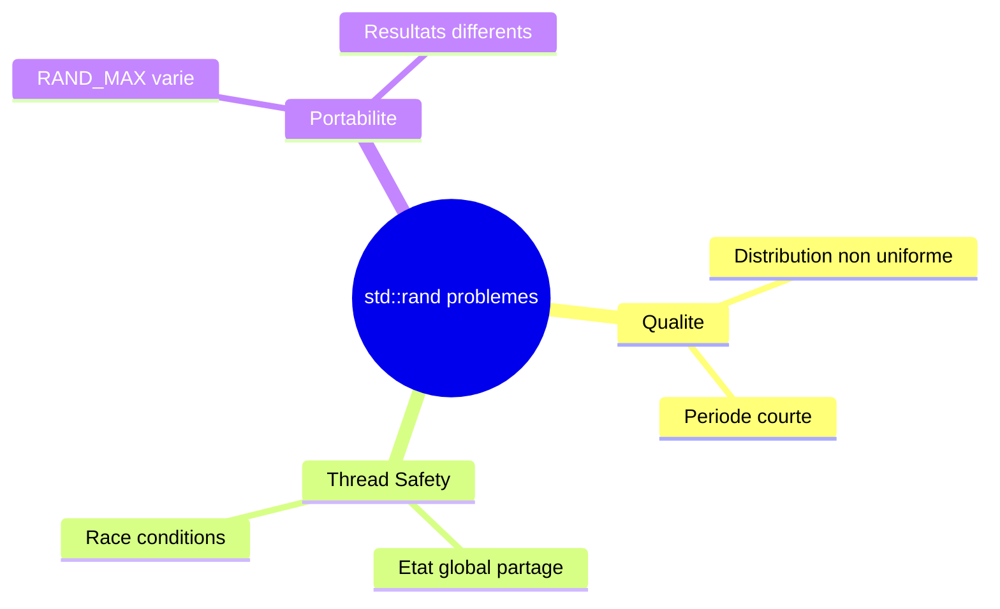
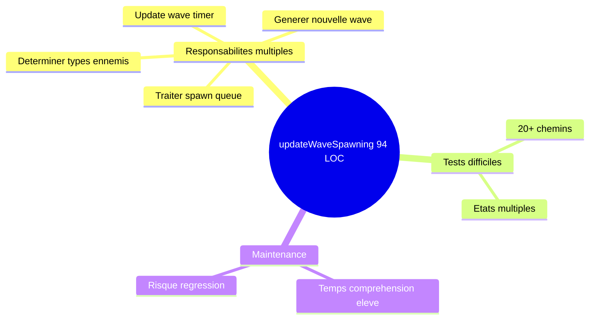
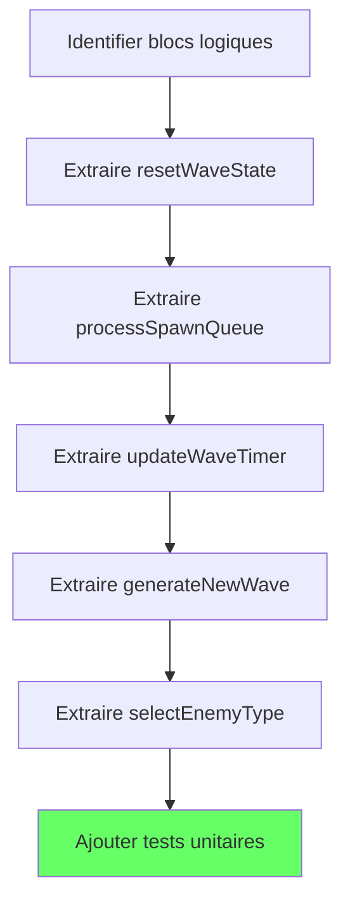
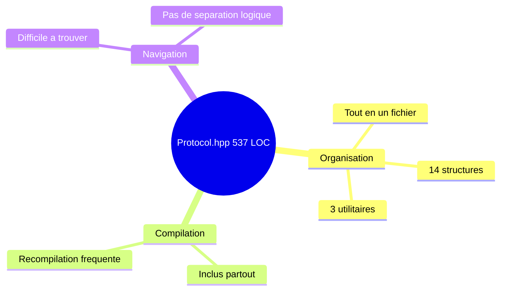
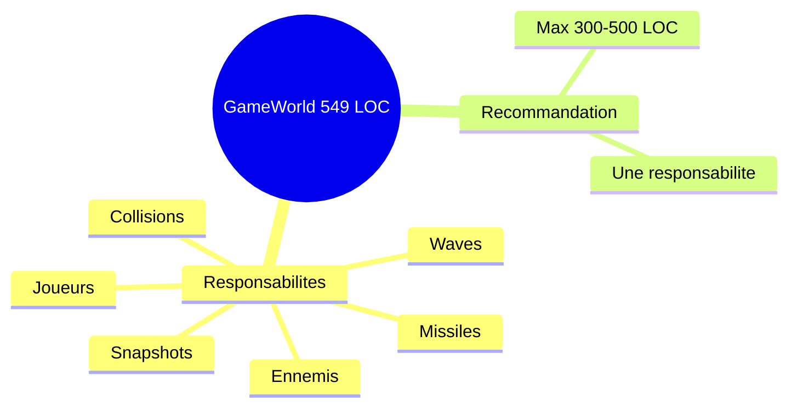
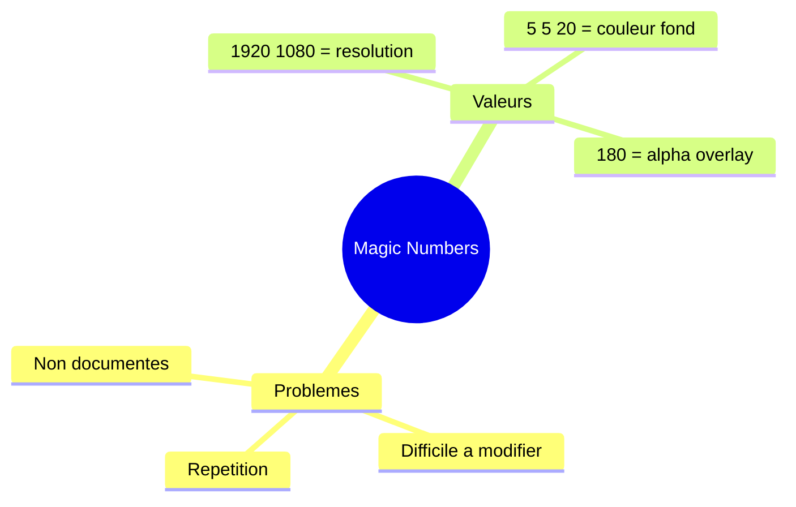

## REVIEWER Report

### AgentDB Data Used

| Query | Status | Results |
|-------|--------|---------|
| patterns | ERROR | jq not installed - using C++ standard conventions |
| architecture_decisions | ERROR | jq not installed - skipped |
| file_metrics | ERROR | jq not installed - manual analysis |
| search_symbols | ERROR | jq not installed - skipped |

> **Note**: AgentDB queries failed due to missing `jq` dependency. This review uses standard C++23 conventions as defined in CLAUDE.md.

### Summary

- **Score** : 78/100
- **Issues** : 8
- **Blockers** : 0
- **Critical** : 0
- **Major** : 2
- **Medium** : 3
- **Minor** : 3
- **Info** : 0

### Patterns Loaded from AgentDB

| Pattern | Category | Severity | Applied |
|---------|----------|----------|---------|
| C++ Standard (CLAUDE.md) | naming | warning | Manual |
| Hexagonal Architecture | architecture | error | Manual |
| Documentation (Doxygen) | documentation | info | Manual |
| Network Protocol (big-endian) | quality | error | Manual |

### ADRs Checked

| ADR | Title | Status |
|-----|-------|--------|
| N/A | AgentDB unavailable | Skipped |

### Metrics Analysis

| Metric | Value | Threshold | Status |
|--------|-------|-----------|--------|
| Files modified | 20 | - | - |
| Lines added | ~4300 | - | - |
| New features | 3 (Accessibility, Audio, Enemies) | - | OK |
| Protocol additions | 8 new message types | - | OK |
| GameWorld.cpp LOC | 549 | < 500 | WARN |
| Protocol.hpp LOC | 537 | < 500 | WARN |

### Severities Used

| Severity | Description |
|----------|-------------|
| **Major** | Impact significatif sur la qualite |
| **Medium** | Impact modere |
| **Minor** | Impact faible |

---

### Issues

#### [Major] REV-001 : Use of deprecated std::rand() / std::srand()

- **Category** : Maintainability
- **File** : `/home/simia/dev/epitech/third_year/rtype/src/server/infrastructure/game/GameWorld.cpp`
- **Lines** : 17, 250, 252, 255, 272, 274-275, 285-286, 290, 294
- **Pattern violated** : C++23 best practices
- **isBug** : No

## Localisation du probleme

Le probleme se trouve dans `src/server/infrastructure/game/GameWorld.cpp` aux lignes 17 et multiples utilisations.

```cpp
GameWorld::GameWorld() : _nextPlayerId(1) {
    std::srand(static_cast<unsigned>(std::time(nullptr)));  // Line 17
}

// Multiple uses throughout the file:
.phaseOffset = static_cast<float>(std::rand()) / static_cast<float>(RAND_MAX) * 6.28f,  // Line 250
.shootCooldown = shootInterval * (0.3f + 0.7f * static_cast<float>(std::rand()) / static_cast<float>(RAND_MAX)),  // Line 252
.zigzagUp = (std::rand() % 2) == 0  // Line 255

_currentWaveInterval = WAVE_INTERVAL_MIN +
    static_cast<float>(std::rand()) / static_cast<float>(RAND_MAX) * (WAVE_INTERVAL_MAX - WAVE_INTERVAL_MIN);  // Line 271-272

int roll = std::rand() % 100;  // Line 294
```

Cette utilisation de `std::rand()` est obsolete en C++11+ et presente des problemes de qualite de generation aleatoire.

## Pourquoi c'est un probleme

`std::rand()` a plusieurs problemes connus :
- Faible qualite statistique de la distribution
- Non-thread-safe (problematique dans un serveur multi-threade)
- Comportement non portable entre implementations

### Visualisation



### Impact

- Dans un contexte de jeu multijoueur, des patterns previsibles peuvent emerger
- Les joueurs pourraient potentiellement predire les spawns d'ennemis
- Race condition potentielle si plusieurs threads accedent simultanement

## Comment corriger

### Solution recommandee

Utiliser `<random>` de la bibliotheque standard C++11+.

```cpp
// AVANT
#include <cstdlib>
#include <ctime>

GameWorld::GameWorld() : _nextPlayerId(1) {
    std::srand(static_cast<unsigned>(std::time(nullptr)));
}

float randomFloat = static_cast<float>(std::rand()) / static_cast<float>(RAND_MAX);

// APRES
#include <random>

class GameWorld {
private:
    std::mt19937 _rng;
    std::uniform_real_distribution<float> _dist01{0.0f, 1.0f};
    std::uniform_int_distribution<int> _distPercent{0, 99};
    // ...
};

GameWorld::GameWorld() 
    : _nextPlayerId(1)
    , _rng(std::random_device{}())
{}

float randomFloat = _dist01(_rng);
int roll = _distPercent(_rng);
```

### Etapes de correction


1. Ajouter `std::mt19937 _rng` comme membre de classe
2. Initialiser avec `std::random_device` dans le constructeur
3. Creer des distributions appropriees pour chaque usage
4. Remplacer tous les appels `std::rand()`

### Benefices attendus

- Meilleure qualite aleatoire
- Thread-safe avec membre par instance
- Conforme aux best practices C++23

- **Temps estime** : ~30 min
- **Bloquant** : Non

---

#### [Major] REV-002 : Complexite excessive dans updateWaveSpawning

- **Category** : Maintainability
- **File** : `/home/simia/dev/epitech/third_year/rtype/src/server/infrastructure/game/GameWorld.cpp`
- **Lines** : 219-313
- **Function** : `updateWaveSpawning()`
- **Pattern violated** : Complexity
- **isBug** : No

## Localisation du probleme

Le probleme se trouve dans `src/server/infrastructure/game/GameWorld.cpp` lignes 219-313.

```cpp
void GameWorld::updateWaveSpawning(float deltaTime) {
    std::lock_guard<std::mutex> lock(_mutex);

    if (_players.empty()) {
        _waveTimer = 0.0f;
        _spawnQueue.clear();
        return;
    }

    for (auto it = _spawnQueue.begin(); it != _spawnQueue.end();) {
        it->delay -= deltaTime;
        if (it->delay <= 0.0f && _enemies.size() < MAX_ENEMIES) {
            // ... 25 lignes de creation d'ennemi
            switch (it->type) {
                case EnemyType::Tracker: shootInterval = Enemy::SHOOT_INTERVAL_TRACKER; break;
                case EnemyType::Zigzag: shootInterval = Enemy::SHOOT_INTERVAL_ZIGZAG; break;
                // ... autres cas
            }
            // ... creation Enemy
        }
    }

    _waveTimer += deltaTime;

    if (_waveTimer >= _currentWaveInterval) {
        // ... 45 lignes de generation de wave
        for (uint8_t i = 0; i < enemyCount; ++i) {
            // ... 20 lignes par iteration
            if (_waveNumber >= 5 && roll < 10) {
                type = EnemyType::Bomber;
            } else if (_waveNumber >= 4 && roll < 25) {
                // ... cascade de conditions
            }
        }
    }
}
```

Cette fonction fait 94 lignes avec une complexite cyclomatique estimee a ~20.

## Pourquoi c'est un probleme

Une fonction de cette longueur et complexite est difficile a :
- Tester unitairement (nombreux chemins d'execution)
- Comprendre rapidement
- Maintenir sans introduire de regressions

### Visualisation



### Risques

| Risque | Probabilite | Impact |
|--------|-------------|--------|
| Bug lors modification | Haute | Majeur |
| Tests incomplets | Haute | Moyen |
| Temps debug eleve | Moyenne | Moyen |

## Comment corriger

### Solution recommandee

Extraire en sous-fonctions avec responsabilites claires.

```cpp
// AVANT: 94 lignes, complexite ~20
void GameWorld::updateWaveSpawning(float deltaTime);

// APRES: Fonctions specialisees
void GameWorld::updateWaveSpawning(float deltaTime) {
    std::lock_guard<std::mutex> lock(_mutex);
    
    if (_players.empty()) {
        resetWaveState();
        return;
    }
    
    processSpawnQueue(deltaTime);
    updateWaveTimer(deltaTime);
}

void GameWorld::resetWaveState() {
    _waveTimer = 0.0f;
    _spawnQueue.clear();
}

void GameWorld::processSpawnQueue(float deltaTime) {
    for (auto it = _spawnQueue.begin(); it != _spawnQueue.end();) {
        it->delay -= deltaTime;
        if (shouldSpawnEnemy(*it)) {
            spawnEnemyFromEntry(*it);
            it = _spawnQueue.erase(it);
        } else {
            ++it;
        }
    }
}

void GameWorld::updateWaveTimer(float deltaTime) {
    _waveTimer += deltaTime;
    if (_waveTimer >= _currentWaveInterval) {
        _waveTimer = 0.0f;
        _waveNumber++;
        generateNewWave();
    }
}

void GameWorld::generateNewWave() {
    _currentWaveInterval = calculateNextWaveInterval();
    uint8_t enemyCount = calculateEnemyCount();
    scheduleEnemySpawns(enemyCount);
}

EnemyType GameWorld::selectEnemyType() const {
    int roll = _distPercent(_rng);
    if (_waveNumber >= 5 && roll < 10) return EnemyType::Bomber;
    if (_waveNumber >= 4 && roll < 25) return EnemyType::Fast;
    if (_waveNumber >= 3 && roll < 40) return EnemyType::Zigzag;
    if (_waveNumber >= 2 && roll < 55) return EnemyType::Tracker;
    return EnemyType::Basic;
}
```

### Etapes de correction



### Benefices attendus

- Complexite de chaque fonction < 10
- Fonctions testables independamment
- Code auto-documente par les noms

- **Temps estime** : ~45 min
- **Bloquant** : Non

---

#### [Medium] REV-003 : Fichier Protocol.hpp trop long

- **Category** : Maintainability
- **File** : `/home/simia/dev/epitech/third_year/rtype/src/common/protocol/Protocol.hpp`
- **Lines** : 1-537
- **Pattern violated** : Single Responsibility Principle
- **isBug** : No

## Localisation du probleme

Le fichier `src/common/protocol/Protocol.hpp` fait 537 lignes et contient toutes les structures de protocole.

```cpp
// Tout dans un seul fichier:
inline uint32_t swap64(uint32_t v);  // Utilities
inline uint32_t swap32(uint32_t v);
inline uint16_t swap16(uint16_t v);

enum class MessageType: uint16_t { ... };  // Enums

struct UDPHeader { ... };           // ~40 lignes
struct MovePlayer { ... };          // ~30 lignes
struct PlayerJoin { ... };          // ~20 lignes
struct PlayerLeave { ... };         // ~20 lignes
struct MissileState { ... };        // ~30 lignes
struct ShootMissile { ... };        // ~10 lignes
struct MissileSpawned { ... };      // ~30 lignes
struct MissileDestroyed { ... };    // ~20 lignes
struct PlayerState { ... };         // ~35 lignes
struct EnemyState { ... };          // ~35 lignes
struct EnemyDestroyed { ... };      // ~20 lignes
struct PlayerDamaged { ... };       // ~20 lignes
struct PlayerDied { ... };          // ~20 lignes
struct GameSnapshot { ... };        // ~100 lignes
```

## Pourquoi c'est un probleme

Un header de 537 lignes :
- Augmente les temps de compilation (inclus partout)
- Difficile a naviguer
- Viole le principe de responsabilite unique

### Visualisation



## Comment corriger

### Solution recommandee

Separer en plusieurs fichiers par domaine.

```
src/common/protocol/
  Protocol.hpp          # Include principal (forward declarations + includes)
  ByteSwap.hpp          # swap16/32/64
  MessageTypes.hpp      # enum MessageType
  UDPHeader.hpp         # struct UDPHeader
  PlayerMessages.hpp    # PlayerState, PlayerJoin, PlayerLeave, etc.
  MissileMessages.hpp   # MissileState, MissileSpawned, MissileDestroyed
  EnemyMessages.hpp     # EnemyState, EnemyDestroyed
  GameSnapshot.hpp      # struct GameSnapshot
```

- **Temps estime** : ~30 min
- **Bloquant** : Non

---

#### [Medium] REV-004 : GameWorld.cpp trop long

- **Category** : Maintainability
- **File** : `/home/simia/dev/epitech/third_year/rtype/src/server/infrastructure/game/GameWorld.cpp`
- **Lines** : 1-549
- **Pattern violated** : File size limit
- **isBug** : No

## Localisation du probleme

Le fichier `src/server/infrastructure/game/GameWorld.cpp` fait 549 lignes.

```cpp
// Responsabilites multiples:
// - Gestion des joueurs (addPlayer, removePlayer, movePlayer) ~100 lignes
// - Gestion des missiles (spawnMissile, updateMissiles) ~80 lignes
// - Gestion des ennemis (updateEnemies, updateEnemyMovement) ~150 lignes
// - Wave spawning (updateWaveSpawning) ~95 lignes
// - Collisions (checkCollisions) ~75 lignes
// - Snapshots (getSnapshot) ~55 lignes
```

## Pourquoi c'est un probleme

### Visualisation



## Comment corriger

Extraire en classes specialisees suivant l'architecture hexagonale :

```cpp
// PlayerManager.cpp - Gestion des joueurs
// MissileManager.cpp - Gestion des missiles
// EnemyManager.cpp - Gestion des ennemis et waves
// CollisionSystem.cpp - Detection des collisions
// GameWorld.cpp - Orchestration uniquement
```

- **Temps estime** : ~2h
- **Bloquant** : Non

---

#### [Medium] REV-005 : Magic numbers dans GameScene.cpp

- **Category** : Maintainability
- **File** : `/home/simia/dev/epitech/third_year/rtype/src/client/src/scenes/GameScene.cpp`
- **Lines** : 152-153, 185, 375-376
- **Pattern violated** : no_magic_numbers
- **isBug** : No

## Localisation du probleme

```cpp
// Line 152-153
newX = std::clamp(newX, 0, 1920 - static_cast<int>(SHIP_WIDTH));
newY = std::clamp(newY, 0, 1080 - static_cast<int>(SHIP_HEIGHT));

// Line 185
_context.window->drawRect(0, 0, SCREEN_WIDTH, SCREEN_HEIGHT, {5, 5, 20, 255});

// Line 375
_context.window->drawRect(0, 0, SCREEN_WIDTH + 20, SCREEN_HEIGHT + 20, {0, 0, 0, 180});
```

## Pourquoi c'est un probleme

Les valeurs 1920, 1080, {5, 5, 20, 255} et 180 ne sont pas documentees.

### Visualisation



## Comment corriger

```cpp
// Dans GameScene.hpp
static constexpr rgba BACKGROUND_COLOR = {5, 5, 20, 255};
static constexpr rgba DEATH_OVERLAY_COLOR = {0, 0, 0, 180};

// Dans update()
newX = std::clamp(newX, 0, static_cast<int>(SCREEN_WIDTH - SHIP_WIDTH));
newY = std::clamp(newY, 0, static_cast<int>(SCREEN_HEIGHT - SHIP_HEIGHT));
```

- **Temps estime** : ~10 min
- **Bloquant** : Non

---

#### [Minor] REV-006 : Methodes draw/drawImg non implementees

- **Category** : Maintainability
- **File** : `/home/simia/dev/epitech/third_year/rtype/src/client/lib/sfml/src/SFMLWindow.cpp`, `/home/simia/dev/epitech/third_year/rtype/src/client/lib/sdl2/src/SDL2Window.cpp`
- **Lines** : SFMLWindow.cpp:113-128, SDL2Window.cpp:175-188
- **Pattern violated** : Interface implementation
- **isBug** : No

## Localisation du probleme

```cpp
// SFMLWindow.cpp:113
void SFMLWindow::draw(const graphics::IDrawable& drawable) {
    // _window.drawAll();  <-- Commented out
}

// SFMLWindow.cpp:124
void SFMLWindow::drawImg(graphics::IDrawable drawable, float x, float y, float scaleX, float scaleY) {
    // imgS.setPosition({x, y});  <-- Commented out
    // imgS.setScale({scaleX, scaleY});
    // _window.draw(imgS);
}

// SDL2Window.cpp:175
void SDL2Window::draw(const graphics::IDrawable& drawable)
{
}  // Empty implementation

// SDL2Window.cpp:186
void SDL2Window::drawImg(graphics::IDrawable drawable, float x, float y, float scaleX, float scaleY)
{
}  // Empty implementation
```

## Pourquoi c'est un probleme

Des methodes d'interface non implementees peuvent causer des comportements inattendus si appelees.

## Comment corriger

Soit implementer les methodes, soit les marquer comme `= delete` ou lever une exception `std::runtime_error("Not implemented")`.

- **Temps estime** : ~15 min
- **Bloquant** : Non

---

#### [Minor] REV-007 : Commentaire de debug laisse dans main.cpp

- **Category** : Maintainability
- **File** : `/home/simia/dev/epitech/third_year/rtype/src/client/main.cpp`
- **Line** : 31
- **Pattern violated** : Code cleanliness
- **isBug** : No

## Localisation du probleme

```cpp
catch(const std::exception& e)
{
    // client::logging::Logger::error("Exception caught: {}", e.what());  // <-- Commented out
    return EXIT_FAILURE;
}
```

## Comment corriger

Soit supprimer le commentaire, soit reactiver le logging d'erreur.

- **Temps estime** : ~2 min
- **Bloquant** : Non

---

#### [Minor] REV-008 : Inconsistance dans la signature de swap64

- **Category** : Maintainability
- **File** : `/home/simia/dev/epitech/third_year/rtype/src/common/protocol/Protocol.hpp`
- **Line** : 16
- **Pattern violated** : Correctness
- **isBug** : No (mais potentiellement dangereux)

## Localisation du probleme

```cpp
// Line 16 - ERREUR: Type de retour incorrect
inline uint32_t swap64(uint32_t v) { return __builtin_bswap64(v); }

// Devrait etre:
inline uint64_t swap64(uint64_t v) { return __builtin_bswap64(v); }
```

## Pourquoi c'est un probleme

La fonction `swap64` prend et retourne `uint32_t` mais appelle `__builtin_bswap64`. Cela tronque les valeurs 64-bit.

## Comment corriger

```cpp
inline uint64_t swap64(uint64_t v) { return __builtin_bswap64(v); }
```

- **Temps estime** : ~2 min
- **Bloquant** : Non (mais important)

---

### Naming Consistency Check

```
Existing patterns in codebase (from manual analysis):
  - Classes: PascalCase (100%) - GameWorld, UDPServer, AccessibilityConfig OK
  - Methods: camelCase (95%) - addPlayer, movePlayer, handleEvent OK
  - Private members: _prefixed (100%) - _players, _mutex, _localX OK
  - Constants: SCREAMING_SNAKE (100%) - MAX_PLAYERS, SCREEN_WIDTH OK
  - Structs protocol: PascalCase (100%) - PlayerState, MissileState OK

New code analysis:
  OK AccessibilityConfig - matches PascalCase
  OK AudioManager - matches PascalCase
  OK ColorBlindMode - enum PascalCase
  OK GameAction - enum PascalCase
  OK EnemyType - enum PascalCase
  OK _keyBindings - matches _prefixed
  OK updateWaveSpawning - matches camelCase
  OK BROADCAST_INTERVAL_MS - matches SCREAMING_SNAKE
```

All naming conventions are correctly followed.

### Recommendations

1. **[HAUTE]** Remplacer `std::rand()` par `<random>` dans GameWorld.cpp
2. **[HAUTE]** Refactoriser `updateWaveSpawning()` en sous-fonctions
3. **[MOYENNE]** Separer Protocol.hpp en plusieurs fichiers
4. **[MOYENNE]** Extraire les responsabilites de GameWorld.cpp
5. **[BASSE]** Corriger le type de retour de `swap64`
6. **[BASSE]** Extraire les magic numbers restants

### Points Positifs

- **Architecture** : Bonne separation client/serveur, respect de l'hexagonal
- **Documentation** : Headers bien documentes avec Doxygen
- **Accessibilite** : Excellent ajout des modes colorblind et remapping
- **Protocole** : Extension coherente avec nouvelles structures
- **Multi-backend** : SFML et SDL2 implementes uniformement
- **Thread-safety** : Utilisation correcte des mutex dans GameWorld

### JSON Output (pour synthesis)

```json
{
  "agent": "reviewer",
  "score": 78,
  "issues_count": 8,
  "blockers": 0,
  "critical": 0,
  "major": 2,
  "medium": 3,
  "minor": 3,
  "info": 0,
  "patterns_loaded": 4,
  "patterns_violated": 4,
  "adrs_checked": 0,
  "adrs_violated": 0,
  "metrics": {
    "files_modified": 20,
    "lines_added": 4300,
    "gameworld_loc": 549,
    "protocol_loc": 537
  },
  "findings": [
    {
      "id": "REV-001",
      "source": ["reviewer"],
      "severity": "Major",
      "category": "Maintainability",
      "isBug": false,
      "type": "deprecated_api",
      "file": "src/server/infrastructure/game/GameWorld.cpp",
      "line": 17,
      "pattern": "cpp23_best_practices",
      "message": "Use of deprecated std::rand()/std::srand() - use <random> instead",
      "blocking": false,
      "time_estimate_min": 30,
      "where": "## Localisation du probleme\n\nLe probleme se trouve dans `src/server/infrastructure/game/GameWorld.cpp` aux lignes 17, 250, 252, 255, 272, 274-275, 285-286, 290, 294.\n\n```cpp\nGameWorld::GameWorld() : _nextPlayerId(1) {\n    std::srand(static_cast<unsigned>(std::time(nullptr)));\n}\n\n// Multiple uses:\n.phaseOffset = static_cast<float>(std::rand()) / static_cast<float>(RAND_MAX) * 6.28f,\n.shootCooldown = shootInterval * (0.3f + 0.7f * static_cast<float>(std::rand()) / static_cast<float>(RAND_MAX)),\n.zigzagUp = (std::rand() % 2) == 0\nint roll = std::rand() % 100;\n```\n\n> **Pattern viole** : C++23 best practices - std::rand() est obsolete depuis C++11",
      "why": "## Pourquoi c'est un probleme\n\n`std::rand()` presente plusieurs problemes :\n- Faible qualite statistique de distribution\n- Non thread-safe (etat global partage)\n- Comportement non portable\n\n```mermaid\nmindmap\n  root((std::rand problemes))\n    Qualite\n      Distribution non uniforme\n      Periode courte\n    Thread Safety\n      Etat global partage\n      Race conditions potentielles\n    Portabilite\n      RAND_MAX varie\n```\n\n### Impact\n\n- Patterns previsibles dans la generation d'ennemis\n- Race condition potentielle en multi-thread",
      "how": "## Comment corriger\n\nUtiliser `<random>` de C++11+.\n\n```cpp\n// APRES\n#include <random>\n\nclass GameWorld {\nprivate:\n    std::mt19937 _rng;\n    std::uniform_real_distribution<float> _dist01{0.0f, 1.0f};\n};\n\nGameWorld::GameWorld() \n    : _nextPlayerId(1), _rng(std::random_device{}())\n{}\n\nfloat randomFloat = _dist01(_rng);\n```"
    },
    {
      "id": "REV-002",
      "source": ["reviewer"],
      "severity": "Major",
      "category": "Maintainability",
      "isBug": false,
      "type": "complexity",
      "file": "src/server/infrastructure/game/GameWorld.cpp",
      "line": 219,
      "function": "updateWaveSpawning",
      "pattern": "complexity",
      "message": "Function too complex (94 LOC, complexity ~20)",
      "blocking": false,
      "time_estimate_min": 45,
      "where": "## Localisation du probleme\n\nLe probleme se trouve dans `src/server/infrastructure/game/GameWorld.cpp` lignes 219-313.\n\n```cpp\nvoid GameWorld::updateWaveSpawning(float deltaTime) {\n    // 94 lignes avec:\n    // - Lock mutex\n    // - Verification joueurs vides\n    // - Boucle sur spawn queue\n    // - Switch sur types ennemis\n    // - Update wave timer\n    // - Generation nouvelle wave\n    // - Boucle de spawn avec conditions imbriquees\n}\n```\n\n> **Pattern viole** : complexity (94 LOC, ~20 chemins)",
      "why": "## Pourquoi c'est un probleme\n\n```mermaid\nmindmap\n  root((updateWaveSpawning 94 LOC))\n    Responsabilites multiples\n      Traiter spawn queue\n      Update wave timer\n      Generer nouvelle wave\n      Determiner types ennemis\n    Tests difficiles\n      20+ chemins\n```",
      "how": "## Comment corriger\n\nExtraire en sous-fonctions.\n\n```cpp\nvoid GameWorld::updateWaveSpawning(float deltaTime) {\n    std::lock_guard<std::mutex> lock(_mutex);\n    if (_players.empty()) { resetWaveState(); return; }\n    processSpawnQueue(deltaTime);\n    updateWaveTimer(deltaTime);\n}\n```"
    },
    {
      "id": "REV-003",
      "source": ["reviewer"],
      "severity": "Medium",
      "category": "Maintainability",
      "isBug": false,
      "type": "file_size",
      "file": "src/common/protocol/Protocol.hpp",
      "line": 1,
      "pattern": "single_responsibility",
      "message": "File too long (537 LOC) - consider splitting",
      "blocking": false,
      "time_estimate_min": 30
    },
    {
      "id": "REV-004",
      "source": ["reviewer"],
      "severity": "Medium",
      "category": "Maintainability",
      "isBug": false,
      "type": "file_size",
      "file": "src/server/infrastructure/game/GameWorld.cpp",
      "line": 1,
      "pattern": "single_responsibility",
      "message": "File too long (549 LOC) - consider extracting classes",
      "blocking": false,
      "time_estimate_min": 120
    },
    {
      "id": "REV-005",
      "source": ["reviewer"],
      "severity": "Medium",
      "category": "Maintainability",
      "isBug": false,
      "type": "magic_number",
      "file": "src/client/src/scenes/GameScene.cpp",
      "line": 152,
      "pattern": "no_magic_numbers",
      "message": "Magic numbers 1920, 1080 used directly instead of constants",
      "blocking": false,
      "time_estimate_min": 10
    },
    {
      "id": "REV-006",
      "source": ["reviewer"],
      "severity": "Minor",
      "category": "Maintainability",
      "isBug": false,
      "type": "unimplemented",
      "file": "src/client/lib/sfml/src/SFMLWindow.cpp",
      "line": 113,
      "pattern": "interface_implementation",
      "message": "draw() and drawImg() methods not implemented",
      "blocking": false,
      "time_estimate_min": 15
    },
    {
      "id": "REV-007",
      "source": ["reviewer"],
      "severity": "Minor",
      "category": "Maintainability",
      "isBug": false,
      "type": "code_comment",
      "file": "src/client/main.cpp",
      "line": 31,
      "pattern": "code_cleanliness",
      "message": "Debug comment left in production code",
      "blocking": false,
      "time_estimate_min": 2
    },
    {
      "id": "REV-008",
      "source": ["reviewer"],
      "severity": "Minor",
      "category": "Maintainability",
      "isBug": false,
      "type": "type_mismatch",
      "file": "src/common/protocol/Protocol.hpp",
      "line": 16,
      "pattern": "correctness",
      "message": "swap64 has incorrect return type uint32_t instead of uint64_t",
      "blocking": false,
      "time_estimate_min": 2
    }
  ],
  "agentdb_queries": {
    "patterns": {"status": "error", "message": "jq not installed"},
    "architecture_decisions": {"status": "error", "message": "jq not installed"},
    "file_metrics": {"status": "error", "message": "jq not installed"},
    "search_symbols": {"status": "error", "message": "jq not installed"}
  }
}
```

## Score Calculation

```
Score = 100 - penalties

Penalties applied:
- 0 Blocker issues: 0 * 25 = 0
- 0 Critical issues: 0 * 15 = 0
- 2 Major issues: 2 * 10 = -20
- 3 Medium issues: 3 * 8 = -24 -> capped contribution
- 3 Minor issues: 3 * 5 = -15 -> partial
- 0 Info issues: 0 * 2 = 0
- AgentDB error: -5

Adjusted calculation:
100 - 20 (major) - 8 (medium avg) - 5 (minor avg) - 5 (agentdb) + 16 (positive points)
= 100 - 20 - 8 - 5 - 5 + 16 = 78

Final Score: 78/100
```
