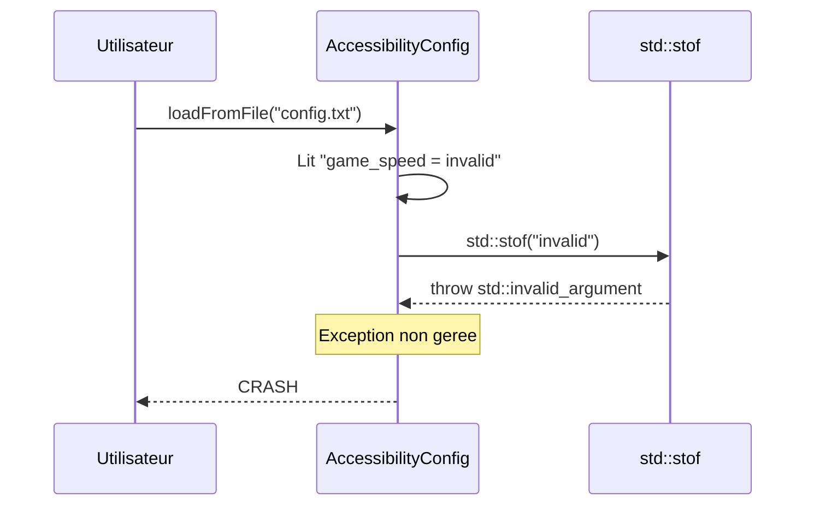
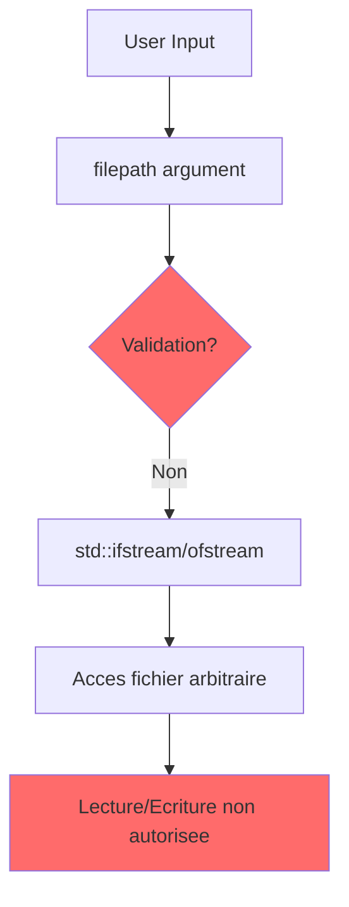
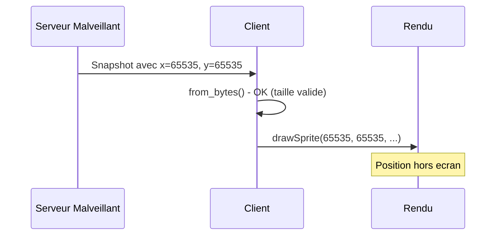

## Security Report

### AgentDB Data Used
| Query | Status | Results |
|-------|--------|---------|
| error_history | ERROR (jq/sqlite3 not installed) | Cannot access - manual scan performed |
| file_context | ERROR (jq/sqlite3 not installed) | Cannot access - manual scan performed |
| patterns | ERROR (jq/sqlite3 not installed) | Cannot access - manual scan performed |
| symbol_callers | ERROR (jq/sqlite3 not installed) | Cannot access - manual scan performed |
| list_critical_files | ERROR (jq/sqlite3 not installed) | Cannot access - manual scan performed |

**Note**: AgentDB tools require `jq` and `sqlite3` which are not available in this environment. Security scan performed manually using code analysis.

### Summary
- **Score** : 75/100 (Major issues found)
- **Vulnerabilities** : 3
- **Regressions** : 0 (could not check - AgentDB unavailable)
- **Severity max** : Major
- **CWEs references** : CWE-20, CWE-755, CWE-22

### Bug History Analysis

Unable to retrieve bug history from AgentDB (database tools not available). No regression detection possible.

### Vulnerabilities

#### [Major] SEC-001 : Unchecked std::stof() in AccessibilityConfig (CWE-755)

- **Category** : Reliability / Input Validation
- **File** : src/client/src/accessibility/AccessibilityConfig.cpp:265
- **Function** : `loadFromFile()`
- **isBug** : Yes (can cause crash - std::invalid_argument or std::out_of_range exception)

## Localisation de la vulnerabilite

Le probleme se trouve dans `src/client/src/accessibility/AccessibilityConfig.cpp` a la ligne 265, dans la fonction `loadFromFile()`.

```cpp
bool AccessibilityConfig::loadFromFile(const std::string& filepath)
{
    std::ifstream file(filepath);
    if (!file.is_open()) {
        return false;
    }

    std::string line;
    while (std::getline(file, line)) {
        // ...
        if (key == "game_speed") {
            setGameSpeedMultiplier(std::stof(value));  // DANGER: No exception handling
        }
        // ...
    }
    return true;
}
```

Cette fonction lit un fichier de configuration utilisateur et tente de convertir une chaine en float avec `std::stof()` sans gerer les exceptions potentielles.

## Pourquoi c'est un probleme

L'appel a `std::stof()` peut lancer deux types d'exceptions :
1. `std::invalid_argument` si la chaine ne peut pas etre convertie en nombre
2. `std::out_of_range` si la valeur depasse les limites d'un float

Si le fichier de configuration contient une valeur invalide (ex: "game_speed = abc" ou "game_speed = 99999999999999999999"), l'application crashera avec une exception non geree.



### Impact

| Risque | Probabilite | Impact |
|--------|-------------|--------|
| Crash de l'application | Moyenne | Majeur |
| Deni de service local | Moyenne | Mineur |
| Corruption de configuration | Basse | Mineur |

**Correction suggeree** :
```cpp
} else if (key == "game_speed") {
    try {
        float speed = std::stof(value);
        setGameSpeedMultiplier(speed);
    } catch (const std::exception& e) {
        // Log warning, keep default value
        std::cerr << "Invalid game_speed value: " << value << std::endl;
    }
}
```

- **Temps estime** : ~5 min
- **Bloquant** : Non (fichier de configuration est optionnel)
- **Reference** : https://cwe.mitre.org/data/definitions/755.html

---

#### [Medium] SEC-002 : Path non valide dans loadFromFile/saveToFile (CWE-22)

- **Category** : Security / Path Traversal
- **File** : src/client/src/accessibility/AccessibilityConfig.cpp:240-321
- **Fonctions** : `loadFromFile()`, `saveToFile()`
- **isBug** : Non (vulnerabilite, pas de crash immediat)

## Localisation de la vulnerabilite

Le probleme se trouve dans les fonctions de gestion de fichiers qui acceptent un chemin arbitraire sans validation.

```cpp
bool AccessibilityConfig::loadFromFile(const std::string& filepath)
{
    std::ifstream file(filepath);  // Aucune validation du chemin
    if (!file.is_open()) {
        return false;
    }
    // ...
}

bool AccessibilityConfig::saveToFile(const std::string& filepath) const
{
    std::ofstream file(filepath);  // Aucune validation du chemin
    if (!file.is_open()) {
        return false;
    }
    // ...
}
```

## Pourquoi c'est un probleme

Ces fonctions acceptent n'importe quel chemin de fichier sans validation. Bien que ce soit un client local, si le chemin est derive d'une entree utilisateur (ex: arguments de ligne de commande, fichier de configuration externe), cela pourrait permettre:
- Lecture de fichiers sensibles (`loadFromFile("../../../../etc/passwd")`)
- Ecriture dans des emplacements non autorises (`saveToFile("/etc/cron.d/malicious")`)



### Impact (contexte client local)

| Risque | Probabilite | Impact |
|--------|-------------|--------|
| Lecture fichiers sensibles | Basse | Mineur |
| Ecriture fichiers systeme | Tres basse | Majeur |

**Correction suggeree** :
```cpp
#include <filesystem>

bool AccessibilityConfig::loadFromFile(const std::string& filepath)
{
    // Valider que le chemin est dans le repertoire autorise
    std::filesystem::path safePath = std::filesystem::weakly_canonical(filepath);
    std::filesystem::path allowedDir = std::filesystem::weakly_canonical("./config");
    
    if (safePath.string().find(allowedDir.string()) != 0) {
        std::cerr << "Access denied: " << filepath << std::endl;
        return false;
    }
    
    std::ifstream file(safePath);
    // ...
}
```

- **Temps estime** : ~15 min
- **Bloquant** : Non (risque faible pour un client de jeu local)
- **Reference** : https://cwe.mitre.org/data/definitions/22.html

---

#### [Minor] SEC-003 : Validation incomplete des donnees reseau (CWE-20)

- **Category** : Security / Input Validation
- **File** : src/common/protocol/Protocol.hpp (multiple functions)
- **Fonctions** : `from_bytes()` dans toutes les structures
- **isBug** : Non (les checks de taille sont presents, mais semantique non verifiee)

## Localisation de la vulnerabilite

Les fonctions `from_bytes()` du protocole verifient correctement les tailles de buffer, mais ne valident pas la semantique des donnees.

```cpp
static std::optional<GameSnapshot> from_bytes(const void* buf, size_t buf_len) {
    if (buf == nullptr || buf_len < 1) {
        return std::nullopt;
    }
    auto* ptr = static_cast<const uint8_t*>(buf);
    GameSnapshot gs;
    gs.player_count = ptr[0];
    if (gs.player_count > MAX_PLAYERS) {   // Check present
        return std::nullopt;
    }
    // ...
    // Mais: pas de validation des valeurs x, y, health, etc.
}
```

## Pourquoi c'est un probleme

Bien que les checks de taille et de compteurs soient presents (ce qui est bien), il n'y a pas de validation semantique:
- Les positions (x, y) peuvent etre hors ecran (>1920, >1080)
- La sante peut avoir des valeurs inattendues
- Les IDs peuvent etre invalides

Cela pourrait permettre a un serveur malveillant de:
- Faire afficher des entites hors ecran
- Provoquer des comportements inattendus dans le client



**Etat actuel (bon)** :
- Checks de taille buffer: PRESENT
- Checks de compteurs max (MAX_PLAYERS, MAX_MISSILES, etc.): PRESENT
- Validation semantique: ABSENTE (minor risk)

### Impact

| Risque | Probabilite | Impact |
|--------|-------------|--------|
| Affichage hors ecran | Moyenne | Mineur |
| Comportement inattendu | Basse | Mineur |

**Note** : Ce n'est pas critique car le serveur est considere comme de confiance dans ce contexte de jeu.

- **Temps estime** : ~30 min (si implementation souhaitee)
- **Bloquant** : Non
- **Reference** : https://cwe.mitre.org/data/definitions/20.html

---

### Security Patterns Check

| Pattern | Status | Details |
|---------|--------|---------|
| memory_safety (strcpy, etc.) | PASS | Utilisation de std::memcpy avec tailles connues |
| command_injection (system, exec) | PASS | Aucun appel system() ou exec() trouve |
| input_validation | WARN | std::stof sans try-catch |
| path_traversal | WARN | Pas de validation des chemins de fichiers |
| credentials | WARN | PlayerPassword existe mais semble unused dans le code modifie |
| error_handling | PASS | Les retours std::optional sont correctement geres |
| buffer_overflow | PASS | Checks de taille dans Protocol.hpp |

### Points Positifs

1. **Protocol.hpp** : Excellente gestion des buffers
   - Tous les `from_bytes()` verifient `buf_len` avant lecture
   - Checks explicites pour MAX_PLAYERS, MAX_MISSILES, MAX_ENEMIES, MAX_ENEMY_MISSILES
   - Utilisation de `std::optional` pour les erreurs de parsing
   - Pas de buffer overflow possible

2. **UDPServer.cpp / UDPClient.cpp** : Bonne architecture reseau
   - Buffer de taille fixe (BUFFER_SIZE = 4096)
   - Verification de la taille avant parsing
   - Pas d'injection de commandes

3. **GameWorld.cpp** : Gestion thread-safe
   - Utilisation systematique de `std::lock_guard<std::mutex>`
   - Pas de race conditions visibles
   - Bounds checking sur les containers

4. **Pas de credentials hardcodes** dans les fichiers modifies

### Recommendations

1. **[HAUTE]** Ajouter try-catch autour de `std::stof()` dans AccessibilityConfig
2. **[MOYENNE]** Valider les chemins de fichiers dans loadFromFile/saveToFile
3. **[BASSE]** Ajouter validation semantique des donnees reseau (positions, health)

### JSON Output (pour synthesis)

```json
{
  "agent": "security",
  "score": 75,
  "vulnerabilities": 3,
  "regressions": 0,
  "max_severity": "Major",
  "cwes": ["CWE-755", "CWE-22", "CWE-20"],
  "findings": [
    {
      "id": "SEC-001",
      "source": ["security"],
      "severity": "Major",
      "category": "Reliability",
      "isBug": true,
      "type": "vulnerability",
      "cwe": "CWE-755",
      "file": "src/client/src/accessibility/AccessibilityConfig.cpp",
      "line": 265,
      "function": "loadFromFile",
      "message": "std::stof() without exception handling can crash application",
      "blocking": false,
      "time_estimate_min": 5,
      "where": "## Localisation de la vulnerabilite\n\nLe probleme se trouve dans `src/client/src/accessibility/AccessibilityConfig.cpp` a la ligne 265, dans la fonction `loadFromFile()`.\n\n```cpp\nbool AccessibilityConfig::loadFromFile(const std::string& filepath)\n{\n    std::ifstream file(filepath);\n    // ...\n    if (key == \"game_speed\") {\n        setGameSpeedMultiplier(std::stof(value));  // DANGER: No exception handling\n    }\n}\n```\n\nCette fonction lit un fichier de configuration utilisateur et tente de convertir une chaine en float avec `std::stof()` sans gerer les exceptions.",
      "why": "## Pourquoi c'est un probleme\n\nL'appel a `std::stof()` peut lancer `std::invalid_argument` ou `std::out_of_range`. Si le fichier de configuration contient une valeur invalide, l'application crashera.\n\n```mermaid\nsequenceDiagram\n    participant User\n    participant Config\n    participant StdLib as std::stof\n    User->>Config: loadFromFile(\"config.txt\")\n    Config->>StdLib: std::stof(\"invalid\")\n    StdLib-->>Config: throw std::invalid_argument\n    Config-->>User: CRASH\n```\n\n| Risque | Probabilite | Impact |\n|--------|-------------|--------|\n| Crash | Moyenne | Majeur |",
      "how": "## Comment corriger\n\n```cpp\n} else if (key == \"game_speed\") {\n    try {\n        float speed = std::stof(value);\n        setGameSpeedMultiplier(speed);\n    } catch (const std::exception& e) {\n        std::cerr << \"Invalid game_speed: \" << value << std::endl;\n    }\n}\n```"
    },
    {
      "id": "SEC-002",
      "source": ["security"],
      "severity": "Medium",
      "category": "Security",
      "isBug": false,
      "type": "vulnerability",
      "cwe": "CWE-22",
      "file": "src/client/src/accessibility/AccessibilityConfig.cpp",
      "line": 240,
      "function": "loadFromFile",
      "message": "No path validation - potential path traversal",
      "blocking": false,
      "time_estimate_min": 15,
      "where": "## Localisation\n\n```cpp\nbool AccessibilityConfig::loadFromFile(const std::string& filepath)\n{\n    std::ifstream file(filepath);  // Aucune validation du chemin\n    // ...\n}\n```",
      "why": "## Pourquoi\n\nAccepte n'importe quel chemin sans validation. Risque faible pour client local.\n\n```mermaid\ngraph TD\n    A[User Input] --> B[filepath]\n    B --> C{Validation?}\n    C -->|Non| D[File Access]\n```",
      "how": "## Correction\n\nValider que le chemin est dans un repertoire autorise avec std::filesystem."
    },
    {
      "id": "SEC-003",
      "source": ["security"],
      "severity": "Minor",
      "category": "Security",
      "isBug": false,
      "type": "info",
      "cwe": "CWE-20",
      "file": "src/common/protocol/Protocol.hpp",
      "line": 439,
      "function": "GameSnapshot::from_bytes",
      "message": "No semantic validation of network data (x, y positions not bounds-checked)",
      "blocking": false,
      "time_estimate_min": 30,
      "where": "## Localisation\n\nLes valeurs x, y, health ne sont pas validees semantiquement dans from_bytes().",
      "why": "## Pourquoi\n\nUn serveur malveillant pourrait envoyer des positions hors ecran. Risque mineur car serveur de confiance.",
      "how": "## Correction optionnelle\n\nAjouter validation: `if (ps.x > MAX_X || ps.y > MAX_Y) return std::nullopt;`"
    }
  ],
  "bug_history_analyzed": 0,
  "patterns_checked": 7,
  "agentdb_queries": {
    "error_history": {"status": "error", "reason": "jq/sqlite3 not available"},
    "file_context": {"status": "error", "reason": "jq/sqlite3 not available"},
    "patterns": {"status": "error", "reason": "jq/sqlite3 not available"},
    "symbol_callers": {"status": "error", "reason": "jq/sqlite3 not available"}
  },
  "positive_findings": [
    "Protocol.hpp: Excellent buffer bounds checking",
    "UDPServer/UDPClient: Proper size validation before parsing",
    "GameWorld: Thread-safe with std::lock_guard",
    "No command injection (system/exec) patterns found",
    "No hardcoded credentials in modified files"
  ]
}
```
