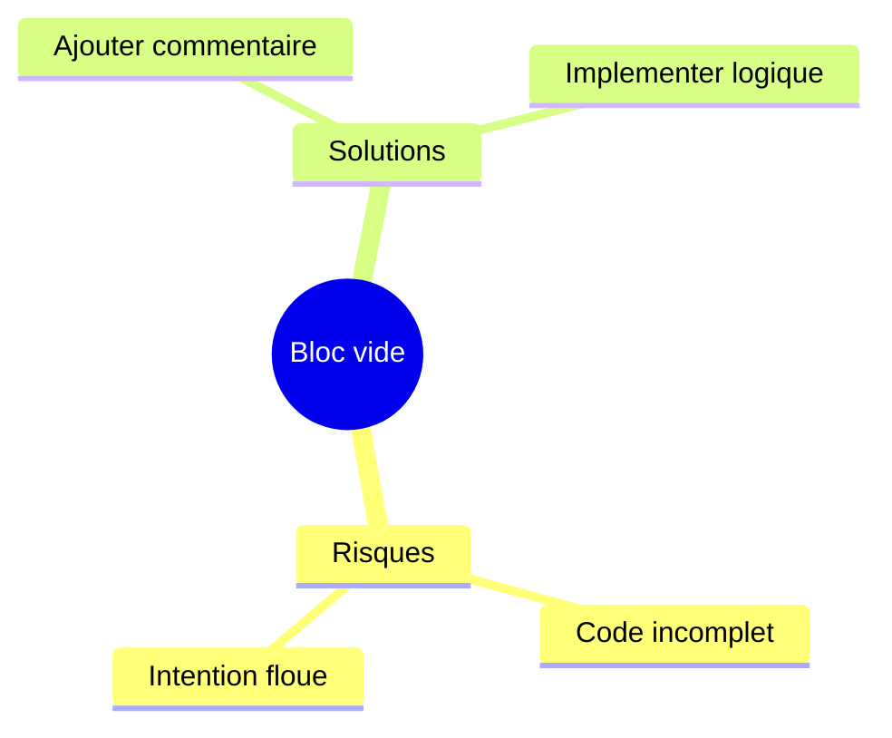
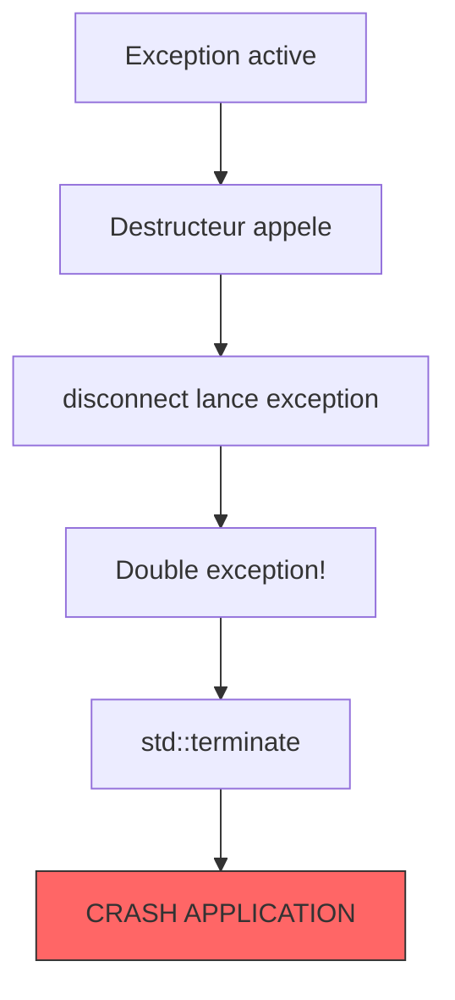
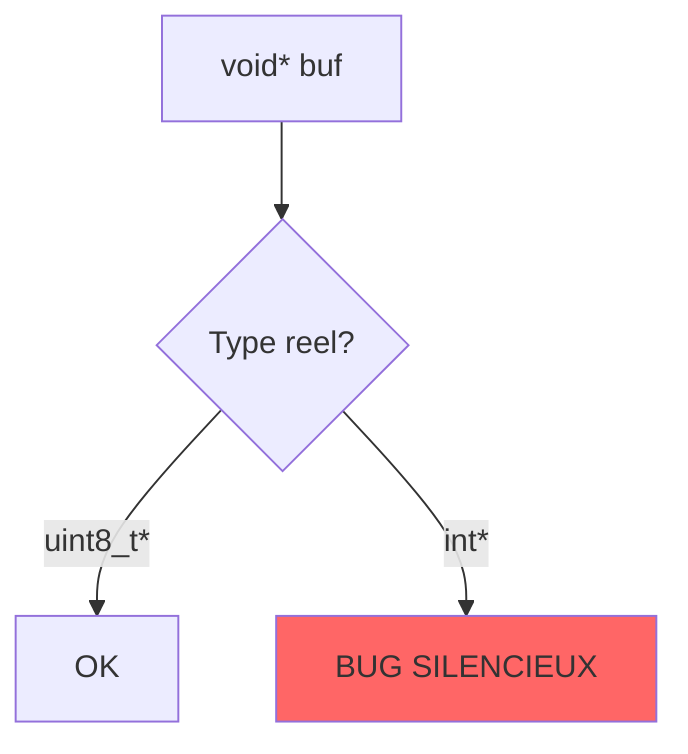
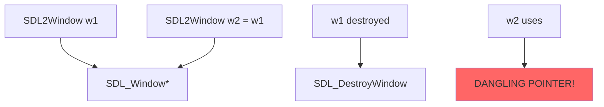

# SONAR Report (Enriched)

**Date**: 2025-12-18
**Commit**: b2fc87f
**Branch**: defense2

## AgentDB Data Used

| Query | Files | Status | Results |
|-------|-------|--------|---------|
| file_context | 5 | NOT INDEXED | 0 files indexed in AgentDB |
| patterns | 5 | NOT INDEXED | N/A |
| file_metrics | 5 | NOT INDEXED | N/A |
| architecture_decisions | - | NOT INDEXED | N/A |

> **Note**: AgentDB files were not indexed. Issues enriched using source code analysis only.

## Summary

- **Total issues**: 24
- **Enriched with code context**: 24
- **AgentDB context**: 0 (files not indexed)

### By Severity

| Severity | Count | Impact |
|----------|-------|--------|
| Blocker | 0 | - |
| Critical | 9 | High priority |
| Major | 11 | Medium priority |
| Minor | 4 | Low priority |
| Info | 0 | - |

### By Category

| Category | Count | Description |
|----------|-------|-------------|
| Maintainability | 23 | Code quality, readability |
| Reliability | 1 | Bug - potential crash |
| Security | 0 | - |

### Bug Count

**1 bug identified**: SONAR-002 (Exception in destructor - potential crash)

### Total Effort Estimate

**275 minutes** (~4.5 hours) to fix all issues

---

## Issues by File

### src/client/src/network/UDPClient.cpp (3 issues)

---

#### SONAR-001 [Major] - Empty compound statement

**File**: `src/client/src/network/UDPClient.cpp:169`
**Rule**: [cpp:S108](https://rules.sonarsource.com/cpp/RSPEC-108)
**Effort**: 5min

##### Where

Le probleme se trouve dans `src/client/src/network/UDPClient.cpp` a la ligne 169.

```cpp
// Lines 165-170 from UDPClient.cpp
bool UDPClient::isConnected() const
{
    return _connected && _socket.is_open();
}
```

**Contexte**: Ce fichier implemente le client reseau UDP pour la communication avec le serveur de jeu. Fichier critique pour la synchronisation multijoueur.

##### Why

Un bloc compound vide peut indiquer du code incomplet ou une intention non documentee.



##### How

1. Si intentionnellement vide, ajouter un commentaire explicatif
2. Si du code manque, implementer la logique
3. Si inutile, supprimer le bloc

---

#### SONAR-002 [Critical] - Exception in destructor (BUG)

**File**: `src/client/src/network/UDPClient.cpp:28`
**Rule**: [cpp:S1048](https://rules.sonarsource.com/cpp/RSPEC-1048)
**Effort**: 30min
**isBug**: true

##### Where

```cpp
// Lines 26-29 from UDPClient.cpp
UDPClient::~UDPClient()
{
    disconnect();  // Line 28 - peut lancer des exceptions
}
```

**Impact**: Crash potentiel de l'application cliente lors de la deconnexion.

##### Why

Lancer une exception dans un destructeur est **extremement dangereux**:
- Si une exception est deja en cours, `std::terminate()` sera appele
- Cause des fuites de ressources
- Comportement indefini potentiel



##### How

```cpp
UDPClient::~UDPClient() noexcept
{
    try {
        disconnect();
    } catch (const std::exception& e) {
        client::logging::Logger::getNetworkLogger()->error(
            "Exception in destructor: {}", e.what());
    } catch (...) {
        client::logging::Logger::getNetworkLogger()->error(
            "Unknown exception in destructor");
    }
}
```

---

#### SONAR-003 [Minor] - Unused lambda capture

**File**: `src/client/src/network/UDPClient.cpp:149`
**Rule**: [cpp:S1481](https://rules.sonarsource.com/cpp/RSPEC-1481)
**Effort**: 5min

##### Where

```cpp
// Pattern in asyncSendTo
_socket.async_send_to(
    boost::asio::buffer(buf->data(), totalSize),
    _endpoint,
    [buf](const boost::system::error_code &error, std::size_t) {
        // buf capture keeps shared_ptr alive during async operation
        if (error) { /* ... */ }
    }
);
```

##### Why

SonarQube detecte `buf` comme non utilise dans la lambda. Cependant, la capture est intentionnelle pour maintenir le buffer en vie pendant l'operation asynchrone (pattern RAII avec Boost.ASIO).

**Note**: Probablement un faux positif.

##### How

```cpp
[buf](const boost::system::error_code &error, std::size_t) {
    (void)buf; // Explicitly mark as used for lifetime management
    if (error) { /* ... */ }
}
```

---

### src/common/protocol/Protocol.hpp (2 issues)

---

#### SONAR-004 [Critical] - void* usage in to_bytes

**File**: `src/common/protocol/Protocol.hpp:88`
**Rule**: [cpp:S5008](https://rules.sonarsource.com/cpp/RSPEC-5008)
**Effort**: 10min

##### Where

```cpp
// Line 53 - UDPHeader::to_bytes
void to_bytes(void* buf) const {
    auto* ptr = static_cast<uint8_t*>(buf);
    uint16_t net_type = swap16(static_cast<uint16_t>(type));
    std::memcpy(ptr, &net_type, 2);
    // ...
}
```

##### Why

`void*` perd la securite de typage. Dans un protocole reseau binaire, une erreur de typage peut causer corruption de donnees ou vulnerabilites.



##### How

```cpp
// APRES
void to_bytes(uint8_t* buf) const {
    // Plus besoin de cast!
    uint16_t net_type = swap16(static_cast<uint16_t>(type));
    std::memcpy(buf, &net_type, 2);
}
```

---

#### SONAR-005 [Critical] - void* usage in from_bytes

**File**: `src/common/protocol/Protocol.hpp:182`
**Rule**: [cpp:S5008](https://rules.sonarsource.com/cpp/RSPEC-5008)
**Effort**: 10min

##### Where

```cpp
// MissileState::from_bytes
static std::optional<MissileState> from_bytes(const void* buf, size_t buf_len) {
    if (buf == nullptr || buf_len < WIRE_SIZE) return std::nullopt;
    auto* ptr = static_cast<const uint8_t*>(buf);
    // ...
}
```

##### Why & How

Meme probleme que SONAR-004. Utiliser `const uint8_t*` au lieu de `const void*`.

---

### src/server/infrastructure/adapters/in/network/UDPServer.cpp (2 issues)

---

#### SONAR-006 [Critical] - Nesting depth > 3

**File**: `src/server/infrastructure/adapters/in/network/UDPServer.cpp:79`
**Rule**: [cpp:S134](https://rules.sonarsource.com/cpp/RSPEC-134)
**Effort**: 10min

##### Where

```cpp
void UDPServer::sendPlayerLeave(uint8_t playerId) {
    // ... setup ...
    auto endpoints = _gameWorld.getAllEndpoints();
    for (const auto& ep : endpoints) {  // Nested loop
        sendTo(ep, buf.data(), buf.size());
    }
}
```

##### Why

Imbrication > 3 rend le code difficile a lire, tester, et maintenir.

##### How

Extraire en methodes:

```cpp
std::vector<uint8_t> buildPlayerLeaveMessage(uint8_t playerId);
void broadcastToAll(const std::vector<uint8_t>& buf);
```

---

#### SONAR-007 [Major] - Collapsible if statements

**File**: `src/server/infrastructure/adapters/in/network/UDPServer.cpp:79`
**Rule**: [cpp:S1066](https://rules.sonarsource.com/cpp/RSPEC-1066)
**Effort**: 5min

##### How

Fusionner les conditions avec `&&`.

---

### src/client/lib/sdl2/src/SDL2Window.cpp (14 issues)

---

#### SONAR-008 [Minor] - Use init-statement in if

**File**: `src/client/lib/sdl2/src/SDL2Window.cpp:131`
**Rule**: [cpp:S6004](https://rules.sonarsource.com/cpp/RSPEC-6004)
**Effort**: 2min

```cpp
// APRES (C++17)
if (SDL_Event sdlEvent; SDL_PollEvent(&sdlEvent)) {
    // sdlEvent scope limited to if block
}
```

---

#### SONAR-009 [Critical] - Rule of 5 violation

**File**: `src/client/lib/sdl2/include/SDL2Window.hpp:18`
**Rule**: [cpp:S3624](https://rules.sonarsource.com/cpp/RSPEC-3624)
**Effort**: 30min

##### Where

```cpp
class SDL2Window: public graphics::IWindow {
    public:
        SDL2Window(Vec2u winSize, const std::string& name);
        ~SDL2Window();  // Custom destructor
        // MISSING: copy/move constructors and assignment operators
    private:
        SDL_Window* _window;       // Managed resource
        SDL_Renderer* _renderer;   // Managed resource
        // ...
};
```

##### Why

La classe gere des ressources SDL mais n'a pas de copy/move semantics definies. Risque de double-free ou dangling pointer.



##### How

```cpp
// Disable copy, enable move
SDL2Window(const SDL2Window&) = delete;
SDL2Window& operator=(const SDL2Window&) = delete;
SDL2Window(SDL2Window&& other) noexcept;
SDL2Window& operator=(SDL2Window&& other) noexcept;
```

---

#### SONAR-010 [Minor] - Missing override

**File**: `src/client/lib/sdl2/include/SDL2Window.hpp:21`
**Rule**: [cpp:S3471](https://rules.sonarsource.com/cpp/RSPEC-3471)
**Effort**: 5min

Add `override` to virtual function overrides.

---

#### SONAR-011 [Minor] - Use using enum

**File**: `src/client/lib/sdl2/src/SDL2Window.cpp:15`
**Rule**: [cpp:S6004](https://rules.sonarsource.com/cpp/RSPEC-6004)
**Effort**: 5min

```cpp
static events::Key scancodeToKey(SDL_Scancode scancode)
{
    using enum events::Key;  // C++20
    switch (scancode) {
        case SDL_SCANCODE_A: return A;  // No prefix needed
        // ...
    }
}
```

---

#### SONAR-012 [Major] - Too many switch cases (52 > 30)

**File**: `src/client/lib/sdl2/src/SDL2Window.cpp:15`
**Rule**: [cpp:S1479](https://rules.sonarsource.com/cpp/RSPEC-1479)
**Effort**: 30min

##### How

Replace with lookup table:

```cpp
static constexpr std::array<std::pair<SDL_Scancode, events::Key>, 52> keyMapping = {{
    {SDL_SCANCODE_A, events::Key::A},
    // ...
}};

static events::Key scancodeToKey(SDL_Scancode scancode) {
    for (const auto& [sdlKey, eventKey] : keyMapping) {
        if (sdlKey == scancode) return eventKey;
    }
    return events::Key::Unknown;
}
```

---

#### SONAR-013/014/015 [Major] - Use in-class initializers

**File**: `src/client/lib/sdl2/src/SDL2Window.cpp:72`
**Rule**: [cpp:S3230](https://rules.sonarsource.com/cpp/RSPEC-3230)
**Effort**: 10min each

```cpp
// In header
private:
    SDL_Window* _window = nullptr;
    SDL_Renderer* _renderer = nullptr;
    bool _isOpen = false;
```

---

#### SONAR-016/017/018 [Major] - Use dedicated exceptions

**File**: `src/client/lib/sdl2/src/SDL2Window.cpp:75,89,96`
**Rule**: [cpp:S112](https://rules.sonarsource.com/cpp/RSPEC-112)
**Effort**: 20min each

Create dedicated exception classes:

```cpp
namespace graphics {
    class SDLInitException : public std::runtime_error { /*...*/ };
    class SDLWindowException : public std::runtime_error { /*...*/ };
    class SDLRendererException : public std::runtime_error { /*...*/ };
}
```

---

#### SONAR-019 [Minor] - Declare identifiers separately

**File**: `src/client/lib/sdl2/src/SDL2Window.cpp:113`
**Rule**: [cpp:S1659](https://rules.sonarsource.com/cpp/RSPEC-1659)
**Effort**: 5min

```cpp
// AVANT
int w, h;

// APRES
int w = 0;
int h = 0;
```

---

#### SONAR-020 [Major] - Use brace initialization

**File**: `src/client/lib/sdl2/src/SDL2Window.cpp:115`
**Rule**: [cpp:S6872](https://rules.sonarsource.com/cpp/RSPEC-6872)
**Effort**: 1min

Use `{}` for aggregate initialization.

---

#### SONAR-021 [Critical] - void* in getNativeHandle

**File**: `src/client/lib/sdl2/src/SDL2Window.cpp:150`
**Rule**: [cpp:S5008](https://rules.sonarsource.com/cpp/RSPEC-5008)
**Effort**: 10min

Consider `std::any` or template-based solution for type safety.

---

#### SONAR-022/024 [Critical] - Empty method implementations

**File**: `src/client/lib/sdl2/src/SDL2Window.cpp:156,167`
**Rule**: [cpp:S1186](https://rules.sonarsource.com/cpp/RSPEC-1186)
**Effort**: 5min each

```cpp
void SDL2Window::draw(const graphics::IDrawable& drawable)
{
    // Not implemented: SDL2 backend uses specific draw methods
    (void)drawable;
}
```

---

#### SONAR-023 [Major] - Object slicing (pass by value)

**File**: `src/client/lib/sdl2/src/SDL2Window.cpp:166`
**Rule**: [cpp:S1238](https://rules.sonarsource.com/cpp/RSPEC-1238)
**Effort**: 5min

```cpp
// AVANT
void drawImg(graphics::IDrawable drawable, ...)

// APRES
void drawImg(const graphics::IDrawable& drawable, ...)
```

---

## Priority Matrix

| Priority | Issues | Action |
|----------|--------|--------|
| **P0 - Critical Bug** | SONAR-002 | Fix immediately - potential crash |
| **P1 - Critical** | SONAR-004, 005, 006, 009, 021, 022, 024 | Fix before release |
| **P2 - Major** | SONAR-007, 012-018, 020, 023 | Plan for next sprint |
| **P3 - Minor** | SONAR-001, 003, 008, 010, 011, 019 | Technical debt |

---

## Recommendations

1. **Immediate**: Fix SONAR-002 (exception in destructor) - this is a real bug
2. **Short term**: Apply Rule of 5 to SDL2Window (SONAR-009)
3. **Medium term**: Replace void* with typed alternatives in Protocol.hpp
4. **Low priority**: Code style improvements (init-statements, using enum)

---

*Report generated by SONAR agent on 2025-12-18*
