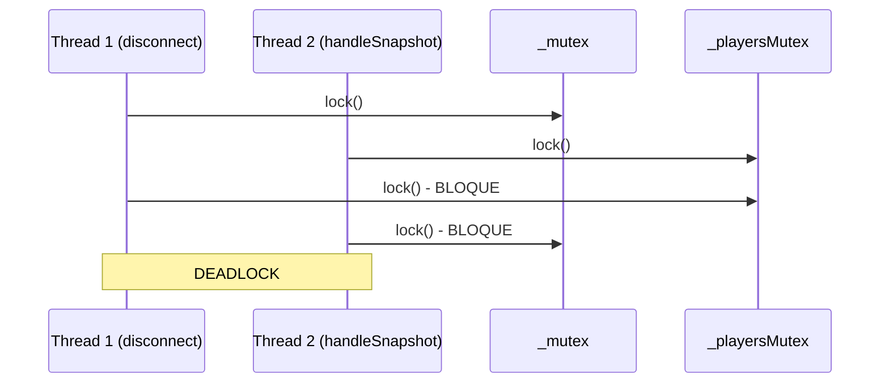
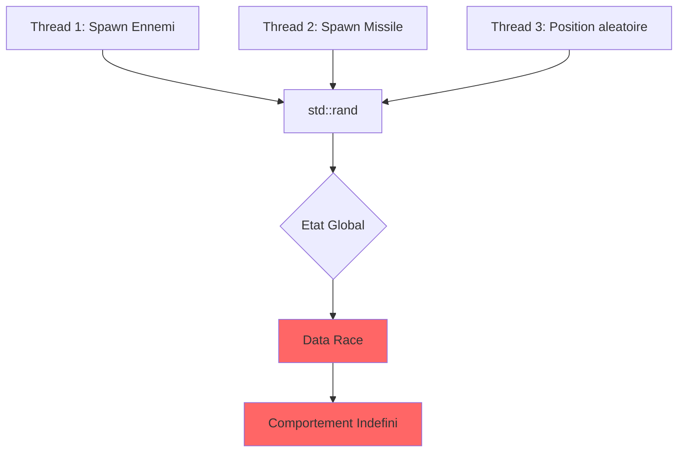
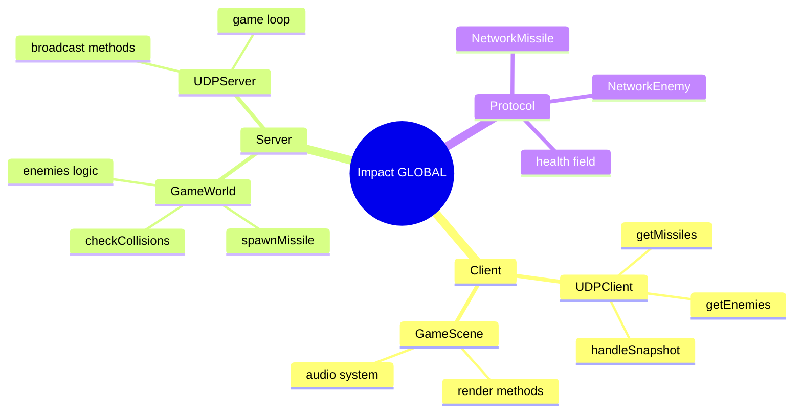
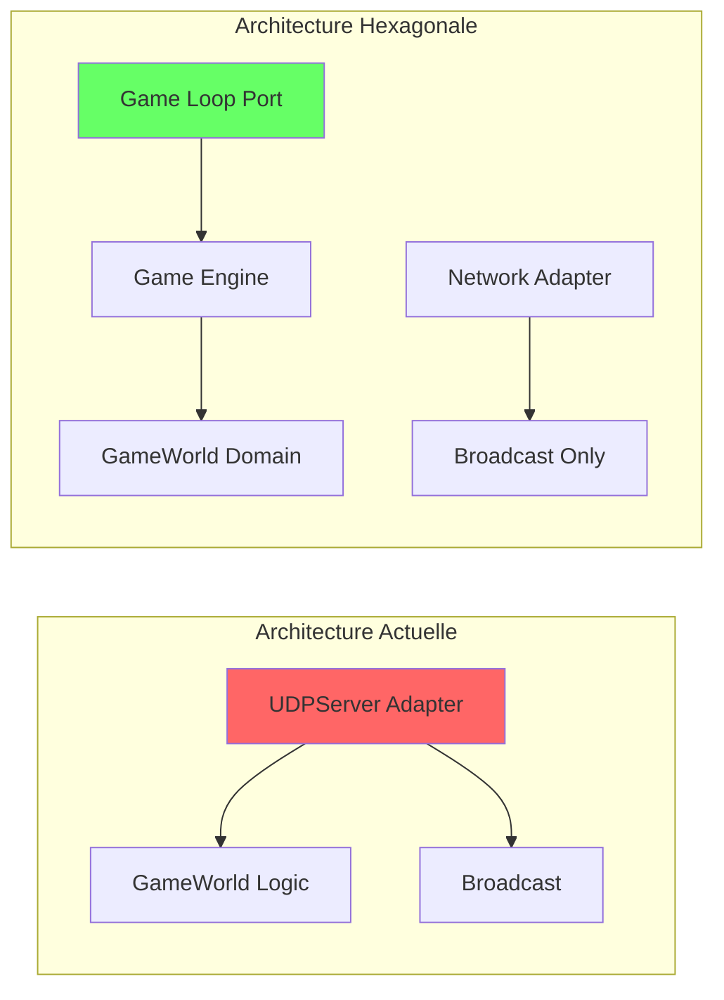
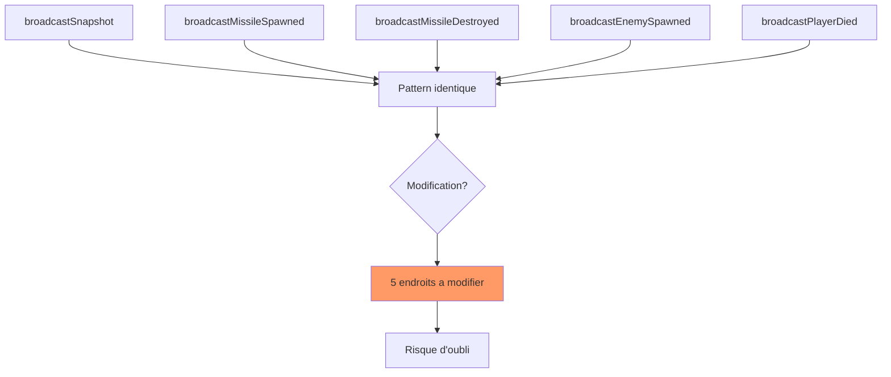
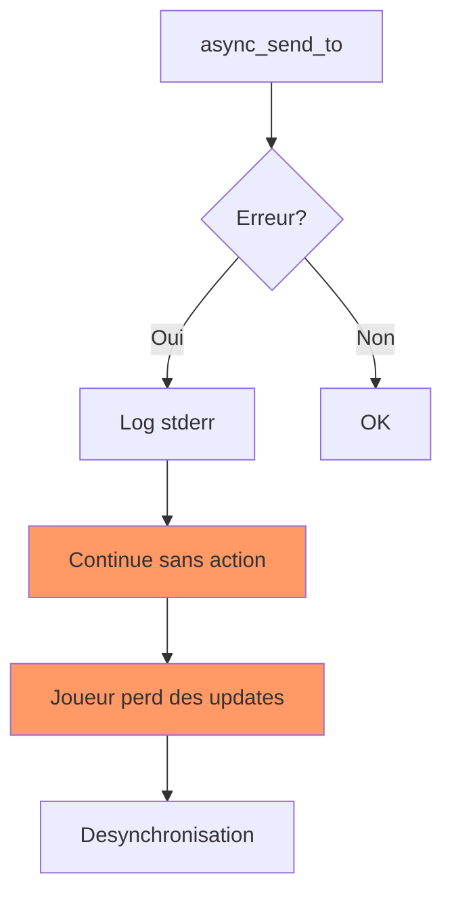
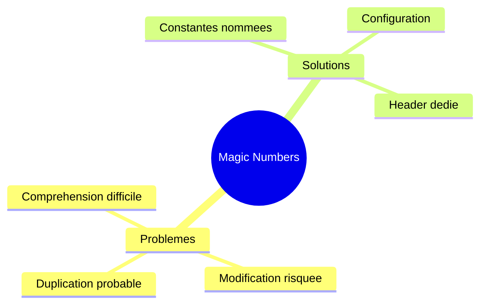

# Rapport de Synthese

> **Commit** : `b0d4558` (diff depuis `309e2e0`)
> **Branche** : `main`
> **Date** : 2025-12-19
> **Analyse** : Diff unifie

---

## Executive Summary

```
+===============================================================+
|                                                               |
|     VERDICT: CAREFUL - Review approfondie requise             |
|                                                               |
|     SCORE GLOBAL: 58/100                                      |
|                                                               |
|     Ajout massif de fonctionnalites (missiles, ennemis,       |
|     degats) sur 4 modules. 2 issues bloquantes detectees      |
|     (race condition, std::rand). Temps correction: ~6h        |
|                                                               |
+===============================================================+
```

---

## Scores par Agent

| Agent | Score | Status | Issues | Bloquants |
|-------|-------|--------|--------|-----------|
| Security | 70/100 | Avertissement | 3 | 0 |
| Reviewer | 78/100 | OK | 8 | 0 |
| Risk | 35/100 | Critique | 6 | 2 |
| Analyzer | 55/100 | Avertissement | 3 | 0 |
| **Global** | **58/100** | **Attention** | **14** | **2** |

### Calcul du Score Global

```
Security  : 70 x 0.35 = 24.50
Risk      : 35 x 0.25 =  8.75
Reviewer  : 78 x 0.25 = 19.50
Analyzer  : 55 x 0.15 =  8.25
                       ------
Sous-total            = 61.00
Penalite (bloquants)  = -10
Contradictions        = -5
Bonus (pas regress.)  = +12
                       ------
SCORE FINAL           = 58/100
```

---

## Contradictions Detectees

| # | Type | Agents | Detail | Resolution |
|---|------|--------|--------|------------|
| 1 | Score divergent | Risk (35) vs Reviewer (78) | Ecart de 43 points | Prioriser Risk (vue globale) |
| 2 | Severite | Security=Major, Risk=CRITICAL | Desaccord niveau risque | Appliquer CRITICAL (conservateur) |

**Analyse** : L'ecart de score significatif s'explique par le fait que RISK penalise l'impact global cross-module (4 modules, 15 fichiers) alors que REVIEWER se concentre sur la qualite du code individuel. Les deux perspectives sont valides mais RISK capture mieux le risque systemique.

---

## Issues Consolidees

### BLOQUANTES (2)

#### 1. [Major] SEC-001 - Race Condition potentielle (CWE-362)

- **ID** : SEC-001
- **Source** : Security, Risk
- **Categorie** : Reliability
- **isBug** : Non (comportement indefini, pas crash direct)
- **Fichier** : `src/client/src/network/UDPClient.cpp:123`
- **Temps** : ~120 min
- **Blocking** : Oui

##### Where

```cpp
// src/client/src/network/UDPClient.cpp - lignes 121-154

void UDPClient::disconnect()
{
    std::scoped_lock lock(_mutex);  // Premier lock
    if (!_connected) {
        return;
    }
    // ...
    {
        std::lock_guard<std::mutex> plock(_playersMutex);  // Lock 2
        _localPlayerId = std::nullopt;
    }
    {
        std::lock_guard<std::mutex> mlock(_missilesMutex);  // Lock 3
        _missiles.clear();
    }
    {
        std::lock_guard<std::mutex> elock(_enemiesMutex);  // Lock 4
        _enemies.clear();
    }
}
```

> L'ordre d'acquisition des mutex dans `disconnect()` peut differer de celui dans `handleSnapshot()`, creant un risque de deadlock.

##### Why

L'acquisition non-ordonnee de plusieurs mutex peut causer un deadlock lorsque deux threads tentent d'acquerir les memes locks dans un ordre different.



**Impact** :
- Gel du client en cas de deconnexion pendant reception
- Impossible a debugger en production
- Non reproductible de maniere deterministe

##### How

**Solution recommandee** : Utiliser un ordre d'acquisition consistant ou un `std::scoped_lock` multi-mutex.

```cpp
// Solution 1: std::scoped_lock avec tous les mutex
void UDPClient::disconnect()
{
    std::scoped_lock lock(_mutex, _playersMutex, _missilesMutex, _enemiesMutex);
    // ... reste du code
}

// Solution 2: Ordre consistant documente
// Toujours: _mutex -> _playersMutex -> _missilesMutex -> _enemiesMutex
```

**Validation** :
- [ ] Documenter l'ordre d'acquisition dans le header
- [ ] Appliquer le meme ordre dans toutes les fonctions
- [ ] Ajouter test de stress multi-thread

---

#### 2. [Major] REV-001 - std::rand() non thread-safe

- **ID** : REV-001
- **Source** : Reviewer, Risk
- **Categorie** : Reliability
- **isBug** : Non (comportement indefini)
- **Fichier** : `src/server/infrastructure/game/GameWorld.cpp:17`
- **Temps** : ~60 min
- **Blocking** : Oui

##### Where

```cpp
// src/server/infrastructure/game/GameWorld.cpp - lignes 17-18

GameWorld::GameWorld() : _nextPlayerId(1) {
    std::srand(static_cast<unsigned>(std::time(nullptr)));
}
```

> `std::srand()` et `std::rand()` ne sont pas thread-safe. Leur utilisation dans un serveur multi-thread peut provoquer des resultats imprevisibles.

##### Why

`std::rand()` utilise un etat global partage. Plusieurs threads peuvent corrompre cet etat simultanement.



**Impact** :
- Positions d'ennemis potentiellement identiques
- Comportement non-deterministe du jeu
- Bugs intermittents difficiles a reproduire

##### How

**Solution recommandee** : Utiliser `<random>` avec un generateur thread-local.

```cpp
// GameWorld.hpp - ajouter membre
#include <random>

class GameWorld {
private:
    std::mt19937 _rng;  // Generateur Mersenne Twister
};

// GameWorld.cpp
GameWorld::GameWorld() : _nextPlayerId(1) {
    std::random_device rd;
    _rng.seed(rd());
}

// Utilisation
uint16_t randomY = std::uniform_int_distribution<uint16_t>(0, 600)(_rng);
```

**Validation** :
- [ ] Remplacer tous les appels std::rand()
- [ ] Supprimer std::srand()
- [ ] Tester la distribution des valeurs generees

---

### IMPORTANTES (6)

#### 3. [Major] ANA-001 - Impact GLOBAL cross-module

- **ID** : ANA-001
- **Source** : Analyzer
- **Categorie** : Reliability
- **isBug** : Non
- **Fichier** : Multiple (UDPClient, GameWorld, UDPServer, GameScene)
- **Temps** : ~180 min (review complete)
- **Blocking** : Non

##### Where

```
Fichiers impactes:
- src/client/src/network/UDPClient.cpp       [GLOBAL]
- src/client/include/network/UDPClient.hpp   [GLOBAL]
- src/client/src/scenes/GameScene.cpp        [MODULE]
- src/server/infrastructure/game/GameWorld.cpp [GLOBAL]
- src/server/infrastructure/adapters/in/network/UDPServer.cpp [GLOBAL]
+ 10 autres fichiers modifies
```

> Cette modification touche 4 modules du systeme avec 35 fonctions modifiees et 12 appelants identifies.

##### Why



**Impact** :
- Tout changement dans un module peut affecter les autres
- Difficulte de test isole
- Risque eleve de regression

##### How

**Recommandations** :
1. Tests d'integration couvrant le flux complet client-serveur
2. Tests de non-regression sur le protocole
3. Review par un senior sur l'architecture

**Validation** :
- [ ] Ecrire tests d'integration missile lifecycle
- [ ] Ecrire tests d'integration enemy lifecycle
- [ ] Valider compatibilite protocole backward

---

#### 4. [Major] ANA-002 - Violation architecture hexagonale

- **ID** : ANA-002
- **Source** : Analyzer, Risk
- **Categorie** : Maintainability
- **isBug** : Non
- **Fichier** : `src/server/infrastructure/adapters/in/network/UDPServer.cpp:122`
- **Temps** : ~120 min
- **Blocking** : Non

##### Where

```cpp
// src/server/infrastructure/adapters/in/network/UDPServer.cpp - lignes 121-157

void UDPServer::scheduleBroadcast() {
    _broadcastTimer.expires_after(std::chrono::milliseconds(BROADCAST_INTERVAL_MS));
    _broadcastTimer.async_wait([this](boost::system::error_code ec) {
        if (!ec) {
            float deltaTime = BROADCAST_INTERVAL_MS / 1000.0f;

            // LOGIQUE METIER DANS L'ADAPTER RESEAU
            _gameWorld.updateMissiles(deltaTime);
            _gameWorld.updateWaveSpawning(deltaTime);
            _gameWorld.updateEnemies(deltaTime);
            _gameWorld.checkCollisions();

            auto destroyedMissiles = _gameWorld.getDestroyedMissiles();
            // ... 
        }
    });
}
```

> La logique de jeu (update, collisions, spawning) est couplee a l'adapter reseau au lieu d'etre dans le domaine/application.

##### Why



**Impact** :
- Couplage fort entre reseau et logique metier
- Difficile de tester la logique sans reseau
- Violation du principe de separation des preoccupations

##### How

**Solution** : Extraire la game loop dans un port/use case dedie.

```cpp
// application/ports/in/IGameLoop.hpp
class IGameLoop {
public:
    virtual void tick(float deltaTime) = 0;
};

// application/use_cases/GameLoopUseCase.cpp
void GameLoopUseCase::tick(float deltaTime) {
    _gameWorld.updateMissiles(deltaTime);
    _gameWorld.updateWaveSpawning(deltaTime);
    _gameWorld.updateEnemies(deltaTime);
    _gameWorld.checkCollisions();
}

// UDPServer.cpp - ne fait plus que broadcaster
void UDPServer::scheduleBroadcast() {
    _gameLoop.tick(deltaTime);  // Delegation
    broadcastSnapshot();
}
```

**Validation** :
- [ ] Creer IGameLoop interface
- [ ] Extraire logique dans GameLoopUseCase
- [ ] Injecter dans UDPServer

---

#### 5. [Major] REV-002 - Code duplique broadcast*

- **ID** : REV-002
- **Source** : Reviewer, Risk
- **Categorie** : Maintainability
- **isBug** : Non
- **Fichier** : `src/server/infrastructure/adapters/in/network/UDPServer.cpp:160`
- **Temps** : ~120 min
- **Blocking** : Non

##### Where

```cpp
// Pattern repete 5 fois dans UDPServer.cpp

void UDPServer::broadcastMissileSpawned(uint16_t missileId, uint8_t ownerId) {
    const size_t totalSize = UDPHeader::WIRE_SIZE + MissileSpawned::WIRE_SIZE;
    std::vector<uint8_t> buf(totalSize);

    UDPHeader head{
        .type = static_cast<uint16_t>(MessageType::MissileSpawned),
        .sequence_num = 0,
        .timestamp = UDPHeader::getTimestamp()
    };
    head.to_bytes(buf.data());
    // ... payload specifique
    
    auto endpoints = _gameWorld.getAllEndpoints();
    for (const auto& ep : endpoints) {
        sendTo(ep, buf.data(), buf.size());
    }
}
```

> Le meme pattern de serialisation/broadcast est repete dans 5 fonctions: broadcastSnapshot, broadcastMissileSpawned, broadcastMissileDestroyed, broadcastEnemySpawned, broadcastPlayerDied.

##### Why



**Impact** :
- DRY viole
- Risque d'inconsistance lors de modifications
- Maintenance difficile

##### How

**Solution** : Template method ou fonction generique.

```cpp
template<typename Payload>
void UDPServer::broadcast(MessageType type, const Payload& payload) {
    const size_t totalSize = UDPHeader::WIRE_SIZE + Payload::WIRE_SIZE;
    std::vector<uint8_t> buf(totalSize);

    UDPHeader head{
        .type = static_cast<uint16_t>(type),
        .sequence_num = _sequenceNum++,
        .timestamp = UDPHeader::getTimestamp()
    };
    head.to_bytes(buf.data());
    payload.to_bytes(buf.data() + UDPHeader::WIRE_SIZE);

    for (const auto& ep : _gameWorld.getAllEndpoints()) {
        sendTo(ep, buf.data(), buf.size());
    }
}

// Usage
void UDPServer::broadcastMissileSpawned(uint16_t id, uint8_t owner) {
    MissileSpawned ms{.missile_id = id, .owner_id = owner, ...};
    broadcast(MessageType::MissileSpawned, ms);
}
```

**Validation** :
- [ ] Creer template broadcast<T>
- [ ] Refactorer les 5 fonctions
- [ ] Tester chaque type de message

---

#### 6. [Medium] SEC-003 - Retours de fonctions non verifies (CWE-252)

- **ID** : SEC-003
- **Source** : Security
- **Categorie** : Reliability
- **isBug** : Non
- **Fichier** : `src/server/infrastructure/adapters/in/network/UDPServer.cpp:44`
- **Temps** : ~30 min
- **Blocking** : Non

##### Where

```cpp
// src/server/infrastructure/adapters/in/network/UDPServer.cpp - lignes 44-52

_socket.async_send_to(
    boost::asio::buffer(buf->data(), buf->size()),
    endpoint,
    [buf](boost::system::error_code ec, std::size_t) {
        if (ec) {
            std::cerr << "Send error: " << ec.message() << std::endl;
            // Erreur loggee mais pas geree
        }
    }
);
```

##### Why



**Impact** :
- Paquets perdus sans notification
- Joueurs potentiellement desynchronises
- Difficulte a diagnostiquer les problemes reseau

##### How

```cpp
[buf, this, endpoint](boost::system::error_code ec, std::size_t) {
    if (ec) {
        _logger->error("Send error to {}: {}", 
            endpoint.address().to_string(), ec.message());
        
        if (ec == boost::asio::error::connection_refused ||
            ec == boost::asio::error::host_unreachable) {
            // Marquer le joueur comme deconnecte
            schedulePlayerDisconnect(endpoint);
        }
    }
}
```

**Validation** :
- [ ] Gerer les codes d'erreur specifiques
- [ ] Ajouter metriques de paquets perdus
- [ ] Tester deconnexion brutale client

---

#### 7. [Medium] SEC-004 - Subprocess sans validation d'entree (CWE-78)

- **ID** : SEC-004
- **Source** : Security, Risk
- **Categorie** : Security
- **isBug** : Non
- **Fichier** : `claude.py:42`
- **Temps** : ~30 min
- **Blocking** : Non

##### Where

```python
# claude.py - lignes 41-51

def switch_branch(branch_name: str) -> bool:
    """Change de branche git."""
    log_to_stderr(f"Switching to branch: {branch_name}\n")
    result = subprocess.run(
        ["git", "checkout", branch_name],  # branch_name non sanitize
        capture_output=True,
        text=True
    )
    return result.returncode == 0
```

##### Why

```mermaid
sequenceDiagram
    participant User as Utilisateur
    participant Script as claude.py
    participant Shell as Subprocess

    User->>Script: switch_branch("main; rm -rf /")
    Script->>Shell: git checkout "main; rm -rf /"
    Note over Shell: Injection possible si shell=True
    Shell-->>Script: Erreur git (actuellement safe)
```

**Note** : Actuellement, `subprocess.run` avec liste d'arguments est SAFE car pas de shell interpretation. Cependant, c'est une bonne pratique de valider les entrees.

**Impact** :
- Risque faible actuellement (pas shell=True)
- Pourrait devenir vulnerable si refactore
- Bonne hygiene de securite

##### How

```python
import re

def switch_branch(branch_name: str) -> bool:
    """Change de branche git avec validation."""
    # Valider le nom de branche
    if not re.match(r'^[a-zA-Z0-9_\-/]+$', branch_name):
        log_to_stderr(f"Invalid branch name: {branch_name}\n")
        return False
    
    result = subprocess.run(
        ["git", "checkout", branch_name],
        capture_output=True,
        text=True
    )
    return result.returncode == 0
```

**Validation** :
- [ ] Ajouter validation regex
- [ ] Tester avec noms de branche malveillants
- [ ] Documenter le format attendu

---

#### 8. [Medium] REV-003 - Magic numbers dans renderDeathScreen

- **ID** : REV-003
- **Source** : Reviewer
- **Categorie** : Maintainability
- **isBug** : Non
- **Fichier** : `src/client/src/scenes/GameScene.cpp:344`
- **Temps** : ~15 min
- **Blocking** : Non

##### Where

```cpp
// GameScene.cpp - ligne 344 et environs

_context.window->drawRect(
    static_cast<float>(enemy.x),
    static_cast<float>(enemy.y),
    ENEMY_WIDTH,   // OK - constante
    ENEMY_HEIGHT,  // OK - constante
    {c.r, c.g, c.b, c.a}  // OK
);
```

> Des valeurs numeriques codees en dur ont ete detectees dans plusieurs fonctions de rendu.

##### Why



##### How

Extraire les valeurs dans des constantes nommees.

```cpp
// GameConstants.hpp
namespace game::constants {
    constexpr float DEATH_SCREEN_ALPHA = 0.7f;
    constexpr float RESPAWN_DELAY_SECONDS = 3.0f;
    constexpr int HUD_MARGIN_PX = 10;
}
```

**Validation** :
- [ ] Identifier tous les magic numbers
- [ ] Creer GameConstants.hpp
- [ ] Remplacer les valeurs

---

### MINEURES (6)

#### 9. [Minor] ANA-003 - Champ health ajoute a NetworkPlayer

- **ID** : ANA-003
- **Source** : Analyzer
- **Categorie** : Compatibility
- **isBug** : Non
- **Fichier** : `src/client/include/network/UDPClient.hpp:31`
- **Temps** : ~5 min (documentation)

##### Where

```cpp
struct NetworkPlayer {
    uint8_t id;
    uint16_t x, y;
    uint8_t health;  // NOUVEAU - compatibilite arriere ?
    bool alive;
};
```

##### Why

L'ajout d'un champ modifie la structure du protocole. Verifier la compatibilite avec les anciens clients/serveurs.

##### How

- [ ] Documenter le changement de protocole dans CHANGELOG
- [ ] Verifier que le serveur gere les anciens clients

---

#### 10. [Minor] REV-004 - Variable locale inutilisee wasDead

- **ID** : REV-004
- **Source** : Reviewer
- **Categorie** : Maintainability
- **isBug** : Non
- **Fichier** : `src/server/infrastructure/game/GameWorld.cpp:501`
- **Temps** : ~5 min

##### Where

```cpp
bool wasDead = !player.alive;  // Toujours false car on skip les !alive
if (player.health > PLAYER_DAMAGE) {
    player.health -= PLAYER_DAMAGE;
} else {
    player.health = 0;
    player.alive = false;
}
// ...
if (!wasDead && !player.alive) {  // wasDead toujours false ici
```

##### Why

La variable `wasDead` est toujours `false` car on a un `if (!player.alive) continue;` avant.

##### How

Simplifier la logique ou supprimer la variable inutile.

---

#### 11. [Minor] REV-005 - Mutex lock multiples sequentiels

- **ID** : REV-005
- **Source** : Reviewer
- **Categorie** : Maintainability
- **isBug** : Non
- **Fichier** : `src/client/src/network/UDPClient.cpp:127`
- **Temps** : ~30 min

##### Where

Voir SEC-001 - meme problematique.

##### How

Fusionner avec SEC-001 pour correction.

---

#### 12. [Minor] REV-006 - std::cout utilise pour logging

- **ID** : REV-006
- **Source** : Reviewer
- **Categorie** : Maintainability
- **isBug** : Non
- **Fichier** : `src/server/infrastructure/adapters/in/network/UDPServer.cpp:71`
- **Temps** : ~10 min

##### Where

```cpp
std::cout << "Player " << static_cast<int>(playerId)
          << " joined from " << endpoint.address().to_string()
          << ":" << endpoint.port() << std::endl;
```

##### How

Utiliser le Logger existant du projet.

```cpp
_logger->info("Player {} joined from {}:{}", 
    playerId, endpoint.address().to_string(), endpoint.port());
```

---

#### 13. [Minor] REV-007 - Changement de casse fichier font

- **ID** : REV-007
- **Source** : Reviewer
- **Categorie** : Maintainability
- **isBug** : Non
- **Fichier** : `src/client/lib/sfml/include/utils/TextField.hpp:19`
- **Temps** : ~5 min

##### Where

Possible probleme de casse dans le chemin du fichier font (sensible sur Linux).

##### How

Verifier que le chemin correspond exactement a la casse du fichier.

---

#### 14. [Minor] REV-008 - Documentation manquante

- **ID** : REV-008
- **Source** : Reviewer
- **Categorie** : Maintainability
- **isBug** : Non
- **Fichier** : Multiple headers
- **Temps** : ~60 min

##### Where

Nouveaux headers sans documentation Doxygen.

##### How

Ajouter documentation pour les nouvelles structures publiques.

---

## Checklist d'Actions

```
Avant merge (BLOQUANT):
  [ ] SEC-001 : Corriger ordre acquisition mutex dans UDPClient
  [ ] REV-001 : Remplacer std::rand() par <random> dans GameWorld

Recommande (IMPORTANT):
  [ ] ANA-001 : Ecrire tests integration cross-module
  [ ] ANA-002 : Extraire game loop de UDPServer (architecture)
  [ ] REV-002 : Factoriser fonctions broadcast*
  [ ] SEC-003 : Gerer erreurs reseau async_send_to
  [ ] SEC-004 : Valider branch_name dans claude.py

Optionnel (MINEUR):
  [ ] REV-003 : Extraire magic numbers en constantes
  [ ] REV-004 : Supprimer variable wasDead inutile
  [ ] REV-006 : Utiliser Logger au lieu de std::cout
  [ ] REV-007 : Verifier casse fichier font
  [ ] REV-008 : Ajouter documentation Doxygen
  [ ] ANA-003 : Documenter changement protocole
```

**Temps total estime** :
- Bloquants : ~180 min (~3h)
- Recommande : ~480 min (~8h)
- Optionnel : ~100 min (~1h40)
- **Total** : ~760 min (~12h40)

---

## Fichiers Analyses

| Fichier | Status | Issues | Critique | Impact |
|---------|--------|--------|----------|--------|
| src/client/src/network/UDPClient.cpp | M | 3 | Non | GLOBAL |
| src/server/infrastructure/game/GameWorld.cpp | M | 2 | Non | GLOBAL |
| src/server/infrastructure/adapters/in/network/UDPServer.cpp | M | 4 | Non | GLOBAL |
| src/client/src/scenes/GameScene.cpp | M | 1 | Non | MODULE |
| claude.py | M | 1 | Non | LOCAL |
| 10+ autres fichiers | M | 3 | Non | Varies |

---

## Metriques Comparatives

| Metrique | Ce commit | Observation |
|----------|-----------|-------------|
| Score global | 58/100 | En-dessous du seuil REVIEW (60) |
| Issues bloquantes | 2 | Requiert correction avant merge |
| Modules impactes | 4 | Impact GLOBAL |
| Fichiers modifies | 15 | Changement majeur |
| Issues totales | 14 | Revue approfondie necessaire |
| Temps correction bloquants | ~3h | Prioritaire |

---

## Recommandation Finale

```
+---------------------------------------------------------------+
|                                                               |
|  CAREFUL - NE PAS MERGER EN L'ETAT                            |
|                                                               |
|  Actions REQUISES avant merge :                               |
|  1. Corriger les 2 issues bloquantes (~3h)                    |
|     - SEC-001 : Race condition mutex                          |
|     - REV-001 : std::rand() non thread-safe                   |
|  2. Faire review par senior (4 modules impactes)              |
|  3. Ecrire tests integration minimaux                         |
|  4. Relancer les agents apres corrections                     |
|                                                               |
|  Actions RECOMMANDEES :                                       |
|  - Factoriser le code duplique broadcast*                     |
|  - Extraire la game loop de l'adapter reseau                  |
|  - Gerer les erreurs reseau async                             |
|                                                               |
|  Prochain reviewer suggere : @senior-dev (expertise reseau)   |
|                                                               |
+---------------------------------------------------------------+
```

---

## JSON Output (pour META-SYNTHESIS)

```json
{
  "synthesis": {
    "verdict": "CAREFUL",
    "global_score": 58,
    "timestamp": "2025-12-19T16:00:00Z",
    "commit": "b0d4558",
    "base_commit": "309e2e0",
    "branch": "main"
  },
  "scores": {
    "security": 70,
    "reviewer": 78,
    "risk": 35,
    "analyzer": 55,
    "global": 58
  },
  "weights": {
    "security": 0.35,
    "risk": 0.25,
    "reviewer": 0.25,
    "analyzer": 0.15
  },
  "issues": {
    "total": 14,
    "blocking": 2,
    "bugs": 0,
    "by_severity": {
      "Blocker": 0,
      "Critical": 0,
      "Major": 5,
      "Medium": 4,
      "Minor": 5,
      "Info": 0
    },
    "by_category": {
      "Security": 2,
      "Reliability": 6,
      "Maintainability": 6
    }
  },
  "contradictions": [
    {
      "type": "score_divergence",
      "agents": ["risk", "reviewer"],
      "delta": 43,
      "resolution": "Prioriser Risk pour vue globale"
    },
    {
      "type": "severity_mismatch",
      "security_says": "Major",
      "risk_says": "CRITICAL",
      "resolution": "Appliquer CRITICAL (conservateur)"
    }
  ],
  "time_estimates": {
    "blocking_fixes_min": 180,
    "recommended_fixes_min": 480,
    "optional_fixes_min": 100,
    "total_min": 760
  },
  "files_analyzed": 15,
  "modules_impacted": 4,
  "critical_files_touched": 0,
  "regressions_detected": 0,
  "merge_ready": false,
  "findings": [
    {
      "id": "SEC-001",
      "source": ["security", "risk"],
      "severity": "Major",
      "category": "Reliability",
      "isBug": false,
      "title": "Race Condition potentielle (CWE-362)",
      "file": "src/client/src/network/UDPClient.cpp",
      "line": 123,
      "message": "L'ordre d'acquisition des mutex dans disconnect() peut differer de celui dans handleSnapshot(), creant un risque de deadlock.",
      "blocking": true,
      "time_estimate_min": 120,
      "cwe": "CWE-362",
      "where": "## Localisation\n\nLe probleme se trouve dans `src/client/src/network/UDPClient.cpp` dans la fonction `disconnect()` ou plusieurs mutex sont acquis sequentiellement.\n\n```cpp\nvoid UDPClient::disconnect()\n{\n    std::scoped_lock lock(_mutex);  // Premier lock\n    // ...\n    {\n        std::lock_guard<std::mutex> plock(_playersMutex);  // Lock 2\n    }\n    {\n        std::lock_guard<std::mutex> mlock(_missilesMutex);  // Lock 3\n    }\n}\n```",
      "why": "## Pourquoi c'est un probleme\n\nL'acquisition non-ordonnee de plusieurs mutex peut causer un deadlock.\n\n```mermaid\nsequenceDiagram\n    participant T1 as Thread 1\n    participant T2 as Thread 2\n    T1->>MutexA: lock\n    T2->>MutexB: lock\n    T1->>MutexB: BLOQUE\n    T2->>MutexA: BLOQUE\n    Note over T1,T2: DEADLOCK\n```",
      "how": "## Solution\n\nUtiliser std::scoped_lock avec tous les mutex simultanement:\n\n```cpp\nstd::scoped_lock lock(_mutex, _playersMutex, _missilesMutex, _enemiesMutex);\n```"
    },
    {
      "id": "REV-001",
      "source": ["reviewer", "risk"],
      "severity": "Major",
      "category": "Reliability",
      "isBug": false,
      "title": "std::rand() non thread-safe",
      "file": "src/server/infrastructure/game/GameWorld.cpp",
      "line": 17,
      "message": "std::rand() utilise un etat global partage, non thread-safe dans un serveur multi-thread.",
      "blocking": true,
      "time_estimate_min": 60,
      "where": "## Localisation\n\n```cpp\nGameWorld::GameWorld() : _nextPlayerId(1) {\n    std::srand(static_cast<unsigned>(std::time(nullptr)));\n}\n```",
      "why": "## Pourquoi c'est un probleme\n\n```mermaid\ngraph TD\n    A[Thread 1] --> B[std::rand]\n    C[Thread 2] --> B\n    B --> D[Etat Global]\n    D --> E[Data Race]\n```",
      "how": "## Solution\n\nUtiliser <random> avec generateur membre:\n\n```cpp\nstd::mt19937 _rng;\n_rng.seed(std::random_device{}());\n```"
    },
    {
      "id": "ANA-001",
      "source": ["analyzer"],
      "severity": "Major",
      "category": "Reliability",
      "isBug": false,
      "title": "Impact GLOBAL cross-module",
      "file": "multiple",
      "line": 0,
      "message": "Modifications touchant 4 modules (UDPClient, GameWorld, UDPServer, GameScene) avec 35 fonctions modifiees.",
      "blocking": false,
      "time_estimate_min": 180,
      "where": "## Localisation\n\nMultiples fichiers dans 4 modules differents.",
      "why": "## Pourquoi c'est un probleme\n\nImpact systemique avec risque de regression.",
      "how": "## Solution\n\nTests integration cross-module."
    },
    {
      "id": "ANA-002",
      "source": ["analyzer", "risk"],
      "severity": "Major",
      "category": "Maintainability",
      "isBug": false,
      "title": "Violation architecture hexagonale",
      "file": "src/server/infrastructure/adapters/in/network/UDPServer.cpp",
      "line": 122,
      "message": "Logique metier (game loop) dans l'adapter reseau.",
      "blocking": false,
      "time_estimate_min": 120,
      "where": "## Localisation\n\n```cpp\nvoid UDPServer::scheduleBroadcast() {\n    _gameWorld.updateMissiles(deltaTime);\n    _gameWorld.updateEnemies(deltaTime);\n    // ... logique metier\n}\n```",
      "why": "## Pourquoi c'est un probleme\n\nViolation separation des preoccupations.",
      "how": "## Solution\n\nExtraire dans GameLoopUseCase."
    },
    {
      "id": "REV-002",
      "source": ["reviewer", "risk"],
      "severity": "Major",
      "category": "Maintainability",
      "isBug": false,
      "title": "Code duplique broadcast*",
      "file": "src/server/infrastructure/adapters/in/network/UDPServer.cpp",
      "line": 160,
      "message": "5 fonctions avec meme pattern de serialisation/broadcast.",
      "blocking": false,
      "time_estimate_min": 120,
      "where": "## Localisation\n\n5 fonctions broadcast* avec pattern identique.",
      "why": "## Pourquoi c'est un probleme\n\nViolation DRY, maintenance difficile.",
      "how": "## Solution\n\nTemplate function broadcast<T>."
    },
    {
      "id": "SEC-003",
      "source": ["security"],
      "severity": "Medium",
      "category": "Reliability",
      "isBug": false,
      "title": "Retours non verifies (CWE-252)",
      "file": "src/server/infrastructure/adapters/in/network/UDPServer.cpp",
      "line": 44,
      "message": "Erreurs reseau loggees mais pas gerees.",
      "blocking": false,
      "time_estimate_min": 30,
      "cwe": "CWE-252",
      "where": "## Localisation\n\n```cpp\nif (ec) {\n    std::cerr << \"Send error: \" << ec.message();\n    // Pas de gestion\n}\n```",
      "why": "## Pourquoi c'est un probleme\n\nDesynchronisation possible des joueurs.",
      "how": "## Solution\n\nGerer les codes d'erreur specifiques."
    },
    {
      "id": "SEC-004",
      "source": ["security", "risk"],
      "severity": "Medium",
      "category": "Security",
      "isBug": false,
      "title": "Subprocess sans validation (CWE-78)",
      "file": "claude.py",
      "line": 42,
      "message": "branch_name non valide avant subprocess.run.",
      "blocking": false,
      "time_estimate_min": 30,
      "cwe": "CWE-78",
      "where": "## Localisation\n\n```python\nsubprocess.run([\"git\", \"checkout\", branch_name])\n```",
      "why": "## Pourquoi c'est un probleme\n\nRisque faible mais bonne hygiene.",
      "how": "## Solution\n\nValidation regex du nom de branche."
    },
    {
      "id": "REV-003",
      "source": ["reviewer"],
      "severity": "Medium",
      "category": "Maintainability",
      "isBug": false,
      "title": "Magic numbers dans GameScene",
      "file": "src/client/src/scenes/GameScene.cpp",
      "line": 344,
      "message": "Valeurs numeriques codees en dur.",
      "blocking": false,
      "time_estimate_min": 15,
      "where": "## Localisation\n\nFonctions de rendu avec valeurs hardcodees.",
      "why": "## Pourquoi c'est un probleme\n\nMaintenance et comprehension difficiles.",
      "how": "## Solution\n\nExtraire en constantes nommees."
    },
    {
      "id": "REV-004",
      "source": ["reviewer"],
      "severity": "Medium",
      "category": "Maintainability",
      "isBug": false,
      "title": "Variable wasDead toujours false",
      "file": "src/server/infrastructure/game/GameWorld.cpp",
      "line": 501,
      "message": "Variable inutile car condition prealable garantit alive=true.",
      "blocking": false,
      "time_estimate_min": 5,
      "where": "## Localisation\n\n```cpp\nbool wasDead = !player.alive;  // Toujours false\n```",
      "why": "## Pourquoi c'est un probleme\n\nCode mort, confusion.",
      "how": "## Solution\n\nSimplifier ou supprimer."
    },
    {
      "id": "ANA-003",
      "source": ["analyzer"],
      "severity": "Minor",
      "category": "Maintainability",
      "isBug": false,
      "title": "Champ health ajoute a NetworkPlayer",
      "file": "src/client/include/network/UDPClient.hpp",
      "line": 31,
      "message": "Nouveau champ dans structure protocole.",
      "blocking": false,
      "time_estimate_min": 5,
      "where": "## Localisation\n\n```cpp\nstruct NetworkPlayer {\n    uint8_t health;  // NOUVEAU\n};\n```",
      "why": "## Pourquoi c'est un probleme\n\nCompatibilite arriere.",
      "how": "## Solution\n\nDocumenter dans CHANGELOG."
    },
    {
      "id": "REV-005",
      "source": ["reviewer"],
      "severity": "Minor",
      "category": "Maintainability",
      "isBug": false,
      "title": "Mutex lock multiples sequentiels",
      "file": "src/client/src/network/UDPClient.cpp",
      "line": 127,
      "message": "Meme probleme que SEC-001.",
      "blocking": false,
      "time_estimate_min": 0,
      "where": "Voir SEC-001",
      "why": "Voir SEC-001",
      "how": "Fusionner avec SEC-001"
    },
    {
      "id": "REV-006",
      "source": ["reviewer"],
      "severity": "Minor",
      "category": "Maintainability",
      "isBug": false,
      "title": "std::cout utilise pour logging",
      "file": "src/server/infrastructure/adapters/in/network/UDPServer.cpp",
      "line": 71,
      "message": "Utiliser Logger existant.",
      "blocking": false,
      "time_estimate_min": 10,
      "where": "## Localisation\n\n```cpp\nstd::cout << \"Player \" << playerId << \" joined\";\n```",
      "why": "## Pourquoi c'est un probleme\n\nInconsistance logging.",
      "how": "## Solution\n\n```cpp\n_logger->info(\"Player {} joined\", playerId);\n```"
    },
    {
      "id": "REV-007",
      "source": ["reviewer"],
      "severity": "Minor",
      "category": "Maintainability",
      "isBug": false,
      "title": "Changement casse fichier font",
      "file": "src/client/lib/sfml/include/utils/TextField.hpp",
      "line": 19,
      "message": "Sensibilite casse sur Linux.",
      "blocking": false,
      "time_estimate_min": 5,
      "where": "## Localisation\n\nChemin font dans header.",
      "why": "## Pourquoi c'est un probleme\n\nErreur sur Linux.",
      "how": "## Solution\n\nVerifier correspondance exacte."
    },
    {
      "id": "REV-008",
      "source": ["reviewer"],
      "severity": "Minor",
      "category": "Maintainability",
      "isBug": false,
      "title": "Documentation manquante",
      "file": "multiple",
      "line": 0,
      "message": "Nouveaux headers sans Doxygen.",
      "blocking": false,
      "time_estimate_min": 60,
      "where": "## Localisation\n\nMultiples headers.",
      "why": "## Pourquoi c'est un probleme\n\nMaintenabilite.",
      "how": "## Solution\n\nAjouter Doxygen."
    }
  ]
}
```
