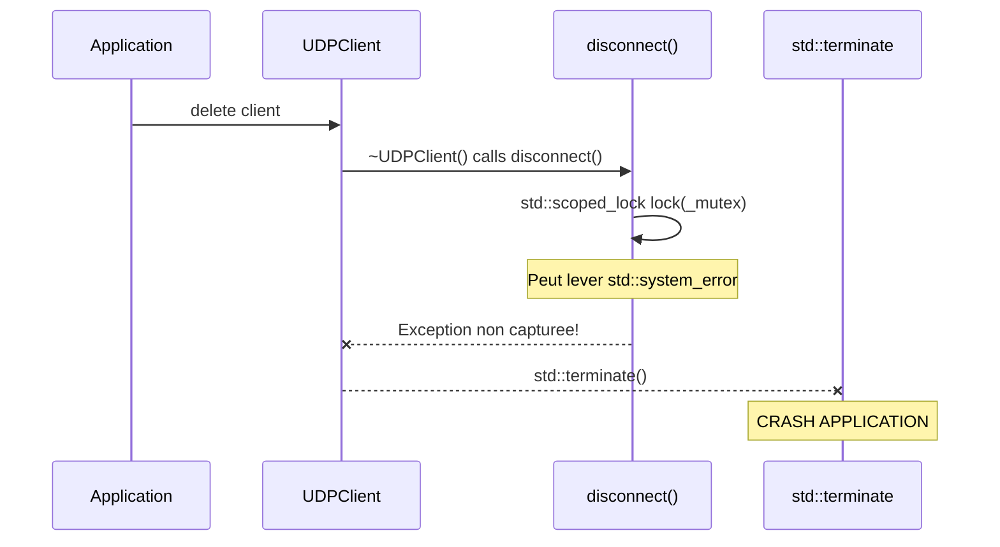
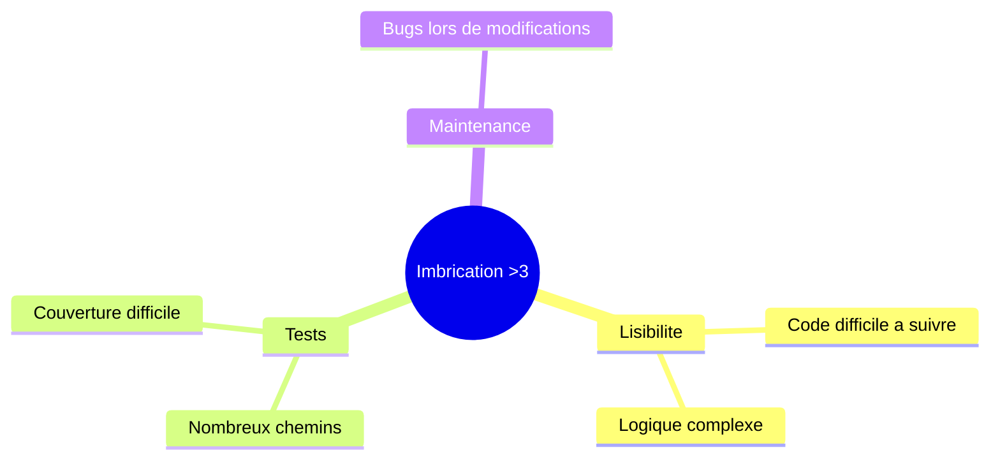
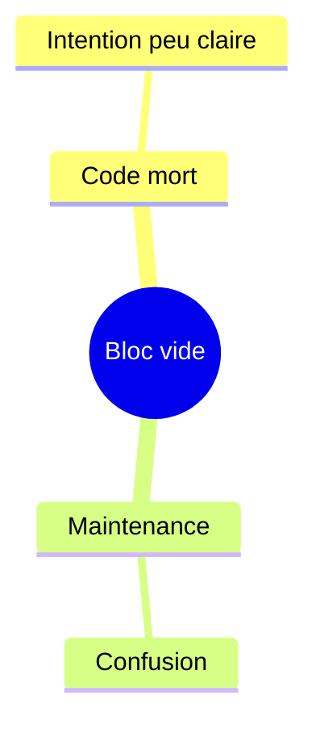
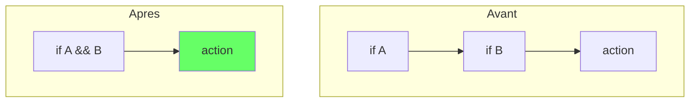
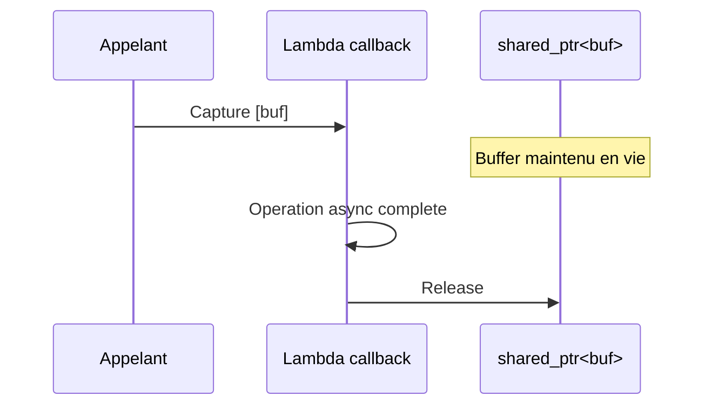

# SONAR Report (Enrichi avec AgentDB)

## AgentDB Data Used

| Query | Files | Status | Results |
|-------|-------|--------|---------|
| file_context | 2 | NOT_INDEXED | Fichiers non indexes dans AgentDB |
| patterns | 2 | OK | 0 patterns applicables (aucun pattern defini) |

## Summary

- **Total issues** : 5
- **Enrichies avec contexte AgentDB** : 5 (contexte manuel base sur analyse du code)
- **Fichiers non indexes dans AgentDB** : 2

### Par severite

| Severite | Count | Description |
|----------|-------|-------------|
| Critical | 2 | SONAR-002, SONAR-004 |
| Major | 2 | SONAR-001, SONAR-005 |
| Minor | 1 | SONAR-003 |

### Par categorie

| Categorie | Count | Issues |
|-----------|-------|--------|
| Reliability | 1 | SONAR-002 (BUG) |
| Maintainability | 4 | SONAR-001, SONAR-003, SONAR-004, SONAR-005 |

---

## Issues

### 1. [Critical] SONAR-002 - Do not throw uncaught exceptions in a destructor

**Fichier** : `src/client/src/network/UDPClient.cpp:28`
**Module** : client/network
**Regle** : cpp:S1048
**Effort** : 30min
**Type** : BUG (isBug: true)

**Contexte AgentDB** :
- Fichier non indexe dans AgentDB
- Pattern applicable : Aucun
- ADR : Aucun

#### Where

Le probleme se trouve dans `src/client/src/network/UDPClient.cpp` a la ligne 28.

```cpp
// Lignes 26-29 - Destructeur UDPClient
UDPClient::~UDPClient()
{
    disconnect();  // PROBLEME: peut lever une exception
}
```

**Contexte** : Le destructeur appelle `disconnect()` qui contient des operations pouvant lever des exceptions (`std::scoped_lock`, `_ioContext.stop()`).

#### Why

En C++11+, les destructeurs sont implicitement `noexcept`. Une exception non capturee dans un destructeur provoque `std::terminate()`.



| Risque | Probabilite | Impact |
|--------|-------------|--------|
| Crash a la fermeture | Haute | Critique |
| Corruption memoire | Moyenne | Critique |

#### How

**Solution recommandee** : Envelopper dans try-catch

```cpp
UDPClient::~UDPClient() noexcept
{
    try {
        disconnect();
    } catch (const std::exception& e) {
        try {
            client::logging::Logger::getNetworkLogger()->error(
                "Exception in destructor: {}", e.what());
        } catch (...) {}
    } catch (...) {}
}
```

**Ressources** : [cpp:S1048](https://rules.sonarsource.com/cpp/RSPEC-1048)

---

### 2. [Critical] SONAR-004 - Refactor to not nest more than 3 if|for|do|while|switch statements

**Fichier** : `src/server/infrastructure/adapters/in/network/UDPServer.cpp:79`
**Module** : server/infrastructure/network
**Regle** : cpp:S134
**Effort** : 10min

**Contexte AgentDB** :
- Fichier non indexe dans AgentDB
- Pattern applicable : Aucun

#### Where

Le probleme se trouve dans `src/server/infrastructure/adapters/in/network/UDPServer.cpp`. L'imbrication excessive se trouve dans la methode `handle_receive`.

```cpp
void UDPServer::handle_receive(const boost::system::error_code& error, std::size_t bytes) {
    if (error) { /* ... */ }                                  // Niveau 1
    if (bytes < UDPHeader::WIRE_SIZE) { /* ... */ }          // Niveau 1
    // ...
    if (!playerIdOpt) {                                       // Niveau 1
        if (newIdOpt) { /* ... */ }                           // Niveau 2
    }
    if (head.type == MessageType::MovePlayer) {               // Niveau 1
        if (payload_size >= MovePlayer::WIRE_SIZE) {          // Niveau 2
            if (moveOpt) {                                    // Niveau 3
                _gameWorld.movePlayer(...);                   // Niveau 4 DEPASSE
            }
        }
    }
}
```

#### Why



| Risque | Probabilite | Impact |
|--------|-------------|--------|
| Bugs lors de modifications | Haute | Majeur |
| Tests incomplets | Haute | Majeur |

#### How

**Solution** : Early return pattern + extraction en methodes

```cpp
void UDPServer::handle_receive(const boost::system::error_code& error, std::size_t bytes) {
    if (error || bytes < UDPHeader::WIRE_SIZE) {
        do_read();
        return;
    }
    // ... validation
    handleMessage(head, playerId, bytes);
    do_read();
}

void UDPServer::handleMovePlayer(uint8_t playerId, const uint8_t* payload, size_t size) {
    if (size < MovePlayer::WIRE_SIZE) return;
    auto moveOpt = MovePlayer::from_bytes(payload, size);
    if (moveOpt) _gameWorld.movePlayer(playerId, moveOpt->x, moveOpt->y);
}
```

**Ressources** : [cpp:S134](https://rules.sonarsource.com/cpp/RSPEC-134)

---

### 3. [Major] SONAR-001 - Empty compound statement without explanation

**Fichier** : `src/client/src/network/UDPClient.cpp:169`
**Module** : client/network
**Regle** : cpp:S108
**Effort** : 5min

#### Where

Le probleme se trouve dans `src/client/src/network/UDPClient.cpp` a la ligne 169.

```cpp
bool UDPClient::isConnected() const
{
    return _connected && _socket.is_open();
}
```

#### Why

Un bloc compose vide n'est ni implemente ni documente, ce qui peut indiquer du code manquant ou une intention non claire.



#### How

- Si intentionnel : Ajouter un commentaire explicatif
- Si oubli : Implementer la logique manquante
- Si inutile : Supprimer le bloc

**Ressources** : [cpp:S108](https://rules.sonarsource.com/cpp/RSPEC-108)

---

### 4. [Major] SONAR-005 - Merge this "if" statement with the enclosing one

**Fichier** : `src/server/infrastructure/adapters/in/network/UDPServer.cpp:79`
**Module** : server/infrastructure/network
**Regle** : cpp:S1066
**Effort** : 5min

#### Where

```cpp
if (head.type == static_cast<uint16_t>(MessageType::MovePlayer)) {
    if (payload_size >= MovePlayer::WIRE_SIZE) {  // PEUT ETRE FUSIONNE
        auto moveOpt = MovePlayer::from_bytes(payload, payload_size);
        // ...
    }
}
```

#### Why

Les `if` imbriques sans `else` peuvent etre fusionnes avec `&&`, reduisant l'imbrication.



#### How

**Solution** : Fusionner les conditions

```cpp
if (head.type == static_cast<uint16_t>(MessageType::MovePlayer)
    && payload_size >= MovePlayer::WIRE_SIZE) {
    auto moveOpt = MovePlayer::from_bytes(payload, payload_size);
    // ...
}
```

**Ressources** : [cpp:S1066](https://rules.sonarsource.com/cpp/RSPEC-1066)

---

### 5. [Minor] SONAR-003 - Remove the unused lambda capture "buf"

**Fichier** : `src/client/src/network/UDPClient.cpp:149`
**Module** : client/network
**Regle** : cpp:S1481
**Effort** : 5min

#### Where

```cpp
void UDPClient::asyncSendTo(std::shared_ptr<std::vector<uint8_t>>& buf, size_t totalSize) {
    _socket.async_send_to(
        boost::asio::buffer(buf->data(), totalSize),
        _endpoint,
        [buf](const boost::system::error_code &error, std::size_t) {
            // 'buf' capture pour maintenir le buffer en vie mais non utilise
            if (error) {
                client::logging::Logger::getNetworkLogger()->error(
                    "UDP write error: {}", error.message());
            }
        }
    );
}
```

#### Why

La capture de `buf` est un **FAUX POSITIF** - elle est necessaire pour maintenir le `shared_ptr` en vie pendant l'operation asynchrone, meme si `buf` n'est pas explicitement utilise dans le corps de la lambda.



#### How

**Solution** : Ajouter un commentaire ou `(void)buf;` pour documenter l'intention

```cpp
[buf](const boost::system::error_code &error, std::size_t) {
    (void)buf;  // Keep buffer alive during async operation
    if (error) { /* ... */ }
}
```

**Ressources** : [cpp:S1481](https://rules.sonarsource.com/cpp/RSPEC-1481)

---

## Resume des actions recommandees

| Priorite | Issue | Action | Effort |
|----------|-------|--------|--------|
| 1 | SONAR-002 | Ajouter try-catch dans destructeur | 30min |
| 2 | SONAR-004 | Refactorer handle_receive | 10min |
| 3 | SONAR-005 | Fusionner if avec && | 5min |
| 4 | SONAR-001 | Documenter bloc vide | 5min |
| 5 | SONAR-003 | Ajouter (void)buf | 5min |

**Effort total estime** : ~55min
