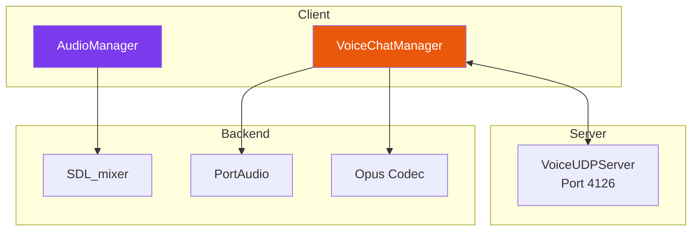
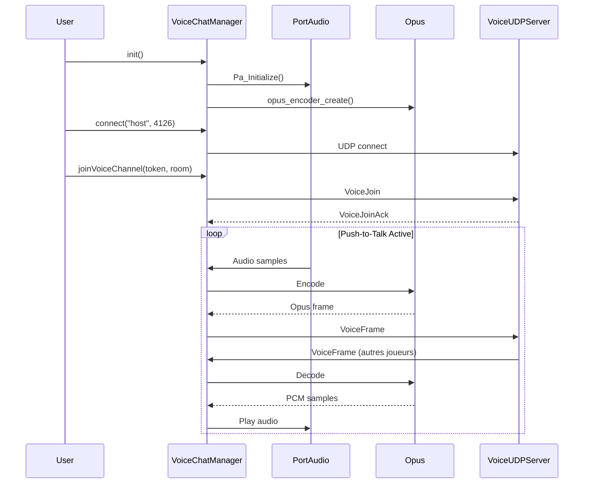

---
tags:
  - api
  - client
  - audio
---

# Audio

Système audio pour les effets sonores, la musique et le chat vocal.

## Vue d'Ensemble

Le système audio est composé de deux classes principales:

| Classe | Fichier | Usage |
|--------|---------|-------|
| `AudioManager` | `audio/AudioManager.hpp` | Musique et effets sonores |
| `VoiceChatManager` | `audio/VoiceChatManager.hpp` | Chat vocal |

---

## AudioManager

Gestionnaire audio pour les effets sonores et la musique (singleton).

### Synopsis

```cpp
#include "audio/AudioManager.hpp"

auto& audio = audio::AudioManager::getInstance();
audio.init();

// Load and play
audio.loadMusic("bgm", "assets/audio/background.ogg");
audio.loadSound("shoot", "assets/audio/shoot.wav");

audio.playMusic("bgm");
audio.playSound("shoot");
```

### Déclaration

```cpp
namespace audio {

class AudioManager {
public:
    static AudioManager& getInstance();

    // Lifecycle
    bool init();
    void shutdown();
    bool isInitialized() const;

    // Music
    bool loadMusic(const std::string& key, const std::string& filepath);
    void playMusic(const std::string& key, int loops = -1);
    void stopMusic();
    void pauseMusic();
    void resumeMusic();
    bool isMusicPlaying() const;

    // Sound effects
    bool loadSound(const std::string& key, const std::string& filepath);
    int playSound(const std::string& key, int loops = 0);

    // Volume (0-100)
    void setMusicVolume(int volume);
    void setSoundVolume(int volume);
    void setMasterVolume(int volume);
    int getMusicVolume() const;
    int getSoundVolume() const;

    // Mute
    void setMuted(bool muted);
    bool isMuted() const;

    // Cleanup
    void unloadAll();

private:
    AudioManager() = default;
    ~AudioManager();

    bool _initialized = false;
    bool _muted = false;
    int _musicVolume = 70;   // 0-100
    int _soundVolume = 80;   // 0-100
    int _masterVolume = 100; // 0-100

    std::unordered_map<std::string, Mix_Music*> _music;
    std::unordered_map<std::string, Mix_Chunk*> _sounds;
};

} // namespace audio
```

### Volumes

Les volumes sont des entiers de **0 à 100** (pas des floats).

```cpp
audio.setMasterVolume(100);  // 100%
audio.setMusicVolume(70);    // 70%
audio.setSoundVolume(80);    // 80%

// Volume effectif = master * category / 100
int effectiveMusic = _masterVolume * _musicVolume / 100;
```

---

## VoiceChatManager

Gestionnaire de chat vocal (singleton séparé).

### Synopsis

```cpp
#include "audio/VoiceChatManager.hpp"

auto& voice = VoiceChatManager::getInstance();
voice.init();
voice.connect("localhost", 4126);
voice.joinVoiceChannel(sessionToken, roomCode);

// Push-to-Talk
if (keyPressed) voice.startTalking();
if (keyReleased) voice.stopTalking();
```

### Configuration Voice

| Paramètre | Valeur | Description |
|-----------|--------|-------------|
| Port | **4126** | Port UDP voice |
| Codec | Opus | Codec audio VoIP |
| Sample Rate | 48000 Hz | Fréquence d'échantillonnage |
| Frame Size | 960 samples | 20ms @ 48kHz |
| Bitrate | 32 kbps | Qualité/bande passante |
| Channels | 1 (mono) | Suffisant pour la voix |

### Modes Voice

```cpp
enum class VoiceMode {
    PushToTalk,      // PTT - touche maintenue
    VoiceActivity,   // VAD - détection automatique
    Disabled         // Désactivé
};

voice.setVoiceMode(VoiceMode::PushToTalk);
voice.setVADThreshold(0.02f);  // Sensibilité VAD
```

### Périphériques Audio

```cpp
// Lister les périphériques
auto inputs = voice.getInputDevices();
auto outputs = voice.getOutputDevices();

// Sélectionner un périphérique
voice.setPreferredInputDevice("Microphone USB");
voice.setPreferredOutputDevice("Casque Gaming");

// Appliquer et réinitialiser
voice.applyAudioDevices(inputName, outputName);
```

---

## Architecture Audio



---

## Flux Voice Chat



---

## Fichiers Audio

### Formats Supportés

| Format | Extension | Usage |
|--------|-----------|-------|
| OGG Vorbis | `.ogg` | Musique |
| WAV | `.wav` | Effets sonores |
| FLAC | `.flac` | Musique HQ |
| MP3 | `.mp3` | Musique |

### Assets Audio

Les fichiers audio sont dans `assets/audio/`:

```
assets/audio/
├── music/
│   ├── menu.ogg
│   └── game.ogg
└── sfx/
    ├── shoot.wav
    ├── explosion.wav
    └── hit.wav
```

---

## Thread Safety

| Classe | Thread Model |
|--------|--------------|
| `AudioManager` | Main thread only |
| `VoiceChatManager` | Internal audio thread |

Le `VoiceChatManager` utilise un thread PortAudio pour la capture et la lecture audio. Les appels aux méthodes publiques sont thread-safe.
