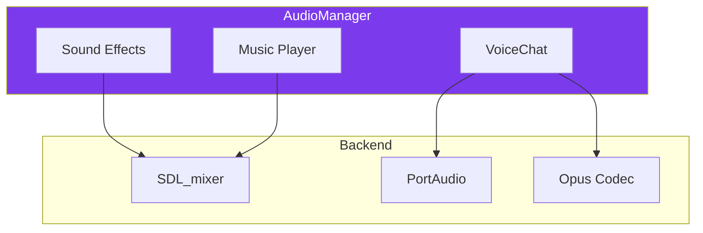
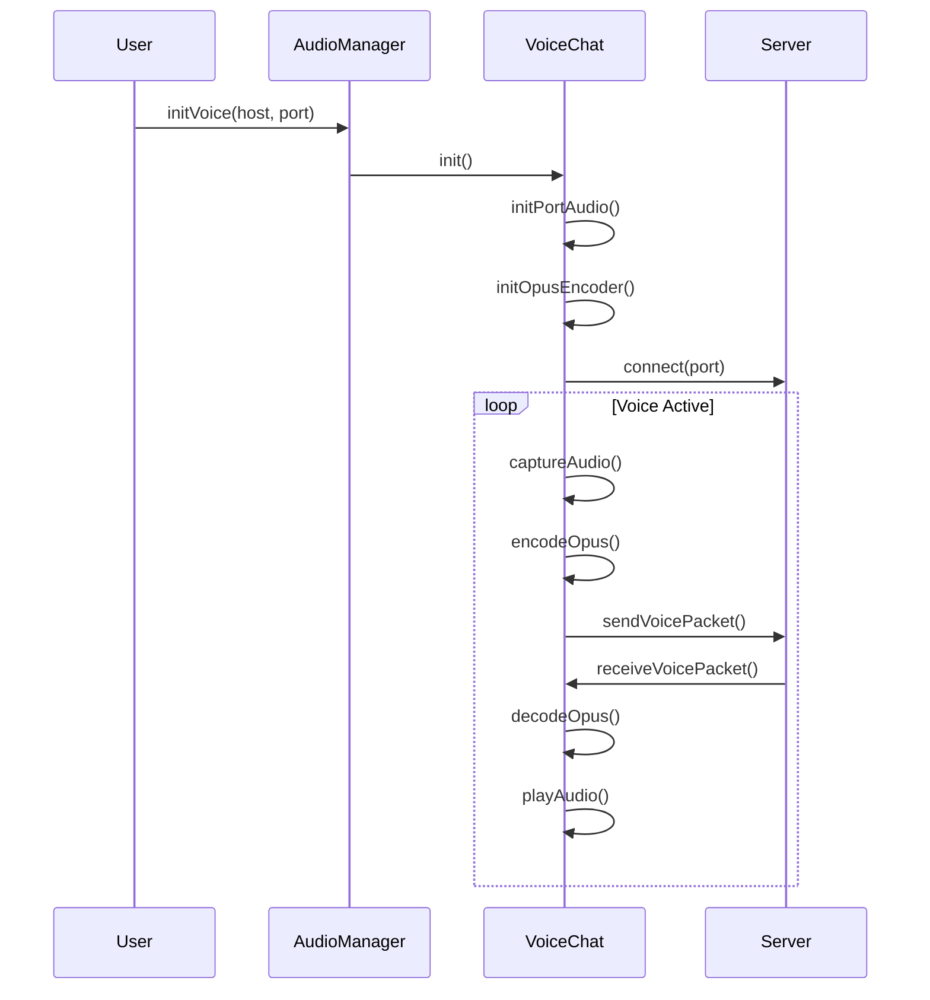

---
tags:
  - api
  - client
  - audio
---

# AudioManager

Gestionnaire audio pour les effets sonores, la musique et le voice chat.

## Synopsis

```cpp
#include "client/AudioManager.hpp"

AudioManager audio;

// Load sounds
audio.loadSound("shoot", "assets/sounds/shoot.wav");
audio.loadMusic("theme", "assets/music/theme.ogg");

// Play
audio.playSound("shoot");
audio.playMusic("theme", true);  // loop

// Voice chat
audio.initVoice("localhost", 4244);
audio.setVoiceMode(VoiceMode::PushToTalk);
```

---

## Déclaration

```cpp
namespace rtype::client {

class AudioManager {
public:
    AudioManager();
    ~AudioManager();

    // Initialization
    void init();
    void shutdown();

    // Sound effects
    void loadSound(const std::string& name, const std::string& path);
    void playSound(const std::string& name);
    void stopSound(const std::string& name);

    // Music
    void loadMusic(const std::string& name, const std::string& path);
    void playMusic(const std::string& name, bool loop = true);
    void stopMusic();
    void pauseMusic();
    void resumeMusic();
    bool isMusicPlaying() const;

    // Volume control
    void setMasterVolume(float volume);
    void setMusicVolume(float volume);
    void setSfxVolume(float volume);
    void setVoiceVolume(float volume);
    float masterVolume() const;
    float musicVolume() const;
    float sfxVolume() const;
    float voiceVolume() const;

    // Voice chat
    void initVoice(const std::string& host, uint16_t port);
    void shutdownVoice();
    void setVoiceMode(VoiceMode mode);
    void setPushToTalkKey(KeyCode key);
    bool isVoiceActive() const;
    void setMuted(bool muted);
    void setDeafened(bool deafened);

    // Voice update (call each frame)
    void updateVoice();

private:
    std::unordered_map<std::string, Sound> sounds_;
    std::unique_ptr<Music> currentMusic_;
    std::unique_ptr<VoiceChat> voiceChat_;

    float masterVolume_ = 1.0f;
    float musicVolume_ = 0.7f;
    float sfxVolume_ = 1.0f;
    float voiceVolume_ = 1.0f;
};

} // namespace rtype::client
```

---

## Types

### VoiceMode

```cpp
enum class VoiceMode {
    PushToTalk,         // PTT - touche maintenue
    VoiceActivation,    // VAD - détection automatique
    Disabled            // Désactivé
};
```

---

## Méthodes

### `playSound()`

```cpp
void playSound(const std::string& name);
```

Joue un effet sonore.

**Paramètres:**

| Nom | Type | Description |
|-----|------|-------------|
| `name` | `string` | Nom du son chargé |

**Note:** Les sons peuvent être joués simultanément.

```cpp
// Tir
void PlayerController::shoot() {
    audio.playSound("shoot");
    // ...
}

// Explosion
void Enemy::onDestroy() {
    audio.playSound("explosion");
}
```

---

### `playMusic()`

```cpp
void playMusic(const std::string& name, bool loop = true);
```

Joue une musique.

**Note:** Une seule musique peut jouer à la fois. Appeler cette méthode arrête la musique précédente.

```cpp
void MenuScene::onEnter(Engine& engine) {
    engine.audio().playMusic("menu_theme", true);
}

void GameScene::onEnter(Engine& engine) {
    engine.audio().playMusic("game_theme", true);
}
```

---

### `setMasterVolume()`

```cpp
void setMasterVolume(float volume);
```

Définit le volume principal (affecte tous les sons).

**Paramètres:**

| Nom | Type | Plage | Description |
|-----|------|-------|-------------|
| `volume` | `float` | 0.0 - 1.0 | Volume principal |

**Calcul du volume final:**

```cpp
float finalVolume = masterVolume_ * categoryVolume_ * soundVolume_;
```

---

### `initVoice()`

```cpp
void initVoice(const std::string& host, uint16_t port);
```

Initialise le chat vocal.

**Paramètres:**

| Nom | Type | Description |
|-----|------|-------------|
| `host` | `string` | Adresse serveur |
| `port` | `uint16_t` | Port voice (4244) |

**Exemple:**

```cpp
void LobbyScene::onJoinRoom(Engine& engine) {
    engine.audio().initVoice(serverHost, 4244);
    engine.audio().setVoiceMode(VoiceMode::PushToTalk);
    engine.audio().setPushToTalkKey(KeyCode::V);
}
```

---

### `updateVoice()`

```cpp
void updateVoice();
```

Met à jour le système de voice chat.

**Note:** Doit être appelé à chaque frame.

```cpp
void Engine::gameLoop() {
    while (running_) {
        // ...
        audio_->updateVoice();
        // ...
    }
}
```

---

## Architecture Audio



---

## Effets Sonores Disponibles

| Nom | Fichier | Description |
|-----|---------|-------------|
| `shoot` | shoot.wav | Tir joueur |
| `explosion` | explosion.wav | Explosion |
| `hit` | hit.wav | Impact |
| `powerup` | powerup.wav | Bonus |
| `menu_select` | select.wav | Sélection menu |
| `menu_confirm` | confirm.wav | Confirmation |

---

## Musiques Disponibles

| Nom | Fichier | Durée |
|-----|---------|-------|
| `menu_theme` | menu.ogg | 2:30 |
| `game_theme` | game.ogg | 4:00 |
| `boss_theme` | boss.ogg | 3:00 |
| `victory` | victory.ogg | 0:30 |
| `gameover` | gameover.ogg | 0:15 |

---

## Diagramme Voice Chat



---

## Configuration

```json
{
  "audio": {
    "master": 1.0,
    "music": 0.7,
    "sfx": 1.0,
    "voice": 1.0,
    "voiceMode": "push_to_talk",
    "pttKey": "V",
    "vadThreshold": 0.02
  }
}
```
