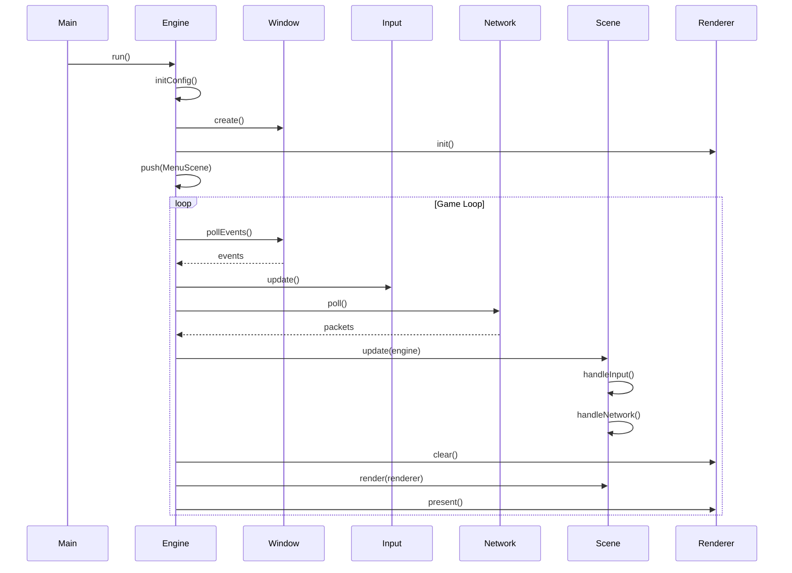

---
tags:
  - api
  - client
  - engine
---

# Engine

Moteur de jeu principal du client R-Type.

## Synopsis

```cpp
#include "client/Engine.hpp"

int main(int argc, char* argv[]) {
    rtype::client::Engine engine;
    return engine.run(argc, argv);
}
```

---

## Déclaration

```cpp
namespace rtype::client {

class Engine {
public:
    Engine();
    ~Engine();

    // Non-copyable
    Engine(const Engine&) = delete;
    Engine& operator=(const Engine&) = delete;

    // Point d'entrée
    int run(int argc, char* argv[]);

    // Lifecycle
    void quit();
    bool isRunning() const;

    // Accesseurs
    SceneManager& sceneManager();
    NetworkClient& network();
    AudioManager& audio();
    Renderer& renderer();
    InputManager& input();
    const Config& config() const;

    // Window
    int windowWidth() const;
    int windowHeight() const;
    void setFullscreen(bool enabled);

    // Delta time
    float deltaTime() const;

private:
    void initConfig(int argc, char* argv[]);
    void initWindow();
    void initRenderer();
    void initAudio();
    void gameLoop();
    void cleanup();

    Config config_;
    std::unique_ptr<Window> window_;
    std::unique_ptr<Renderer> renderer_;
    std::unique_ptr<SceneManager> sceneManager_;
    std::unique_ptr<NetworkClient> network_;
    std::unique_ptr<AudioManager> audio_;
    std::unique_ptr<InputManager> input_;

    bool running_ = false;
    float deltaTime_ = 0.0f;
};

} // namespace rtype::client
```

---

## Méthodes

### `run()`

```cpp
int run(int argc, char* argv[]);
```

Lance le moteur et entre dans la boucle de jeu.

**Paramètres:**

| Nom | Type | Description |
|-----|------|-------------|
| `argc` | `int` | Nombre d'arguments |
| `argv` | `char*[]` | Arguments CLI |

**Retour:** Code de sortie (0 = succès)

**Arguments CLI supportés:**

```
--backend <sdl2|sfml>  Backend graphique
--fullscreen           Mode plein écran
--width <N>            Largeur fenêtre
--height <N>           Hauteur fenêtre
--server <host:port>   Serveur par défaut
```

---

### `quit()`

```cpp
void quit();
```

Demande l'arrêt propre du moteur.

---

### `deltaTime()`

```cpp
float deltaTime() const;
```

Retourne le temps écoulé depuis la dernière frame en secondes.

**Utilisation:**

```cpp
void PlayerController::update(Engine& engine) {
    float dt = engine.deltaTime();
    position_ += velocity_ * dt;
}
```

---

## Boucle de Jeu

```cpp
void Engine::gameLoop() {
    using Clock = std::chrono::high_resolution_clock;
    auto lastFrame = Clock::now();

    while (running_) {
        // Calculate delta time
        auto now = Clock::now();
        deltaTime_ = std::chrono::duration<float>(
            now - lastFrame
        ).count();
        lastFrame = now;

        // Poll window events
        window_->pollEvents();

        // Update input
        input_->update();

        // Update network
        network_->poll();

        // Update current scene
        if (auto* scene = sceneManager_->current()) {
            scene->update(*this);
        }

        // Render
        renderer_->clear();
        if (auto* scene = sceneManager_->current()) {
            scene->render(*renderer_);
        }
        renderer_->present();

        // Frame limiting (optional)
        limitFrameRate();
    }
}
```

---

## Configuration

```cpp
struct Config {
    // Display
    std::string backend = "sdl2";  // sdl2 or sfml
    int windowWidth = 1920;
    int windowHeight = 1080;
    bool fullscreen = false;
    bool vsync = true;

    // Network
    std::string serverHost = "localhost";
    uint16_t serverPort = 4242;

    // Audio
    float masterVolume = 1.0f;
    float musicVolume = 0.7f;
    float sfxVolume = 1.0f;
    float voiceVolume = 1.0f;

    // Accessibility
    ColorblindMode colorblindMode = ColorblindMode::None;
};
```

---

## Diagramme de Séquence



---

## Factory Pattern (Renderer)

```cpp
std::unique_ptr<Renderer> Engine::createRenderer(
    const std::string& backend)
{
    if (backend == "sdl2") {
        return std::make_unique<SDL2Renderer>();
    } else if (backend == "sfml") {
        return std::make_unique<SFMLRenderer>();
    }
    throw std::runtime_error("Unknown backend: " + backend);
}
```

---

## Thread Safety

Le moteur s'exécute sur un seul thread (thread principal). Les opérations réseau utilisent des callbacks asynchrones mais sont traités dans la boucle principale.

| Composant | Thread |
|-----------|--------|
| Window | Main |
| Renderer | Main |
| SceneManager | Main |
| NetworkClient | Main (polling) |
| AudioManager | Main + Audio thread |
