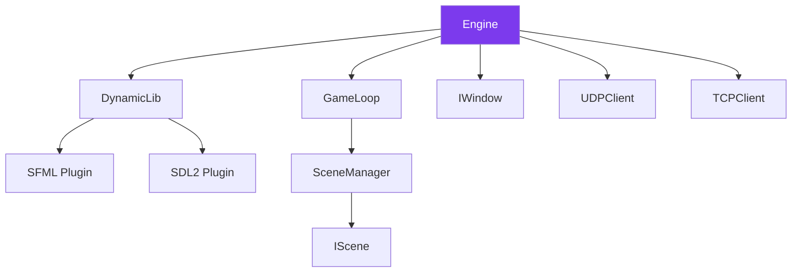

---
tags:
  - api
  - client
  - engine
---

# Engine

Moteur de jeu principal du client R-Type.

## Synopsis

```cpp
#include "core/Engine.hpp"

int main() {
    core::Engine engine;
    engine.initialize(udpClient, tcpClient, graphicsOptions);
    engine.run();
    return 0;
}
```

---

## Déclaration

```cpp
namespace core {

class Engine : public IEngine {
public:
    Engine();
    ~Engine();

    // Initialization
    void initialize() override;
    void initialize(
        std::shared_ptr<client::network::UDPClient> udpClient,
        std::shared_ptr<client::network::TCPClient> tcpClient,
        const GraphicsOptions& graphicsOptions
    );

    // Game loop
    void run() override;

private:
    std::string buildLibraryName(const std::string& name) const;

    std::unique_ptr<DynamicLib> _dynamicLib;
    std::shared_ptr<graphics::IWindow> _window;
    std::unique_ptr<GameLoop> _gameLoop;
    std::shared_ptr<client::network::UDPClient> _udpClient;
    std::shared_ptr<client::network::TCPClient> _tcpClient;
    graphics::IGraphicPlugin* _graphicPlugin;
};

} // namespace core
```

---

## Méthodes

### `initialize()`

```cpp
void initialize();
void initialize(
    std::shared_ptr<client::network::UDPClient> udpClient,
    std::shared_ptr<client::network::TCPClient> tcpClient,
    const GraphicsOptions& graphicsOptions
);
```

Initialise le moteur avec les options graphiques et les clients réseau.

**Paramètres (version complète):**

| Nom | Type | Description |
|-----|------|-------------|
| `udpClient` | `shared_ptr<UDPClient>` | Client UDP pour le gameplay |
| `tcpClient` | `shared_ptr<TCPClient>` | Client TCP pour l'authentification |
| `graphicsOptions` | `GraphicsOptions` | Options graphiques |

**Exemple:**

```cpp
auto udpClient = std::make_shared<client::network::UDPClient>();
auto tcpClient = std::make_shared<client::network::TCPClient>();

GraphicsOptions options;
options.backend = "sfml";
options.width = 1920;
options.height = 1080;

core::Engine engine;
engine.initialize(udpClient, tcpClient, options);
```

---

### `run()`

```cpp
void run() override;
```

Lance la boucle de jeu principale.

**Note:** Cette méthode bloque jusqu'à la fermeture du jeu.

---

## Architecture

L'Engine utilise un système de plugins graphiques dynamiques.



---

## GraphicsOptions

```cpp
struct GraphicsOptions {
    std::string backend = "sfml";  // "sfml" ou "sdl2"
    int width = 1920;
    int height = 1080;
    bool fullscreen = false;
    bool vsync = true;
};
```

---

## Chargement Dynamique

L'Engine charge le backend graphique dynamiquement:

```cpp
std::string Engine::buildLibraryName(const std::string& name) const {
    // Linux: librtype_sfml.so
    // Windows: rtype_sfml.dll
    // macOS: librtype_sfml.dylib
    #ifdef _WIN32
        return name + ".dll";
    #elif __APPLE__
        return "lib" + name + ".dylib";
    #else
        return "lib" + name + ".so";
    #endif
}
```

---

## Composants Associés

| Composant | Fichier | Description |
|-----------|---------|-------------|
| `GameLoop` | `core/GameLoop.hpp` | Boucle de jeu principale |
| `IWindow` | `graphics/IWindow.hpp` | Interface fenêtre |
| `SceneManager` | `scenes/SceneManager.hpp` | Gestionnaire de scènes |
| `UDPClient` | `network/UDPClient.hpp` | Client UDP |
| `TCPClient` | `network/TCPClient.hpp` | Client TCP |

---

## Backends Graphiques

| Backend | Bibliothèque | Fichier |
|---------|--------------|---------|
| SFML | `librtype_sfml.so` | `lib/sfml/` |
| SDL2 | `librtype_sdl2.so` | `lib/sdl2/` |

Chaque backend implémente l'interface `IGraphicPlugin`:

```cpp
class IGraphicPlugin {
public:
    virtual ~IGraphicPlugin() = default;
    virtual std::shared_ptr<IWindow> createWindow(
        int width, int height,
        const std::string& title
    ) = 0;
};
```
