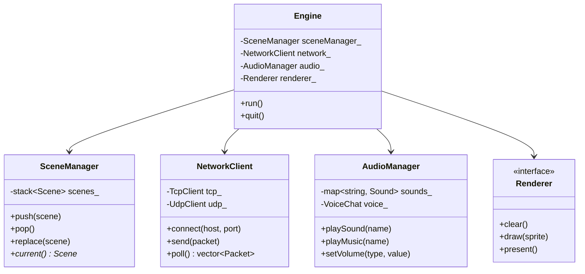
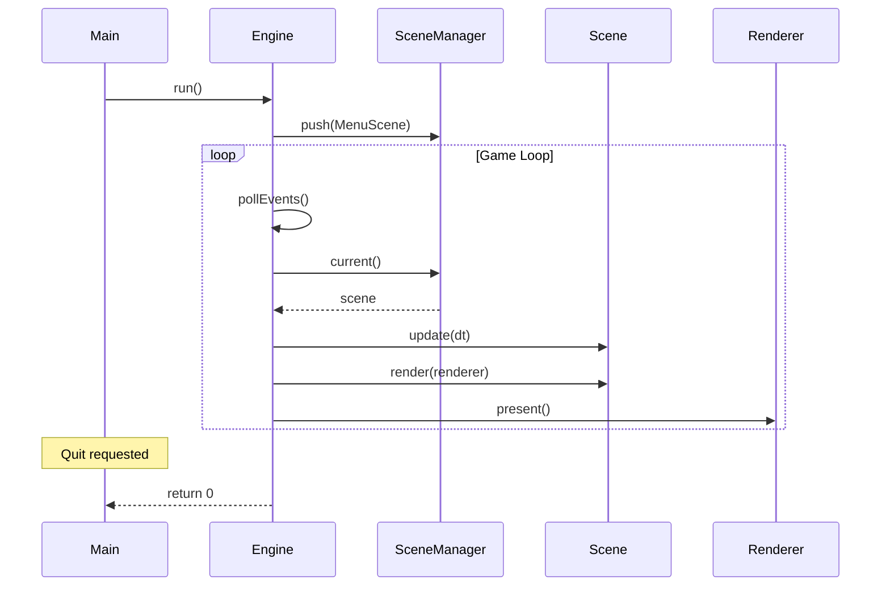
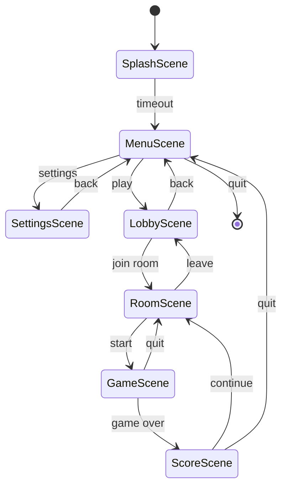

---
tags:
  - api
  - client
---

# API Client

Classes principales du client R-Type.

## Architecture



---

## Flux Principal



---

## Classes

<div class="grid-cards">
  <div class="card">
    <h3><a href="engine/">Engine</a></h3>
    <p>Moteur de jeu principal</p>
  </div>
  <div class="card">
    <h3><a href="scene-manager/">SceneManager</a></h3>
    <p>Gestionnaire de scènes</p>
  </div>
  <div class="card">
    <h3><a href="network-client/">NetworkClient</a></h3>
    <p>Client réseau TCP/UDP</p>
  </div>
  <div class="card">
    <h3><a href="audio-manager/">AudioManager</a></h3>
    <p>Gestionnaire audio</p>
  </div>
</div>

---

## Scènes Disponibles



---

## Plugins

Le client supporte des plugins pour étendre ses fonctionnalités.

```cpp
class IPlugin {
public:
    virtual ~IPlugin() = default;
    virtual std::string name() const = 0;
    virtual void init(Engine& engine) = 0;
    virtual void shutdown() = 0;
};

// Exemple: Plugin controller
class ControllerPlugin : public IPlugin {
public:
    std::string name() const override { return "controller"; }
    void init(Engine& engine) override {
        // Init SDL GameController
    }
    void shutdown() override {
        // Cleanup
    }
};
```
