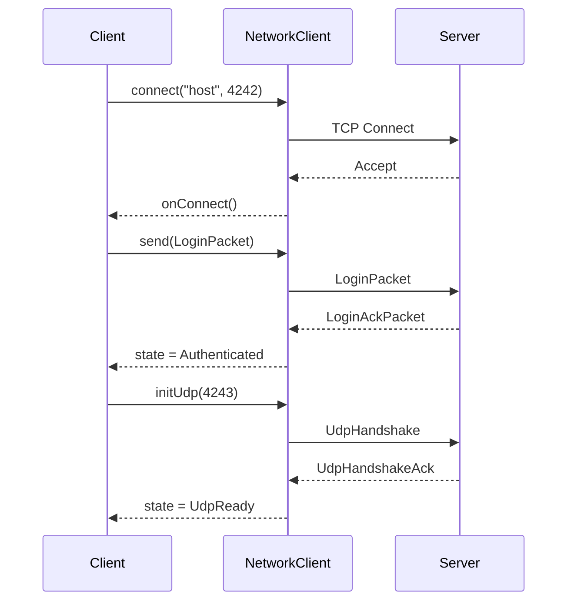

---
tags:
  - api
  - client
  - network
---

# NetworkClient

Client réseau pour la communication avec le serveur.

## Synopsis

```cpp
#include "client/NetworkClient.hpp"

NetworkClient client;

// Connect
client.connect("localhost", 4242);

// Send
client.send(LoginPacket{username, passwordHash});

// Receive (polling)
for (auto& packet : client.poll()) {
    handlePacket(packet);
}
```

---

## Déclaration

```cpp
namespace rtype::client {

class NetworkClient {
public:
    NetworkClient();
    ~NetworkClient();

    // Connection
    void connect(const std::string& host, uint16_t port);
    void disconnect();
    bool isConnected() const;
    ConnectionState state() const;

    // TCP
    void send(const Packet& packet);
    std::vector<Packet> poll();

    // UDP
    void sendUdp(const Packet& packet);
    void initUdp(uint16_t serverPort);

    // Callbacks
    void setOnConnect(std::function<void()> callback);
    void setOnDisconnect(std::function<void()> callback);
    void setOnError(std::function<void(const std::string&)> cb);

    // Info
    uint32_t playerId() const;
    float latency() const;
    float packetLoss() const;

private:
    void handleTcpData();
    void handleUdpData();
    void sendUdpHandshake();

    std::unique_ptr<TcpClient> tcp_;
    std::unique_ptr<UdpClient> udp_;
    ConnectionState state_ = ConnectionState::Disconnected;
    uint32_t playerId_ = 0;

    std::deque<Packet> incomingPackets_;
    std::function<void()> onConnect_;
    std::function<void()> onDisconnect_;
    std::function<void(const std::string&)> onError_;
};

} // namespace rtype::client
```

---

## Types

### ConnectionState

```cpp
enum class ConnectionState {
    Disconnected,   // Non connecté
    Connecting,     // Connexion en cours
    Connected,      // TCP connecté
    Authenticated,  // Login réussi
    UdpReady        // UDP établi
};
```

---

## Méthodes

### `connect()`

```cpp
void connect(const std::string& host, uint16_t port);
```

Établit une connexion TCP avec le serveur.

**Paramètres:**

| Nom | Type | Description |
|-----|------|-------------|
| `host` | `string` | Adresse du serveur |
| `port` | `uint16_t` | Port TCP (défaut 4242) |

**États:**

1. `Disconnected` → `Connecting`
2. Connexion TCP réussie → `Connected`
3. Callback `onConnect_` appelé

**Exemple:**

```cpp
client.setOnConnect([]() {
    std::cout << "Connected!" << std::endl;
});

client.setOnError([](const std::string& error) {
    std::cerr << "Error: " << error << std::endl;
});

client.connect("game.example.com", 4242);
```

---

### `send()`

```cpp
void send(const Packet& packet);
```

Envoie un paquet via TCP.

**Utilisation:**

```cpp
// Login
client.send(LoginPacket{
    .username = "player1",
    .passwordHash = hash
});

// Chat
client.send(ChatPacket{
    .roomId = currentRoom,
    .message = "Hello!"
});
```

---

### `sendUdp()`

```cpp
void sendUdp(const Packet& packet);
```

Envoie un paquet via UDP.

**Note:** Utilisé pour les inputs (faible latence, perte acceptable).

```cpp
void PlayerController::sendInput(const Input& input) {
    client.sendUdp(InputPacket{
        .sequence = input.sequence,
        .keys = input.keys,
        .tick = currentTick_
    });
}
```

---

### `poll()`

```cpp
std::vector<Packet> poll();
```

Récupère les paquets reçus depuis le dernier appel.

**Retour:** Vecteur de paquets (TCP et UDP combinés)

**Exemple:**

```cpp
void GameScene::update(Engine& engine) {
    for (auto& packet : engine.network().poll()) {
        switch (packet.type) {
            case PacketType::GameSnapshot:
                handleSnapshot(packet.as<GameSnapshotPacket>());
                break;

            case PacketType::PlayerJoined:
                handlePlayerJoined(packet.as<PlayerJoinedPacket>());
                break;

            case PacketType::Chat:
                handleChat(packet.as<ChatPacket>());
                break;
        }
    }
}
```

---

## Flux de Connexion



---

## Gestion de la Latence

```cpp
class NetworkClient {
    std::chrono::steady_clock::time_point pingTime_;
    float latency_ = 0.0f;

    void sendPing() {
        pingTime_ = std::chrono::steady_clock::now();
        send(PingPacket{});
    }

    void handlePong() {
        auto now = std::chrono::steady_clock::now();
        latency_ = std::chrono::duration<float, std::milli>(
            now - pingTime_
        ).count();
    }

public:
    float latency() const { return latency_; }
};
```

---

## Buffer de Réception

```cpp
class NetworkClient {
    std::deque<Packet> incomingPackets_;
    std::mutex packetMutex_;

    void onPacketReceived(Packet packet) {
        std::lock_guard lock(packetMutex_);
        incomingPackets_.push_back(std::move(packet));
    }

public:
    std::vector<Packet> poll() {
        std::lock_guard lock(packetMutex_);
        std::vector<Packet> result(
            std::make_move_iterator(incomingPackets_.begin()),
            std::make_move_iterator(incomingPackets_.end())
        );
        incomingPackets_.clear();
        return result;
    }
};
```

---

## Statistiques Réseau

| Métrique | Méthode | Description |
|----------|---------|-------------|
| Latence | `latency()` | RTT en ms |
| Packet Loss | `packetLoss()` | % paquets perdus |
| Bytes Sent | `bytesSent()` | Total envoyé |
| Bytes Received | `bytesReceived()` | Total reçu |
