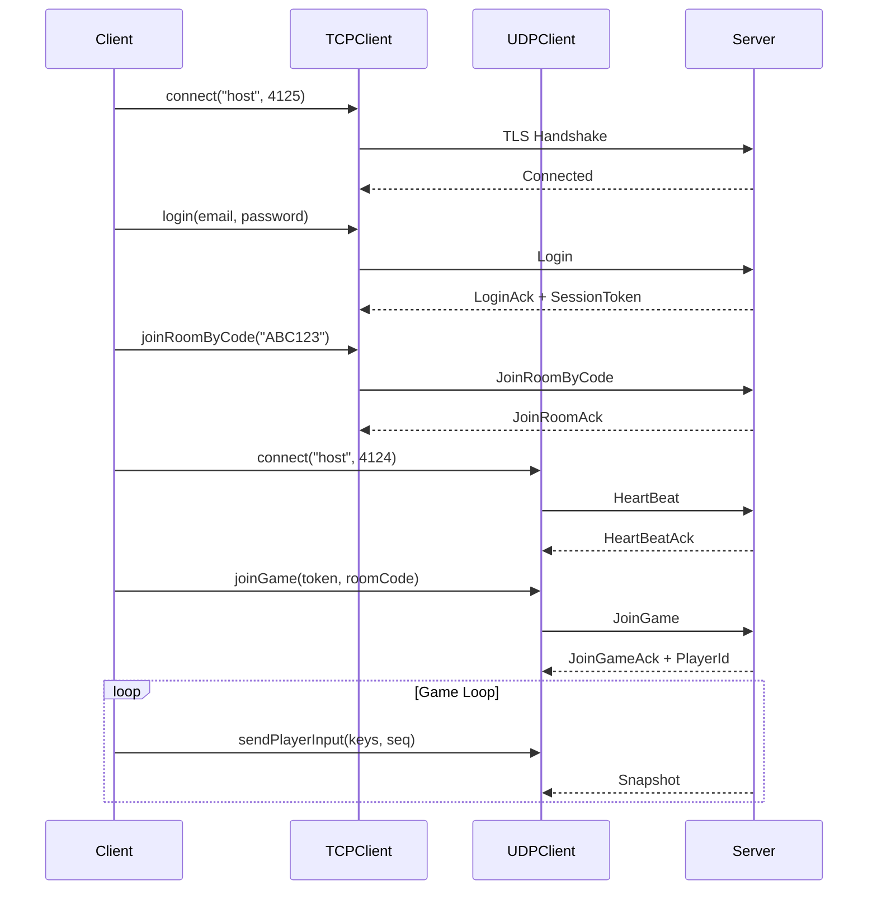

---
tags:
  - api
  - client
  - network
---

# Network Clients

Clients réseau pour la communication avec le serveur.

## Vue d'Ensemble

Le client utilise deux connexions réseau séparées:

| Client | Port | Protocole | Usage |
|--------|------|-----------|-------|
| `TCPClient` | 4125 | TCP + TLS | Authentification, rooms, chat |
| `UDPClient` | 4124 | UDP | Gameplay temps réel |

---

## UDPClient

Client UDP pour le gameplay temps réel.

### Synopsis

```cpp
#include "network/UDPClient.hpp"

using namespace client::network;

UDPClient client;
client.connect("localhost", 4124);

// Join game with session token
client.joinGame(sessionToken, roomCode);

// Send input
client.sendPlayerInput(keys, sequenceNum);

// Poll events
while (auto event = client.pollEvent()) {
    // Handle event
}
```

### Déclaration

```cpp
namespace client::network {

class UDPClient {
public:
    // Callbacks
    using OnConnectedCallback = std::function<void()>;
    using OnDisconnectedCallback = std::function<void()>;
    using OnErrorCallback = std::function<void(const std::string&)>;
    using OnSnapshotCallback = std::function<void(const std::vector<NetworkPlayer>&)>;
    using OnMissileSpawnedCallback = std::function<void(const NetworkMissile&)>;
    using OnMissileDestroyedCallback = std::function<void(uint16_t)>;
    using OnPlayerDiedCallback = std::function<void(uint8_t)>;

    UDPClient();
    ~UDPClient();

    // Connection
    void connect(const std::string& host, uint16_t port);
    void disconnect();
    bool isConnected() const;
    bool isConnecting() const;

    // Reconnection info
    const std::string& getLastHost() const;
    uint16_t getLastPort() const;

    // Game actions
    void joinGame(const SessionToken& token, const std::string& roomCode);
    void sendPlayerInput(uint16_t keys, uint16_t sequenceNum);
    void shootMissile();

    // State access
    std::optional<uint8_t> getLocalPlayerId() const;
    std::vector<NetworkPlayer> getPlayers() const;
    std::vector<NetworkMissile> getMissiles() const;
    std::vector<NetworkEnemy> getEnemies() const;
    std::vector<NetworkMissile> getEnemyMissiles() const;
    bool isLocalPlayerDead() const;

    // Event polling
    std::optional<UDPEvent> pollEvent();

    // Callback setters
    void setOnConnected(const OnConnectedCallback& callback);
    void setOnDisconnected(const OnDisconnectedCallback& callback);
    void setOnError(const OnErrorCallback& callback);
    void setOnSnapshot(const OnSnapshotCallback& callback);
    void setOnMissileSpawned(const OnMissileSpawnedCallback& callback);
    void setOnMissileDestroyed(const OnMissileDestroyedCallback& callback);
    void setOnPlayerDied(const OnPlayerDiedCallback& callback);

private:
    // Network
    boost::asio::io_context _ioContext;
    udp::socket _socket;
    std::jthread _ioThread;
    udp::endpoint _endpoint;

    // State
    std::atomic<bool> _connected{false};
    std::atomic<bool> _connecting{false};
    std::optional<uint8_t> _localPlayerId;

    // Game state
    std::vector<NetworkPlayer> _players;
    std::vector<NetworkMissile> _missiles;
    std::vector<NetworkEnemy> _enemies;
    std::vector<NetworkMissile> _enemyMissiles;

    // Event queue
    EventQueue<UDPEvent> _eventQueue;
};

} // namespace client::network
```

### Types

#### NetworkPlayer

```cpp
struct NetworkPlayer {
    uint8_t id;
    uint16_t x, y;
    uint8_t health;
    bool alive;
    uint16_t lastAckedInputSeq;  // Pour la réconciliation
    uint8_t shipSkin;
};
```

#### NetworkMissile

```cpp
struct NetworkMissile {
    uint16_t id;
    uint8_t owner_id;
    uint16_t x, y;
};
```

#### NetworkEnemy

```cpp
struct NetworkEnemy {
    uint16_t id;
    uint16_t x, y;
    uint8_t health;
    uint8_t enemy_type;
};
```

### Exemple d'Utilisation

```cpp
UDPClient udp;

// Set callbacks
udp.setOnConnected([]() {
    std::cout << "UDP connected!" << std::endl;
});

udp.setOnPlayerDied([](uint8_t playerId) {
    std::cout << "Player " << (int)playerId << " died!" << std::endl;
});

// Connect
udp.connect("game.example.com", 4124);

// Wait for connection
while (udp.isConnecting()) {
    std::this_thread::sleep_for(std::chrono::milliseconds(10));
}

// Join game
udp.joinGame(sessionToken, "ABC123");

// Game loop
while (running) {
    // Send input
    udp.sendPlayerInput(keys, sequenceNum++);

    // Get state
    auto players = udp.getPlayers();
    auto missiles = udp.getMissiles();
    auto enemies = udp.getEnemies();

    // Render...
}
```

---

## TCPClient

Client TCP pour l'authentification et la gestion des rooms.

### Synopsis

```cpp
#include "network/TCPClient.hpp"

using namespace client::network;

TCPClient client;
client.connect("localhost", 4125);

// Login
client.login(email, password);

// Create room
client.createRoom("My Room", 4, false);
```

### Principales Opérations

| Méthode | Description |
|---------|-------------|
| `connect()` | Connexion TCP + TLS |
| `login()` | Authentification |
| `register_()` | Création de compte |
| `createRoom()` | Créer une room |
| `joinRoomByCode()` | Rejoindre par code |
| `leaveRoom()` | Quitter la room |
| `setReady()` | Marquer prêt |
| `startGame()` | Lancer la partie |
| `sendChatMessage()` | Envoyer un message |

---

## Flux de Connexion



---

## Event Queue

Le UDPClient utilise une queue thread-safe pour les événements:

```cpp
// Types d'événements
enum class UDPEventType {
    Connected,
    Disconnected,
    PlayerJoined,
    PlayerLeft,
    PlayerDied,
    MissileSpawned,
    MissileDestroyed,
    Snapshot
};

// Polling dans le thread principal
while (auto event = udpClient.pollEvent()) {
    switch (event->type) {
        case UDPEventType::PlayerJoined:
            handlePlayerJoined(event->playerId);
            break;
        case UDPEventType::Snapshot:
            handleSnapshot(event->players);
            break;
        // ...
    }
}
```

---

## Thread Safety

| Méthode | Thread-Safe |
|---------|-------------|
| `connect()` | Oui |
| `isConnected()` | Oui (atomic) |
| `sendPlayerInput()` | Oui |
| `getPlayers()` | Oui (mutex) |
| `pollEvent()` | Oui |

Le UDPClient exécute son IO sur un thread séparé (`std::jthread`). Toutes les méthodes publiques sont thread-safe.
