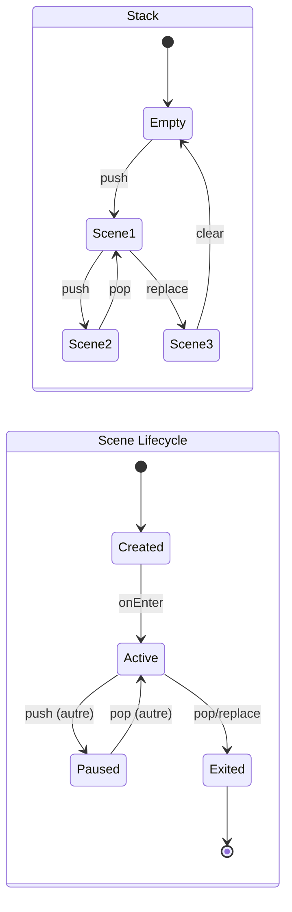

---
tags:
  - api
  - client
  - scenes
---

# SceneManager

Gestionnaire de scènes du client.

## Synopsis

```cpp
#include "client/SceneManager.hpp"

SceneManager manager;

// Push initial scene
manager.push(std::make_unique<MenuScene>());

// In game loop
if (auto* scene = manager.current()) {
    scene->update(engine);
    scene->render(renderer);
}
```

---

## Déclaration

```cpp
namespace rtype::client {

class SceneManager {
public:
    SceneManager();
    ~SceneManager();

    // Stack operations
    void push(std::unique_ptr<Scene> scene);
    void pop();
    void replace(std::unique_ptr<Scene> scene);
    void clear();

    // Access
    Scene* current();
    const Scene* current() const;
    bool empty() const;
    size_t size() const;

    // Deferred operations
    void processPending();

private:
    std::vector<std::unique_ptr<Scene>> stack_;

    // Pending operations (applied at end of frame)
    enum class Op { Push, Pop, Replace, Clear };
    std::vector<std::pair<Op, std::unique_ptr<Scene>>> pending_;
};

} // namespace rtype::client
```

---

## Interface Scene

```cpp
class Scene {
public:
    virtual ~Scene() = default;

    // Lifecycle
    virtual void onEnter(Engine& engine) {}
    virtual void onExit(Engine& engine) {}
    virtual void onPause() {}
    virtual void onResume() {}

    // Update & Render
    virtual void update(Engine& engine) = 0;
    virtual void render(Renderer& renderer) = 0;

    // Events
    virtual void onEvent(const Event& event) {}
    virtual void onPacket(const Packet& packet) {}
};
```

---

## Méthodes

### `push()`

```cpp
void push(std::unique_ptr<Scene> scene);
```

Empile une nouvelle scène.

**Comportement:**

1. Appelle `onPause()` sur la scène actuelle
2. Empile la nouvelle scène
3. Appelle `onEnter()` sur la nouvelle scène

**Exemple:**

```cpp
// Ouvrir les paramètres par-dessus le menu
manager.push(std::make_unique<SettingsScene>());
```

---

### `pop()`

```cpp
void pop();
```

Dépile la scène actuelle.

**Comportement:**

1. Appelle `onExit()` sur la scène actuelle
2. Dépile la scène
3. Appelle `onResume()` sur la scène précédente

**Exemple:**

```cpp
// Fermer la scène actuelle
void SettingsScene::onBackButton() {
    engine.sceneManager().pop();
}
```

---

### `replace()`

```cpp
void replace(std::unique_ptr<Scene> scene);
```

Remplace la scène actuelle.

**Comportement:**

1. Appelle `onExit()` sur la scène actuelle
2. Remplace la scène
3. Appelle `onEnter()` sur la nouvelle scène

**Exemple:**

```cpp
// Passer du menu au jeu
void MenuScene::onPlayButton() {
    engine.sceneManager().replace(
        std::make_unique<GameScene>()
    );
}
```

---

### `processPending()`

```cpp
void processPending();
```

Applique les opérations en attente.

**Note:** Les opérations `push`, `pop`, `replace` sont différées et appliquées à la fin de la frame pour éviter de modifier la stack pendant l'itération.

```cpp
// Dans la boucle de jeu
void Engine::gameLoop() {
    while (running_) {
        // Update
        if (auto* scene = sceneManager_->current()) {
            scene->update(*this);
        }

        // Apply pending operations
        sceneManager_->processPending();

        // Render
        // ...
    }
}
```

---

## Exemples de Scènes

### MenuScene

```cpp
class MenuScene : public Scene {
    Button playButton_;
    Button settingsButton_;
    Button quitButton_;

public:
    void onEnter(Engine& engine) override {
        engine.audio().playMusic("menu_theme");
    }

    void update(Engine& engine) override {
        if (playButton_.clicked()) {
            engine.sceneManager().replace(
                std::make_unique<LobbyScene>()
            );
        }
        if (settingsButton_.clicked()) {
            engine.sceneManager().push(
                std::make_unique<SettingsScene>()
            );
        }
        if (quitButton_.clicked()) {
            engine.quit();
        }
    }

    void render(Renderer& renderer) override {
        renderer.drawSprite(background_);
        playButton_.render(renderer);
        settingsButton_.render(renderer);
        quitButton_.render(renderer);
    }
};
```

### GameScene

```cpp
class GameScene : public Scene {
    PlayerController player_;
    EntityRenderer entities_;
    HUD hud_;

public:
    void onEnter(Engine& engine) override {
        engine.audio().playMusic("game_theme");
    }

    void update(Engine& engine) override {
        player_.update(engine);

        // Process network
        for (auto& packet : engine.network().poll()) {
            onPacket(packet);
        }
    }

    void onPacket(const Packet& packet) override {
        if (packet.type == PacketType::GameSnapshot) {
            entities_.updateFromSnapshot(
                packet.as<GameSnapshotPacket>()
            );
        }
    }

    void render(Renderer& renderer) override {
        entities_.render(renderer);
        hud_.render(renderer);
    }
};
```

---

## Diagramme d'État



---

## Stack Visualization

```
┌─────────────┐
│ GameScene   │  ← current()
├─────────────┤
│ LobbyScene  │  ← paused
├─────────────┤
│ MenuScene   │  ← paused
└─────────────┘
     Stack
```

Après `pop()`:

```
┌─────────────┐
│ LobbyScene  │  ← current() + onResume()
├─────────────┤
│ MenuScene   │  ← paused
└─────────────┘
     Stack
```
