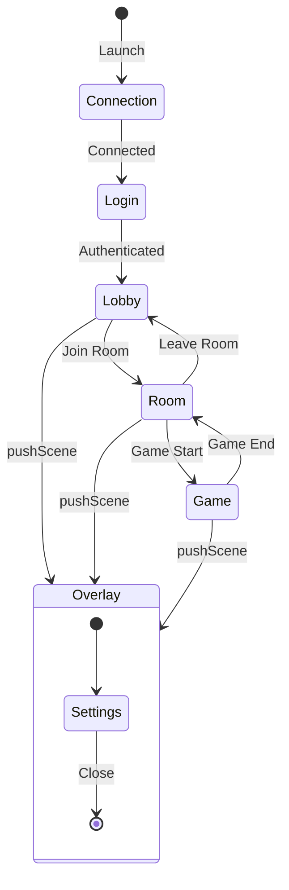

---
tags:
  - api
  - client
  - scenes
---

# SceneManager

Gestionnaire de scènes du client.

## Synopsis

```cpp
#include "scenes/SceneManager.hpp"

SceneManager manager;
manager.setContext(gameContext);

// Change scene
manager.changeScene(std::make_unique<MenuScene>());

// Push overlay
manager.pushScene(std::make_unique<PauseScene>());

// In game loop
manager.handleEvent(event);
manager.update(deltaTime);
manager.render();
```

---

## Déclaration

```cpp
class SceneManager {
public:
    SceneManager();
    ~SceneManager();

    void setContext(const GameContext& ctx);

    // Replace entire scene stack with a single scene
    void changeScene(std::unique_ptr<IScene> newScene);

    // Push a scene on top (overlay) - current scene is paused
    void pushScene(std::unique_ptr<IScene> scene);

    // Pop the top scene - returns to previous scene
    void popScene();

    // Check if there's an overlay scene
    bool hasOverlay() const;

    // Get current scene count
    size_t sceneCount() const;

    // Game loop methods
    void handleEvent(const events::Event& event);
    void update(float deltatime);
    void render();

private:
    enum class PendingAction {
        None,
        Change,
        Push,
        Pop
    };

    void applyPendingActions();
    void initScene(IScene* scene);
    IScene* currentScene() const;

    std::stack<std::unique_ptr<IScene>> _sceneStack;
    std::unique_ptr<IScene> _pendingScene;
    PendingAction _pendingAction = PendingAction::None;
    std::shared_ptr<core::IRenderer> _renderer;
    GameContext _context;
};
```

---

## Interface IScene

```cpp
class IScene {
public:
    virtual ~IScene() = default;

    // Game loop
    virtual void handleEvent(const events::Event& event) = 0;
    virtual void update(float deltatime) = 0;
    virtual void render() = 0;

protected:
    SceneContext _context;  // window, udpClient, etc.
};
```

---

## Méthodes

### `changeScene()`

```cpp
void changeScene(std::unique_ptr<IScene> newScene);
```

Remplace toute la stack par une nouvelle scène.

**Comportement:**

1. Vide la stack de scènes
2. Pousse la nouvelle scène
3. Initialise la scène

**Exemple:**

```cpp
// Transition menu -> jeu
manager.changeScene(std::make_unique<GameScene>());
```

---

### `pushScene()`

```cpp
void pushScene(std::unique_ptr<IScene> scene);
```

Empile une scène overlay (la scène précédente reste en mémoire).

**Exemple:**

```cpp
// Ouvrir les paramètres par-dessus le jeu
manager.pushScene(std::make_unique<SettingsScene>());
```

---

### `popScene()`

```cpp
void popScene();
```

Dépile la scène actuelle et retourne à la précédente.

**Exemple:**

```cpp
// Fermer l'overlay
void SettingsScene::onBackButton() {
    // Le SceneManager gère le pop via le contexte
}
```

---

### `hasOverlay()`

```cpp
bool hasOverlay() const;
```

Vérifie s'il y a plusieurs scènes dans la stack.

**Retour:** `true` si `sceneCount() > 1`

---

## GameContext / SceneContext

```cpp
struct GameContext {
    std::shared_ptr<graphics::IWindow> window;
    std::shared_ptr<client::network::UDPClient> udpClient;
    std::shared_ptr<client::network::TCPClient> tcpClient;
    // ...
};

struct SceneContext {
    graphics::IWindow* window;
    client::network::UDPClient* udpClient;
    client::network::TCPClient* tcpClient;
    SceneManager* sceneManager;
    // ...
};
```

---

## Scènes Existantes

| Scène | Fichier | Description |
|-------|---------|-------------|
| `ConnectionScene` | `scenes/ConnectionScene.hpp` | Écran de connexion serveur |
| `LoginScene` | `scenes/LoginScene.hpp` | Authentification |
| `LobbyScene` | `scenes/LobbyScene.hpp` | Menu principal / lobby |
| `RoomScene` | `scenes/RoomScene.hpp` | Salle d'attente |
| `GameScene` | `scenes/GameScene.hpp` | Gameplay |
| `SettingsScene` | `scenes/SettingsScene.hpp` | Paramètres |

---

## Diagramme d'État



---

## Stack Visualization

```
┌─────────────┐
│ GameScene   │  ← currentScene()
├─────────────┤
│ RoomScene   │  ← paused (si overlay)
└─────────────┘
     Stack
```

Après `pushScene(SettingsScene)`:

```
┌─────────────┐
│ Settings    │  ← currentScene() (overlay)
├─────────────┤
│ GameScene   │  ← paused
├─────────────┤
│ RoomScene   │  ← paused
└─────────────┘
     Stack
```

---

## Actions Différées

Les opérations `changeScene`, `pushScene`, `popScene` sont différées et appliquées à la fin de la frame via `applyPendingActions()`.

Cela évite de modifier la stack pendant l'itération.

```cpp
// Interne au SceneManager
void SceneManager::update(float deltatime) {
    if (auto* scene = currentScene()) {
        scene->update(deltatime);
    }
    applyPendingActions();  // Applique les changements en attente
}
```
