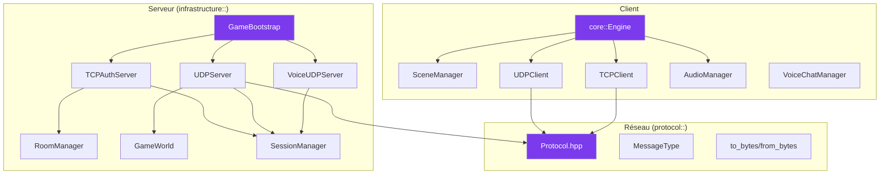

---
tags:
  - api
  - reference
---

# API Reference

Documentation complète des classes et interfaces du projet R-Type.

## Vue d'Ensemble



---

## Organisation

### Serveur

Classes principales du serveur autoritatif (architecture hexagonale).

| Classe | Namespace | Description |
|--------|-----------|-------------|
| [`GameBootstrap`](serveur/application.md) | `infrastructure::bootstrap` | Orchestrateur serveur |
| [`RoomManager`](serveur/room-manager.md) | `infrastructure::room` | Gestion des salons |
| [`SessionManager`](serveur/client-session.md) | `infrastructure::session` | Sessions TCP/UDP |
| [`GameWorld`](serveur/game-world.md) | `infrastructure::game` | Simulation de jeu |

### Client

Classes principales du client graphique (multi-backend SFML/SDL2).

| Classe | Namespace | Description |
|--------|-----------|-------------|
| [`Engine`](client/engine.md) | `core` | Moteur de jeu |
| [`SceneManager`](client/scene-manager.md) | - | Gestionnaire de scènes |
| [`UDPClient`](client/network-client.md#udpclient) | `client::network` | Client game UDP |
| [`TCPClient`](client/network-client.md#tcpclient) | `client::network` | Client auth TCP+TLS |
| [`AudioManager`](client/audio-manager.md#audiomanager) | `audio` | Musique et SFX |
| [`VoiceChatManager`](client/audio-manager.md#voicechatmanager) | - | Chat vocal Opus |

### Réseau

Protocole binaire et sérialisation.

| Fichier | Description |
|---------|-------------|
| [`Protocol.hpp`](reseau/protocol.md) | Types, ports, structures |
| [`Serialization`](reseau/serialization.md) | to_bytes/from_bytes (big-endian) |

---

## Ports Réseau

| Port | Protocole | Description |
|------|-----------|-------------|
| **4125** | TCP + TLS | Authentification, rooms, chat |
| **4124** | UDP | Game loop (20Hz) |
| **4126** | UDP | Voice chat (Opus) |

---

## Conventions

### Nommage

| Type | Convention | Exemple |
|------|------------|---------|
| Classes | PascalCase | `GameWorld` |
| Méthodes | camelCase | `processInput()` |
| Membres privés | `_prefix` | `_players` |
| Constantes | UPPER_SNAKE | `MAX_PLAYERS` |

### Types Protocole

```cpp
// Types du protocole réseau (Protocol.hpp)
using SessionToken = std::array<uint8_t, 32>;  // Token 256-bit

// Pas de typedef pour les IDs - types natifs utilisés directement
uint8_t player_id;      // 0-255, assigné par UDPServer
uint16_t missile_id;    // ID missile
uint16_t enemy_id;      // ID ennemi
uint16_t sequence_num;  // Numéro de séquence paquet
```

### Sérialisation

```cpp
// Pattern to_bytes / from_bytes (big-endian)
void to_bytes(uint8_t* buf) const;
static std::optional<T> from_bytes(const void* buf, size_t len);

// Fonctions de swap endianness
uint16_t swap16(uint16_t v);  // Host <-> Network
uint32_t swap32(uint32_t v);
uint64_t swap64(uint64_t v);
```

---

## Architecture Hexagonale (Serveur)

```
src/server/
├── include/
│   ├── domain/              # Logique métier (entités, value objects)
│   │   ├── entities/        # Player, User, Room
│   │   ├── value_objects/   # Position, Health, PlayerId
│   │   └── exceptions/      # DomainException
│   │
│   ├── application/         # Cas d'utilisation, ports
│   │   ├── use_cases/       # Login, Register
│   │   └── ports/out/       # IUserRepository, ILogger
│   │
│   └── infrastructure/      # Adaptateurs, réseau
│       ├── adapters/in/     # UDPServer, TCPAuthServer
│       ├── adapters/out/    # MongoDB, SpdLog
│       ├── game/            # GameWorld
│       ├── room/            # RoomManager
│       ├── session/         # SessionManager
│       └── bootstrap/       # GameBootstrap
```

---

## Documentation

<div class="grid-cards">
  <div class="card">
    <h3><a href="serveur/">Serveur</a></h3>
    <p>API serveur autoritatif (GameBootstrap, RoomManager, SessionManager, GameWorld)</p>
  </div>
  <div class="card">
    <h3><a href="client/">Client</a></h3>
    <p>API client graphique (Engine, SceneManager, UDPClient, TCPClient, Audio)</p>
  </div>
  <div class="card">
    <h3><a href="reseau/">Réseau</a></h3>
    <p>Protocole binaire UDP/TCP (MessageType, structures, sérialisation)</p>
  </div>
</div>
