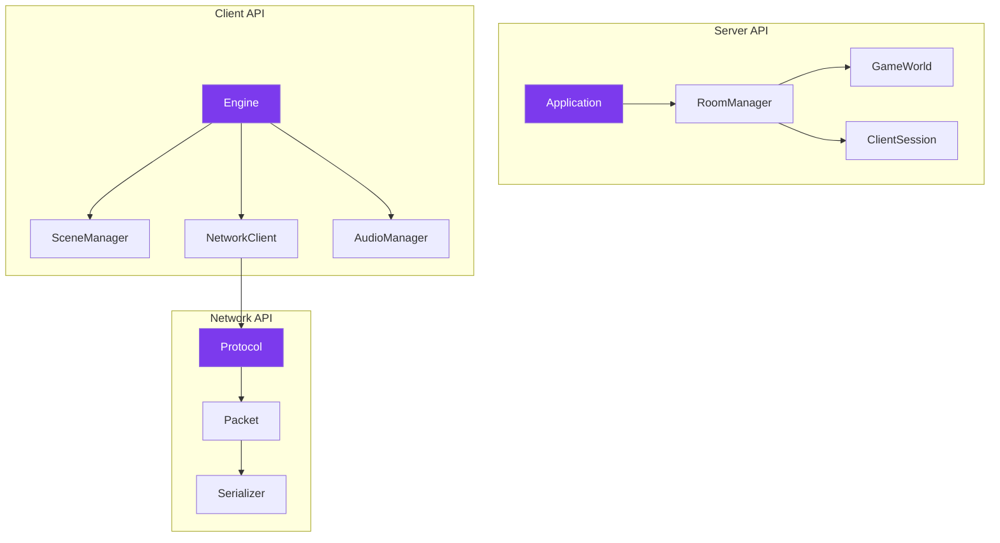

---
tags:
  - api
  - reference
---

# API Reference

Documentation complète des classes et interfaces du projet R-Type.

## Vue d'Ensemble



---

## Organisation

### Serveur

Classes principales du serveur autoritatif.

| Classe | Description |
|--------|-------------|
| `Application` | Point d'entrée serveur |
| `RoomManager` | Gestion des salons |
| `ClientSession` | Session client TCP/UDP |
| `GameWorld` | Simulation de jeu |

### Client

Classes principales du client graphique.

| Classe | Description |
|--------|-------------|
| `Engine` | Moteur de jeu |
| `SceneManager` | Gestionnaire de scènes |
| `NetworkClient` | Client réseau |
| `AudioManager` | Gestionnaire audio |

### Réseau

Classes du protocole réseau.

| Classe | Description |
|--------|-------------|
| `Protocol` | Définitions protocole |
| `Packet` | Gestion paquets |
| `Serializer` | Sérialisation binaire |

---

## Conventions

### Nommage

| Type | Convention | Exemple |
|------|------------|---------|
| Classes | PascalCase | `GameWorld` |
| Méthodes | camelCase | `processInput()` |
| Membres | trailing_ | `players_` |
| Constantes | UPPER_SNAKE | `MAX_PLAYERS` |

### Types Standards

```cpp
// Types utilisés dans l'API
using PlayerId = uint32_t;
using EntityId = uint32_t;
using RoomId = uint32_t;
using Tick = uint32_t;
```

---

## Documentation

<div class="grid-cards">
  <div class="card">
    <h3><a href="serveur/">🖥️ Serveur</a></h3>
    <p>API serveur autoritatif</p>
  </div>
  <div class="card">
    <h3><a href="client/">🎮 Client</a></h3>
    <p>API client graphique</p>
  </div>
  <div class="card">
    <h3><a href="reseau/">🌐 Réseau</a></h3>
    <p>API protocole réseau</p>
  </div>
</div>
