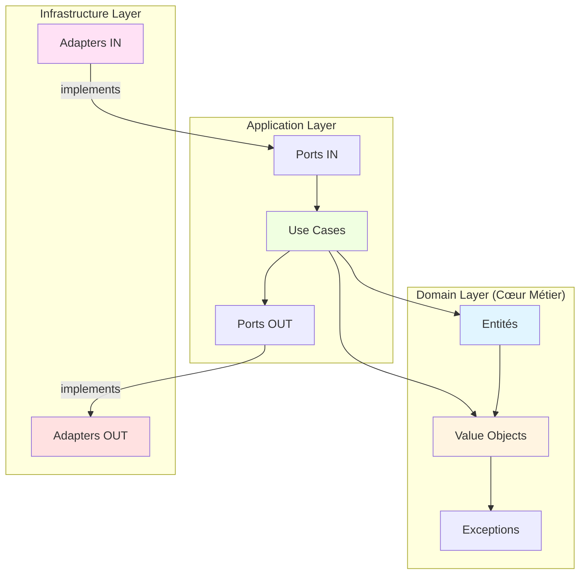

# Vue d'Ensemble - Référence API

**Version:** 0.5.1
**Dernière mise à jour:** Décembre 2025

---

## 📚 Introduction

Cette section contient la documentation de référence complète de l'API R-Type. Elle est organisée selon l'architecture hexagonale du projet avec un focus sur le **protocole binaire UDP** pour le gameplay temps réel.

## 🗺️ Navigation

### [API Domain Layer](domain.md)

Documentation complète de la couche domaine (logique métier pure).

**Contenu:**
- **Entités** - Player, User
- **Value Objects** - Health, Position, PlayerId, UserId, Username, Email, Password
- **Exceptions** - Hiérarchie d'exceptions métier
- **Utilitaires** - PasswordUtils

**État:** ✅ Implémenté et Documenté

[→ Accéder à l'API Domain](domain.md)

---

### [API Adapters Layer](adapters.md)

Documentation des adaptateurs (infrastructure et points d'entrée).

**Contenu:**
- **Adapters IN** - UDPServer (port 4124), GameWorld, Protocol binaire
- **Adapters OUT** - MongoDBConfiguration, Repositories
- **Network Protocol** - 14 types de messages, broadcast 20Hz
- **Collision System** - AABB hitboxes

**État:** ✅ Implémenté et Documenté

[→ Accéder à l'API Adapters](adapters.md)

---

## 📖 Guides Complémentaires

### Guides Architecturaux

- [Architecture Globale](../guides/architecture.md) - Vue d'ensemble du projet
- [Architecture Hexagonale](../guides/hexagonal-architecture.md) - Principes et implémentation
- [Système d'Authentification](../guides/authentication.md) - Guide complet du système auth

### Documentation Développeur

- [Changelog](../development/changelog.md) - Historique des modifications
- [Guide de Contribution](../development/contributing.md) - Comment contribuer
- [Politique de Commits](../development/COMMIT_POLICES.md) - Conventions Git

---

## 🏗️ Architecture Hexagonale



---

## 📦 Composants par Couche

### Domain Layer (Logique Métier Pure)

| Composant | Description | Fichiers |
|-----------|-------------|----------|
| **Player** | Entité joueur (gameplay) | `domain/entities/Player.{hpp,cpp}` |
| **User** | Entité utilisateur (auth) | `domain/entities/User.{hpp,cpp}` |
| **Health** | Points de vie | `domain/value_objects/Health.{hpp,cpp}` |
| **Position** | Coordonnées 3D | `domain/value_objects/Position.{hpp,cpp}` |
| **Email** | Email validé RFC 5322 | `domain/value_objects/user/Email.{hpp,cpp}` |
| **Password** | Hash mot de passe | `domain/value_objects/user/Password.{hpp,cpp}` |

[→ Documentation complète Domain Layer](domain.md)

---

### Application Layer (Use Cases)

| Use Case | Description | Statut |
|----------|-------------|--------|
| **Login** | Authentification utilisateur | ✅ Implémenté |
| **Register** | Inscription nouvel utilisateur | ✅ Implémenté |
| **MovePlayerUseCase** | Déplacement joueur | ✅ Implémenté |

---

### Infrastructure Layer (Adaptateurs)

| Adaptateur | Type | Description | Statut |
|------------|------|-------------|--------|
| **UDPServer** | IN | Serveur UDP gameplay (port 4124, 20Hz) | ✅ Implémenté |
| **GameWorld** | IN | État de jeu (joueurs, missiles, ennemis) | ✅ Implémenté |
| **Protocol** | IN | 14 types de messages binaires | ✅ Implémenté |
| **AABB Collision** | IN | Système de collision | ✅ Implémenté |
| **TCPServer** | IN | Serveur TCP auth (port 3000) | ✅ Implémenté |
| **MongoDBConfig** | OUT | Configuration MongoDB | ✅ Implémenté |

[→ Documentation complète Adapters Layer](adapters.md)

---

## 🔍 Index des Types

### Entités

- [Player](domain.md#player) - Joueur en partie
- [User](domain.md#user) - Utilisateur authentifié

### Value Objects

**Gameplay:**
- [Health](domain.md#health) - Points de vie
- [Position](domain.md#position) - Coordonnées 3D
- [PlayerId](domain.md#playerid) - ID joueur

**Authentification:**
- [UserId](domain.md#userid) - ID utilisateur
- [Username](domain.md#username) - Nom d'utilisateur
- [Email](domain.md#email) - Adresse email
- [Password](domain.md#password) - Hash mot de passe

**Utilitaires:**
- [PasswordUtils](domain.md#utilitaires-passwordutils) - Hachage mots de passe

### Exceptions

- [DomainException](domain.md#domainexception) - Exception de base
- [HealthException](domain.md#healthexception) - Santé invalide
- [PositionException](domain.md#positionexception) - Position invalide
- [PlayerIdException](domain.md#exceptions) - ID joueur invalide
- [UserIdException](domain.md#exceptions) - ID utilisateur invalide
- [UsernameException](domain.md#exceptions) - Username invalide
- [EmailException](domain.md#exceptions) - Email invalide
- [PasswordException](domain.md#exceptions) - Mot de passe invalide

---

## 🎯 Cas d'Usage Courants

### Créer un Joueur

```cpp
#include "domain/entities/Player.hpp"
#include "domain/value_objects/Health.hpp"
#include "domain/value_objects/player/PlayerId.hpp"
#include "domain/value_objects/Position.hpp"

Player player(
    Health(100.0f),
    PlayerId("507f1f77bcf86cd799439011"),
    Position(0.0f, 0.0f, 0.0f)
);
```

[→ Documentation Player complète](domain.md#player)

### Créer un Utilisateur

```cpp
#include "domain/entities/User.hpp"
#include "domain/value_objects/user/Email.hpp"
#include "domain/value_objects/user/Password.hpp"
#include "domain/value_objects/user/utils/PasswordUtils.hpp"

User user(
    UserId(bsoncxx::oid().to_string()),
    Username("player123"),
    Email("player@example.com"),
    Password(utils::hashPassword("secret"))
);
```

[→ Documentation User complète](domain.md#user)

### Authentifier un Utilisateur

```cpp
#include "application/use_cases/auth/Login.hpp"

auto loginUseCase = std::make_shared<Login>(userRepository);
loginUseCase->execute("user@example.com", "password123");
```

[→ Guide Authentification complet](../guides/authentication.md)

---

## 📝 Conventions

### Namespaces

```cpp
domain::entities          // Entités
domain::value_objects     // Value Objects
domain::exceptions        // Exceptions
application::use_cases    // Use Cases
application::ports        // Ports (interfaces)
infrastructure::adapters  // Adapters
```

### Patterns

- **Value Objects** - Immuables, validation dans constructeur
- **Entités** - Identité unique, peuvent muter
- **Exceptions** - Héritent de `DomainException`
- **Use Cases** - Une responsabilité par classe
- **Repositories** - Interface (Port OUT) + implémentation (Adapter OUT)

---

## 🔗 Liens Utiles

- [Documentation complète sur GitHub](https://github.com/Pluenet-Killian/rtype)
- [MkDocs Material](https://squidfunk.github.io/mkdocs-material/)
- [Architecture Hexagonale](https://alistair.cockburn.us/hexagonal-architecture/)

---

*Dernière mise à jour: Décembre 2025 | Version 0.5.1*
