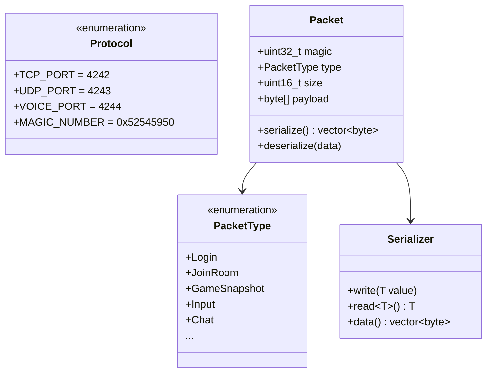
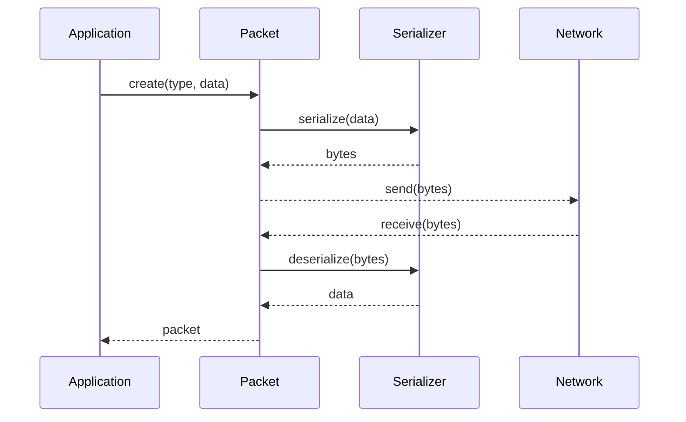

---
tags:
  - api
  - reseau
---

# API Réseau

Classes du protocole réseau R-Type.

## Architecture



---

## Protocole

| Port | Protocole | Usage |
|------|-----------|-------|
| 4242 | TCP | Authentification, chat, rooms |
| 4243 | UDP | Gameplay temps réel |
| 4244 | UDP | Voice chat |

---

## Format de Paquet

```
┌────────────────────────────────────────────┐
│ Magic (4 bytes) │ Type (1) │ Size (2) │ ... │
├────────────────────────────────────────────┤
│              Payload (N bytes)             │
└────────────────────────────────────────────┘
```

**Magic Number:** `0x52545950` ("RTYP" en ASCII)

---

## Flux de Données



---

## Classes

<div class="grid-cards">
  <div class="card">
    <h3><a href="protocol/">Protocol</a></h3>
    <p>Constantes et types de paquets</p>
  </div>
  <div class="card">
    <h3><a href="packet/">Packet</a></h3>
    <p>Structure des paquets</p>
  </div>
  <div class="card">
    <h3><a href="serialization/">Serialization</a></h3>
    <p>Sérialisation binaire</p>
  </div>
</div>
