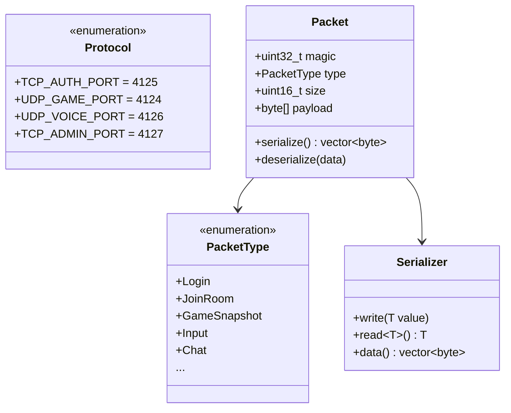
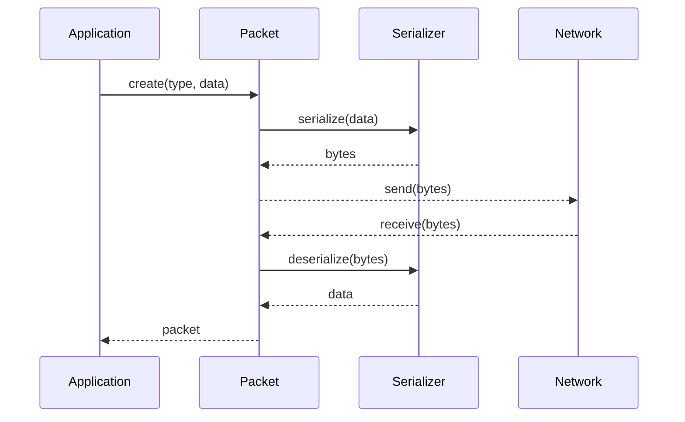

---
tags:
  - api
  - reseau
---

# API Réseau

Classes du protocole réseau R-Type.

## Architecture



---

## Protocole

| Port | Protocole | Usage |
|------|-----------|-------|
| 4125 | TCP + TLS | Authentification, chat, rooms |
| 4124 | UDP | Gameplay temps réel |
| 4126 | UDP | Voice chat |
| 4127 | TCP | Administration (localhost only) |

---

## Format de Paquet

### TCP Header (7 bytes)

```
┌───────────────────┬──────────┬─────────────┐
│ isAuthenticated   │ Type     │ PayloadSize │
│ 1 byte            │ 2 bytes  │ 4 bytes     │
└───────────────────┴──────────┴─────────────┘
```

### UDP Header (12 bytes)

```
┌──────────┬──────────┬────────────┐
│ Type     │ Sequence │ Timestamp  │
│ 2 bytes  │ 2 bytes  │ 8 bytes    │
└──────────┴──────────┴────────────┘
```

**Note:** Toutes les valeurs multi-octets sont en network byte order (big-endian).

---

## Flux de Données



---

## Classes

<div class="grid-cards">
  <div class="card">
    <h3><a href="protocol/">Protocol</a></h3>
    <p>Constantes et types de paquets</p>
  </div>
  <div class="card">
    <h3><a href="packet/">Packet</a></h3>
    <p>Structure des paquets</p>
  </div>
  <div class="card">
    <h3><a href="serialization/">Serialization</a></h3>
    <p>Sérialisation binaire</p>
  </div>
</div>
