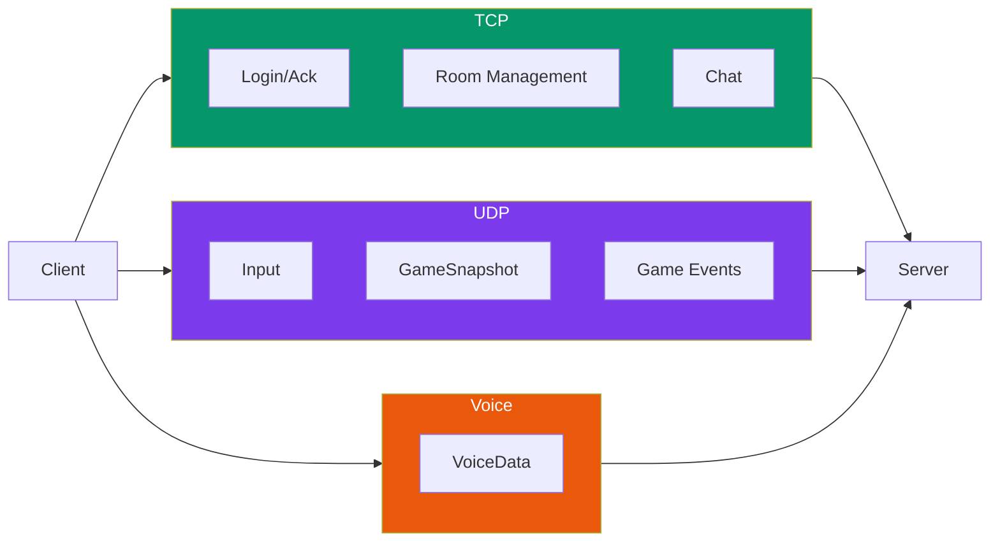

---
tags:
  - api
  - reseau
  - protocol
---

# Protocol

Définitions du protocole réseau R-Type.

## Synopsis

```cpp
#include "network/Protocol.hpp"

using namespace rtype::network;

// Check packet type
if (packet.type == PacketType::Login) {
    auto login = packet.as<LoginPacket>();
}
```

---

## Constantes

```cpp
namespace rtype::network {

struct Protocol {
    // Ports
    static constexpr uint16_t TCP_PORT = 4242;
    static constexpr uint16_t UDP_PORT = 4243;
    static constexpr uint16_t VOICE_PORT = 4244;

    // Magic number ("RTYP")
    static constexpr uint32_t MAGIC = 0x52545950;

    // Limits
    static constexpr size_t MAX_PACKET_SIZE = 1400;
    static constexpr size_t MAX_PLAYERS = 4;
    static constexpr size_t MAX_USERNAME = 32;
    static constexpr size_t MAX_ROOM_NAME = 64;
    static constexpr size_t MAX_CHAT_MESSAGE = 256;

    // Timing
    static constexpr int TICK_RATE = 60;
    static constexpr float TICK_DURATION = 1.0f / TICK_RATE;
};

} // namespace rtype::network
```

---

## Types de Paquets

### PacketType

```cpp
enum class PacketType : uint8_t {
    // === TCP Packets (0x00 - 0x7F) ===

    // Authentication
    Login           = 0x01,
    LoginAck        = 0x02,
    Logout          = 0x03,

    // Room Management
    CreateRoom      = 0x10,
    CreateRoomAck   = 0x11,
    JoinRoom        = 0x12,
    JoinRoomAck     = 0x13,
    LeaveRoom       = 0x14,
    ListRooms       = 0x15,
    RoomList        = 0x16,

    // Room Events
    PlayerJoined    = 0x20,
    PlayerLeft      = 0x21,
    GameStart       = 0x22,
    GameEnd         = 0x23,

    // Chat
    Chat            = 0x30,

    // === UDP Packets (0x80 - 0xFF) ===

    // Handshake
    UdpHandshake    = 0x80,
    UdpHandshakeAck = 0x81,

    // Game State
    Input           = 0x90,
    GameSnapshot    = 0x91,

    // Events
    PlayerDied      = 0xA0,
    EnemySpawn      = 0xA1,
    EnemyDied       = 0xA2,
    MissileSpawn    = 0xA3,

    // Voice
    VoiceData       = 0xF0,
};
```

---

## Paquets TCP

### LoginPacket

```cpp
struct LoginPacket {
    static constexpr PacketType TYPE = PacketType::Login;

    char username[32];
    char passwordHash[64];

    void serialize(Serializer& s) const {
        s.writeFixedString(username, 32);
        s.writeFixedString(passwordHash, 64);
    }

    void deserialize(Serializer& s) {
        s.readFixedString(username, 32);
        s.readFixedString(passwordHash, 64);
    }
};
```

### LoginAckPacket

```cpp
struct LoginAckPacket {
    static constexpr PacketType TYPE = PacketType::LoginAck;

    bool success;
    uint32_t playerId;
    char errorMessage[64];
};
```

### JoinRoomPacket

```cpp
struct JoinRoomPacket {
    static constexpr PacketType TYPE = PacketType::JoinRoom;

    uint32_t roomId;
};
```

### RoomListPacket

```cpp
struct RoomListPacket {
    static constexpr PacketType TYPE = PacketType::RoomList;

    struct RoomInfo {
        uint32_t id;
        char name[64];
        uint8_t playerCount;
        uint8_t maxPlayers;
        uint8_t state;  // 0=Waiting, 1=Playing
    };

    uint8_t roomCount;
    RoomInfo rooms[10];
};
```

### ChatPacket

```cpp
struct ChatPacket {
    static constexpr PacketType TYPE = PacketType::Chat;

    uint32_t senderId;
    uint32_t roomId;
    char message[256];
    uint64_t timestamp;
};
```

---

## Paquets UDP

### InputPacket

```cpp
struct InputPacket {
    static constexpr PacketType TYPE = PacketType::Input;

    uint32_t playerId;
    uint32_t sequence;
    uint32_t tick;
    uint8_t keys;  // Bitmask KEY_UP|DOWN|LEFT|RIGHT|SHOOT
};

// Key bitmask
constexpr uint8_t KEY_UP    = 0x01;
constexpr uint8_t KEY_DOWN  = 0x02;
constexpr uint8_t KEY_LEFT  = 0x04;
constexpr uint8_t KEY_RIGHT = 0x08;
constexpr uint8_t KEY_SHOOT = 0x10;
```

### GameSnapshotPacket

```cpp
struct GameSnapshotPacket {
    static constexpr PacketType TYPE = PacketType::GameSnapshot;

    uint32_t tick;

    // Players
    uint8_t playerCount;
    struct PlayerState {
        uint32_t id;
        uint16_t x, y;
        uint8_t health;
        uint8_t alive;
        uint32_t lastAckedInput;
    } players[4];

    // Enemies
    uint8_t enemyCount;
    struct EnemyState {
        uint32_t id;
        uint8_t type;
        uint16_t x, y;
        uint8_t health;
    } enemies[50];

    // Missiles
    uint8_t missileCount;
    struct MissileState {
        uint32_t id;
        uint16_t x, y;
        uint8_t isEnemy;
    } missiles[100];
};
```

### VoiceDataPacket

```cpp
struct VoiceDataPacket {
    static constexpr PacketType TYPE = PacketType::VoiceData;

    uint32_t playerId;
    uint32_t sequence;
    uint16_t dataLength;
    uint8_t data[960];  // Opus encoded frame
};
```

---

## Diagramme des Paquets



---

## Taille des Paquets

| Paquet | Taille (bytes) |
|--------|----------------|
| LoginPacket | 96 |
| JoinRoomPacket | 4 |
| ChatPacket | 276 |
| InputPacket | 13 |
| GameSnapshotPacket | ~800-1200 |
| VoiceDataPacket | ~970 |
