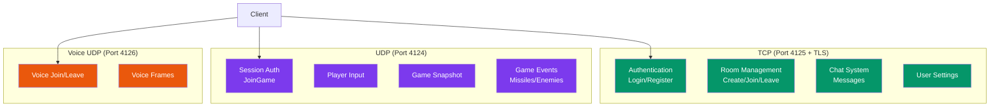

---
tags:
  - api
  - reseau
  - protocol
---

# Protocol

Définitions du protocole réseau R-Type.

## Synopsis

```cpp
#include "Protocol.hpp"

// Check message type
if (header.type == static_cast<uint16_t>(MessageType::Login)) {
    auto login = LoginRequest::from_bytes(payload, len);
}
```

---

## Ports

| Service | Port | Protocole | Description |
|---------|------|-----------|-------------|
| Auth | 4125 | TCP + TLS | Authentification et gestion de rooms |
| Game | 4124 | UDP | Gameplay temps réel |
| Voice | 4126 | UDP | Chat vocal |

---

## Constantes

```cpp
// Protocol.hpp

// Buffer
static constexpr std::size_t BUFFER_SIZE = 4096;

// Limits
static constexpr uint8_t MAX_PLAYERS = 4;
static constexpr uint8_t MAX_MISSILES = 32;
static constexpr uint8_t MAX_ENEMIES = 16;
static constexpr uint8_t MAX_ENEMY_MISSILES = 32;

// Room system
static constexpr size_t ROOM_NAME_LEN = 32;
static constexpr size_t ROOM_CODE_LEN = 6;
static constexpr uint8_t MAX_ROOM_PLAYERS = 6;
static constexpr uint8_t MIN_ROOM_PLAYERS = 1;

// Session token (256 bits)
static constexpr size_t TOKEN_SIZE = 32;

// Voice
static constexpr uint16_t VOICE_UDP_PORT = 4126;
```

---

## Types de Messages

### MessageType

```cpp
enum class MessageType: uint16_t {
    // === UDP Messages ===
    HeartBeat           = 0x0001,
    HeartBeatAck        = 0x0002,

    // UDP Session authentication
    JoinGame            = 0x0010,
    JoinGameAck         = 0x0011,
    JoinGameNack        = 0x0012,

    // UDP Game messages
    Snapshot            = 0x0040,
    PlayerInput         = 0x0061,
    PlayerJoin          = 0x0070,
    PlayerLeave         = 0x0071,
    ShootMissile        = 0x0080,
    MissileSpawned      = 0x0081,
    MissileDestroyed    = 0x0082,
    EnemyDestroyed      = 0x0091,
    PlayerDamaged       = 0x00A0,
    PlayerDied          = 0x00A1,

    // === TCP Messages ===

    // Authentication (0x01xx)
    Login               = 0x0100,
    LoginAck            = 0x0101,
    Register            = 0x0102,
    RegisterAck         = 0x0103,

    // Room Management (0x02xx)
    CreateRoom          = 0x0200,
    CreateRoomAck       = 0x0201,
    JoinRoomByCode      = 0x0210,
    JoinRoomAck         = 0x0211,
    JoinRoomNack        = 0x0212,
    LeaveRoom           = 0x0220,
    LeaveRoomAck        = 0x0221,
    SetReady            = 0x0230,
    SetReadyAck         = 0x0231,
    StartGame           = 0x0240,
    StartGameAck        = 0x0241,
    StartGameNack       = 0x0242,

    // Room Notifications
    RoomUpdate          = 0x0250,
    GameStarting        = 0x0251,
    SetRoomConfig       = 0x0252,
    SetRoomConfigAck    = 0x0253,

    // Kick System (0x026x)
    KickPlayer          = 0x0260,
    KickPlayerAck       = 0x0261,
    PlayerKicked        = 0x0262,

    // Room Browser (0x027x)
    BrowsePublicRooms   = 0x0270,
    BrowsePublicRoomsAck = 0x0271,
    QuickJoin           = 0x0272,
    QuickJoinAck        = 0x0273,
    QuickJoinNack       = 0x0274,

    // User Settings (0x028x)
    GetUserSettings     = 0x0280,
    GetUserSettingsAck  = 0x0281,
    SaveUserSettings    = 0x0282,
    SaveUserSettingsAck = 0x0283,

    // Chat System (0x029x)
    SendChatMessage     = 0x0290,
    SendChatMessageAck  = 0x0291,
    ChatMessageBroadcast = 0x0292,
    ChatHistory         = 0x0293,

    // Voice Chat (0x030x)
    VoiceJoin           = 0x0300,
    VoiceJoinAck        = 0x0301,
    VoiceLeave          = 0x0302,
    VoiceFrame          = 0x0303,
    VoiceMute           = 0x0304,
};
```

---

## Header UDP

```cpp
struct UDPHeader {
    uint16_t type;          // MessageType
    uint16_t sequence_num;  // Numéro de séquence
    uint64_t timestamp;     // Millisecondes depuis epoch

    static constexpr size_t WIRE_SIZE = 12;

    void to_bytes(void* buf) const;
    static std::optional<UDPHeader> from_bytes(const void* buf, size_t len);
};
```

**Format binaire (12 bytes, big-endian):**

| Offset | Taille | Champ |
|--------|--------|-------|
| 0 | 2 | type |
| 2 | 2 | sequence_num |
| 4 | 8 | timestamp |

---

## Input Keys

```cpp
namespace InputKeys {
    constexpr uint16_t UP    = 0x0001;
    constexpr uint16_t DOWN  = 0x0002;
    constexpr uint16_t LEFT  = 0x0004;
    constexpr uint16_t RIGHT = 0x0008;
    constexpr uint16_t SHOOT = 0x0010;
}
```

---

## Structures Principales

### SessionToken

Token d'authentification pour la session UDP (32 bytes).

```cpp
struct SessionToken {
    uint8_t bytes[TOKEN_SIZE];  // 32 bytes

    std::string toHex() const;
    static std::optional<SessionToken> fromHex(const std::string& hex);

    void to_bytes(uint8_t* buf) const;
    static std::optional<SessionToken> from_bytes(const void* buf, size_t len);
};
```

### PlayerState

État d'un joueur dans le snapshot (9 bytes).

```cpp
struct PlayerState {
    uint8_t id;
    uint16_t x, y;
    uint8_t health;
    uint8_t alive;
    uint16_t lastAckedInputSeq;
    uint8_t shipSkin;

    static constexpr size_t WIRE_SIZE = 9;
};
```

### MissileState

État d'un missile (7 bytes).

```cpp
struct MissileState {
    uint16_t id;
    uint8_t owner_id;
    uint16_t x, y;

    static constexpr size_t WIRE_SIZE = 7;
};
```

### EnemyState

État d'un ennemi (8 bytes).

```cpp
struct EnemyState {
    uint16_t id;
    uint16_t x, y;
    uint8_t health;
    uint8_t enemy_type;

    static constexpr size_t WIRE_SIZE = 8;
};
```

### GameSnapshot

Snapshot complet du jeu (taille variable).

```cpp
struct GameSnapshot {
    uint8_t player_count;
    PlayerState players[MAX_PLAYERS];

    uint8_t missile_count;
    MissileState missiles[MAX_MISSILES];

    uint8_t enemy_count;
    EnemyState enemies[MAX_ENEMIES];

    uint8_t enemy_missile_count;
    MissileState enemy_missiles[MAX_ENEMY_MISSILES];
};
```

### VoiceFrame

Frame audio encodé Opus (5-485 bytes).

```cpp
struct VoiceFrame {
    uint8_t speaker_id;
    uint16_t sequence;
    uint16_t opus_len;
    uint8_t opus_data[480];

    static constexpr size_t HEADER_SIZE = 5;
    static constexpr size_t MAX_OPUS_SIZE = 480;
};
```

---

## Sérialisation

Toutes les structures utilisent **big-endian** (network byte order).

```cpp
// Fonctions de conversion
inline uint16_t swap16(uint16_t v) { return __builtin_bswap16(v); }
inline uint32_t swap32(uint32_t v) { return __builtin_bswap32(v); }
inline uint64_t swap64(uint64_t v) { return __builtin_bswap64(v); }

// Pattern de sérialisation
void to_bytes(uint8_t* buf) const {
    uint16_t net_x = swap16(x);  // Host → Network
    std::memcpy(buf, &net_x, 2);
}

static std::optional<T> from_bytes(const void* buf, size_t len) {
    uint16_t net_x;
    std::memcpy(&net_x, buf, 2);
    x = swap16(net_x);  // Network → Host
}
```

---

## Diagramme des Messages



---

## Tailles des Messages

| Message | Taille (bytes) |
|---------|----------------|
| UDPHeader | 12 |
| SessionToken | 32 |
| PlayerState | 9 |
| MissileState | 7 |
| EnemyState | 8 |
| PlayerInput | 4 |
| VoiceFrame | 5-485 |
| GameSnapshot | Variable (~200-500) |
