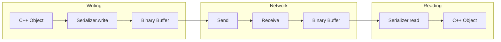

---
tags:
  - api
  - reseau
  - serialization
---

# Serialization

Utilitaires de sérialisation binaire.

## Synopsis

```cpp
#include "network/Serializer.hpp"

// Writing
Serializer writer;
writer.write<uint32_t>(playerId);
writer.write<float>(position.x);
writer.writeString(username);
auto bytes = writer.data();

// Reading
Serializer reader(bytes);
uint32_t id = reader.read<uint32_t>();
float x = reader.read<float>();
std::string name = reader.readString();
```

---

## Déclaration

```cpp
namespace rtype::network {

class Serializer {
public:
    // Constructors
    Serializer();
    explicit Serializer(const std::vector<uint8_t>& data);
    explicit Serializer(std::vector<uint8_t>&& data);

    // Writing
    template<typename T>
    void write(T value);

    void writeBytes(const void* data, size_t size);
    void writeString(const std::string& str);
    void writeFixedString(const char* str, size_t maxLen);

    // Reading
    template<typename T>
    T read();

    void readBytes(void* dest, size_t size);
    std::string readString();
    void readFixedString(char* dest, size_t maxLen);

    // Access
    const std::vector<uint8_t>& data() const;
    std::vector<uint8_t>&& moveData();
    size_t size() const;
    size_t remaining() const;

    // Position
    size_t position() const;
    void seek(size_t pos);
    void reset();

    // Validation
    bool hasRemaining(size_t bytes) const;

private:
    std::vector<uint8_t> buffer_;
    size_t readPos_ = 0;
};

} // namespace rtype::network
```

---

## Types Supportés

| Type | Taille | Endianness |
|------|--------|------------|
| `uint8_t` | 1 byte | - |
| `int8_t` | 1 byte | - |
| `uint16_t` | 2 bytes | Little-endian |
| `int16_t` | 2 bytes | Little-endian |
| `uint32_t` | 4 bytes | Little-endian |
| `int32_t` | 4 bytes | Little-endian |
| `uint64_t` | 8 bytes | Little-endian |
| `float` | 4 bytes | IEEE 754 |
| `double` | 8 bytes | IEEE 754 |
| `bool` | 1 byte | 0/1 |

---

## Méthodes

### `write<T>()`

```cpp
template<typename T>
void write(T value);
```

Écrit une valeur dans le buffer.

**Exemple:**

```cpp
Serializer s;
s.write<uint32_t>(42);
s.write<float>(3.14f);
s.write<bool>(true);
```

**Implémentation:**

```cpp
template<typename T>
void Serializer::write(T value) {
    static_assert(std::is_trivially_copyable_v<T>,
                  "Type must be trivially copyable");

    const uint8_t* bytes = reinterpret_cast<const uint8_t*>(&value);
    buffer_.insert(buffer_.end(), bytes, bytes + sizeof(T));
}

// Spécialisation pour garantir little-endian
template<>
void Serializer::write<uint32_t>(uint32_t value) {
    buffer_.push_back(value & 0xFF);
    buffer_.push_back((value >> 8) & 0xFF);
    buffer_.push_back((value >> 16) & 0xFF);
    buffer_.push_back((value >> 24) & 0xFF);
}
```

---

### `read<T>()`

```cpp
template<typename T>
T read();
```

Lit une valeur depuis le buffer.

**Exceptions:** `std::runtime_error` si pas assez de données

**Exemple:**

```cpp
Serializer s(receivedData);
uint32_t id = s.read<uint32_t>();
float x = s.read<float>();
bool active = s.read<bool>();
```

**Implémentation:**

```cpp
template<typename T>
T Serializer::read() {
    if (!hasRemaining(sizeof(T))) {
        throw std::runtime_error("Buffer underflow");
    }

    T value;
    std::memcpy(&value, buffer_.data() + readPos_, sizeof(T));
    readPos_ += sizeof(T);
    return value;
}

// Spécialisation little-endian
template<>
uint32_t Serializer::read<uint32_t>() {
    if (!hasRemaining(4)) throw std::runtime_error("Underflow");

    uint32_t value = buffer_[readPos_] |
                    (buffer_[readPos_ + 1] << 8) |
                    (buffer_[readPos_ + 2] << 16) |
                    (buffer_[readPos_ + 3] << 24);
    readPos_ += 4;
    return value;
}
```

---

### `writeString()`

```cpp
void writeString(const std::string& str);
```

Écrit une string avec préfixe de longueur.

**Format:** `[length:uint16][chars:N]`

```cpp
void Serializer::writeString(const std::string& str) {
    write<uint16_t>(static_cast<uint16_t>(str.size()));
    writeBytes(str.data(), str.size());
}

std::string Serializer::readString() {
    uint16_t len = read<uint16_t>();
    if (!hasRemaining(len)) {
        throw std::runtime_error("Buffer underflow");
    }
    std::string result(
        reinterpret_cast<const char*>(buffer_.data() + readPos_),
        len
    );
    readPos_ += len;
    return result;
}
```

---

### `writeFixedString()`

```cpp
void writeFixedString(const char* str, size_t maxLen);
```

Écrit une string de taille fixe (paddée avec zeros).

**Exemple:**

```cpp
char username[32] = "player1";
s.writeFixedString(username, 32);  // Toujours 32 bytes
```

```cpp
void Serializer::writeFixedString(const char* str, size_t maxLen) {
    size_t len = std::min(std::strlen(str), maxLen - 1);
    writeBytes(str, len);
    // Padding
    for (size_t i = len; i < maxLen; i++) {
        write<uint8_t>(0);
    }
}
```

---

## Exemple: Sérialisation de Structure

```cpp
struct PlayerState {
    uint32_t id;
    float x, y;
    uint8_t health;
    bool alive;

    void serialize(Serializer& s) const {
        s.write(id);
        s.write(x);
        s.write(y);
        s.write(health);
        s.write(alive);
    }

    void deserialize(Serializer& s) {
        id = s.read<uint32_t>();
        x = s.read<float>();
        y = s.read<float>();
        health = s.read<uint8_t>();
        alive = s.read<bool>();
    }
};

// Usage
PlayerState player{42, 100.5f, 200.0f, 100, true};

Serializer writer;
player.serialize(writer);
auto bytes = writer.data();  // 14 bytes

Serializer reader(bytes);
PlayerState loaded;
loaded.deserialize(reader);
```

---

## Diagramme de Flux



---

## Performance Tips

```cpp
// Pré-allouer le buffer si la taille est connue
Serializer s;
s.data().reserve(expectedSize);

// Éviter les copies inutiles
auto bytes = writer.moveData();  // std::move

// Réutiliser les serializers
Serializer reusable;
for (auto& entity : entities) {
    reusable.reset();
    entity.serialize(reusable);
    send(reusable.data());
}
```
