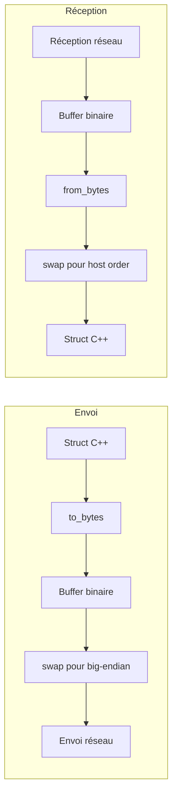

---
tags:
  - api
  - reseau
  - serialization
---

# Sérialisation

Pattern de sérialisation binaire du protocole R-Type.

## Synopsis

```cpp
#include "Protocol.hpp"

// Écriture
PlayerState state{1, 100, 200, 100, 1, 42, 1};
uint8_t buffer[PlayerState::WIRE_SIZE];
state.to_bytes(buffer);

// Lecture
auto parsed = PlayerState::from_bytes(buffer, sizeof(buffer));
if (parsed) {
    // Utiliser *parsed
}
```

---

## Pattern de Sérialisation

Chaque structure du protocole implémente deux méthodes statiques:

```cpp
struct ExampleMessage {
    uint16_t value;
    static constexpr size_t WIRE_SIZE = 2;

    void to_bytes(uint8_t* buf) const {
        uint16_t net_value = swap16(value);  // Host → Network (big-endian)
        std::memcpy(buf, &net_value, 2);
    }

    static std::optional<ExampleMessage> from_bytes(const void* buf, size_t len) {
        if (buf == nullptr || len < WIRE_SIZE) return std::nullopt;

        uint16_t net_value;
        std::memcpy(&net_value, buf, 2);

        ExampleMessage msg;
        msg.value = swap16(net_value);  // Network → Host
        return msg;
    }
};
```

---

## Byte Order

Le protocole utilise **big-endian** (network byte order) pour tous les types multi-octets.

### Fonctions de Conversion

```cpp
// Protocol.hpp
inline uint16_t swap16(uint16_t v) { return __builtin_bswap16(v); }
inline uint32_t swap32(uint32_t v) { return __builtin_bswap32(v); }
inline uint64_t swap64(uint64_t v) { return __builtin_bswap64(v); }
```

### Types et Tailles

| Type | Taille | Endianness |
|------|--------|------------|
| `uint8_t` | 1 byte | - |
| `int8_t` | 1 byte | - |
| `uint16_t` | 2 bytes | Big-endian |
| `int16_t` | 2 bytes | Big-endian |
| `uint32_t` | 4 bytes | Big-endian |
| `uint64_t` | 8 bytes | Big-endian |
| `float` | 4 bytes | IEEE 754 |
| `bool` | 1 byte | 0/1 |

---

## Exemples de Structures

### PlayerState (9 bytes)

```cpp
struct PlayerState {
    uint8_t id;
    uint16_t x, y;
    uint8_t health;
    uint8_t alive;
    uint16_t lastAckedInputSeq;
    uint8_t shipSkin;

    static constexpr size_t WIRE_SIZE = 9;

    void to_bytes(uint8_t* buf) const {
        buf[0] = id;
        uint16_t net_x = swap16(x);
        uint16_t net_y = swap16(y);
        std::memcpy(buf + 1, &net_x, 2);
        std::memcpy(buf + 3, &net_y, 2);
        buf[5] = health;
        buf[6] = alive;
        uint16_t net_seq = swap16(lastAckedInputSeq);
        std::memcpy(buf + 7, &net_seq, 2);
        // shipSkin may be in extended format
    }

    static std::optional<PlayerState> from_bytes(const void* buf, size_t len) {
        if (buf == nullptr || len < WIRE_SIZE) return std::nullopt;
        auto* ptr = static_cast<const uint8_t*>(buf);

        PlayerState state;
        state.id = ptr[0];

        uint16_t net_x, net_y;
        std::memcpy(&net_x, ptr + 1, 2);
        std::memcpy(&net_y, ptr + 3, 2);
        state.x = swap16(net_x);
        state.y = swap16(net_y);

        state.health = ptr[5];
        state.alive = ptr[6];

        uint16_t net_seq;
        std::memcpy(&net_seq, ptr + 7, 2);
        state.lastAckedInputSeq = swap16(net_seq);

        return state;
    }
};
```

### UDPHeader (12 bytes)

```cpp
struct UDPHeader {
    uint16_t type;
    uint16_t sequence_num;
    uint64_t timestamp;

    static constexpr size_t WIRE_SIZE = 12;

    void to_bytes(void* buf) const {
        auto* ptr = static_cast<uint8_t*>(buf);
        uint16_t net_type = swap16(type);
        uint16_t net_seq = swap16(sequence_num);
        uint64_t net_ts = swap64(timestamp);

        std::memcpy(ptr, &net_type, 2);
        std::memcpy(ptr + 2, &net_seq, 2);
        std::memcpy(ptr + 4, &net_ts, 8);
    }

    static std::optional<UDPHeader> from_bytes(const void* buf, size_t len) {
        if (buf == nullptr || len < WIRE_SIZE) return std::nullopt;
        auto* ptr = static_cast<const uint8_t*>(buf);

        UDPHeader header;
        uint16_t net_type, net_seq;
        uint64_t net_ts;

        std::memcpy(&net_type, ptr, 2);
        std::memcpy(&net_seq, ptr + 2, 2);
        std::memcpy(&net_ts, ptr + 4, 8);

        header.type = swap16(net_type);
        header.sequence_num = swap16(net_seq);
        header.timestamp = swap64(net_ts);

        return header;
    }
};
```

---

## Fixed-Size Strings

Pour les chaînes de taille fixe (room codes, noms):

```cpp
// Écriture
char roomCode[ROOM_CODE_LEN] = "ABC123";
std::memcpy(buf + offset, roomCode, ROOM_CODE_LEN);

// Lecture
char roomCode[ROOM_CODE_LEN];
std::memcpy(roomCode, ptr + offset, ROOM_CODE_LEN);
```

---

## Validation

Toujours valider la taille du buffer avant de parser:

```cpp
static std::optional<T> from_bytes(const void* buf, size_t len) {
    // Validation obligatoire
    if (buf == nullptr || len < WIRE_SIZE) {
        return std::nullopt;
    }
    // Parsing...
}
```

---

## Diagramme de Flux



---

## Constantes de Taille

| Structure | WIRE_SIZE |
|-----------|-----------|
| `UDPHeader` | 12 |
| `SessionToken` | 32 |
| `PlayerState` | 9 |
| `MissileState` | 7 |
| `EnemyState` | 8 |
| `JoinGame` | 39 |
| `VoiceFrame` (header) | 5 |

---

## Bonnes Pratiques

```cpp
// 1. Toujours utiliser memcpy pour éviter les problèmes d'alignement
uint16_t value;
std::memcpy(&value, ptr, 2);  // OK
// uint16_t value = *reinterpret_cast<uint16_t*>(ptr);  // Dangereux!

// 2. Retourner std::optional pour gérer les erreurs de parsing
auto result = Message::from_bytes(buf, len);
if (!result) {
    // Erreur de parsing
    return;
}
auto& msg = *result;

// 3. Utiliser les constantes WIRE_SIZE
uint8_t buffer[PlayerState::WIRE_SIZE];
state.to_bytes(buffer);
```
