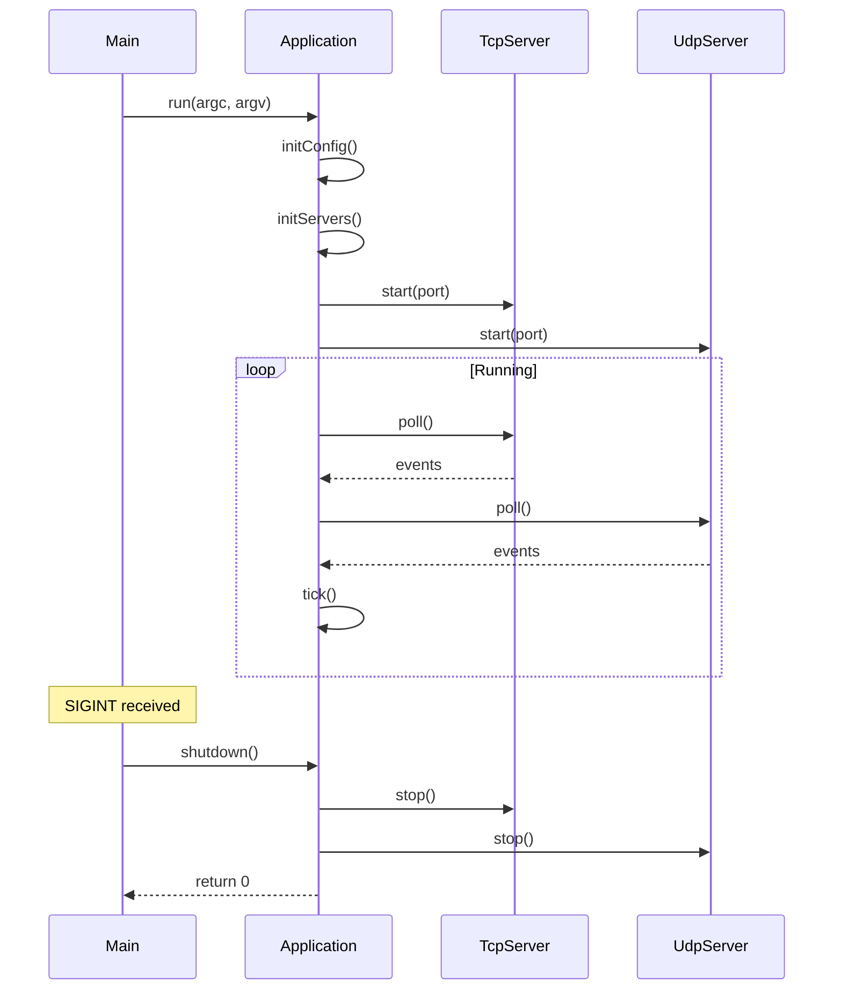

---
tags:
  - api
  - serveur
  - application
---

# Application

Point d'entrée du serveur R-Type.

## Synopsis

```cpp
#include "server/Application.hpp"

int main(int argc, char* argv[]) {
    rtype::server::Application app;
    return app.run(argc, argv);
}
```

---

## Déclaration

```cpp
namespace rtype::server {

class Application {
public:
    Application();
    ~Application();

    // Non-copyable
    Application(const Application&) = delete;
    Application& operator=(const Application&) = delete;

    // Point d'entrée
    int run(int argc, char* argv[]);

    // Lifecycle
    void shutdown();
    bool isRunning() const;

    // Accesseurs
    RoomManager& roomManager();
    const Config& config() const;

private:
    void initConfig(int argc, char* argv[]);
    void initServers();
    void gameLoop();
    void cleanup();

    Config config_;
    std::unique_ptr<RoomManager> roomManager_;
    std::unique_ptr<TcpServer> tcpServer_;
    std::unique_ptr<UdpServer> udpServer_;
    std::unique_ptr<VoiceServer> voiceServer_;
    std::atomic<bool> running_{false};
};

} // namespace rtype::server
```

---

## Méthodes

### `run()`

```cpp
int run(int argc, char* argv[]);
```

Lance le serveur et entre dans la boucle principale.

**Paramètres:**

| Nom | Type | Description |
|-----|------|-------------|
| `argc` | `int` | Nombre d'arguments |
| `argv` | `char*[]` | Arguments CLI |

**Retour:** Code de sortie (0 = succès)

**Exemple:**

```cpp
int main(int argc, char* argv[]) {
    rtype::server::Application app;
    return app.run(argc, argv);
}
```

---

### `shutdown()`

```cpp
void shutdown();
```

Arrête proprement le serveur.

**Note:** Thread-safe, peut être appelé depuis un signal handler.

```cpp
Application* g_app = nullptr;

void signalHandler(int sig) {
    if (g_app) g_app->shutdown();
}

int main() {
    Application app;
    g_app = &app;
    signal(SIGINT, signalHandler);
    return app.run(0, nullptr);
}
```

---

### `roomManager()`

```cpp
RoomManager& roomManager();
```

Accès au gestionnaire de salons.

**Retour:** Référence au RoomManager

---

## Boucle de Jeu

```cpp
void Application::gameLoop() {
    using Clock = std::chrono::steady_clock;
    constexpr auto TICK_DURATION =
        std::chrono::microseconds(16667);  // 60 Hz

    auto lastTick = Clock::now();

    while (running_) {
        auto now = Clock::now();
        auto elapsed = now - lastTick;

        if (elapsed >= TICK_DURATION) {
            // Tick all rooms
            roomManager_->tick();

            // Broadcast snapshots
            roomManager_->broadcastSnapshots();

            lastTick = now;
        }

        // Process network events
        tcpServer_->poll();
        udpServer_->poll();

        // Small sleep to prevent CPU spinning
        std::this_thread::sleep_for(
            std::chrono::microseconds(100)
        );
    }
}
```

---

## Configuration

```cpp
struct Config {
    // Network
    std::string bindAddress = "0.0.0.0";
    uint16_t tcpPort = 4242;
    uint16_t udpPort = 4243;
    uint16_t voicePort = 4244;

    // Game
    int maxRooms = 10;
    int maxPlayersPerRoom = 4;
    int tickRate = 60;

    // Database
    std::string mongoUri = "mongodb://localhost:27017";
    std::string mongoDatabase = "rtype";

    // Logging
    std::string logLevel = "info";
};
```

---

## Diagramme de Séquence



---

## Thread Safety

| Méthode | Thread-Safe |
|---------|-------------|
| `run()` | Non (appelé une fois) |
| `shutdown()` | Oui |
| `isRunning()` | Oui |
| `roomManager()` | Non |
