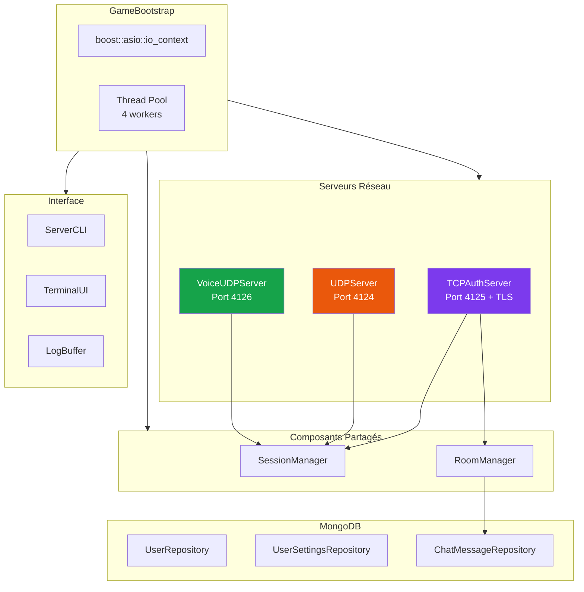
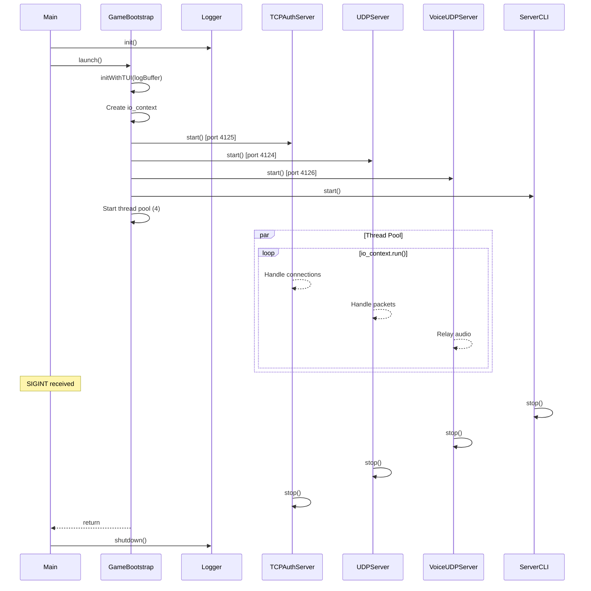

---
tags:
  - api
  - serveur
  - bootstrap
---

# GameBootstrap

Point d'entrée et orchestrateur du serveur R-Type.

## Synopsis

```cpp
#include "infrastructure/bootstrap/GameBootstrap.hpp"

int main(void) {
    using infrastructure::bootstrap::GameBootstrap;

    server::logging::Logger::init();

    try {
        GameBootstrap gameBootstrap;
        gameBootstrap.launch();
    } catch (const std::exception& e) {
        // Handle error
    }

    server::logging::Logger::shutdown();
    return 0;
}
```

---

## Déclaration

```cpp
namespace infrastructure::bootstrap {

class GameBootstrap {
public:
    GameBootstrap() = default;

    void launch();

private:
    void server();
};

} // namespace infrastructure::bootstrap
```

---

## Architecture Serveur



---

## Composants Initialisés

### Serveurs Réseau

| Serveur | Port | Protocole | Description |
|---------|------|-----------|-------------|
| `TCPAuthServer` | 4125 | TCP + TLS | Authentification, rooms, chat |
| `UDPServer` | 4124 | UDP | Game loop, mouvements, missiles |
| `VoiceUDPServer` | 4126 | UDP | Relay audio Opus |

### Composants Partagés

| Composant | Partagé entre | Description |
|-----------|---------------|-------------|
| `SessionManager` | TCP, UDP, Voice | Tokens et sessions utilisateurs |
| `RoomManager` | TCP | Gestion des salons |

---

## Configuration

### Variables d'Environnement

| Variable | Défaut | Description |
|----------|--------|-------------|
| `MONGODB_URI` | `mongodb://localhost:8089` | URI de connexion MongoDB |
| `MONGODB_DB` | `rtype` | Nom de la base de données |
| `TLS_CERT_FILE` | `certs/server.crt` | Certificat TLS |
| `TLS_KEY_FILE` | `certs/server.key` | Clé privée TLS |

### DBConfig

```cpp
struct DBConfig {
    std::string connexionString;
    std::string dbName;
    uint32_t minPoolSize = 1;
    uint32_t maxPoolSize = 10;
};
```

---

## Méthode `launch()`

```cpp
void launch();
```

Lance le serveur et bloque jusqu'à l'arrêt.

**Séquence d'initialisation:**

1. Créer `LogBuffer` et initialiser le Logger TUI
2. Créer `boost::asio::io_context` avec work guard
3. Initialiser MongoDB et les repositories
4. Créer `SessionManager` et `RoomManager` partagés
5. Démarrer `TCPAuthServer` (port 4125)
6. Démarrer `UDPServer` (port 4124)
7. Démarrer `VoiceUDPServer` (port 4126)
8. Démarrer `ServerCLI` avec callback de shutdown
9. Configurer gestionnaire de signaux (SIGINT, SIGTERM)
10. Lancer thread pool (4 workers)
11. Attendre la fin du CLI

---

## Thread Pool

```cpp
constexpr size_t THREAD_POOL_SIZE = 4;
std::vector<std::jthread> threadPool;

for (size_t i = 0; i < THREAD_POOL_SIZE; ++i) {
    threadPool.emplace_back([&io_ctx]() {
        io_ctx.run();
    });
}
```

Le serveur utilise un pool de 4 threads (`std::jthread`) pour exécuter les handlers `io_context`.

---

## Arrêt Propre

L'arrêt peut être déclenché par:

1. **Signal SIGINT/SIGTERM** (Ctrl+C)
2. **Commande CLI** (`exit` ou `quit`)

```cpp
// Signal handler
boost::asio::signal_set signals(io_ctx, SIGINT, SIGTERM);
signals.async_wait([&](const boost::system::error_code&, int signum) {
    serverCLI.stop();
    voiceServer.stop();
    udpServer.stop();
    tcpAuthServer.stop();
    workGuard.reset();
    io_ctx.stop();
});

// CLI shutdown callback
serverCLI.setShutdownCallback([&]() {
    voiceServer.stop();
    udpServer.stop();
    tcpAuthServer.stop();
    workGuard.reset();
    io_ctx.stop();
});
```

---

## Diagramme de Séquence



---

## ServerCLI

Le serveur inclut une interface en ligne de commande interactive.

```cpp
cli::ServerCLI serverCLI(
    sessionManager,
    udpServer,
    logBuffer,
    userRepo,
    roomManager
);
```

| Commande | Description |
|----------|-------------|
| `status` | Affiche l'état des serveurs |
| `sessions` | Liste les sessions actives |
| `rooms` | Liste les salons |
| `kick <email>` | Expulse un joueur |
| `exit` / `quit` | Arrête le serveur |

---

## Repositories MongoDB

```cpp
// Configuration MongoDB
auto mongoConfig = std::make_shared<MongoDBConfiguration>(dbConfig);

// Repositories
auto userRepo = std::make_shared<MongoDBUserRepository>(mongoConfig);
auto userSettingsRepo = std::make_shared<MongoDBUserSettingsRepository>(mongoConfig);
auto chatMessageRepo = std::make_shared<MongoDBChatMessageRepository>(mongoConfig);
```

| Repository | Collection | Description |
|------------|------------|-------------|
| `MongoDBUserRepository` | `users` | Comptes utilisateurs |
| `MongoDBUserSettingsRepository` | `user_settings` | Préférences audio/vidéo |
| `MongoDBChatMessageRepository` | `chat_messages` | Historique chat |
