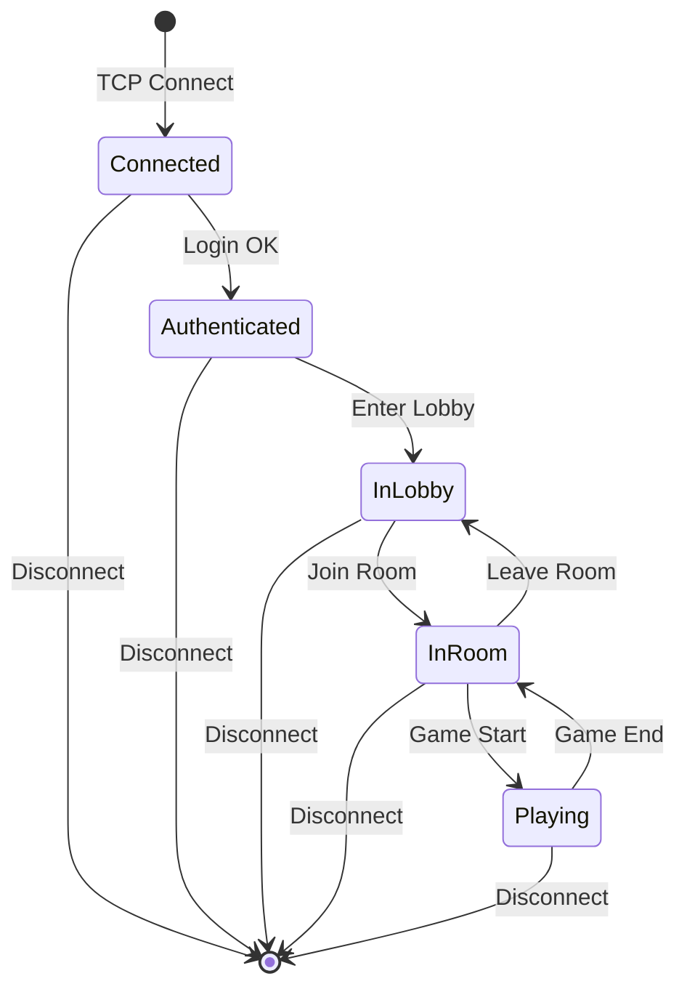
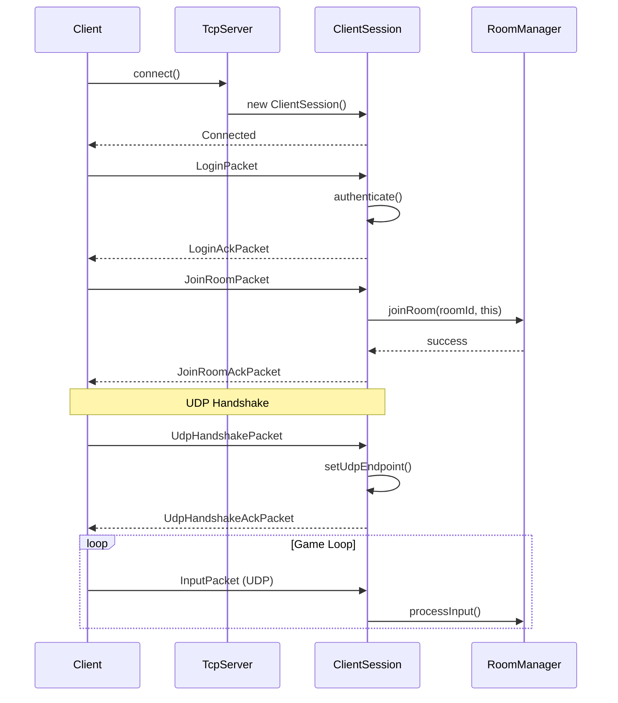

---
tags:
  - api
  - serveur
  - session
---

# ClientSession

Représente une session client connectée au serveur.

## Synopsis

```cpp
#include "server/ClientSession.hpp"

// Création lors de la connexion TCP
auto session = std::make_unique<ClientSession>(
    nextPlayerId_++,
    std::move(tcpConnection)
);

// Envoi de paquet
session->send(WelcomePacket{session->id()});
```

---

## Déclaration

```cpp
namespace rtype::server {

class ClientSession {
public:
    ClientSession(PlayerId id, TcpConnection&& tcp);
    ~ClientSession();

    // Identité
    PlayerId id() const;
    const std::string& username() const;
    void setUsername(const std::string& name);

    // État
    SessionState state() const;
    bool isAuthenticated() const;
    bool isInRoom() const;
    RoomId currentRoom() const;

    // Réseau TCP
    void send(const Packet& packet);
    void disconnect();
    bool isConnected() const;

    // Réseau UDP
    void setUdpEndpoint(const UdpEndpoint& endpoint);
    const UdpEndpoint& udpEndpoint() const;
    bool hasUdp() const;

    // Voice
    void setVoiceEndpoint(const UdpEndpoint& endpoint);
    bool hasVoice() const;

    // Callbacks
    void onPacket(const Packet& packet);
    void onDisconnect();

private:
    PlayerId id_;
    std::string username_;
    SessionState state_ = SessionState::Connected;
    RoomId currentRoom_ = 0;

    TcpConnection tcp_;
    std::optional<UdpEndpoint> udpEndpoint_;
    std::optional<UdpEndpoint> voiceEndpoint_;
};

} // namespace rtype::server
```

---

## Types

### SessionState

```cpp
enum class SessionState {
    Connected,      // TCP connecté
    Authenticated,  // Login réussi
    InLobby,        // Dans le lobby
    InRoom,         // Dans un salon
    Playing         // En jeu
};
```

---

## Méthodes

### `send()`

```cpp
void send(const Packet& packet);
```

Envoie un paquet TCP au client.

**Paramètres:**

| Nom | Type | Description |
|-----|------|-------------|
| `packet` | `Packet` | Paquet à envoyer |

**Exemple:**

```cpp
// Envoyer un message de chat
session->send(ChatMessagePacket{
    .senderId = 0,  // Server
    .message = "Welcome to R-Type!"
});
```

---

### `setUdpEndpoint()`

```cpp
void setUdpEndpoint(const UdpEndpoint& endpoint);
```

Associe un endpoint UDP au client.

**Note:** Appelé après réception du premier paquet UDP du client.

```cpp
void UdpServer::onPacket(const UdpEndpoint& sender,
                          const Packet& packet)
{
    if (packet.type == PacketType::UdpHandshake) {
        auto* session = findSessionById(packet.playerId);
        if (session) {
            session->setUdpEndpoint(sender);
        }
    }
}
```

---

### `onPacket()`

```cpp
void onPacket(const Packet& packet);
```

Traite un paquet reçu du client.

**Exemple d'implémentation:**

```cpp
void ClientSession::onPacket(const Packet& packet) {
    switch (packet.type) {
        case PacketType::Login:
            handleLogin(packet.as<LoginPacket>());
            break;

        case PacketType::JoinRoom:
            handleJoinRoom(packet.as<JoinRoomPacket>());
            break;

        case PacketType::Chat:
            handleChat(packet.as<ChatPacket>());
            break;

        case PacketType::Input:
            handleInput(packet.as<InputPacket>());
            break;

        default:
            // Unknown packet type
            break;
    }
}
```

---

## Cycle de Vie



---

## Diagramme de Séquence



---

## Gestion des Timeouts

```cpp
class ClientSession {
    static constexpr auto TCP_TIMEOUT = std::chrono::seconds(30);
    static constexpr auto UDP_TIMEOUT = std::chrono::seconds(5);

    std::chrono::steady_clock::time_point lastTcpActivity_;
    std::chrono::steady_clock::time_point lastUdpActivity_;

public:
    void updateTcpActivity() {
        lastTcpActivity_ = std::chrono::steady_clock::now();
    }

    void updateUdpActivity() {
        lastUdpActivity_ = std::chrono::steady_clock::now();
    }

    bool isTcpTimedOut() const {
        return std::chrono::steady_clock::now() - lastTcpActivity_
               > TCP_TIMEOUT;
    }

    bool isUdpTimedOut() const {
        if (!hasUdp()) return false;
        return std::chrono::steady_clock::now() - lastUdpActivity_
               > UDP_TIMEOUT;
    }
};
```

---

## Thread Safety

| Méthode | Thread-Safe |
|---------|-------------|
| `send()` | Oui (buffer interne) |
| `onPacket()` | Non (appelé depuis thread réseau) |
| `state()` | Oui (atomic) |
| `setUdpEndpoint()` | Non |
