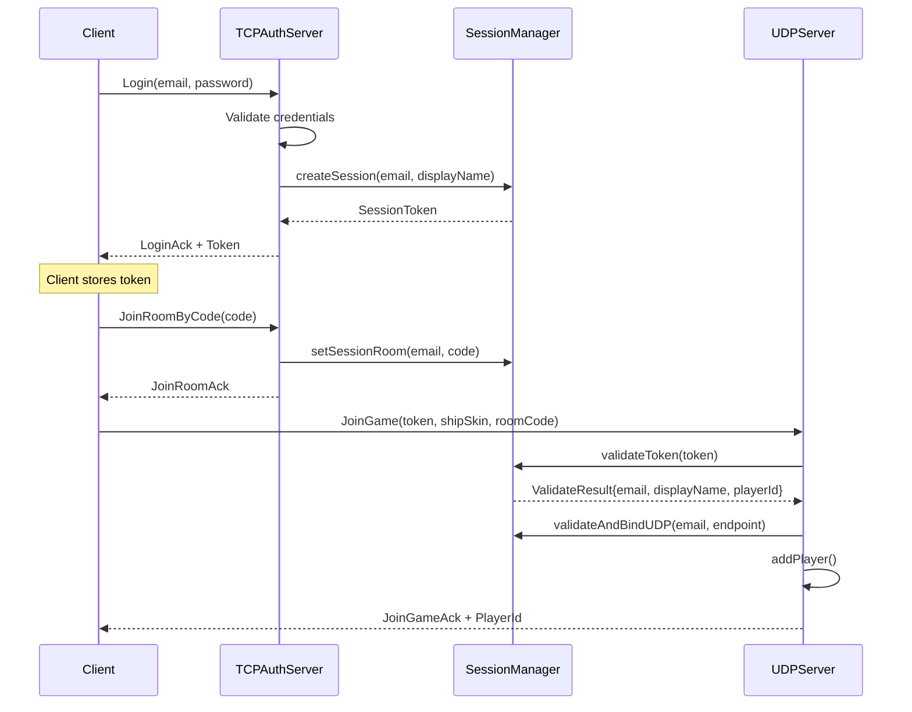
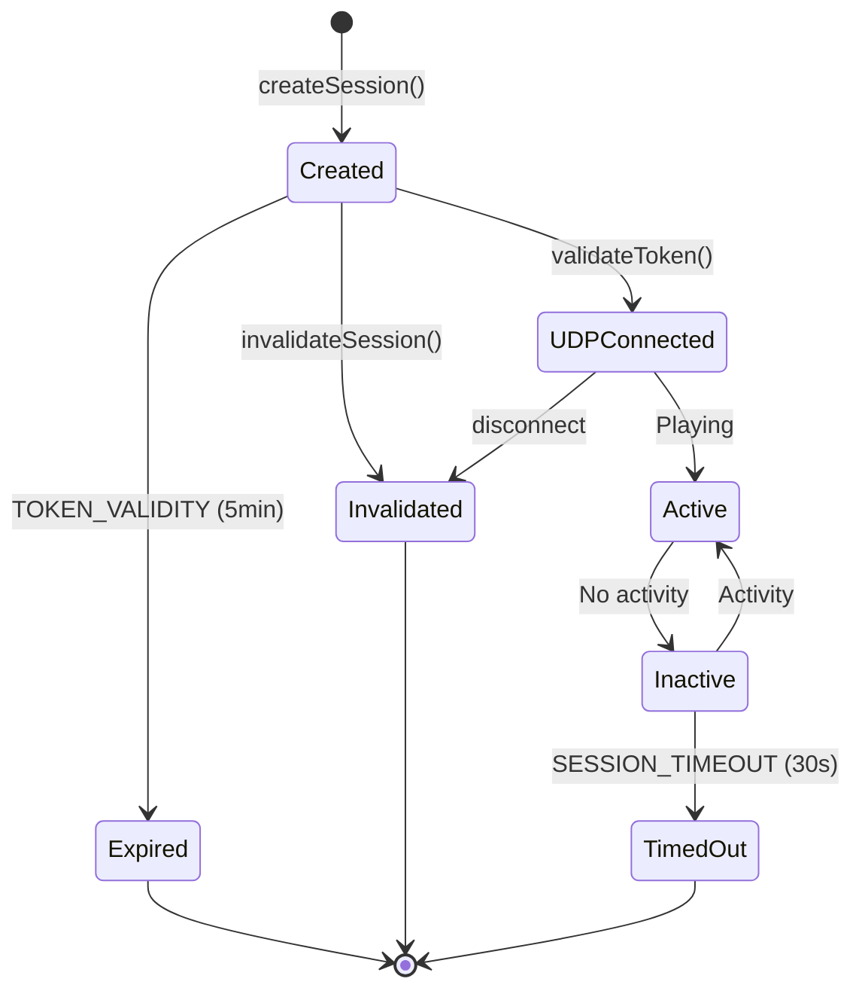

---
tags:
  - api
  - serveur
  - session
---

# SessionManager

Gestionnaire des sessions utilisateur (authentification et liaison TCP/UDP).

## Synopsis

```cpp
#include "infrastructure/session/SessionManager.hpp"

using namespace infrastructure::session;

SessionManager sessions;

// After TCP login
auto result = sessions.createSession(email, displayName);
if (result) {
    sendToClient(result->token);
}

// When UDP JoinGame received
auto validation = sessions.validateToken(token, roomCode);
if (validation) {
    // Player authenticated
}
```

---

## Déclaration

```cpp
namespace infrastructure::session {

class SessionManager {
public:
    // Token validity before UDP connection (5 minutes)
    static constexpr auto TOKEN_VALIDITY = std::chrono::minutes(5);

    // Session timeout for inactivity (30 seconds)
    static constexpr auto SESSION_TIMEOUT = std::chrono::seconds(30);

    SessionManager() = default;
    ~SessionManager() = default;

    // ═══════════════════════════════════════════════════════════════
    // Called by TCPAuthServer after successful login
    // ═══════════════════════════════════════════════════════════════

    struct CreateSessionResult {
        SessionToken token;
        std::string displayName;
    };

    std::optional<CreateSessionResult> createSession(
        const std::string& email,
        const std::string& displayName);

    // ═══════════════════════════════════════════════════════════════
    // Called by UDPServer to validate connections
    // ═══════════════════════════════════════════════════════════════

    struct ValidateResult {
        std::string email;
        std::string displayName;
        uint8_t playerId;
    };

    std::optional<ValidateResult> validateToken(const SessionToken& token);

    // Called by UDPServer after successful validateToken to bind UDP endpoint
    void validateAndBindUDP(const std::string& email, const asio::ip::udp::endpoint& endpoint);

    // ═══════════════════════════════════════════════════════════════
    // Session management
    // ═══════════════════════════════════════════════════════════════

    void invalidateSession(const std::string& email);
    bool hasActiveSession(const std::string& email) const;
    std::optional<std::string> getEmailByToken(const SessionToken& token) const;

    // ═══════════════════════════════════════════════════════════════
    // Room association
    // ═══════════════════════════════════════════════════════════════

    void setSessionRoom(const std::string& email, const std::string& roomCode);
    void clearSessionRoom(const std::string& email);
    std::optional<std::string> getSessionRoom(const std::string& email) const;

    // ═══════════════════════════════════════════════════════════════
    // Ship skin
    // ═══════════════════════════════════════════════════════════════

    void setSessionShipSkin(const std::string& email, uint8_t shipSkin);
    uint8_t getSessionShipSkin(const std::string& email) const;

    // ═══════════════════════════════════════════════════════════════
    // Cleanup
    // ═══════════════════════════════════════════════════════════════

    size_t cleanupExpiredTokens();
    size_t getActiveSessionCount() const;

private:
    mutable std::shared_mutex _mutex;

    struct Session {
        SessionToken token;
        std::string email;
        std::string displayName;
        std::string roomCode;
        uint8_t shipSkin = 1;
        std::chrono::steady_clock::time_point createdAt;
        std::chrono::steady_clock::time_point lastActivity;
        bool udpConnected = false;
    };

    std::unordered_map<std::string, Session> _sessionsByEmail;
    std::unordered_map<std::string, std::string> _tokenToEmail;
};

} // namespace infrastructure::session
```

---

## Flux d'Authentification



---

## SessionToken

Token de 32 bytes (256 bits) généré cryptographiquement.

```cpp
struct SessionToken {
    uint8_t bytes[TOKEN_SIZE];  // TOKEN_SIZE = 32

    std::string toHex() const;
    static std::optional<SessionToken> fromHex(const std::string& hex);

    void to_bytes(uint8_t* buf) const;
    static std::optional<SessionToken> from_bytes(const void* buf, size_t len);
};
```

---

## Méthodes

### `createSession()`

```cpp
std::optional<CreateSessionResult> createSession(
    const std::string& email,
    const std::string& displayName);
```

Crée une nouvelle session après authentification TCP.

**Retour:** Token et displayName, ou `nullopt` si session déjà active

**Note:** Le token est valide pendant 5 minutes pour la connexion UDP.

---

### `validateToken()`

```cpp
std::optional<ValidateResult> validateToken(const SessionToken& token);
```

Valide un token UDP.

**Conditions de validation:**
- Token existe et non expiré

**Retour:** Email, displayName et playerId, ou `nullopt`

---

### `validateAndBindUDP()`

```cpp
void validateAndBindUDP(const std::string& email, const asio::ip::udp::endpoint& endpoint);
```

Associe l'endpoint UDP à la session après validation du token.

---

### `invalidateSession()`

```cpp
void invalidateSession(const std::string& email);
```

Invalide la session (déconnexion ou timeout).

---

## Cycle de Vie



---

## Timeouts

| Timeout | Durée | Description |
|---------|-------|-------------|
| `TOKEN_VALIDITY` | 5 minutes | Temps pour connecter UDP après login |
| `SESSION_TIMEOUT` | 30 secondes | Inactivité avant déconnexion |

---

## Thread Safety

La classe utilise un `shared_mutex` pour permettre des lectures concurrentes.

| Méthode | Verrouillage |
|---------|--------------|
| `createSession()` | Exclusif |
| `validateToken()` | Exclusif |
| `invalidateSession()` | Exclusif |
| `hasActiveSession()` | Partagé |
| `getEmailByToken()` | Partagé |
| `getActiveSessionCount()` | Partagé |
