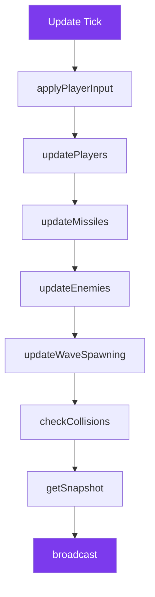

---
tags:
  - api
  - serveur
  - gameplay
---

# GameWorld

Simulation du monde de jeu côté serveur.

## Synopsis

```cpp
#include "infrastructure/game/GameWorld.hpp"

using namespace infrastructure::game;

GameWorld world(io_context);

// Add player
auto playerId = world.addPlayer(endpoint);

// Game loop
while (running) {
    world.applyPlayerInput(playerId, keys, sequence);
    world.updatePlayers(deltaTime);
    world.updateMissiles(deltaTime);
    world.updateEnemies(deltaTime);
    world.updateWaveSpawning(deltaTime);
    world.checkCollisions();

    auto snapshot = world.getSnapshot();
    broadcast(snapshot);
}
```

---

## Déclaration

```cpp
namespace infrastructure::game {

class GameWorld {
public:
    explicit GameWorld(boost::asio::io_context& io_ctx);

    // Strand for thread-safe operations
    boost::asio::strand<boost::asio::io_context::executor_type>& getStrand();

    // ═══════════════════════════════════════════════════════════════
    // Game Speed Configuration
    // ═══════════════════════════════════════════════════════════════

    void setGameSpeedPercent(uint16_t percent);  // 50-200
    uint16_t getGameSpeedPercent() const;
    float getGameSpeedMultiplier() const;

    // ═══════════════════════════════════════════════════════════════
    // Player Management
    // ═══════════════════════════════════════════════════════════════

    std::optional<uint8_t> addPlayer(const udp::endpoint& endpoint);
    void removePlayer(uint8_t playerId);
    void removePlayerByEndpoint(const udp::endpoint& endpoint);
    void setPlayerSkin(uint8_t playerId, uint8_t skinId);

    // ═══════════════════════════════════════════════════════════════
    // Server-Authoritative Movement
    // ═══════════════════════════════════════════════════════════════

    void applyPlayerInput(uint8_t playerId, uint16_t keys, uint16_t sequenceNum);
    uint16_t getPlayerLastInputSeq(uint8_t playerId) const;
    void updatePlayers(float deltaTime);

    // ═══════════════════════════════════════════════════════════════
    // Player Queries
    // ═══════════════════════════════════════════════════════════════

    std::optional<uint8_t> getPlayerIdByEndpoint(const udp::endpoint& endpoint);
    std::optional<udp::endpoint> getEndpointByPlayerId(uint8_t playerId) const;
    std::vector<udp::endpoint> getAllEndpoints() const;
    size_t getPlayerCount() const;
    bool isPlayerAlive(uint8_t playerId) const;

    // ═══════════════════════════════════════════════════════════════
    // Missiles
    // ═══════════════════════════════════════════════════════════════

    uint16_t spawnMissile(uint8_t playerId);
    void updateMissiles(float deltaTime);
    std::vector<uint16_t> getDestroyedMissiles();
    std::optional<Missile> getMissile(uint16_t missileId) const;

    // ═══════════════════════════════════════════════════════════════
    // Enemies & Waves
    // ═══════════════════════════════════════════════════════════════

    void updateWaveSpawning(float deltaTime);
    void updateEnemies(float deltaTime);
    std::vector<uint16_t> getDestroyedEnemies();

    // ═══════════════════════════════════════════════════════════════
    // Collisions & Damage
    // ═══════════════════════════════════════════════════════════════

    void checkCollisions();
    std::vector<std::pair<uint8_t, uint8_t>> getPlayerDamageEvents();
    std::vector<uint8_t> getDeadPlayers();

    // ═══════════════════════════════════════════════════════════════
    // State
    // ═══════════════════════════════════════════════════════════════

    GameSnapshot getSnapshot() const;
    void updatePlayerActivity(uint8_t playerId);
    std::vector<uint8_t> checkPlayerTimeouts(std::chrono::milliseconds timeout);

private:
    boost::asio::strand<boost::asio::io_context::executor_type> _strand;

    // Game speed
    uint16_t _gameSpeedPercent = 100;
    float _gameSpeedMultiplier = 1.0f;

    // Players
    std::unordered_map<uint8_t, ConnectedPlayer> _players;
    std::unordered_map<uint8_t, uint16_t> _playerInputs;
    std::unordered_map<uint8_t, uint16_t> _playerLastInputSeq;

    // Missiles
    std::unordered_map<uint16_t, Missile> _missiles;
    std::unordered_map<uint16_t, Missile> _enemyMissiles;
    std::vector<uint16_t> _destroyedMissiles;

    // Enemies
    std::unordered_map<uint16_t, Enemy> _enemies;
    std::vector<uint16_t> _destroyedEnemies;
    std::vector<SpawnEntry> _spawnQueue;

    // Wave system
    float _waveTimer = 0.0f;
    float _currentWaveInterval;
    uint16_t _waveNumber = 0;
};

} // namespace infrastructure::game
```

---

## Types

### ConnectedPlayer

```cpp
struct ConnectedPlayer {
    uint8_t id;
    uint16_t x, y;
    uint8_t health;
    bool alive;
    udp::endpoint endpoint;
    std::chrono::steady_clock::time_point lastActivity;
    uint8_t shipSkin = 1;  // 1-6
};
```

### Missile

```cpp
struct Missile {
    uint16_t id;
    uint8_t owner_id;
    float x, y;
    float velocityX;

    static constexpr float SPEED = 600.0f;
    static constexpr float WIDTH = 16.0f;
    static constexpr float HEIGHT = 8.0f;
};
```

### EnemyType

```cpp
enum class EnemyType : uint8_t {
    Basic = 0,    // HP: 30, Speed: 120
    Tracker = 1,  // HP: 25, Speed: 100, suit les joueurs
    Zigzag = 2,   // HP: 20, Speed: 140, mouvement en zigzag
    Fast = 3,     // HP: 15, Speed: 220, rapide
    Bomber = 4    // HP: 50, Speed: 80, tir fréquent
};
```

---

## Constantes

```cpp
// Screen
static constexpr float SCREEN_WIDTH = 1920.0f;
static constexpr float SCREEN_HEIGHT = 1080.0f;

// Player
static constexpr uint8_t DEFAULT_HEALTH = 100;
static constexpr float PLAYER_MOVE_SPEED = 200.0f;
static constexpr float PLAYER_SHIP_WIDTH = 64.0f;
static constexpr float PLAYER_SHIP_HEIGHT = 30.0f;

// Missiles
static constexpr float MISSILE_SPAWN_OFFSET_X = 64.0f;
static constexpr float MISSILE_SPAWN_OFFSET_Y = 15.0f;

// Waves
static constexpr float WAVE_INTERVAL_MIN = 6.0f;
static constexpr float WAVE_INTERVAL_MAX = 12.0f;
static constexpr uint8_t ENEMIES_PER_WAVE_MIN = 2;
static constexpr uint8_t ENEMIES_PER_WAVE_MAX = 6;

// Damage
static constexpr uint8_t ENEMY_DAMAGE = 15;
static constexpr uint8_t PLAYER_DAMAGE = 20;
```

---

## Méthodes

### `applyPlayerInput()`

```cpp
void applyPlayerInput(uint8_t playerId, uint16_t keys, uint16_t sequenceNum);
```

Applique les touches pressées pour un joueur.

**Keys bitfield:**
```cpp
namespace InputKeys {
    constexpr uint16_t UP    = 0x0001;
    constexpr uint16_t DOWN  = 0x0002;
    constexpr uint16_t LEFT  = 0x0004;
    constexpr uint16_t RIGHT = 0x0008;
    constexpr uint16_t SHOOT = 0x0010;
}
```

---

### `updatePlayers()`

```cpp
void updatePlayers(float deltaTime);
```

Met à jour les positions des joueurs selon leurs inputs.

```cpp
// Implémentation simplifiée
void GameWorld::updatePlayers(float deltaTime) {
    float speed = PLAYER_MOVE_SPEED * _gameSpeedMultiplier;

    for (auto& [id, player] : _players) {
        if (!player.alive) continue;

        uint16_t keys = _playerInputs[id];

        if (keys & InputKeys::UP)    player.y -= speed * deltaTime;
        if (keys & InputKeys::DOWN)  player.y += speed * deltaTime;
        if (keys & InputKeys::LEFT)  player.x -= speed * deltaTime;
        if (keys & InputKeys::RIGHT) player.x += speed * deltaTime;

        // Clamp to screen
        player.x = std::clamp(player.x, 0.0f, SCREEN_WIDTH - PLAYER_SHIP_WIDTH);
        player.y = std::clamp(player.y, 0.0f, SCREEN_HEIGHT - PLAYER_SHIP_HEIGHT);
    }
}
```

---

### `getSnapshot()`

```cpp
GameSnapshot getSnapshot() const;
```

Génère un snapshot de l'état actuel pour broadcast.

**Note:** Le snapshot est envoyé aux clients à ~20 Hz.

---

## Diagramme de Tick



---

## Game Speed

La vitesse de jeu peut être configurée entre 50% et 200%:

```cpp
world.setGameSpeedPercent(150);  // 1.5x speed

// Affects:
// - Player movement speed
// - Missile speed
// - Enemy movement speed
// - Wave spawn intervals
```

---

## Thread Safety

GameWorld utilise un **strand** Boost.ASIO pour sérialiser les opérations.

```cpp
// Toutes les opérations doivent passer par le strand
boost::asio::post(world.getStrand(), [&world, playerId, keys, seq]() {
    world.applyPlayerInput(playerId, keys, seq);
});
```

| Composant | Thread Model |
|-----------|--------------|
| Player updates | Strand |
| Missile updates | Strand |
| Enemy updates | Strand |
| Collisions | Strand |
| Snapshots | Strand (lecture) |
