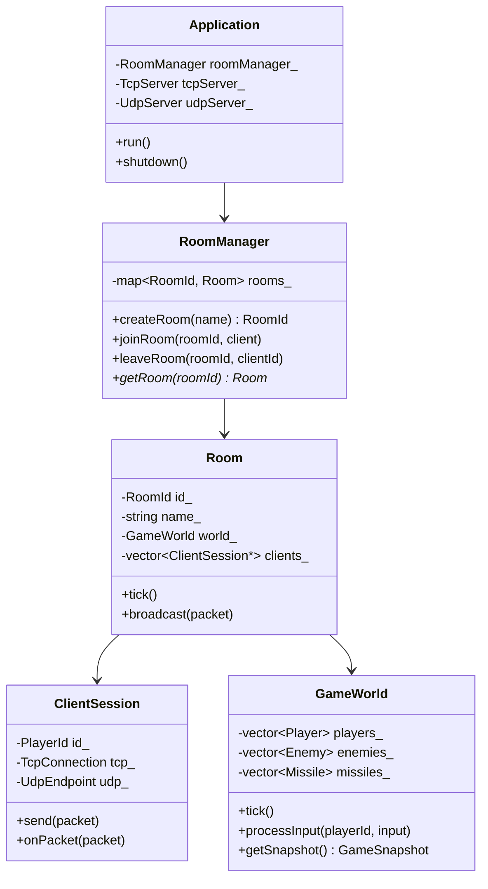
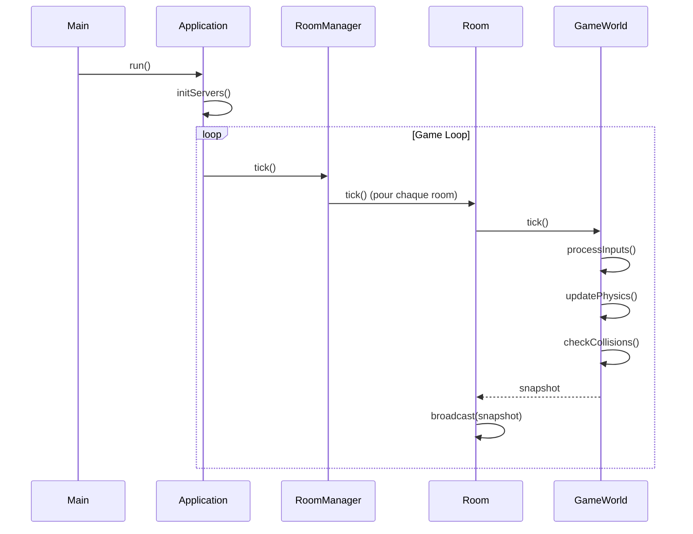

---
tags:
  - api
  - serveur
---

# API Serveur

Classes principales du serveur R-Type.

## Architecture

---

## Flux Principal

---

## Classes

  

    <h3><a href="application/">Application</a></h3>
    
Point d'entrée serveur

  

  

    <h3><a href="room-manager/">RoomManager</a></h3>
    
Gestion des salons

  

  

    <h3><a href="client-session/">ClientSession</a></h3>
    
Session client

  

  

    <h3><a href="game-world/">GameWorld</a></h3>
    
Monde de jeu

  

