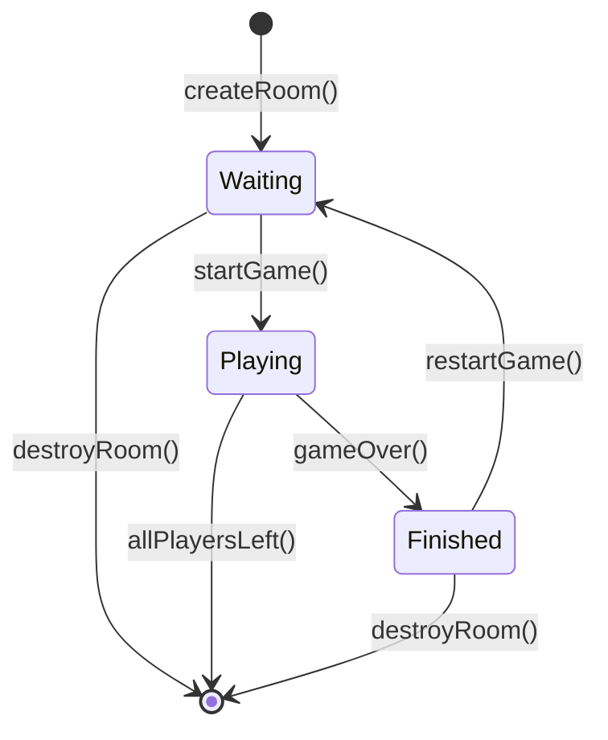
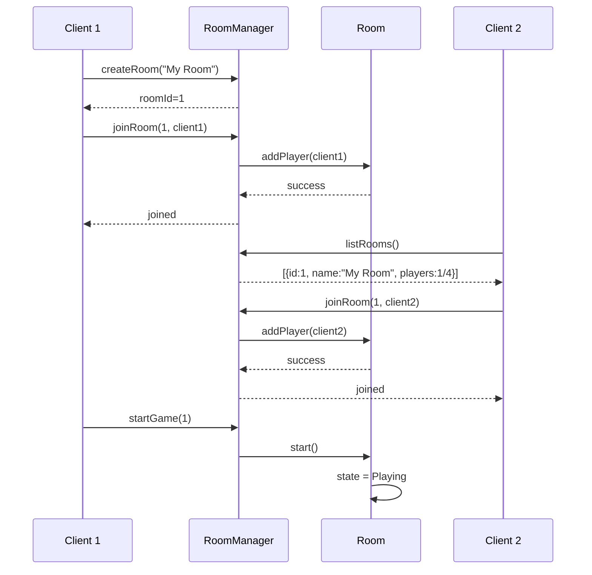

---
tags:
  - api
  - serveur
  - rooms
---

# RoomManager

Gestionnaire des salons de jeu.

## Synopsis

```cpp
#include "server/RoomManager.hpp"

RoomManager manager;
auto roomId = manager.createRoom("My Room");
manager.joinRoom(roomId, client);
```

---

## Déclaration

```cpp
namespace rtype::server {

class RoomManager {
public:
    RoomManager(int maxRooms = 10);
    ~RoomManager();

    // Room lifecycle
    RoomId createRoom(const std::string& name);
    void destroyRoom(RoomId id);

    // Player management
    bool joinRoom(RoomId id, ClientSession* client);
    void leaveRoom(RoomId id, PlayerId playerId);

    // Queries
    Room* getRoom(RoomId id);
    const Room* getRoom(RoomId id) const;
    std::vector<RoomInfo> listRooms() const;
    Room* findRoomByPlayer(PlayerId playerId);

    // Tick
    void tick();
    void broadcastSnapshots();

private:
    int maxRooms_;
    RoomId nextRoomId_ = 1;
    std::unordered_map<RoomId, std::unique_ptr<Room>> rooms_;
    mutable std::shared_mutex mutex_;
};

} // namespace rtype::server
```

---

## Types

### RoomInfo

```cpp
struct RoomInfo {
    RoomId id;
    std::string name;
    int playerCount;
    int maxPlayers;
    RoomState state;  // Waiting, Playing, Finished
};
```

### RoomState

```cpp
enum class RoomState {
    Waiting,   // En attente de joueurs
    Playing,   // Partie en cours
    Finished   // Partie terminée
};
```

---

## Méthodes

### `createRoom()`

```cpp
RoomId createRoom(const std::string& name);
```

Crée un nouveau salon.

**Paramètres:**

| Nom | Type | Description |
|-----|------|-------------|
| `name` | `string` | Nom du salon |

**Retour:** ID du salon créé

**Exceptions:**

- `std::runtime_error` si le nombre max de salons est atteint

**Exemple:**

```cpp
try {
    auto roomId = manager.createRoom("Epic Battle");
    std::cout << "Room created: " << roomId << std::endl;
} catch (const std::runtime_error& e) {
    std::cerr << "Cannot create room: " << e.what() << std::endl;
}
```

---

### `joinRoom()`

```cpp
bool joinRoom(RoomId id, ClientSession* client);
```

Ajoute un joueur à un salon.

**Paramètres:**

| Nom | Type | Description |
|-----|------|-------------|
| `id` | `RoomId` | ID du salon |
| `client` | `ClientSession*` | Session client |

**Retour:** `true` si le joueur a rejoint, `false` si le salon est plein

**Exemple:**

```cpp
if (manager.joinRoom(roomId, client)) {
    client->send(JoinRoomAckPacket{roomId, true});
} else {
    client->send(JoinRoomAckPacket{roomId, false, "Room full"});
}
```

---

### `leaveRoom()`

```cpp
void leaveRoom(RoomId id, PlayerId playerId);
```

Retire un joueur d'un salon.

**Note:** Si le salon devient vide et que la partie est terminée, il est automatiquement détruit.

---

### `listRooms()`

```cpp
std::vector<RoomInfo> listRooms() const;
```

Liste tous les salons disponibles.

**Retour:** Vecteur de `RoomInfo`

**Exemple:**

```cpp
auto rooms = manager.listRooms();
for (const auto& room : rooms) {
    std::cout << room.name << " ("
              << room.playerCount << "/"
              << room.maxPlayers << ")\n";
}
```

---

### `tick()`

```cpp
void tick();
```

Met à jour tous les salons.

**Note:** Appelé à 60 Hz par la boucle principale.

```cpp
void RoomManager::tick() {
    std::shared_lock lock(mutex_);
    for (auto& [id, room] : rooms_) {
        if (room->state() == RoomState::Playing) {
            room->tick();
        }
    }
}
```

---

## Flux de Vie d'un Salon



---

## Diagramme de Séquence



---

## Thread Safety

La classe utilise un `shared_mutex` pour permettre des lectures concurrentes.

| Méthode | Verrouillage |
|---------|--------------|
| `createRoom()` | Exclusif |
| `destroyRoom()` | Exclusif |
| `joinRoom()` | Exclusif |
| `leaveRoom()` | Exclusif |
| `getRoom()` | Partagé |
| `listRooms()` | Partagé |
| `tick()` | Partagé |
