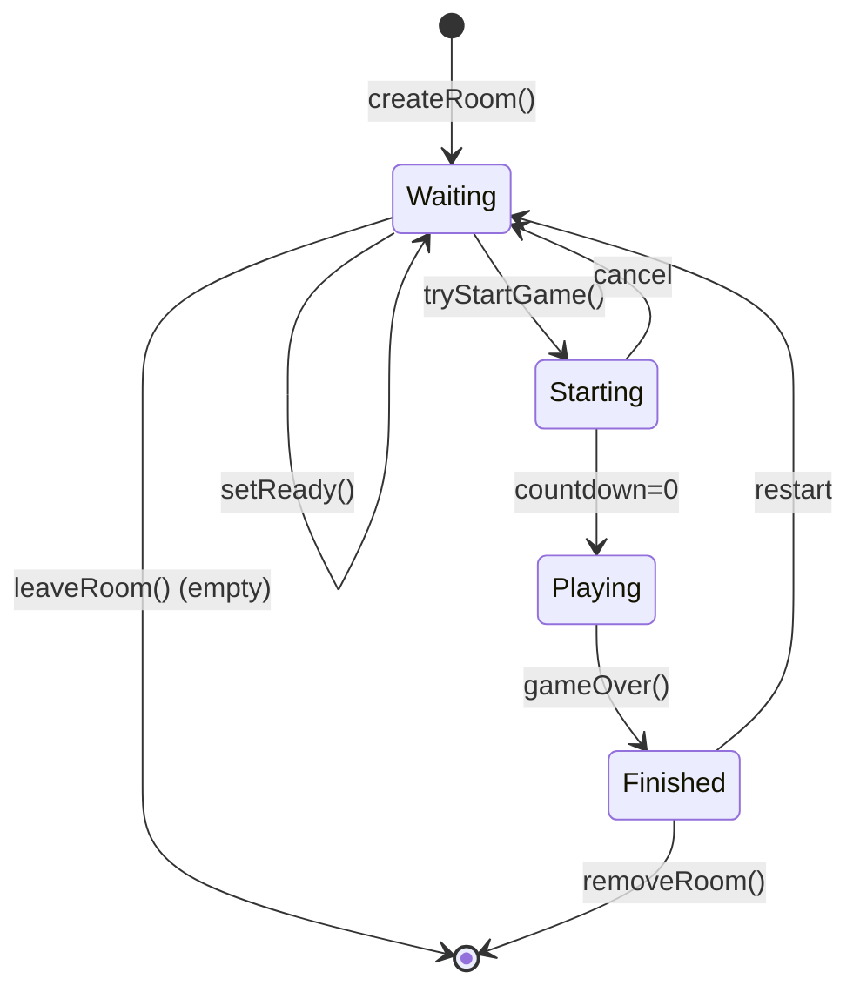
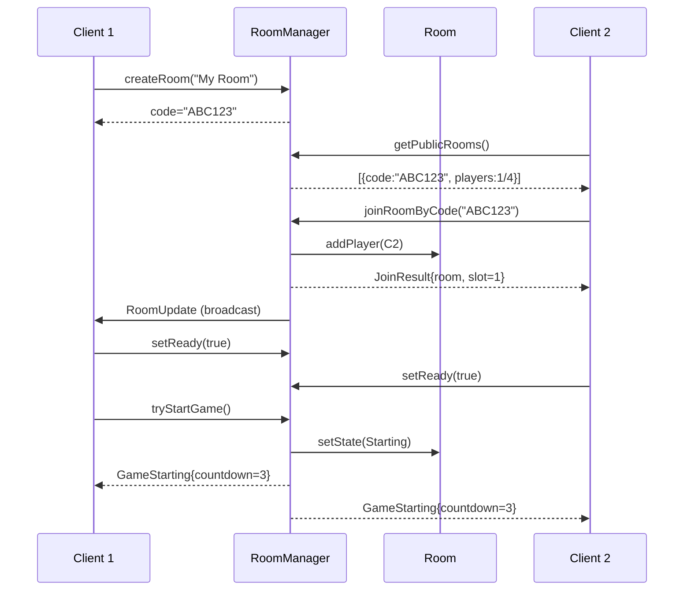

---
tags:
  - api
  - serveur
  - rooms
---

# RoomManager

Gestionnaire des salons de jeu.

## Synopsis

```cpp
#include "infrastructure/room/RoomManager.hpp"

using namespace infrastructure::room;

RoomManager manager(chatRepository);

// Create room
auto result = manager.createRoom(
    hostEmail, hostDisplayName, "My Room", 4, false, 1);

if (result) {
    std::cout << "Room code: " << result->code << std::endl;
}

// Join room
auto joinResult = manager.joinRoomByCode(code, email, displayName, shipSkin);
```

---

## Déclaration

```cpp
namespace infrastructure::room {

class RoomManager {
public:
    RoomManager() = default;
    explicit RoomManager(std::shared_ptr<IChatMessageRepository> chatRepo);
    ~RoomManager() = default;

    // ═══════════════════════════════════════════════════════════════
    // Room Creation
    // ═══════════════════════════════════════════════════════════════

    struct CreateResult {
        std::string code;
        domain::entities::Room* room;
    };

    std::optional<CreateResult> createRoom(
        const std::string& hostEmail,
        const std::string& hostDisplayName,
        const std::string& name,
        uint8_t maxPlayers,
        bool isPrivate,
        uint8_t shipSkin = 1);

    // ═══════════════════════════════════════════════════════════════
    // Room Lookup
    // ═══════════════════════════════════════════════════════════════

    Room* getRoomByCode(const std::string& code);
    Room* getRoomByPlayerEmail(const std::string& email);
    bool isPlayerInRoom(const std::string& email) const;

    // ═══════════════════════════════════════════════════════════════
    // Join/Leave Operations
    // ═══════════════════════════════════════════════════════════════

    struct JoinResult {
        domain::entities::Room* room;
        uint8_t slotId;
    };

    std::optional<JoinResult> joinRoomByCode(
        const std::string& code,
        const std::string& email,
        const std::string& displayName,
        uint8_t shipSkin = 1);

    std::string leaveRoom(const std::string& email);

    // ═══════════════════════════════════════════════════════════════
    // Ready System
    // ═══════════════════════════════════════════════════════════════

    Room* setReady(const std::string& email, bool ready);

    // ═══════════════════════════════════════════════════════════════
    // Kick System
    // ═══════════════════════════════════════════════════════════════

    struct KickResult {
        std::string roomCode;
        std::string targetEmail;
    };

    std::optional<KickResult> kickPlayer(
        const std::string& hostEmail,
        const std::string& targetEmail,
        const std::string& reason);

    // ═══════════════════════════════════════════════════════════════
    // Room Configuration (Host only)
    // ═══════════════════════════════════════════════════════════════

    Room* setRoomGameSpeed(const std::string& hostEmail, uint16_t percent);
    void updatePlayerShipSkin(const std::string& email, uint8_t shipSkin);

    // ═══════════════════════════════════════════════════════════════
    // Room Browser
    // ═══════════════════════════════════════════════════════════════

    struct BrowserEntry {
        std::string code;
        std::string name;
        uint8_t currentPlayers;
        uint8_t maxPlayers;
    };

    std::vector<BrowserEntry> getPublicRooms() const;
    std::optional<JoinResult> quickJoin(
        const std::string& email,
        const std::string& displayName,
        uint8_t shipSkin = 1);

    // ═══════════════════════════════════════════════════════════════
    // Chat System
    // ═══════════════════════════════════════════════════════════════

    bool sendChatMessage(const std::string& email, const std::string& message);
    std::vector<ChatMessage> getChatHistory(const std::string& code) const;

    // ═══════════════════════════════════════════════════════════════
    // Game Start
    // ═══════════════════════════════════════════════════════════════

    bool tryStartGame(const std::string& hostEmail);
    Room* getStartingRoom(const std::string& email);

    // ═══════════════════════════════════════════════════════════════
    // Cleanup
    // ═══════════════════════════════════════════════════════════════

    void removeRoom(const std::string& code);
    void cleanupEmptyRooms();
    size_t getRoomCount() const;
    std::vector<Room*> getAllRooms();

private:
    mutable std::mutex _mutex;
    std::shared_ptr<IChatMessageRepository> _chatMessageRepository;
    std::unordered_map<std::string, std::unique_ptr<Room>> _roomsByCode;
    std::unordered_map<std::string, std::string> _playerToRoom;

    std::string generateRoomCode();
};

} // namespace infrastructure::room
```

---

## Room Codes

Les rooms sont identifiées par des **codes alphanumériques** (pas des IDs numériques).

```cpp
// Format: 6 caractères alphanumériques
static constexpr size_t ROOM_CODE_LEN = 6;

// Exemple: "ABC123", "XYZ789"
std::string code = manager.createRoom(...)->code;
```

---

## Méthodes

### `createRoom()`

```cpp
std::optional<CreateResult> createRoom(
    const std::string& hostEmail,
    const std::string& hostDisplayName,
    const std::string& name,
    uint8_t maxPlayers,
    bool isPrivate,
    uint8_t shipSkin = 1);
```

Crée un nouveau salon et ajoute l'hôte.

**Paramètres:**

| Nom | Type | Description |
|-----|------|-------------|
| `hostEmail` | `string` | Email de l'hôte |
| `hostDisplayName` | `string` | Nom affiché |
| `name` | `string` | Nom du salon |
| `maxPlayers` | `uint8_t` | Max joueurs (2-6) |
| `isPrivate` | `bool` | Visible dans le browser |
| `shipSkin` | `uint8_t` | Skin du vaisseau (1-6) |

**Retour:** `CreateResult` avec code et pointeur room, ou `nullopt`

---

### `joinRoomByCode()`

```cpp
std::optional<JoinResult> joinRoomByCode(
    const std::string& code,
    const std::string& email,
    const std::string& displayName,
    uint8_t shipSkin = 1);
```

Rejoint un salon par son code.

**Retour:** `JoinResult` avec room et slotId, ou `nullopt` si:
- Room inexistante
- Room pleine
- Joueur déjà dans une room

---

### `setReady()`

```cpp
Room* setReady(const std::string& email, bool ready);
```

Marque un joueur comme prêt/pas prêt.

**Retour:** Pointeur vers la room (pour broadcast), ou `nullptr`

---

### `tryStartGame()`

```cpp
bool tryStartGame(const std::string& hostEmail);
```

Tente de lancer la partie (host only).

**Conditions:**
- L'email doit être l'hôte
- Tous les joueurs sont prêts
- Au moins 2 joueurs

---

## Callbacks

Le RoomManager utilise des callbacks pour notifier les sessions TCP:

```cpp
using RoomUpdateCallback = std::function<void(const RoomUpdate&)>;
using GameStartingCallback = std::function<void(const GameStarting&)>;
using PlayerKickedCallback = std::function<void(const PlayerKickedNotification&)>;
using ChatMessageCallback = std::function<void(const ChatMessagePayload&)>;

void registerSessionCallbacks(
    const std::string& email,
    RoomUpdateCallback onRoomUpdate,
    GameStartingCallback onGameStarting);

void broadcastRoomUpdate(Room* room);
void broadcastGameStarting(Room* room, uint8_t countdown);
```

---

## Flux de Vie d'un Salon



---

## Diagramme de Séquence



---

## Thread Safety

La classe utilise un `mutex` pour la synchronisation.

| Méthode | Thread-Safe |
|---------|-------------|
| `createRoom()` | Oui |
| `joinRoomByCode()` | Oui |
| `leaveRoom()` | Oui |
| `setReady()` | Oui |
| `getRoomByCode()` | Oui |
| `getPublicRooms()` | Oui |
