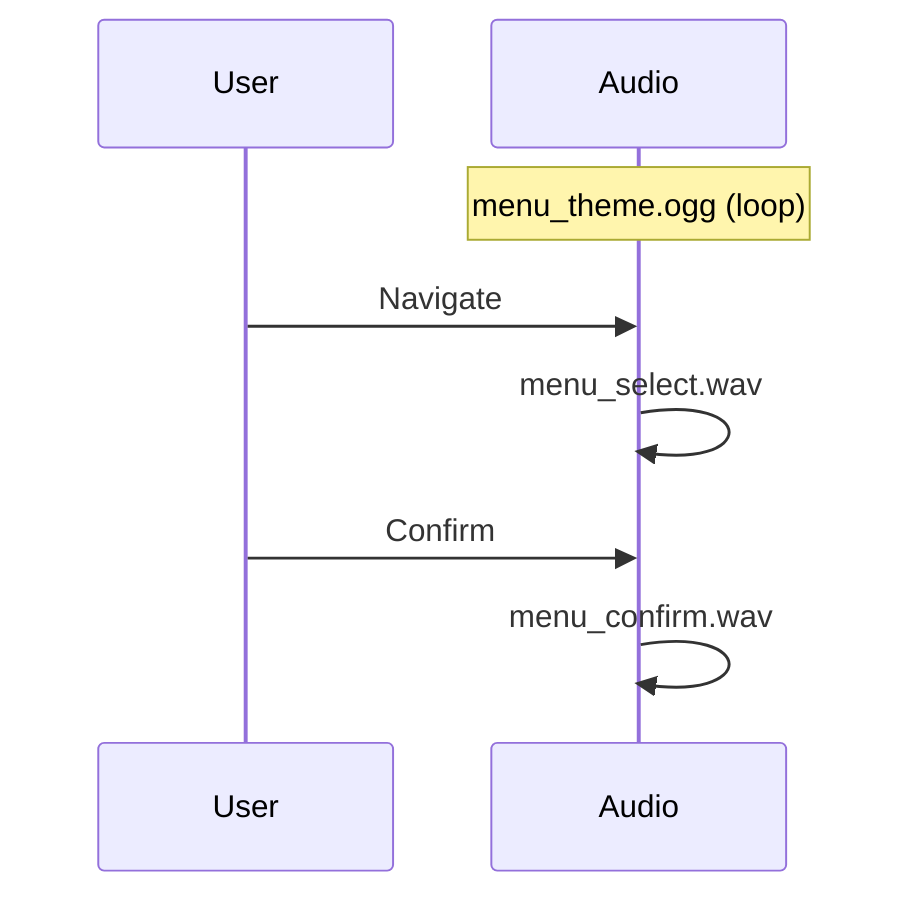
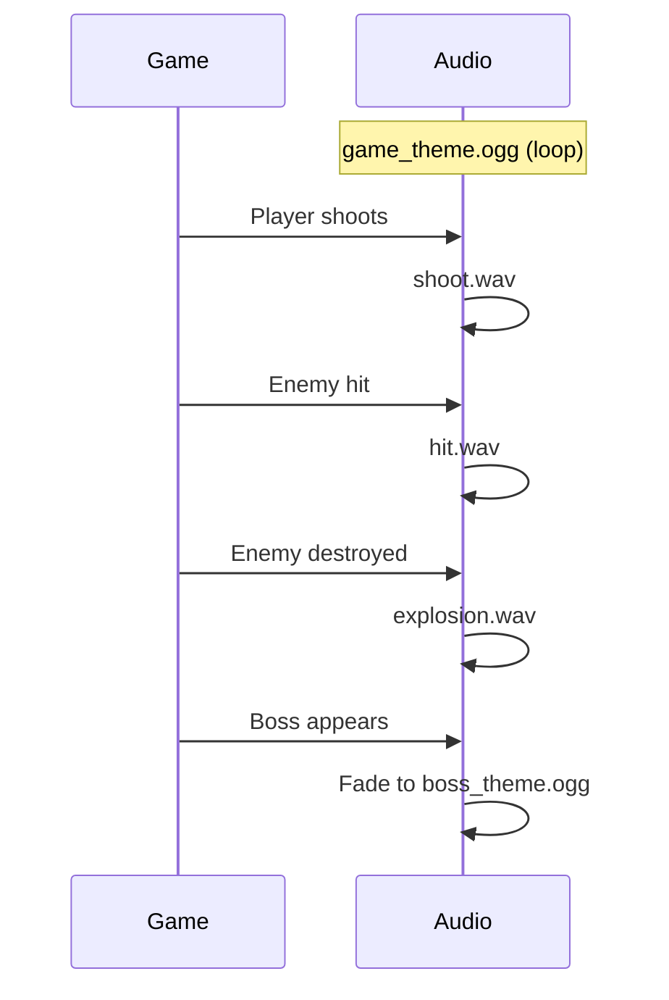

---
tags:
  - assets
  - audio
  - sons
---

# Sons et Musiques

Ressources audio du jeu R-Type.

## Structure

```
sounds/
├── sfx/
│   ├── shoot.wav          # Tir joueur
│   ├── explosion.wav      # Explosion
│   ├── hit.wav            # Impact
│   ├── powerup.wav        # Bonus
│   ├── menu_select.wav    # Sélection menu
│   ├── menu_confirm.wav   # Confirmation
│   └── player_death.wav   # Mort joueur
│
└── music/
    ├── menu_theme.ogg     # Musique menu
    ├── game_theme.ogg     # Musique jeu
    ├── boss_theme.ogg     # Musique boss
    ├── victory.ogg        # Victoire
    └── gameover.ogg       # Game over
```

---

## Effets Sonores (SFX)

### Liste Complète

| Fichier | Durée | Format | Description |
|---------|-------|--------|-------------|
| `shoot.wav` | 0.1s | WAV 44.1kHz | Tir du joueur |
| `explosion.wav` | 0.5s | WAV 44.1kHz | Explosion ennemi/joueur |
| `hit.wav` | 0.15s | WAV 44.1kHz | Impact missile |
| `powerup.wav` | 0.3s | WAV 44.1kHz | Ramassage bonus |
| `menu_select.wav` | 0.1s | WAV 44.1kHz | Navigation menu |
| `menu_confirm.wav` | 0.2s | WAV 44.1kHz | Validation menu |
| `player_death.wav` | 0.8s | WAV 44.1kHz | Mort du joueur |

### Spécifications Techniques

```
Format:     WAV PCM
Canaux:     Mono (1 channel)
Fréquence:  44100 Hz
Bits:       16-bit
Volume:     Normalisé à -3dB
```

---

## Musiques

### Liste Complète

| Fichier | Durée | Format | Loop | Description |
|---------|-------|--------|------|-------------|
| `menu_theme.ogg` | 2:30 | OGG | Oui | Thème principal menu |
| `game_theme.ogg` | 4:00 | OGG | Oui | Musique de jeu |
| `boss_theme.ogg` | 3:00 | OGG | Oui | Combat de boss |
| `victory.ogg` | 0:30 | OGG | Non | Jingle victoire |
| `gameover.ogg` | 0:15 | OGG | Non | Jingle défaite |

### Spécifications Techniques

```
Format:     OGG Vorbis
Canaux:     Stéréo (2 channels)
Fréquence:  48000 Hz
Bitrate:    128-192 kbps VBR
```

---

## Utilisation dans le Code

### Chargement

```cpp
class SoundManager {
    std::unordered_map<std::string, Sound> sounds_;
    std::unordered_map<std::string, Music> musics_;

public:
    void loadAll() {
        // SFX
        sounds_["shoot"] = loadSound("assets/sounds/sfx/shoot.wav");
        sounds_["explosion"] = loadSound("assets/sounds/sfx/explosion.wav");
        sounds_["hit"] = loadSound("assets/sounds/sfx/hit.wav");
        sounds_["powerup"] = loadSound("assets/sounds/sfx/powerup.wav");

        // Music
        musics_["menu"] = loadMusic("assets/sounds/music/menu_theme.ogg");
        musics_["game"] = loadMusic("assets/sounds/music/game_theme.ogg");
        musics_["boss"] = loadMusic("assets/sounds/music/boss_theme.ogg");
    }
};
```

### Lecture

```cpp
// Effet sonore (one-shot)
void Player::shoot() {
    audio_.playSound("shoot");
    // ...
}

// Musique (loop)
void GameScene::onEnter() {
    audio_.playMusic("game", true);  // loop = true
}

// Transition de musique
void GameScene::onBossSpawn() {
    audio_.fadeOut(1.0f);  // 1 seconde
    audio_.playMusic("boss", true);
    audio_.fadeIn(1.0f);
}
```

---

## Mixage Audio

### Canaux

| Canal | Volume Défaut | Description |
|-------|---------------|-------------|
| Master | 100% | Volume principal |
| Music | 70% | Musique de fond |
| SFX | 100% | Effets sonores |
| Voice | 100% | Chat vocal |

### Configuration

```cpp
struct AudioConfig {
    float masterVolume = 1.0f;
    float musicVolume = 0.7f;
    float sfxVolume = 1.0f;
    float voiceVolume = 1.0f;
};

// Application du volume
float finalVolume = config.masterVolume * config.sfxVolume * soundVolume;
```

---

## Timeline Sonore

### Menu



### Gameplay



---

## Guidelines de Création

### SFX

1. **Durée courte** - 0.1s à 1s max
2. **Attaque rapide** - Le son doit être immédiat
3. **Pas de silence au début** - Trim les fichiers
4. **Normalisation** - -3dB pour headroom
5. **Format WAV** - Faible latence

### Musique

1. **Loop seamless** - Point de boucle propre
2. **Intro optionnelle** - Si non-loop, courte
3. **Tempo adapté** - Menu calme, action rapide
4. **Compression** - OGG pour taille réduite

---

## Outils Recommandés

| Outil | Usage |
|-------|-------|
| Audacity | Édition, normalisation |
| BFXR | Génération SFX 8-bit |
| LMMS | Composition musique |
| ffmpeg | Conversion formats |

### Commandes Utiles

```bash
# Convertir en WAV mono 44.1kHz
ffmpeg -i input.mp3 -ac 1 -ar 44100 output.wav

# Convertir en OGG
ffmpeg -i input.wav -c:a libvorbis -q:a 5 output.ogg

# Normaliser audio
ffmpeg -i input.wav -af "loudnorm=I=-16" output.wav
```
