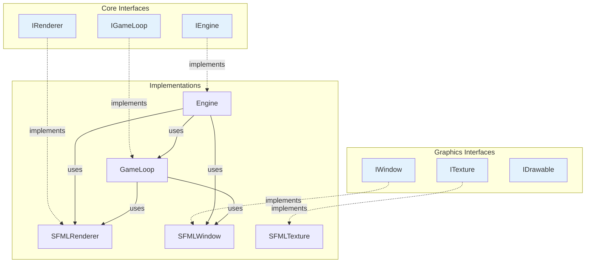

# Référence API - Interfaces

## Vue d'Ensemble

Cette page documente toutes les **interfaces** (classes abstraites) du client R-Type. Les interfaces définissent les contrats que les implémentations doivent respecter.

---

## IEngine

**Description** : Interface pour le moteur de jeu principal.

**Fichier** : `/home/simia/epitech/second_year/projects/rtype/src/client/include/core/IEngine.hpp`

**Namespace** : `core`

### Définition

```cpp
namespace core {
    class IEngine {
        public:
            virtual ~IEngine() = default;

            // Initialise tous les sous-systèmes (fenêtre, renderer, assets)
            virtual void initialize() = 0;

            // Lance la boucle de jeu (bloquant)
            virtual void run() = 0;
    };
}
```

### Méthodes

| Méthode | Retour | Description |
|---------|--------|-------------|
| `initialize()` | `void` | Initialise window, renderer, gameloop |
| `run()` | `void` | Lance la GameLoop (bloquant) |

### Implémentations

- ✅ **Engine** : Implementation principale en `src/client/core/Engine.cpp`

### Exemple d'Utilisation

```cpp
#include "core/IEngine.hpp"
#include "core/Engine.hpp"

std::unique_ptr<core::IEngine> engine = std::make_unique<core::Engine>();
engine->initialize();
engine->run();  // Bloque jusqu'à fermeture fenêtre
```

---

## IGameLoop

**Description** : Interface pour la boucle de jeu.

**Fichier** : `/home/simia/epitech/second_year/projects/rtype/src/client/include/core/IGameLoop.hpp`

**Namespace** : `core`

### Définition

```cpp
namespace core {
    class IGameLoop {
        public:
            virtual ~IGameLoop() = default;

            // Lance la boucle (bloquant)
            virtual void run() = 0;

            // Efface le buffer
            virtual void clear() = 0;

            // Affiche le buffer
            virtual void display() = 0;
    };
}
```

### Méthodes

| Méthode | Retour | Description |
|---------|--------|-------------|
| `run()` | `void` | Boucle infinie: `while(window.isOpen()) { clear(); update(); display(); }` |
| `clear()` | `void` | Appelle `window->clear()` |
| `display()` | `void` | Appelle `window->display()` (swap buffers) |

### Implémentations

- ✅ **GameLoop** : Implementation en `src/client/core/GameLoop.cpp`

### Exemple d'Utilisation

```cpp
auto window = std::make_unique<SFMLWindow>();
auto renderer = std::make_unique<SFMLRenderer>(window.get());

std::unique_ptr<core::IGameLoop> gameLoop =
    std::make_unique<core::GameLoop>(window.get(), renderer.get());

gameLoop->run();  // Bloque
```

---

## IRenderer

**Description** : Interface pour le système de rendu.

**Fichier** : `/home/simia/epitech/second_year/projects/rtype/src/client/include/core/IRenderer.hpp`

**Namespace** : `core`

### Définition

```cpp
namespace core {
    class IRenderer {
        public:
            virtual ~IRenderer() = default;

            // Charge les assets graphiques
            virtual void initialize() = 0;

            // Rend une frame (appelé chaque frame)
            virtual void update() = 0;
    };
}
```

### Méthodes

| Méthode | Retour | Description |
|---------|--------|-------------|
| `initialize()` | `void` | Charge textures, crée sprites initiaux |
| `update()` | `void` | Dessine tous les sprites via AssetManager |

### Implémentations

- ✅ **SFMLRenderer** : Implementation SFML en `src/client/implementations/sfml/SFMLRenderer.cpp`

### Exemple d'Utilisation

```cpp
auto window = std::make_unique<SFMLWindow>();
std::unique_ptr<core::IRenderer> renderer =
    std::make_unique<SFMLRenderer>(window.get());

renderer->initialize();  // Charger assets

// Dans la game loop:
while (window->isOpen()) {
    window->clear();
    renderer->update();  // Dessiner
    window->display();
}
```

---

## IWindow

**Description** : Interface pour la fenêtre de rendu.

**Fichier** : `/home/simia/epitech/second_year/projects/rtype/src/client/include/graphics/IWindow.hpp`

**Namespace** : `graphics`

### Définition

```cpp
namespace graphics {
    class IWindow {
        public:
            virtual ~IWindow() = default;

            // Crée et configure la fenêtre
            virtual bool initialize(Vec2u winSize, const std::string& name) = 0;

            // Vérifie si la fenêtre est ouverte
            virtual bool isOpen() = 0;

            // Dessine un sprite
            virtual void draw(const sf::Sprite& sprite) = 0;

            // Efface le buffer (fond noir)
            virtual void clear() = 0;

            // Swap les buffers (affiche)
            virtual void display() = 0;
    };
}
```

### Méthodes

| Méthode | Paramètres | Retour | Description |
|---------|------------|--------|-------------|
| `initialize()` | `Vec2u size, string name` | `bool` | Crée fenêtre. False si déjà ouverte |
| `isOpen()` | - | `bool` | True si fenêtre active |
| `draw()` | `const sf::Sprite&` | `void` | Ajoute sprite au back buffer |
| `clear()` | - | `void` | Remplit back buffer (noir) |
| `display()` | - | `void` | Swap back/front buffers |

### Implémentations

- ✅ **SFMLWindow** : Wrapper autour de `sf::RenderWindow`

### Exemple d'Utilisation

```cpp
std::unique_ptr<graphics::IWindow> window =
    std::make_unique<SFMLWindow>();

if (!window->initialize({1920, 1080}, "R-Type")) {
    std::cerr << "Failed to create window" << std::endl;
}

while (window->isOpen()) {
    window->clear();
    // ... dessiner sprites ...
    window->display();
}
```

---

## ITexture

**Description** : Interface pour les textures (images).

**Fichier** : `/home/simia/epitech/second_year/projects/rtype/src/client/include/graphics/ITexture.hpp`

**Namespace** : `graphics`

### Définition

```cpp
namespace graphics {
    class ITexture {
        public:
            virtual ~ITexture() = default;

            // Retourne la taille de la texture
            virtual Vec2u getSize() const = 0;

            // Charge la texture depuis un fichier
            virtual void loadFile() = 0;
    };
}
```

### Méthodes

| Méthode | Retour | Description |
|---------|--------|-------------|
| `getSize()` | `Vec2u` | Dimensions (largeur, hauteur) en pixels |
| `loadFile()` | `void` | Charge depuis disque |

### Implémentations

- ⚠️ **SFMLTexture** : Implementation partielle (non utilisée actuellement)

!!! warning "Non Utilisé"
    `ITexture` n'est **pas utilisé** dans le code actuel. `AssetManager` gère directement `sf::Texture`.

---

## IDrawable

**Description** : Interface pour les objets dessinables.

**Fichier** : `/home/simia/epitech/second_year/projects/rtype/src/client/include/graphics/IDrawable.hpp`

**Namespace** : `graphics`

### Définition

```cpp
namespace graphics {
    class IDrawable {
        public:
            virtual ~IDrawable() = default;

            // Dessine l'objet sur une fenêtre SFML
            virtual void draw(sf::RenderWindow& window) = 0;
    };
}
```

### Méthodes

| Méthode | Paramètres | Retour | Description |
|---------|------------|--------|-------------|
| `draw()` | `sf::RenderWindow&` | `void` | Dessine l'objet |

!!! warning "Couplage SFML"
    Cette interface dépend directement de `sf::RenderWindow`, ce qui couple le code à SFML. Amélioration future : utiliser `IWindow` à la place.

### Implémentations

- ❌ Aucune implémentation actuelle

---

## Hiérarchie Complète



---

## Pattern Utilisé : Dependency Inversion

Toutes ces interfaces suivent le principe **SOLID** de **Dependency Inversion** :

> Les modules de haut niveau ne doivent pas dépendre des modules de bas niveau.
> Les deux doivent dépendre d'abstractions.

**Exemple** :

```cpp
// ❌ Mauvais : Couplage fort
class Engine {
    SFMLWindow window;  // Dépend de l'implémentation SFML
};

// ✅ Bon : Couplage faible via interface
class Engine {
    graphics::IWindow* window;  // Dépend de l'abstraction
};
```

**Avantages** :

1. **Testabilité** : Mock des interfaces pour tests
2. **Flexibilité** : Changer d'implémentation sans modifier le code client
3. **Modularité** : Séparation claire des responsabilités

---

## Conventions de Nommage

| Convention | Exemple | Usage |
|------------|---------|-------|
| Préfixe `I` | `IWindow`, `IRenderer` | Toutes les interfaces |
| PascalCase | `IGameLoop`, `IEngine` | Noms de classes |
| camelCase | `initialize()`, `isOpen()` | Noms de méthodes |
| Destructeur virtuel | `virtual ~IWindow() = default` | Toutes les interfaces |

---

## Bonnes Pratiques

### ✅ DO

```cpp
// 1. Toujours un destructeur virtuel
class IMyInterface {
    virtual ~IMyInterface() = default;  // ✅
};

// 2. Programmez vers les interfaces
void processWindow(graphics::IWindow* window) {  // ✅
    window->clear();
}

// 3. Utilisez des pointeurs ou références
class Engine {
    graphics::IWindow* _window;  // ✅ Pointeur vers interface
};
```

### ❌ DON'T

```cpp
// 1. Pas de destructeur virtuel
class IMyInterface {
    // ❌ Fuite mémoire potentielle
};

// 2. Ne programmez pas vers les implémentations
void processWindow(SFMLWindow* window) {  // ❌
    window->clear();
}

// 3. N'instanciez pas les interfaces
IWindow window;  // ❌ Impossible, classe abstraite
```

---

## Résumé

Les **6 interfaces** du client R-Type :

1. **IEngine** : Moteur principal
2. **IGameLoop** : Boucle de jeu
3. **IRenderer** : Système de rendu
4. **IWindow** : Fenêtre d'affichage
5. **ITexture** : Texture/Image (non utilisé)
6. **IDrawable** : Objet dessinable (non utilisé)

**Implémentations actuelles** :

- ✅ 4 interfaces implémentées et utilisées
- ⚠️ 2 interfaces définies mais non utilisées

**Pattern** : Dependency Inversion (SOLID)

!!! tip "Voir Aussi"
    - [Engine Implementation](../core/engine.md)
    - [SFMLRenderer Implementation](../core/renderer.md)
    - [Architecture Overview](../architecture/overview.md)
