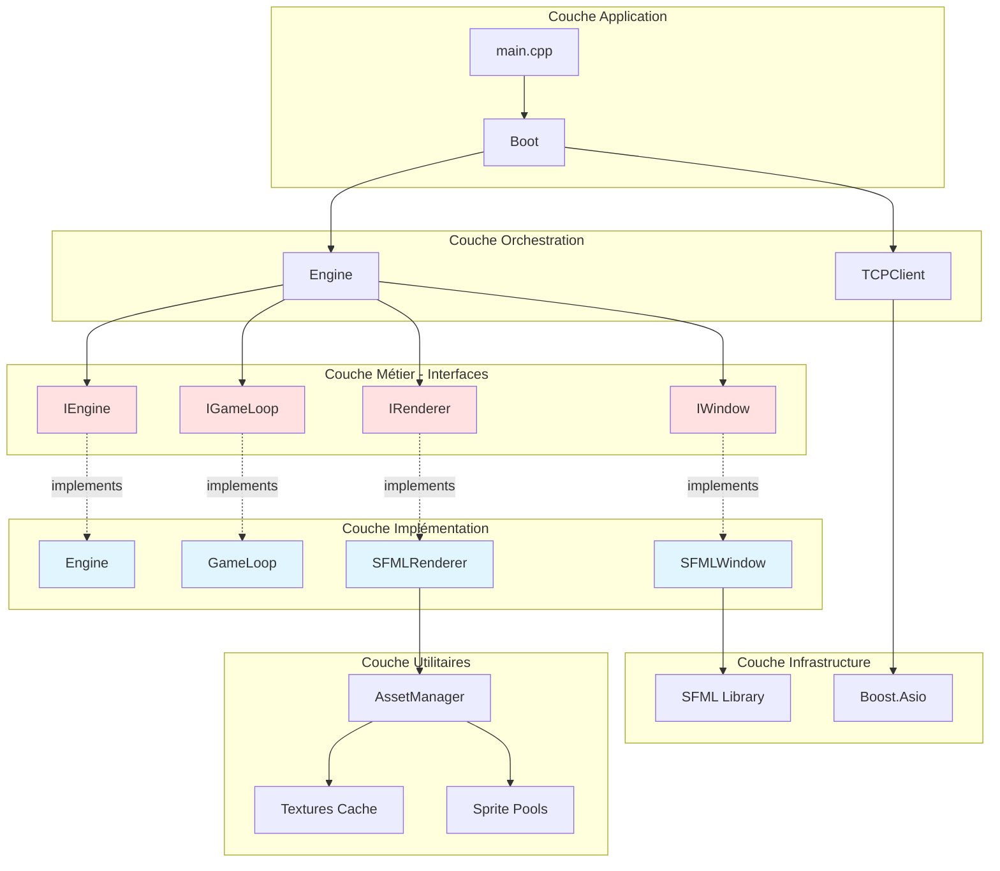
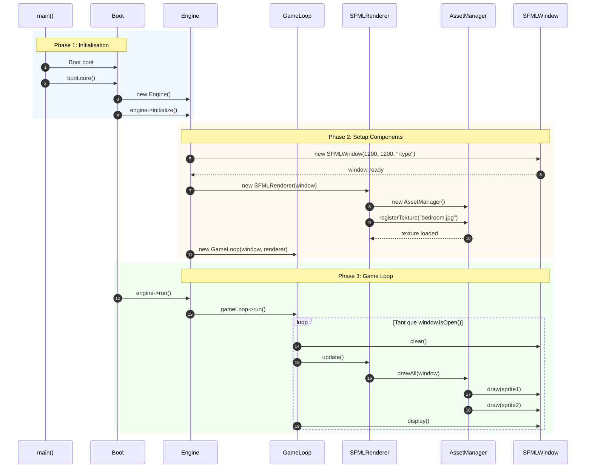
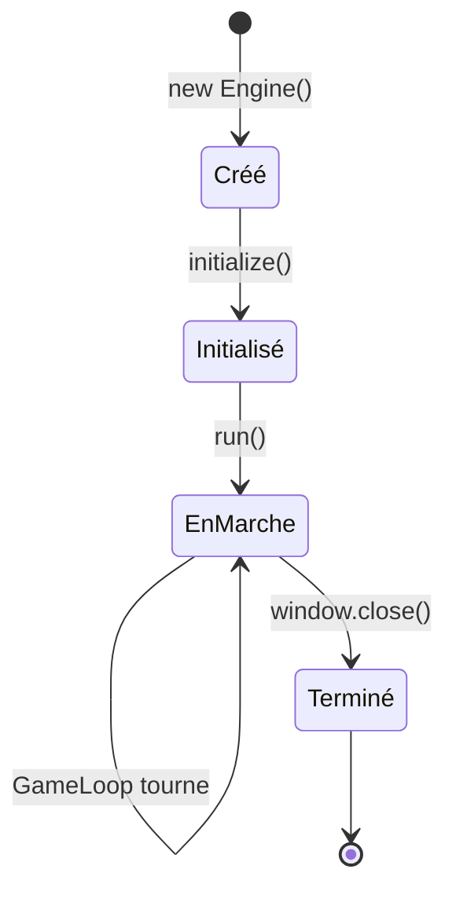
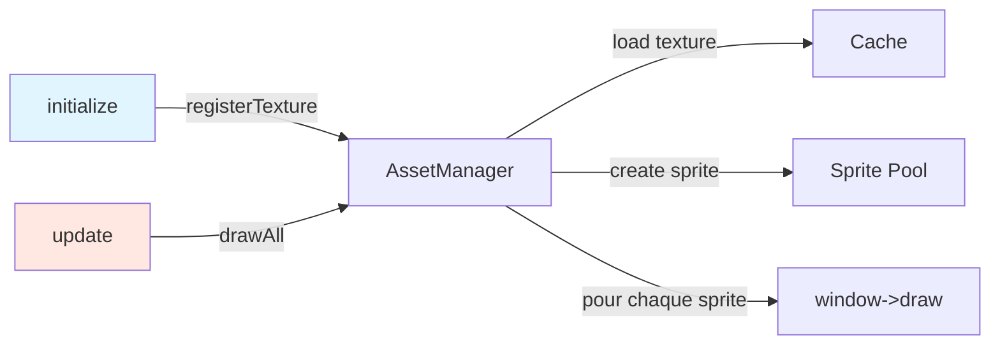
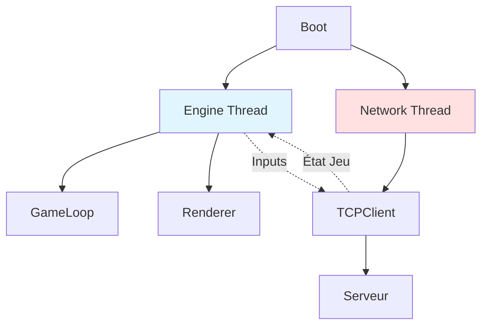
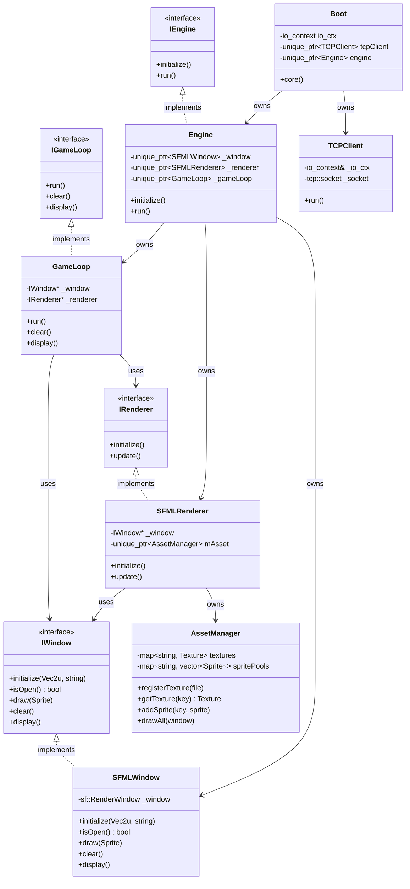

# Architecture Globale du Client

## 📐 Vue d'Ensemble

L'architecture du client R-Type suit les principes SOLID avec une séparation claire entre les interfaces et les implémentations. Cette approche permet une grande flexibilité, facilitant les tests et les changements de technologies.

## 🏛️ Architecture en Couches



## 🎯 Principes Architecturaux

### 1. Dependency Inversion Principle (DIP)

Les modules de haut niveau ne dépendent pas des modules de bas niveau. Les deux dépendent d'abstractions.

**Exemple concret** :

```cpp
// ❌ MAUVAIS : Engine dépend directement de SFML
class Engine {
    sf::RenderWindow _window;  // Couplage fort !
    sf::Texture _texture;      // Difficile à tester !
};

// ✅ BON : Engine dépend d'interfaces
class Engine {
    std::unique_ptr<IWindow> _window;      // Abstraction
    std::unique_ptr<IRenderer> _renderer;  // Flexible
};
```

**Avantages** :

- ✅ Tests unitaires faciles (mocks)
- ✅ Changement de bibliothèque graphique transparent
- ✅ Plusieurs implémentations possibles (SFML, SDL, OpenGL)

### 2. Interface Segregation Principle (ISP)

Les clients ne doivent pas dépendre d'interfaces qu'ils n'utilisent pas.

**Notre approche** :

```cpp
// Interfaces spécialisées plutôt qu'une grosse interface
class IWindow {
    virtual void draw(const sf::Sprite&) = 0;
    virtual void clear() = 0;
    virtual void display() = 0;
};

class IRenderer {
    virtual void initialize() = 0;
    virtual void update() = 0;
};

class IEngine {
    virtual void initialize() = 0;
    virtual void run() = 0;
};
```

### 3. Single Responsibility Principle (SRP)

Chaque classe a une seule raison de changer.

| Classe | Responsabilité Unique |
|--------|----------------------|
| `Boot` | Orchestration et initialisation |
| `Engine` | Gestion du cycle de vie du moteur |
| `GameLoop` | Boucle de rendu (clear/update/display) |
| `SFMLRenderer` | Rendu graphique avec SFML |
| `AssetManager` | Cache et gestion des ressources |
| `TCPClient` | Communication réseau |

### 4. RAII et Ownership Clair

Gestion automatique de la mémoire avec smart pointers :

```cpp
class Engine {
    // Engine OWNS ces ressources
    std::unique_ptr<SFMLWindow> _window;
    std::unique_ptr<SFMLRenderer> _renderer;
    std::unique_ptr<GameLoop> _gameLoop;

    // Destructeur automatique, pas de fuites !
    ~Engine() = default;
};
```

## 🔄 Flux de Données



## 🏗️ Composants Principaux

### Boot - Orchestrateur

**Rôle** : Point d'entrée et orchestration des systèmes.

```cpp
class Boot {
public:
    Boot();
    void core();  // Lance le jeu

private:
    boost::asio::io_context io_ctx;
    std::unique_ptr<TCPClient> tcpClient;  // Réseau (futur)
    std::unique_ptr<core::Engine> engine;  // Moteur graphique
};
```

**Responsabilités** :

- ✅ Initialiser `io_context` pour Boost.Asio
- ✅ Créer le `TCPClient` (actuellement désactivé)
- ✅ Créer et lancer l'`Engine`
- ⏳ Future : Coordonner thread réseau + thread graphique

### Engine - Cœur du Moteur

**Rôle** : Gestionnaire principal du cycle de vie du jeu.

```cpp
class Engine : public IEngine {
public:
    void initialize() override;
    void run() override;

private:
    std::unique_ptr<SFMLWindow> _window;
    std::unique_ptr<SFMLRenderer> _renderer;
    std::unique_ptr<GameLoop> _gameLoop;
};
```

**Cycle de vie** :



**Responsabilités** :

1. **initialize()** :
   - Créer la fenêtre SFML (1200x1200)
   - Créer le renderer avec la fenêtre
   - Créer la GameLoop avec window et renderer

2. **run()** :
   - Déléguer à `gameLoop->run()`
   - Bloquer jusqu'à fermeture fenêtre

### GameLoop - Boucle de Rendu

**Rôle** : Orchestrer le cycle clear → update → display.

```cpp
class GameLoop : public IGameLoop {
public:
    GameLoop(IWindow* window, IRenderer* renderer);

    void run() override;
    void clear() override;
    void display() override;

private:
    IWindow* _window;      // Pas d'ownership
    IRenderer* _renderer;  // Pas d'ownership
};
```

**Pattern** :

```cpp
void GameLoop::run() {
    while (_window->isOpen()) {
        clear();           // Nettoie la frame
        _renderer->update();  // Rendu des objets
        display();         // Affiche à l'écran
    }
}
```

!!! warning "Ownership"
    `GameLoop` utilise des **pointeurs nus** car elle ne possède pas les objets. L'ownership appartient à `Engine`.

### SFMLRenderer - Moteur de Rendu

**Rôle** : Gérer le rendu graphique et les assets.

```cpp
class SFMLRenderer : public IRenderer {
public:
    SFMLRenderer(IWindow* window);

    void initialize() override;
    void update() override;

private:
    IWindow* _window;
    std::unique_ptr<AssetManager> mAsset;
};
```

**Workflow** :



### AssetManager - Gestionnaire de Ressources

**Rôle** : Cache intelligent de textures et sprites.

```cpp
class AssetManager {
public:
    void registerTexture(const std::string& file);
    sf::Texture& getTexture(const std::string& key);
    void addSprite(const std::string& key, const sf::Sprite& sprite);
    void drawAll(IWindow* window);

private:
    std::unordered_map<std::string, sf::Texture> textures;
    std::unordered_map<std::string, std::vector<sf::Sprite>> spritePools;
};
```

**Optimisations** :

- **Cache de textures** : Évite les rechargements
- **Sprite pools** : Regroupe sprites par texture
- **Détection doublons** : `if (textures.count(file)) return;`

## 🌐 Système Réseau (TCPClient)

**Rôle** : Communication asynchrone avec le serveur.

```cpp
class TCPClient {
public:
    TCPClient(boost::asio::io_context& io_ctx);
    void run();  // À implémenter

private:
    boost::asio::io_context& _io_ctx;
    tcp::socket _socket;
};
```

**État actuel** :

- ✅ Connexion asynchrone à `127.0.0.1:4125`
- ✅ Gestion erreurs de connexion
- ⏳ Lecture/écriture à implémenter
- ⏳ Intégration avec Engine (multi-thread)

**Future architecture** :



## 📊 Diagramme de Classes Complet



## 🎨 Patterns de Conception Utilisés

### Adapter Pattern

Encapsuler SFML derrière nos interfaces.

```cpp
// Notre interface
class IWindow { /*...*/ };

// Adapter SFML
class SFMLWindow : public IWindow {
    sf::RenderWindow _window;  // Wrapped

    void draw(const sf::Sprite& s) override {
        _window.draw(s);  // Délégation
    }
};
```

### Dependency Injection

Injection via constructeurs :

```cpp
// GameLoop ne crée pas ses dépendances
GameLoop::GameLoop(IWindow* window, IRenderer* renderer)
    : _window(window), _renderer(renderer) {}

// C'est Engine qui injecte
_gameLoop = std::make_unique<GameLoop>(_window.get(), _renderer.get());
```

### Strategy Pattern

AssetManager peut changer de stratégie de cache :

```cpp
// Stratégie actuelle : std::unordered_map
std::unordered_map<std::string, sf::Texture> textures;

// Facile à remplacer par LRU cache, etc.
```

## 🚀 Points d'Extension Futurs

| Extension | Difficulté | Impact |
|-----------|------------|--------|
| **Intégration ECS** | Haute | Architecture complète |
| **Gestion Événements** | Moyenne | Inputs joueur |
| **Multi-threading réseau** | Haute | Performance |
| **Delta Time** | Basse | Gameplay fluide |
| **Audio System** | Moyenne | Ambiance sonore |
| **UI/HUD** | Moyenne | Interface utilisateur |

## 📚 Ressources

- [Patterns de Conception](design-patterns.md)
- [Système Graphique](../graphics/overview.md)
- [Moteur de Jeu](../core/engine.md)
- [Système Réseau](../network/tcp-client.md)

---

!!! success "Architecture Solide"
    Cette architecture modulaire et découplée permet d'ajouter facilement de nouvelles fonctionnalités sans impacter le code existant !
