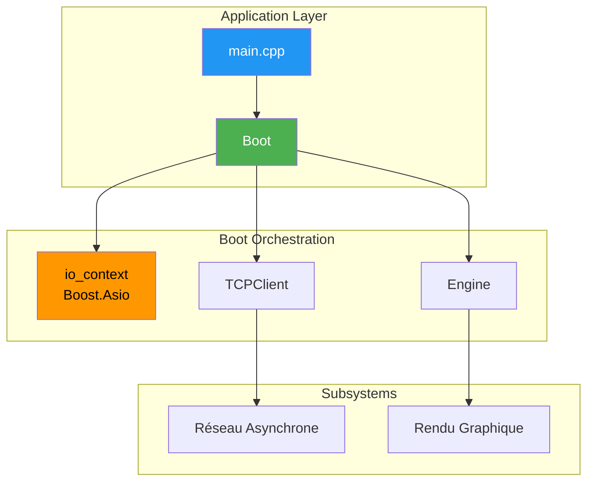
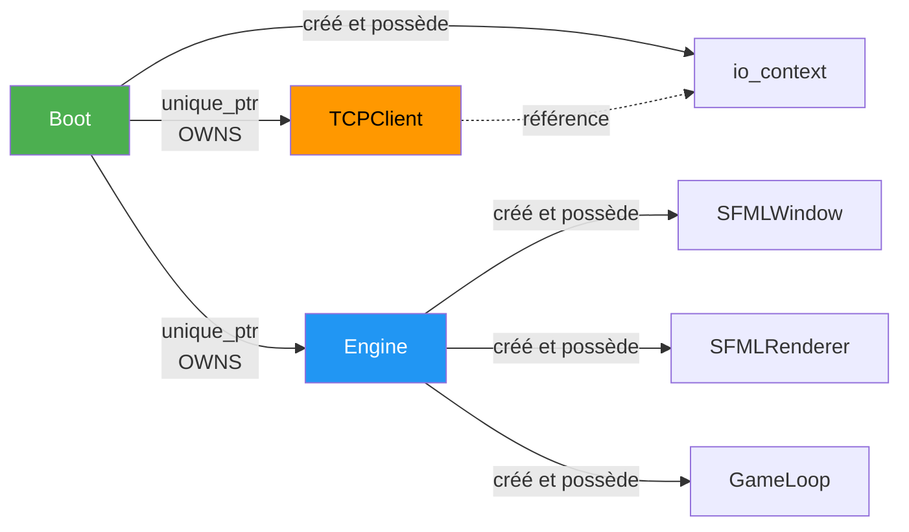
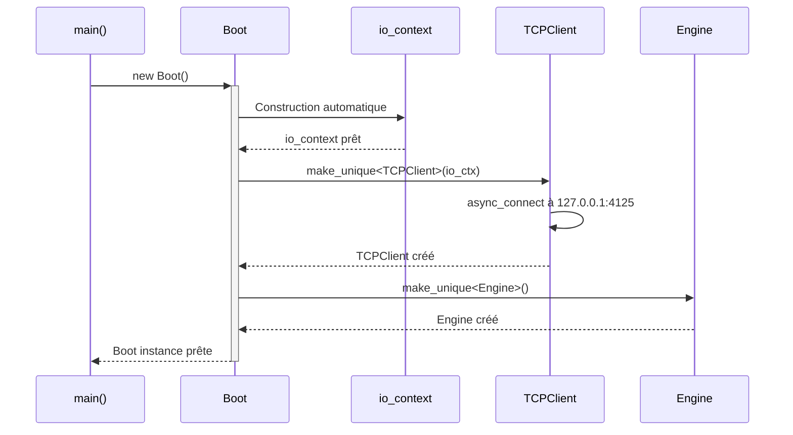
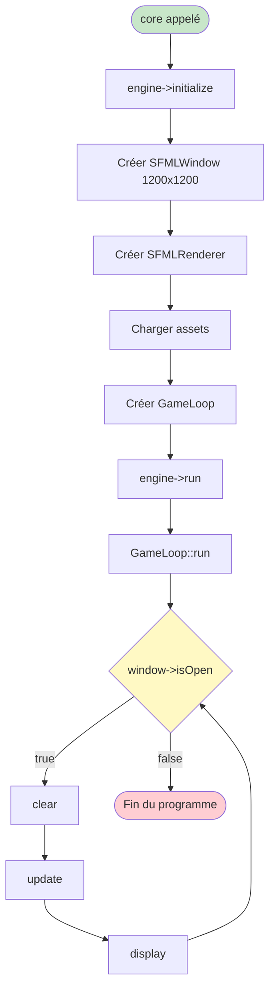
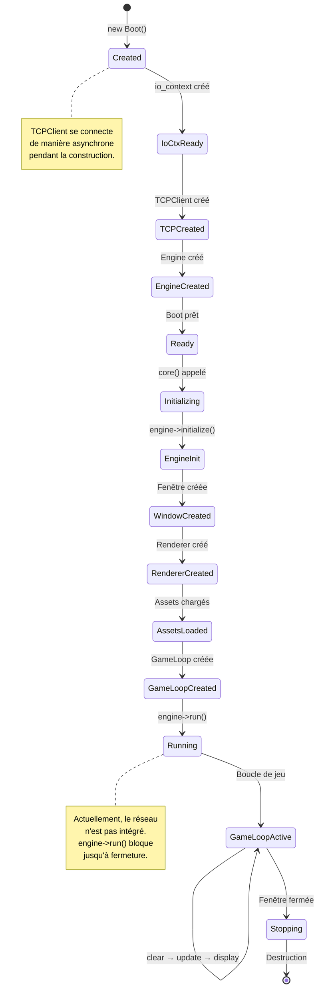
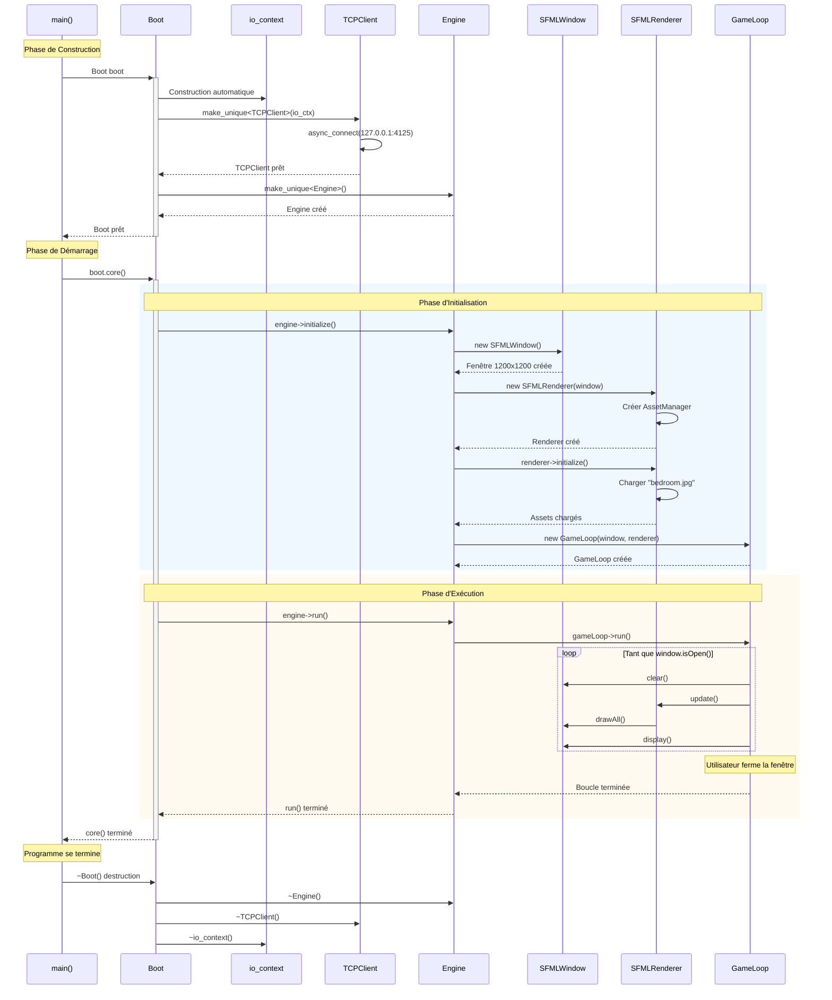
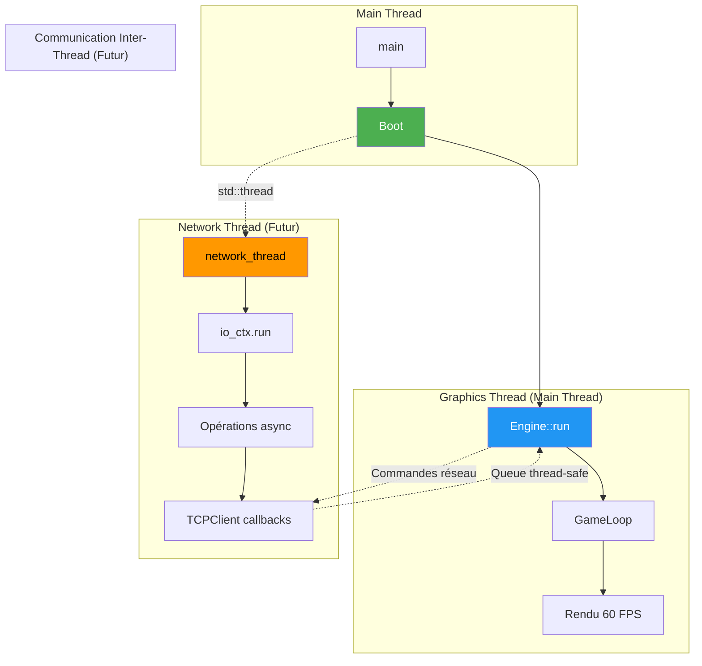

# Boot - Orchestrateur et Point d'Entrée Principal

## Vue d'Ensemble

La classe **Boot** est l'**orchestrateur central** et le **premier point d'entrée** du client R-Type. Elle agit comme un chef d'orchestre qui coordonne l'initialisation et le démarrage de tous les sous-systèmes critiques : le moteur graphique (Engine) et le client réseau (TCPClient).

!!! info "Localisation"
    - **Header**: `/home/simia/epitech/second_year/projects/rtype/src/client/include/boot/Boot.hpp`
    - **Implementation**: `/home/simia/epitech/second_year/projects/rtype/src/client/boot/Boot.cpp`
    - **Namespace**: Global

!!! success "Responsabilités Principales"
    - **Initialisation Boost.Asio**: Crée le `io_context` pour les opérations asynchrones
    - **Création des sous-systèmes**: Instancie TCPClient et Engine
    - **Orchestration du démarrage**: Lance l'application via `core()`
    - **Séparation des threads** (futur): Coordonnera thread réseau et thread graphique

---

## Architecture et Position dans le Système



### Hiérarchie d'Ownership



---

## Code Source Complet

### Header (Boot.hpp)

```cpp
/*
** EPITECH PROJECT, 2025
** rtype [WSL: Ubuntu-24.04]
** File description:
** Boot
*/

#ifndef BOOT_HPP_
#define BOOT_HPP_

#include <boost/asio.hpp>
#include <memory>

#include "../network/TCPClient.hpp"
#include "../core/Engine.hpp"

using boost::asio::ip::tcp;

class Boot {
    public:
        Boot();              // Constructeur : initialise io_context et crée les subsystèmes
        void core();         // Lance l'application

    protected:
    private:
        boost::asio::io_context io_ctx;                  // Contexte ASIO pour async I/O
        std::unique_ptr<TCPClient> tcpClient;            // Client réseau
        std::unique_ptr<core::Engine> engine;            // Moteur graphique
};

#endif /* !BOOT_HPP_ */
```

### Implémentation (Boot.cpp)

```cpp
/*
** EPITECH PROJECT, 2025
** rtype [WSL: Ubuntu-24.04]
** File description:
** Boot
*/

#include "boot/Boot.hpp"

Boot::Boot()
{
    // Initialisation des sous-systèmes
    tcpClient = std::make_unique<TCPClient>(io_ctx);
    engine = std::make_unique<core::Engine>();
}

void Boot::core()
{
    // Phase d'initialisation
    engine->initialize();

    // Phase d'exécution
    engine->run();

    // Note: Le code ci-dessous est commenté dans la version actuelle
    // car l'intégration réseau n'est pas encore complète
    //
    // std::thread network_thread([this]() {
    //     io_ctx.run();  // Thread réseau asynchrone
    // });
    //
    // tcpClient->run();  // Lancer la communication réseau
    //
    // network_thread.join();  // Attendre la fin du thread réseau
}
```

---

## Analyse Détaillée

### Constructeur

```cpp
Boot::Boot()
{
    tcpClient = std::make_unique<TCPClient>(io_ctx);
    engine = std::make_unique<core::Engine>();
}
```

**Étapes d'exécution** :

1. **Création de `io_ctx`** : Le membre `boost::asio::io_context` est automatiquement construit
   - Prêt à gérer les opérations asynchrones (sockets, timers, etc.)

2. **Création du TCPClient** :
   ```cpp
   tcpClient = std::make_unique<TCPClient>(io_ctx);
   ```
   - Passe une **référence** au `io_context` (pas de copie)
   - Le TCPClient utilise ce contexte pour ses opérations async
   - Ownership exclusif via `unique_ptr`

3. **Création de l'Engine** :
   ```cpp
   engine = std::make_unique<core::Engine>();
   ```
   - Crée le moteur de jeu indépendamment
   - L'Engine n'a pas besoin du `io_context` (graphique synchrone)
   - Ownership exclusif via `unique_ptr`

**État après construction** :
- `io_ctx` : Prêt pour async I/O
- `tcpClient` : Connecté (ou en cours de connexion) à 127.0.0.1:4125
- `engine` : Créé mais pas encore initialisé



---

### Méthode `core()`

```cpp
void Boot::core()
{
    engine->initialize();
    engine->run();
}
```

**Comportement actuel** :



**Étapes détaillées** :

1. **`engine->initialize()`** :
   - Crée une fenêtre SFML 1200x1200 nommée "rtype"
   - Crée le renderer avec la fenêtre
   - Charge les assets initiaux (texture de démo)
   - Crée la GameLoop

2. **`engine->run()`** :
   - Délègue à `gameLoop->run()`
   - **Bloque** jusqu'à ce que la fenêtre soit fermée
   - Boucle infinie : `clear() → update() → display()`

**Code réseau commenté** :

La version actuelle du code contient du code **commenté** pour l'intégration réseau :

```cpp
// Code futur (actuellement commenté) :
void Boot::core()
{
    engine->initialize();

    // Lancer un thread dédié au réseau
    std::thread network_thread([this]() {
        io_ctx.run();  // Boucle d'événements asynchrones
    });

    // Lancer les opérations réseau
    tcpClient->run();

    // Lancer la boucle graphique (bloquant)
    engine->run();

    // Attendre la fin du thread réseau
    network_thread.join();
}
```

**Pourquoi c'est commenté ?**

!!! warning "Intégration réseau non finalisée"
    Le code réseau est commenté car :
    - `TCPClient::run()` n'est pas encore implémenté (stub)
    - Pas de protocole de communication défini
    - `engine->run()` est bloquant, donc incompatible avec le code actuel
    - Nécessite refactoring pour un vrai système multi-thread

---

## Cycle de Vie Complet



---

## Diagramme de Séquence Complet



---

## Architecture Future : Multi-threading

Le code contient des commentaires montrant l'architecture future avec séparation des threads :



**Code future prévu** :

```cpp
void Boot::core()
{
    engine->initialize();

    // ✅ Thread réseau dédié
    std::thread network_thread([this]() {
        io_ctx.run();  // Boucle d'événements Boost.Asio
    });

    // ✅ Lancer les opérations réseau
    tcpClient->run();

    // ✅ Thread graphique (main thread)
    engine->run();  // Bloquant

    // ✅ Attendre la fin du thread réseau
    network_thread.join();
}
```

**Défis à résoudre** :

1. **Communication inter-thread** : Queue thread-safe pour échanger données
2. **Synchronisation** : Éviter les race conditions
3. **Shutdown gracieux** : Arrêter proprement les deux threads
4. **Exception handling** : Gérer les exceptions dans les deux threads

---

## Exemples d'Utilisation

### Exemple 1 : Utilisation Standard

```cpp
#include "boot/Boot.hpp"

int main() {
    try {
        // Créer l'orchestrateur
        Boot boot;

        // Lancer l'application
        boot.core();  // Bloquant jusqu'à fermeture

    } catch (const std::exception& e) {
        std::cerr << "Erreur fatale: " << e.what() << std::endl;
        return 1;
    }

    return 0;
}
```

### Exemple 2 : Avec Logging

```cpp
#include "boot/Boot.hpp"
#include <iostream>

int main() {
    std::cout << "=== Démarrage R-Type Client ===" << std::endl;

    try {
        Boot boot;
        std::cout << "✓ Boot créé" << std::endl;

        boot.core();
        std::cout << "✓ Application terminée normalement" << std::endl;

    } catch (const boost::system::system_error& e) {
        std::cerr << "Erreur réseau: " << e.what() << std::endl;
        return 1;
    } catch (const std::exception& e) {
        std::cerr << "Erreur: " << e.what() << std::endl;
        return 1;
    }

    return 0;
}
```

### Exemple 3 : Version Future avec Multi-threading

```cpp
// Code futur (après implémentation réseau complète)
#include "boot/Boot.hpp"

class BootV2 : public Boot {
public:
    void core() override {
        engine->initialize();

        // Thread réseau
        std::thread network_thread([this]() {
            try {
                io_ctx.run();
            } catch (const std::exception& e) {
                std::cerr << "Erreur thread réseau: " << e.what() << std::endl;
            }
        });

        // Thread graphique (main thread)
        try {
            tcpClient->run();
            engine->run();
        } catch (const std::exception& e) {
            std::cerr << "Erreur thread graphique: " << e.what() << std::endl;
        }

        // Arrêt propre
        io_ctx.stop();
        if (network_thread.joinable()) {
            network_thread.join();
        }
    }
};
```

---

## Membres Privés

### io_ctx

```cpp
boost::asio::io_context io_ctx;
```

**Description** : Contexte Boost.Asio pour les opérations I/O asynchrones.

**Rôle** :
- Gère la boucle d'événements pour async I/O
- Fournit le contexte pour les timers, sockets, etc.
- Utilisé par TCPClient pour les connexions asynchrones

**Cycle de vie** :
- Créé automatiquement dans le constructeur de Boot
- Détruit automatiquement à la destruction de Boot
- Thread-safe quand utilisé avec `io_ctx.run()` dans un thread dédié

**Utilisation mémoire** : Environ 64 bytes + buffers internes

---

### tcpClient

```cpp
std::unique_ptr<TCPClient> tcpClient;
```

**Description** : Client réseau TCP pour communiquer avec le serveur R-Type.

**Ownership** : Boot possède exclusivement le TCPClient

**État actuel** :
- Créé et connecté (ou en cours de connexion) dans le constructeur
- Méthode `run()` non implémentée (stub)
- Commenté dans `core()` car non finalisé

**Architecture future** : Tournera dans un thread dédié

---

### engine

```cpp
std::unique_ptr<core::Engine> engine;
```

**Description** : Moteur de jeu principal gérant graphiques et gameplay.

**Ownership** : Boot possède exclusivement l'Engine

**Responsabilités** :
- Créer et gérer la fenêtre SFML
- Créer et gérer le renderer
- Créer et gérer la GameLoop
- Exécuter la boucle de jeu

**Thread** : Tourne sur le main thread (graphique doit être sur thread principal)

---

## Comparaisons et Bonnes Pratiques

### ✅ BON : Architecture Actuelle

```cpp
class Boot {
    // ✅ Ownership clair via unique_ptr
    std::unique_ptr<TCPClient> tcpClient;
    std::unique_ptr<core::Engine> engine;

    // ✅ io_context partagé par référence
    boost::asio::io_context io_ctx;
};
```

**Avantages** :
- Ownership explicite
- Destruction automatique dans le bon ordre
- io_context créé avant les dépendances

---

### ❌ MAUVAIS : Pointeurs Bruts

```cpp
class Boot {
    // ❌ Fuite mémoire potentielle
    TCPClient* tcpClient;
    core::Engine* engine;
};

Boot::Boot() {
    tcpClient = new TCPClient(io_ctx);  // Fuite si exception !
    engine = new core::Engine();
}

~Boot() {
    delete tcpClient;  // Oublier = fuite mémoire
    delete engine;
}
```

---

### ❌ MAUVAIS : Ordre d'Initialisation Incorrect

```cpp
class Boot {
    // ❌ tcpClient déclaré AVANT io_ctx !
    std::unique_ptr<TCPClient> tcpClient;
    boost::asio::io_context io_ctx;  // Détruit AVANT tcpClient
};

// Problème : io_ctx détruit avant tcpClient
// → Dangling reference !
```

**Règle** : Déclarer les membres dans l'ordre de dépendance :
1. io_ctx (indépendant)
2. tcpClient (dépend de io_ctx)
3. engine (indépendant)

---

## Questions Fréquentes (FAQ)

### Q1 : Pourquoi Boot possède-t-il `io_context` au lieu de le passer en paramètre ?

**Réponse** : Le `io_context` doit survivre au moins aussi longtemps que tous les objets qui l'utilisent (TCPClient). En le possédant, Boot garantit cette contrainte de lifetime.

---

### Q2 : Pourquoi le code réseau est-il commenté ?

**Réponse** : Le TCPClient n'est pas encore complet :
- `run()` est un stub
- Pas de protocole de communication
- `engine->run()` est bloquant, empêche le multi-threading actuel

---

### Q3 : Comment ajouter un nouveau sous-système à Boot ?

**Réponse** :

```cpp
// 1. Ajouter le membre
class Boot {
    std::unique_ptr<AudioSystem> audioSystem;  // Nouveau
};

// 2. Créer dans le constructeur
Boot::Boot() {
    tcpClient = std::make_unique<TCPClient>(io_ctx);
    engine = std::make_unique<core::Engine>();
    audioSystem = std::make_unique<AudioSystem>();  // Nouveau
}

// 3. Initialiser dans core()
void Boot::core() {
    engine->initialize();
    audioSystem->initialize();  // Nouveau
    engine->run();
}
```

---

### Q4 : Boot peut-il être utilisé pour relancer le jeu ?

**Réponse** : Non, Boot est conçu pour un usage unique. Pour relancer :

```cpp
int main() {
    bool shouldRestart = true;

    while (shouldRestart) {
        {
            Boot boot;
            boot.core();
            // Demander si restart souhaité
        }
        // Boot détruit, on peut recréer
    }
}
```

---

## Améliorations Futures Suggérées

### 1. Configuration Externe

```cpp
struct BootConfig {
    std::string serverIp = "127.0.0.1";
    int serverPort = 4125;
    bool enableNetwork = true;
    bool enableGraphics = true;
};

class Boot {
public:
    Boot(const BootConfig& config);
};
```

### 2. Gestion d'État

```cpp
enum class BootState {
    Uninitialized,
    Initializing,
    Running,
    Stopping,
    Stopped
};

class Boot {
    BootState getState() const;
    bool isRunning() const;
};
```

### 3. Callbacks de Progression

```cpp
using ProgressCallback = std::function<void(const std::string&, float)>;

class Boot {
public:
    void setProgressCallback(ProgressCallback callback);
    // Appelé pendant initialize() pour afficher la progression
};
```

### 4. Arrêt Gracieux

```cpp
class Boot {
public:
    void shutdown();  // Arrêt propre des threads
    bool isShuttingDown() const;
};
```

---

## Résumé

**Boot** est le point d'entrée et orchestrateur central du client R-Type :

- **Crée** : io_context, TCPClient, Engine
- **Initialise** : Tous les sous-systèmes via `core()`
- **Exécute** : La boucle graphique (actuellement bloquante)
- **Future** : Gérera multi-threading réseau/graphique

**Points Clés** :
- Ownership clair via `unique_ptr`
- io_context partagé par référence
- Code réseau commenté (en attente d'implémentation)
- Architecture prête pour multi-threading

!!! tip "Prochaines Étapes"
    - Lisez [main.md](./main.md) pour comprendre le point d'entrée
    - Consultez [TCPClient.md](../network/tcp-client.md) pour le système réseau
    - Référez-vous à [Engine.md](./engine.md) pour le moteur graphique
