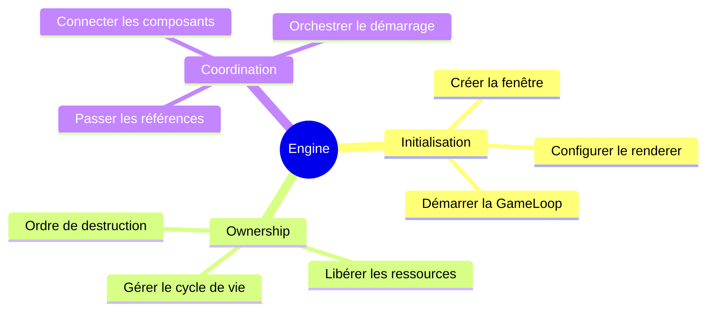
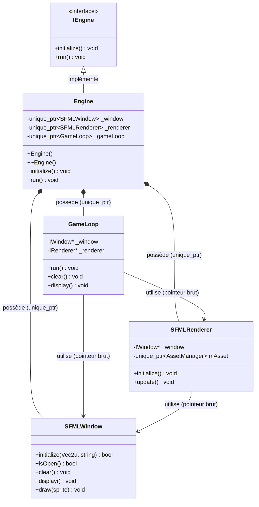
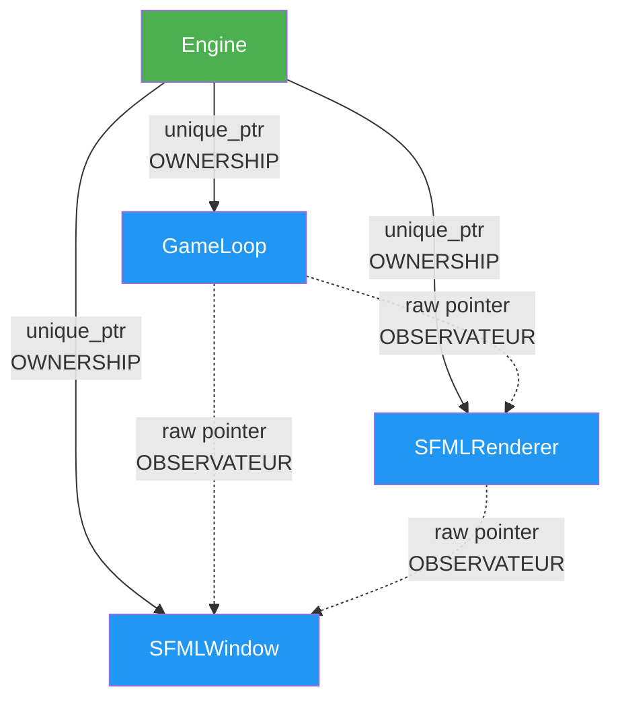
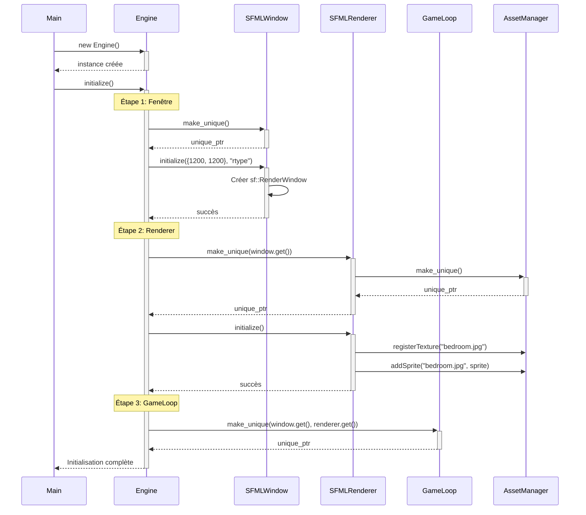
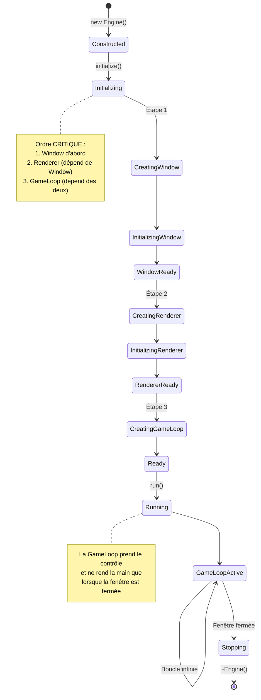
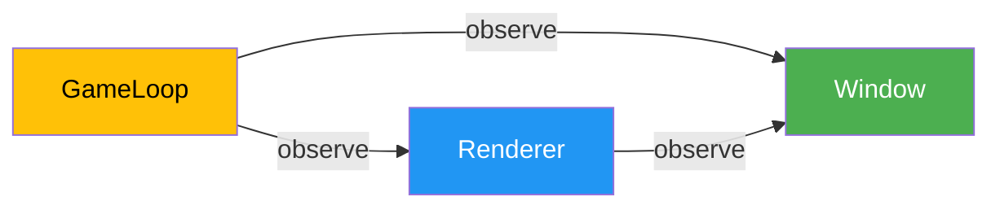
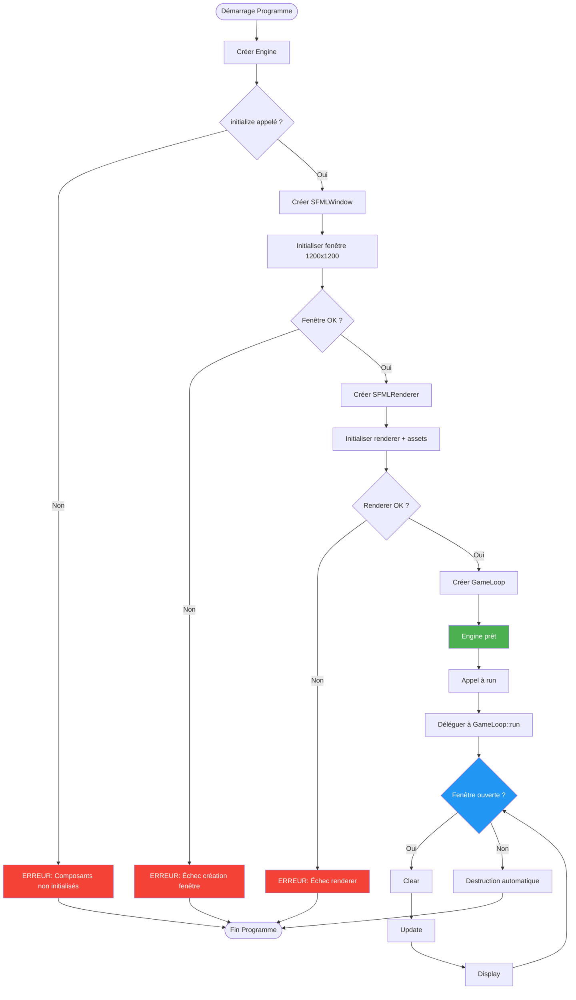
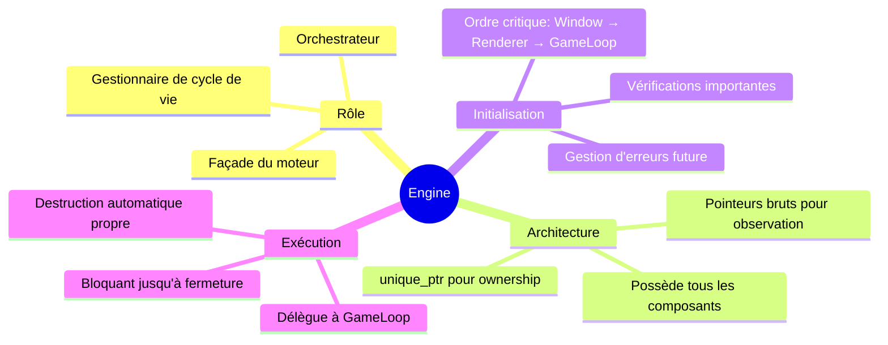

# Engine - Le Coeur du Moteur de Jeu R-Type

## Vue d'Ensemble

La classe `Engine` est le **point d'entrée principal** et le **chef d'orchestre** du moteur de jeu R-Type. Elle agit comme un **façade pattern** qui coordonne l'initialisation et l'exécution de tous les composants critiques du système de rendu et de la boucle de jeu.

### Responsabilités Principales



## Architecture et Hiérarchie des Classes

### Diagramme de Classes



### Hiérarchie d'Ownership

> **WARNING**: Comprendre l'ownership est CRITIQUE pour éviter les fuites mémoire et les crashs !



**Principes clés de l'ownership :**

1. **Engine POSSÈDE** tous les composants via `std::unique_ptr`
2. **GameLoop et SFMLRenderer OBSERVENT** via des pointeurs bruts (`*`)
3. L'ordre de destruction est automatiquement correct (LIFO)
4. Aucun risque de double-free ou de dangling pointer

## Code Source Complet

### Déclaration (Engine.hpp)

```cpp
/*
** EPITECH PROJECT, 2025
** rtype [WSL: Ubuntu-24.04]
** File description:
** Engine
*/

#ifndef ENGINE_HPP_
#define ENGINE_HPP_

#include "IEngine.hpp"
#include "GameLoop.hpp"
#include "IRenderer.hpp"
#include "../graphics/IWindow.hpp"
#include "../implementations/sfml/SFMLWindow.hpp"
#include "../implementations/sfml/SFMLRenderer.hpp"

#include <memory>

namespace core {
    class Engine: public IEngine {
        public:
            Engine();
            ~Engine();

            void initialize() override;
            void run() override;

        private:
            std::unique_ptr<SFMLWindow> _window;      // Ownership de la fenêtre
            std::unique_ptr<SFMLRenderer> _renderer;  // Ownership du renderer
            std::unique_ptr<GameLoop> _gameLoop;      // Ownership de la boucle
    };
}

#endif /* !ENGINE_HPP_ */
```

### Implémentation (Engine.cpp)

```cpp
/*
** EPITECH PROJECT, 2025
** rtype [WSL: Ubuntu-24.04]
** File description:
** Engine
*/

#include "core/Engine.hpp"

namespace core {
    Engine::Engine()
    {
        // Constructeur vide : les unique_ptr sont initialisés à nullptr
    }

    Engine::~Engine()
    {
        // Destructeur automatique : les unique_ptr libèrent dans l'ordre inverse
        // 1. _gameLoop détruit en premier (ne peut plus accéder aux composants)
        // 2. _renderer détruit ensuite (ne peut plus accéder à _window)
        // 3. _window détruit en dernier
    }

    void Engine::initialize()
    {
        // Étape 1: Créer et initialiser la fenêtre
        _window = std::make_unique<SFMLWindow>();
        _window->initialize({.x = 1200, .y = 1200}, "rtype");

        // Étape 2: Créer et initialiser le renderer avec référence à la fenêtre
        _renderer = std::make_unique<SFMLRenderer>(_window.get());
        _renderer->initialize();

        // Étape 3: Créer la GameLoop avec références à la fenêtre et au renderer
        _gameLoop = std::make_unique<GameLoop>(_window.get(), _renderer.get());
    }

    void Engine::run()
    {
        // Déléguer l'exécution à la GameLoop
        _gameLoop->run();
    }
}
```

## Cycle de Vie Complet

### Diagramme de Séquence d'Initialisation



### Diagramme d'États de l'Engine



## Initialisation des Composants en Détail

### Étape 1: Création de la Fenêtre

```cpp
// Création d'un unique_ptr qui POSSÈDE la fenêtre
_window = std::make_unique<SFMLWindow>();

// Configuration de la fenêtre : taille 1200x1200, titre "rtype"
_window->initialize({.x = 1200, .y = 1200}, "rtype");
```

**Points clés :**
- Utilisation de `std::make_unique` pour une allocation exception-safe
- Initialisation immédiate avec des designated initializers `.x` et `.y`
- La fenêtre est maintenant prête à recevoir des commandes de rendu

### Étape 2: Création du Renderer

```cpp
// Création du renderer EN LUI PASSANT un pointeur vers la fenêtre
_renderer = std::make_unique<SFMLRenderer>(_window.get());

// Le renderer s'initialise (charge les assets, etc.)
_renderer->initialize();
```

**Pourquoi `.get()` ?**

> **TIP**: `.get()` extrait le pointeur brut d'un `unique_ptr` SANS transférer l'ownership

```cpp
// ✅ BON : Passer un pointeur brut pour observation
_renderer = std::make_unique<SFMLRenderer>(_window.get());

// ❌ MAUVAIS : Transférer l'ownership (renderer posséderait la fenêtre)
_renderer = std::make_unique<SFMLRenderer>(std::move(_window));

// ❌ MAUVAIS : Créer une copie d'unique_ptr (IMPOSSIBLE, ne compile pas)
_renderer = std::make_unique<SFMLRenderer>(_window);
```

### Étape 3: Création de la GameLoop

```cpp
// GameLoop reçoit des OBSERVATEURS vers window et renderer
_gameLoop = std::make_unique<GameLoop>(_window.get(), _renderer.get());
```

**Architecture de dépendances :**



## Diagramme de Flux d'Exécution



## Exemples Pratiques

### Exemple 1: Utilisation Basique

```cpp
#include "core/Engine.hpp"

int main() {
    // Créer l'instance du moteur
    core::Engine engine;

    // Initialiser tous les composants
    engine.initialize();

    // Lancer la boucle de jeu (bloquant jusqu'à fermeture)
    engine.run();

    // Destruction automatique à la fin du scope
    return 0;
}
```

**Trace d'exécution :**

```
1. Construction Engine (pointeurs à nullptr)
2. initialize() appelée
   ├─ Création SFMLWindow
   ├─ Fenêtre 1200x1200 "rtype" créée
   ├─ Création SFMLRenderer
   ├─ Chargement assets (bedroom.jpg)
   └─ Création GameLoop
3. run() appelée
   └─ GameLoop prend le contrôle
4. Boucle infinie : clear → update → display
5. Utilisateur ferme la fenêtre
6. Destruction automatique (ordre inverse)
   ├─ ~GameLoop()
   ├─ ~SFMLRenderer()
   └─ ~SFMLWindow()
```

### Exemple 2: Gestion d'Erreurs (Futur)

```cpp
// ✅ BON : Vérifier que initialize a été appelée
int main() {
    core::Engine engine;
    engine.initialize();  // OBLIGATOIRE avant run()
    engine.run();
    return 0;
}

// ❌ MAUVAIS : Oublier initialize
int main() {
    core::Engine engine;
    engine.run();  // CRASH ! _gameLoop est nullptr
    return 0;
}
```

> **WARNING**: Actuellement, aucune vérification n'est faite. Appeler `run()` sans `initialize()` causera un crash (nullptr dereference).

**Amélioration future suggérée :**

```cpp
void Engine::run() {
    if (!_gameLoop) {
        throw std::runtime_error("Engine::run() appelé avant initialize()");
    }
    _gameLoop->run();
}
```

### Exemple 3: Comprendre l'Ownership

```cpp
void Engine::initialize() {
    // 1. Créer la fenêtre
    _window = std::make_unique<SFMLWindow>();
    // _window POSSÈDE la SFMLWindow
    // SFMLWindow* window_ptr = _window.get(); // Observer le pointeur

    // 2. Créer le renderer avec un OBSERVATEUR
    _renderer = std::make_unique<SFMLRenderer>(_window.get());
    // _renderer POSSÈDE le SFMLRenderer
    // SFMLRenderer stocke window_ptr mais ne le possède PAS

    // 3. Créer la GameLoop avec des OBSERVATEURS
    _gameLoop = std::make_unique<GameLoop>(_window.get(), _renderer.get());
    // _gameLoop POSSÈDE la GameLoop
    // GameLoop stocke window_ptr et renderer_ptr mais ne les possède PAS
}

// À la destruction de Engine :
Engine::~Engine() {
    // 1. _gameLoop détruit d'abord (déclaré en dernier)
    //    → GameLoop n'a plus accès aux pointeurs, mais c'est OK car on va les détruire

    // 2. _renderer détruit ensuite
    //    → SFMLRenderer n'a plus accès à _window, mais c'est OK

    // 3. _window détruit en dernier
    //    → Tout est propre !
}
```

**Visualisation de la mémoire :**

```
┌─────────────────────────────────────────────────────────┐
│                      STACK (main)                       │
├─────────────────────────────────────────────────────────┤
│  Engine engine;                                         │
│    ├─ _window    → [unique_ptr] ──────┐                │
│    ├─ _renderer  → [unique_ptr] ──┐   │                │
│    └─ _gameLoop  → [unique_ptr] ┐ │   │                │
└─────────────────────────────────┼─┼───┼────────────────┘
                                  │ │   │
┌─────────────────────────────────┼─┼───┼────────────────┐
│                      HEAP                               │
├─────────────────────────────────┼─┼───┼────────────────┤
│  ┌───────────────────────────┐  │ │   │                │
│  │    GameLoop               │◄─┘ │   │                │
│  │  - _window*    ───────────┼────┼───┤                │
│  │  - _renderer*  ───────────┼────┤   │                │
│  └───────────────────────────┘    │   │                │
│                                    │   │                │
│  ┌───────────────────────────┐    │   │                │
│  │    SFMLRenderer           │◄───┘   │                │
│  │  - _window*    ───────────┼────────┤                │
│  │  - mAsset (unique_ptr)    │        │                │
│  └───────────────────────────┘        │                │
│                                        │                │
│  ┌───────────────────────────┐        │                │
│  │    SFMLWindow             │◄───────┘                │
│  │  - sf::RenderWindow       │                         │
│  └───────────────────────────┘                         │
└─────────────────────────────────────────────────────────┘

Légende:
  ──────► : unique_ptr (ownership)
  ······► : raw pointer (observateur)
```

## Comparaisons Bon vs Mauvais Code

### Ownership et Pointeurs

#### ✅ BON : Architecture actuelle

```cpp
class Engine {
private:
    std::unique_ptr<SFMLWindow> _window;      // Engine POSSÈDE
    std::unique_ptr<SFMLRenderer> _renderer;  // Engine POSSÈDE
    std::unique_ptr<GameLoop> _gameLoop;      // Engine POSSÈDE
};

void Engine::initialize() {
    _window = std::make_unique<SFMLWindow>();
    _renderer = std::make_unique<SFMLRenderer>(_window.get());  // Observe
    _gameLoop = std::make_unique<GameLoop>(_window.get(), _renderer.get());  // Observe
}
```

**Avantages :**
- Ownership clair : Engine contrôle tout
- Destruction automatique dans le bon ordre
- Pas de fuite mémoire possible
- Pas de double-free possible

#### ❌ MAUVAIS : Pointeurs bruts partout

```cpp
class Engine {
private:
    SFMLWindow* _window;       // Qui possède ? On ne sait pas !
    SFMLRenderer* _renderer;
    GameLoop* _gameLoop;
};

void Engine::initialize() {
    _window = new SFMLWindow();  // Fuite mémoire si on oublie delete !
    _renderer = new SFMLRenderer(_window);
    _gameLoop = new GameLoop(_window, _renderer);
}

Engine::~Engine() {
    delete _gameLoop;    // Ordre manuel, risque d'erreur
    delete _renderer;
    delete _window;
    // Oublier un delete = fuite mémoire garantie !
}
```

#### ❌ MAUVAIS : shared_ptr sans raison

```cpp
class Engine {
private:
    std::shared_ptr<SFMLWindow> _window;      // Overkill !
    std::shared_ptr<SFMLRenderer> _renderer;  // Overhead inutile
    std::shared_ptr<GameLoop> _gameLoop;      // Confusion d'ownership
};

void Engine::initialize() {
    _window = std::make_shared<SFMLWindow>();
    // Qui d'autre pourrait partager la fenêtre ? Personne !
    // shared_ptr a un coût (compteur de références, atomic ops)
}
```

### Initialisation

#### ✅ BON : Ordre de dépendances respecté

```cpp
void Engine::initialize() {
    // 1. Créer ce qui n'a pas de dépendances
    _window = std::make_unique<SFMLWindow>();
    _window->initialize({.x = 1200, .y = 1200}, "rtype");

    // 2. Créer ce qui dépend de la fenêtre
    _renderer = std::make_unique<SFMLRenderer>(_window.get());
    _renderer->initialize();

    // 3. Créer ce qui dépend de tout
    _gameLoop = std::make_unique<GameLoop>(_window.get(), _renderer.get());
}
```

#### ❌ MAUVAIS : Ordre inversé

```cpp
void Engine::initialize() {
    // ERREUR : GameLoop créée avant ses dépendances !
    _gameLoop = std::make_unique<GameLoop>(_window.get(), _renderer.get());
    // _window.get() et _renderer.get() sont nullptr → CRASH !

    _window = std::make_unique<SFMLWindow>();
    _renderer = std::make_unique<SFMLRenderer>(_window.get());
}
```

#### ❌ MAUVAIS : Oublier une initialisation

```cpp
void Engine::initialize() {
    _window = std::make_unique<SFMLWindow>();
    // OUBLI : pas d'appel à _window->initialize() !
    // La fenêtre n'est pas configurée

    _renderer = std::make_unique<SFMLRenderer>(_window.get());
    // OUBLI : pas d'appel à _renderer->initialize() !
    // Les assets ne sont pas chargés

    _gameLoop = std::make_unique<GameLoop>(_window.get(), _renderer.get());
}
```

## Améliorations Futures Suggérées

### 1. Vérification de l'État

```cpp
class Engine {
public:
    void initialize() override {
        if (_initialized) {
            throw std::runtime_error("Engine déjà initialisé");
        }

        // ... initialisation ...

        _initialized = true;
    }

    void run() override {
        if (!_initialized) {
            throw std::runtime_error("Engine non initialisé. Appelez initialize() d'abord.");
        }
        _gameLoop->run();
    }

private:
    bool _initialized = false;
};
```

### 2. Configuration Paramétrable

```cpp
struct EngineConfig {
    Vec2u windowSize = {1200, 1200};
    std::string windowTitle = "rtype";
    bool fullscreen = false;
    unsigned int maxFPS = 60;
};

class Engine {
public:
    void initialize(const EngineConfig& config) override {
        _window = std::make_unique<SFMLWindow>();
        _window->initialize(config.windowSize, config.windowTitle);

        if (config.fullscreen) {
            _window->setFullscreen(true);
        }

        // ...
    }
};
```

### 3. Gestion d'Erreurs Robuste

```cpp
void Engine::initialize() {
    try {
        _window = std::make_unique<SFMLWindow>();
        if (!_window->initialize({.x = 1200, .y = 1200}, "rtype")) {
            throw std::runtime_error("Échec d'initialisation de la fenêtre");
        }

        _renderer = std::make_unique<SFMLRenderer>(_window.get());
        _renderer->initialize();

        _gameLoop = std::make_unique<GameLoop>(_window.get(), _renderer.get());

    } catch (const std::exception& e) {
        // Cleanup partiel si nécessaire
        _gameLoop.reset();
        _renderer.reset();
        _window.reset();

        throw;  // Re-throw pour informer l'appelant
    }
}
```

### 4. Support du Hot-Reload

```cpp
class Engine {
public:
    void reload() {
        // Sauvegarder l'état si nécessaire

        // Réinitialiser le renderer (recharge les assets)
        _renderer->cleanup();
        _renderer->initialize();
    }

    void restart() {
        // Arrêter la GameLoop proprement
        _gameLoop->stop();

        // Réinitialiser tout
        initialize();

        // Relancer
        run();
    }
};
```

## Questions Fréquentes (FAQ)

### Q1: Pourquoi utiliser `unique_ptr` au lieu de variables membres directes ?

**Réponse :**

```cpp
// Avec unique_ptr (actuel)
class Engine {
private:
    std::unique_ptr<SFMLWindow> _window;  // ✅ Polymorphisme possible
};

// Avec membres directs
class Engine {
private:
    SFMLWindow _window;  // ❌ Pas de polymorphisme, taille fixe
};
```

Avantages de `unique_ptr` :
1. **Polymorphisme** : Peut pointer vers une classe dérivée
2. **Forward declaration** : Pas besoin d'inclure le header complet
3. **Flexibilité** : Peut être `nullptr`, réassigné, etc.
4. **RAII** : Destruction automatique garantie

### Q2: Pourquoi passer des pointeurs bruts à GameLoop au lieu de shared_ptr ?

**Réponse :**

L'ownership est **unidirectionnel** :
- Engine **possède** les ressources
- GameLoop **observe** les ressources

```cpp
// ✅ BON : GameLoop observe
class GameLoop {
    IWindow* _window;      // N'a PAS l'ownership
    IRenderer* _renderer;  // N'a PAS l'ownership
};

// ❌ MAUVAIS : GameLoop partage l'ownership
class GameLoop {
    std::shared_ptr<IWindow> _window;      // Overkill et confus
    std::shared_ptr<IRenderer> _renderer;  // Qui possède réellement ?
};
```

### Q3: Que se passe-t-il si j'appelle `run()` sans `initialize()` ?

**Réponse :**

**Comportement actuel :** CRASH immédiat !

```cpp
Engine engine;
engine.run();  // _gameLoop est nullptr → Segmentation Fault
```

**Pourquoi ?**
- `_gameLoop` est initialisé à `nullptr` par défaut
- `run()` appelle `_gameLoop->run()` sans vérification
- Déréférencement de `nullptr` → crash

**Solution recommandée :** Ajouter une assertion ou exception (voir "Améliorations Futures").

### Q4: Dans quel ordre sont détruits les composants ?

**Réponse :**

Les membres d'une classe sont **détruits dans l'ordre inverse de leur déclaration** :

```cpp
class Engine {
private:
    std::unique_ptr<SFMLWindow> _window;      // Déclaré en 1er → Détruit en 3e
    std::unique_ptr<SFMLRenderer> _renderer;  // Déclaré en 2e → Détruit en 2e
    std::unique_ptr<GameLoop> _gameLoop;      // Déclaré en 3e → Détruit en 1er
};

// Ordre de destruction :
// 1. ~GameLoop()      → Plus d'accès à window/renderer (OK, ils existent encore)
// 2. ~SFMLRenderer()  → Plus d'accès à window (OK, elle existe encore)
// 3. ~SFMLWindow()    → Plus rien ne la référence (parfait !)
```

Cet ordre est **parfait** pour notre architecture !

### Q5: Peut-on avoir plusieurs Engine dans un même programme ?

**Réponse :**

Techniquement **oui**, mais avec des contraintes :

```cpp
int main() {
    core::Engine engine1;
    engine1.initialize();

    core::Engine engine2;  // ⚠️ Problème potentiel
    engine2.initialize();  // Deux fenêtres SFML en parallèle

    // On ne peut exécuter qu'une seule GameLoop à la fois (bloquante)
    engine1.run();  // Bloque jusqu'à fermeture de la fenêtre
    engine2.run();  // Ne s'exécutera qu'après
}
```

**Limitations :**
- `run()` est bloquant
- Difficile de gérer plusieurs fenêtres simultanément
- Chaque Engine nécessite ses propres ressources

## Résumé des Points Clés



## Checklist de Compréhension

Avant de continuer, assurez-vous de comprendre :

- [ ] Le rôle de façade de la classe Engine
- [ ] La différence entre `unique_ptr` (ownership) et `*` (observation)
- [ ] Pourquoi `.get()` est utilisé pour passer les pointeurs
- [ ] L'ordre d'initialisation des composants et pourquoi il est important
- [ ] L'ordre de destruction automatique et pourquoi il fonctionne
- [ ] Pourquoi `run()` est bloquant
- [ ] Les risques d'appeler `run()` avant `initialize()`
- [ ] Comment les composants communiquent entre eux

## Voir Aussi

- [GameLoop Documentation](./gameloop.md) - Détails sur la boucle de jeu
- [Renderer Documentation](./renderer.md) - Système de rendu
- [Architecture Globale](../architecture/overview.md) - Vue d'ensemble du système
