# GameLoop - Le Cycle de Rendu du Moteur R-Type

## Vue d'Ensemble

La `GameLoop` est le **coeur battant** du moteur de jeu R-Type. Elle implémente le pattern classique **Event → Update → Render** et orchestre le cycle de rendu à chaque frame.

!!! success "Mise à Jour SFML 3"
    La GameLoop utilise maintenant l'API SFML 3 pour les événements et intègre le **SceneManager** pour la gestion des scènes.

### Responsabilités Principales

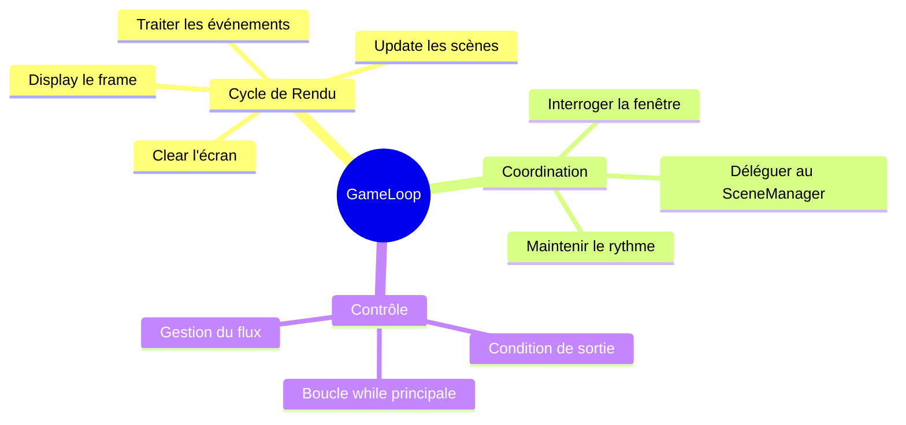

## Architecture et Hiérarchie

### Diagramme de Classes

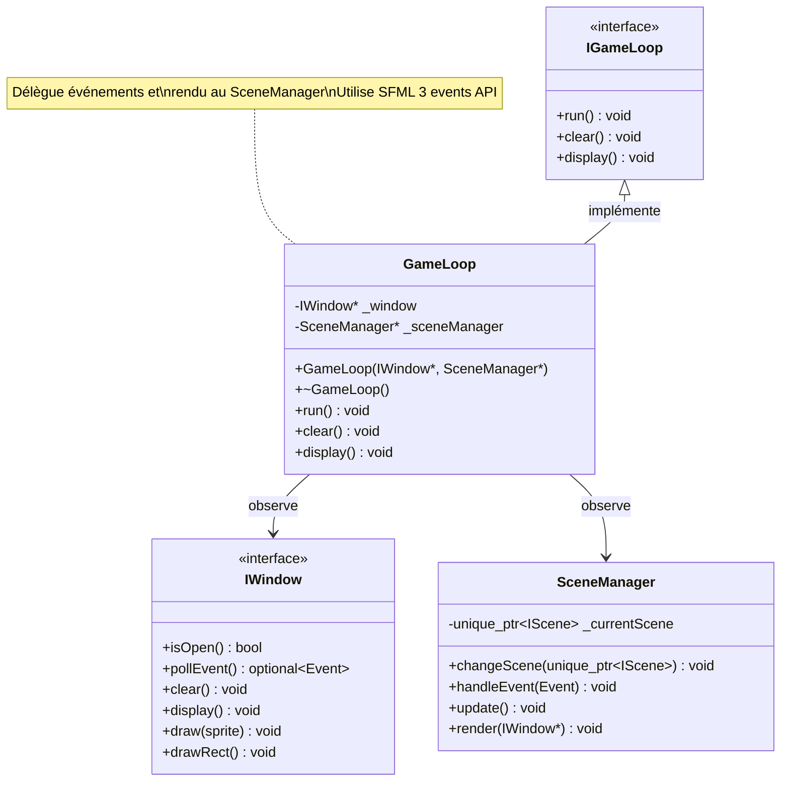

### Pattern d'Observation

> **TIP**: GameLoop utilise le pattern **Observer** : elle observe des ressources possédées par Engine.

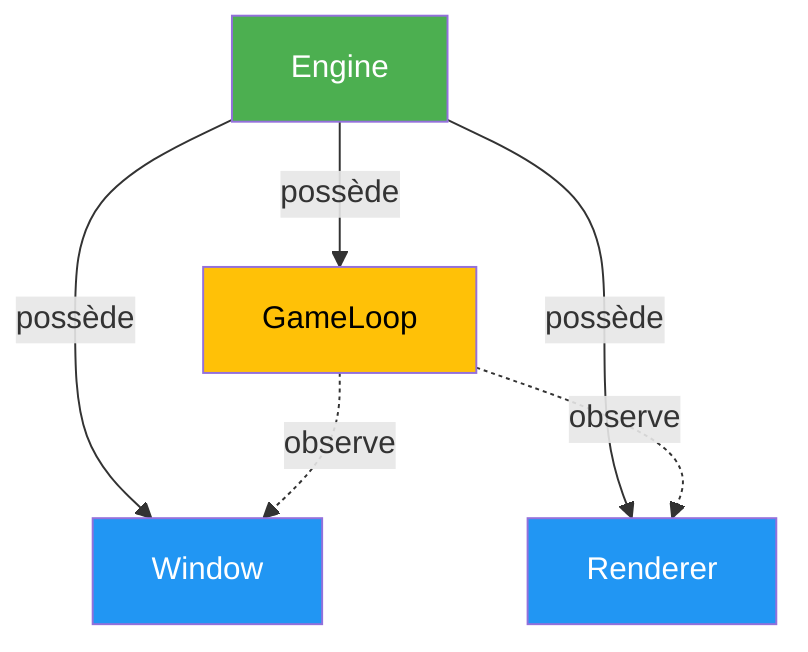

## Code Source Complet

### Déclaration (GameLoop.hpp)

```cpp
/*
** EPITECH PROJECT, 2025
** rtype [WSL: Ubuntu-24.04]
** File description:
** GameLoop
*/

#ifndef GAMELOOP_HPP_
#define GAMELOOP_HPP_

#include "IGameLoop.hpp"
#include "scenes/SceneManager.hpp"

#include <memory>

namespace core {
    class GameLoop: public IGameLoop {
        public:
            // Constructeur : prend des OBSERVATEURS (pointeurs bruts)
            GameLoop(graphics::IWindow* window, SceneManager* sceneManager);
            ~GameLoop();

            void run() override;      // Boucle principale
            void clear() override;    // Nettoyer l'écran
            void display() override;  // Afficher le frame

        private:
            // Pointeurs bruts = OBSERVATION, pas ownership
            graphics::IWindow* _window;
            SceneManager* _sceneManager;
    };
}

#endif /* !GAMELOOP_HPP_ */
```

### Implémentation (GameLoop.cpp)

```cpp
/*
** EPITECH PROJECT, 2025
** rtype [WSL: Ubuntu-24.04]
** File description:
** GameLoop
*/

#include "core/GameLoop.hpp"
#include <iostream>

namespace core {
    // Constructeur : initialise les pointeurs d'observation
    GameLoop::GameLoop(graphics::IWindow* window, SceneManager* sceneManager)
        : _window(window), _sceneManager(sceneManager)
    {
        // Pas d'allocation : on stocke juste les adresses
        // Les ressources sont possédées par Engine
    }

    GameLoop::~GameLoop()
    {
        // Pas de libération : on ne possède rien
    }

    // Boucle principale avec gestion des événements SFML 3
    void GameLoop::run()
    {
        while (_window->isOpen()) {
            // Étape 1: Traiter TOUS les événements en attente
            while (auto event = _window->pollEvent()) {
                // Fermeture de la fenêtre
                if (event->is<sf::Event::Closed>()) {
                    return;
                }
                // Déléguer au SceneManager
                _sceneManager->handleEvent(*event);
            }

            // Étape 2: Mise à jour de la scène
            _sceneManager->update();

            // Étape 3: Rendu
            clear();
            _sceneManager->render(_window);
            display();
        }
    }

    void GameLoop::clear()
    {
        _window->clear();
    }

    void GameLoop::display()
    {
        _window->display();
    }
}
```

### Points Clés SFML 3

#### Nouvelle API d'Événements

```cpp
// pollEvent() retourne std::optional<sf::Event>
while (auto event = _window->pollEvent()) {
    // event est un std::optional, déréférencer avec *event
    if (event->is<sf::Event::Closed>()) {
        return;
    }
    _sceneManager->handleEvent(*event);
}
```

**Avantages de SFML 3 :**

- Plus de `sf::Event event;` sans constructeur par défaut
- Typage fort avec `is<>()` et `getIf<>()`
- Code plus expressif et sûr

### Interface (IGameLoop.hpp)

```cpp
/*
** EPITECH PROJECT, 2025
** rtype [WSL: Ubuntu-24.04]
** File description:
** IGameLoop
*/

#ifndef IGAMELOOP_HPP_
#define IGAMELOOP_HPP_

#include "IRenderer.hpp"
#include "../graphics/IWindow.hpp"
#include "../graphics/IDrawable.hpp"

#include <memory>

namespace core {
    class IGameLoop {
        public:
            virtual ~IGameLoop() = default;

            virtual void run() = 0;      // Boucle principale
            virtual void clear() = 0;    // Nettoyer l'écran
            virtual void display() = 0;  // Afficher le frame
    };
}
#endif /* !IGAMELOOP_HPP_ */
```

## Le Pattern Clear → Update → Display Expliqué

### Vue d'Ensemble du Cycle

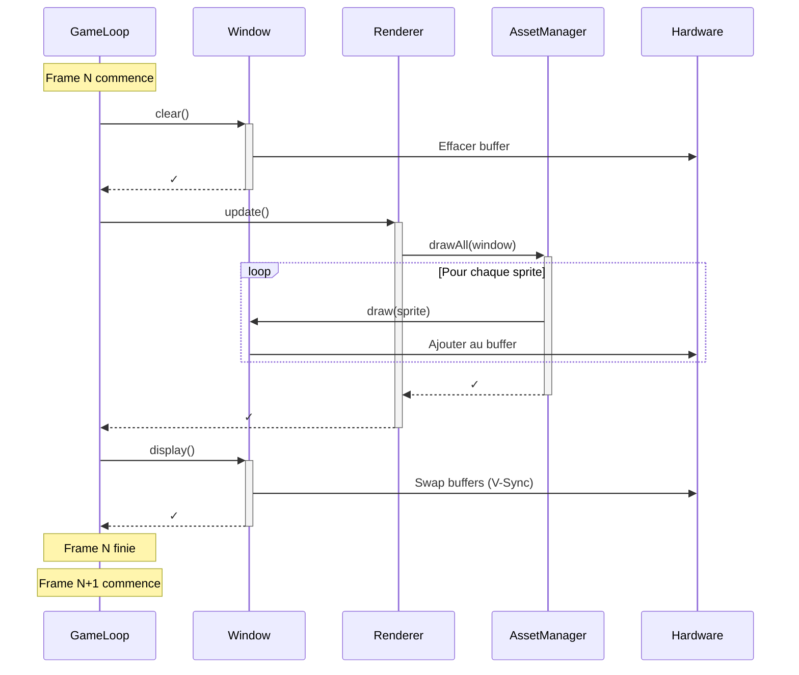

### Détail de Chaque Étape

#### Étape 1: Clear

```cpp
void GameLoop::clear()
{
    _window->clear();  // Délégation à la fenêtre
}
```

**Ce qui se passe :**

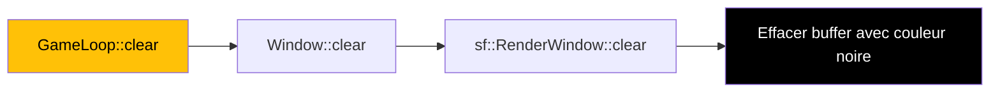

**Pourquoi c'est important :**

> **WARNING**: Sans `clear()`, les frames précédentes resteraient visibles, créant un effet de "traînée".

```cpp
// ❌ MAUVAIS : Oublier clear()
void GameLoop::run() {
    while (_window->isOpen()) {
        // Pas de clear() !
        _renderer->update();
        display();
    }
}
// Résultat : Les sprites s'accumulent, image corrompue
```

**Visualisation :**

```
Frame 1 (sans clear):        Frame 2 (sans clear):        Frame 3 (avec clear):
┌─────────────┐              ┌─────────────┐              ┌─────────────┐
│   🚀        │              │   🚀        │              │             │
│             │  +           │  🚀         │  +           │        🚀   │
│             │  =           │             │  =           │             │
│             │              │             │              │             │
└─────────────┘              └─────────────┘              └─────────────┘
  Rendu initial              Accumulation !               Propre !
```

#### Étape 2: Update

```cpp
void GameLoop::run()
{
    while (_window->isOpen()) {
        clear();
        _renderer->update();  // ← ICI : Dessiner tout
        display();
    }
}
```

**Ce qui se passe dans `_renderer->update()` :**

```cpp
// SFMLRenderer::update()
void SFMLRenderer::update()
{
    mAsset->drawAll(_window);  // Dessiner tous les sprites enregistrés
}
```

**Flux de dessin :**

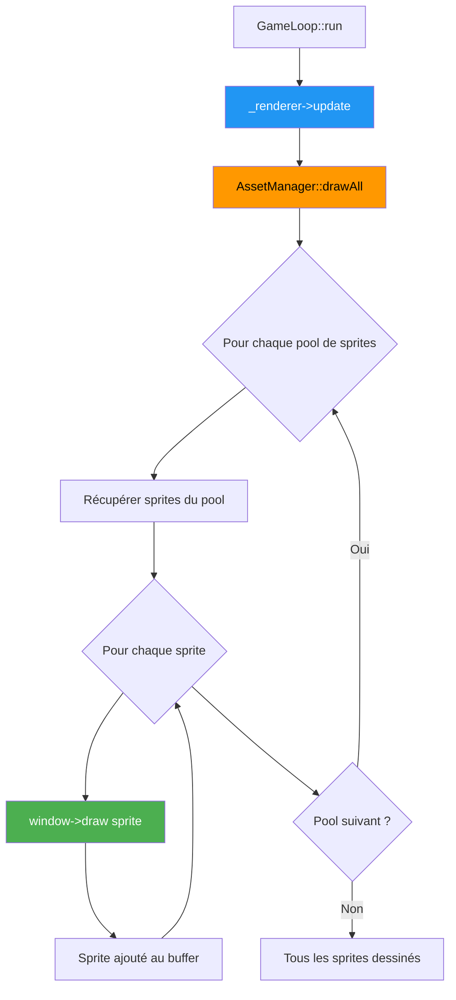

**Code de AssetManager::drawAll :**

```cpp
void AssetManager::drawAll(graphics::IWindow* window) {
    // Parcourir tous les pools de sprites (indexés par clé)
    for (auto const& [key, sprites]: spritePools) {
        // Dessiner chaque sprite du pool
        for (const auto& sprite: sprites) {
            window->draw(sprite);  // Ajouter au buffer de rendu
        }
    }
}
```

#### Étape 3: Display

```cpp
void GameLoop::display()
{
    _window->display();  // Délégation à la fenêtre
}
```

**Ce qui se passe :**


**Double Buffering expliqué :**

```
┌────────────────────────────────────────────────────┐
│                    SFML Internals                  │
├────────────────────────────────────────────────────┤
│                                                    │
│  Back Buffer (où on dessine)    Front Buffer      │
│  ┌─────────────┐                ┌─────────────┐  │
│  │   🚀        │   display()    │   🛸        │  │
│  │        ⭐   │  ───────────►  │   🌟  ☄️   │  │
│  │  ☄️         │   (swap)       │             │  │
│  └─────────────┘                └─────────────┘  │
│   Invisible                      Visible à       │
│   (en construction)              l'écran         │
└────────────────────────────────────────────────────┘

Après swap:
┌────────────────────────────────────────────────────┐
│  Back Buffer                    Front Buffer      │
│  ┌─────────────┐                ┌─────────────┐  │
│  │             │                │   🚀        │  │
│  │             │                │        ⭐   │  │
│  │             │                │  ☄️         │  │
│  └─────────────┘                └─────────────┘  │
│   Prêt pour                      Affichage       │
│   le clear suivant               du frame actuel │
└────────────────────────────────────────────────────┘
```

> **TIP**: Le double buffering évite le "tearing" (déchirure d'image) en affichant toujours une image complète.

### Le Cycle Complet Visualisé

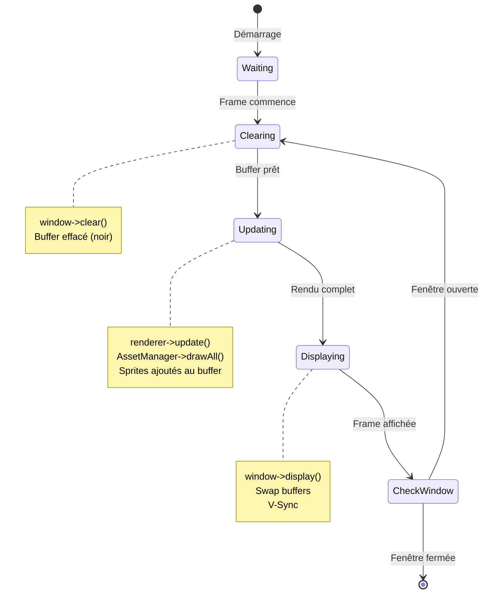

## Ownership et Gestion de la Mémoire

### Architecture de Pointeurs

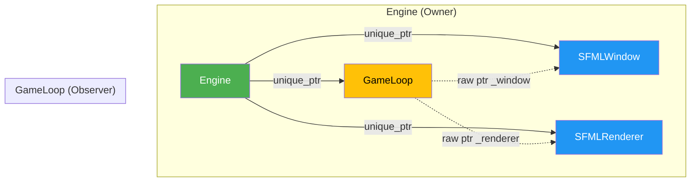

### Pourquoi des Pointeurs Bruts ?

#### Analyse du Constructeur

```cpp
GameLoop::GameLoop(graphics::IWindow* window, IRenderer* renderer)
    : _window(window), _renderer(renderer)
{
}
```

**Ce code signifie :**

1. **GameLoop ne POSSÈDE PAS** les ressources
2. GameLoop **OBSERVE** les ressources
3. La durée de vie de `_window` et `_renderer` est gérée ailleurs (par Engine)

#### Visualisation de la Mémoire

```
Stack Frame de Engine::initialize():
┌────────────────────────────────────────────┐
│ Engine this                                │
│   ├─ _window:    unique_ptr → [0x1000]    │
│   ├─ _renderer:  unique_ptr → [0x2000]    │
│   └─ _gameLoop:  unique_ptr → [0x3000]    │
└────────────────────────────────────────────┘
                     │
                     │
Heap:                │
┌────────────────────┼────────────────────────┐
│                    │                        │
│ [0x1000] SFMLWindow instance               │
│                    ▲                        │
│                    │                        │
│ [0x2000] SFMLRenderer instance             │
│            _window = 0x1000  ───────┘      │
│                    ▲                        │
│                    │                        │
│ [0x3000] GameLoop instance                 │
│            _window   = 0x1000  ─────────┘  │
│            _renderer = 0x2000  ─────┘      │
└────────────────────────────────────────────┘

Légende:
  unique_ptr → : Ownership (possède, libérera)
  raw ptr  = : Observation (regarde, ne libérera PAS)
```

### Destruction Séquentielle

> **WARNING**: L'ordre de destruction est CRITIQUE pour éviter les dangling pointers !

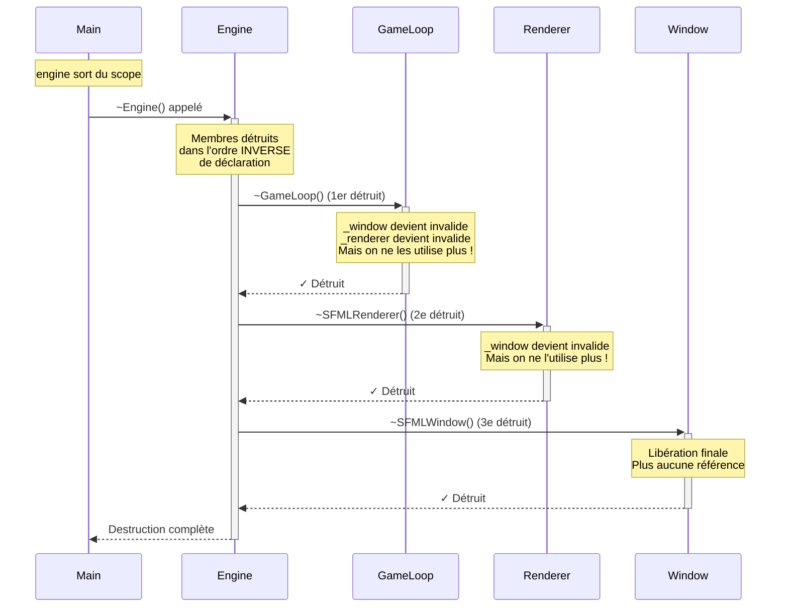

**Pourquoi cet ordre fonctionne :**

```cpp
class Engine {
private:
    std::unique_ptr<SFMLWindow> _window;      // Déclaré 1er → Détruit DERNIER
    std::unique_ptr<SFMLRenderer> _renderer;  // Déclaré 2e → Détruit 2e
    std::unique_ptr<GameLoop> _gameLoop;      // Déclaré 3e → Détruit PREMIER
};

// Ordre de destruction garanti :
// 1. ~GameLoop()      → Plus besoin de _window/_renderer
// 2. ~SFMLRenderer()  → Plus besoin de _window
// 3. ~SFMLWindow()    → Peut être détruit en toute sécurité
```

### Exemples Bon vs Mauvais Code

#### ✅ BON : Pointeurs bruts pour observation

```cpp
class GameLoop {
private:
    graphics::IWindow* _window;    // Observer
    IRenderer* _renderer;          // Observer
};

GameLoop::GameLoop(graphics::IWindow* window, IRenderer* renderer)
    : _window(window), _renderer(renderer)
{
    // Aucune allocation
    // Juste stocker les adresses
}

GameLoop::~GameLoop()
{
    // Aucune libération
    // On ne possède rien
}
```

**Avantages :**
- Intention claire : GameLoop n'est pas propriétaire
- Pas de gestion mémoire dans GameLoop
- Destruction automatique et sûre
- Performances optimales

#### ❌ MAUVAIS : Prendre ownership

```cpp
class GameLoop {
private:
    std::unique_ptr<graphics::IWindow> _window;    // ❌ Ownership volé !
    std::unique_ptr<IRenderer> _renderer;          // ❌ Ownership volé !
};

// Dans Engine::initialize()
_gameLoop = std::make_unique<GameLoop>(
    std::move(_window),      // ❌ On transfère l'ownership !
    std::move(_renderer)     // ❌ Engine ne possède plus rien !
);

// Problèmes :
// 1. Engine a perdu l'ownership
// 2. _window et _renderer sont maintenant nullptr dans Engine
// 3. Confusion sur qui possède quoi
// 4. Ordre de destruction problématique
```

#### ❌ MAUVAIS : Copies de shared_ptr

```cpp
class GameLoop {
private:
    std::shared_ptr<graphics::IWindow> _window;    // ❌ Overkill
    std::shared_ptr<IRenderer> _renderer;          // ❌ Overhead inutile
};

// Problèmes :
// 1. Shared ownership alors qu'on n'en a pas besoin
// 2. Overhead des compteurs de références (atomic ops)
// 3. Destruction retardée imprévisible
// 4. Confusion sur le propriétaire réel
```

## La Boucle While et la Condition de Sortie

### Anatomie de la Boucle

```cpp
void GameLoop::run()
{
    while (_window->isOpen()) {  // ← Condition de continuation
        clear();                 // ← Frame commence
        _renderer->update();     // ← Logique de jeu/rendu
        display();               // ← Frame se termine
    }
    // Sortie propre
}
```

### Diagramme de Flux Détaillé

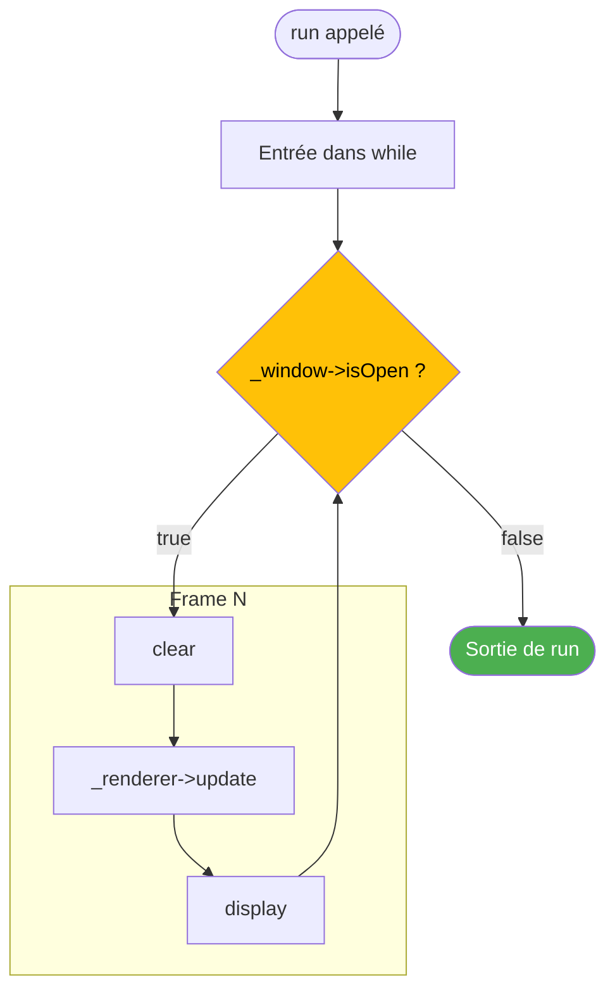

### Condition `_window->isOpen()`

**Implémentation dans SFMLWindow :**

```cpp
bool SFMLWindow::isOpen()
{
    return _window.isOpen();  // Délégation à sf::RenderWindow
}
```

**SFML gère automatiquement :**

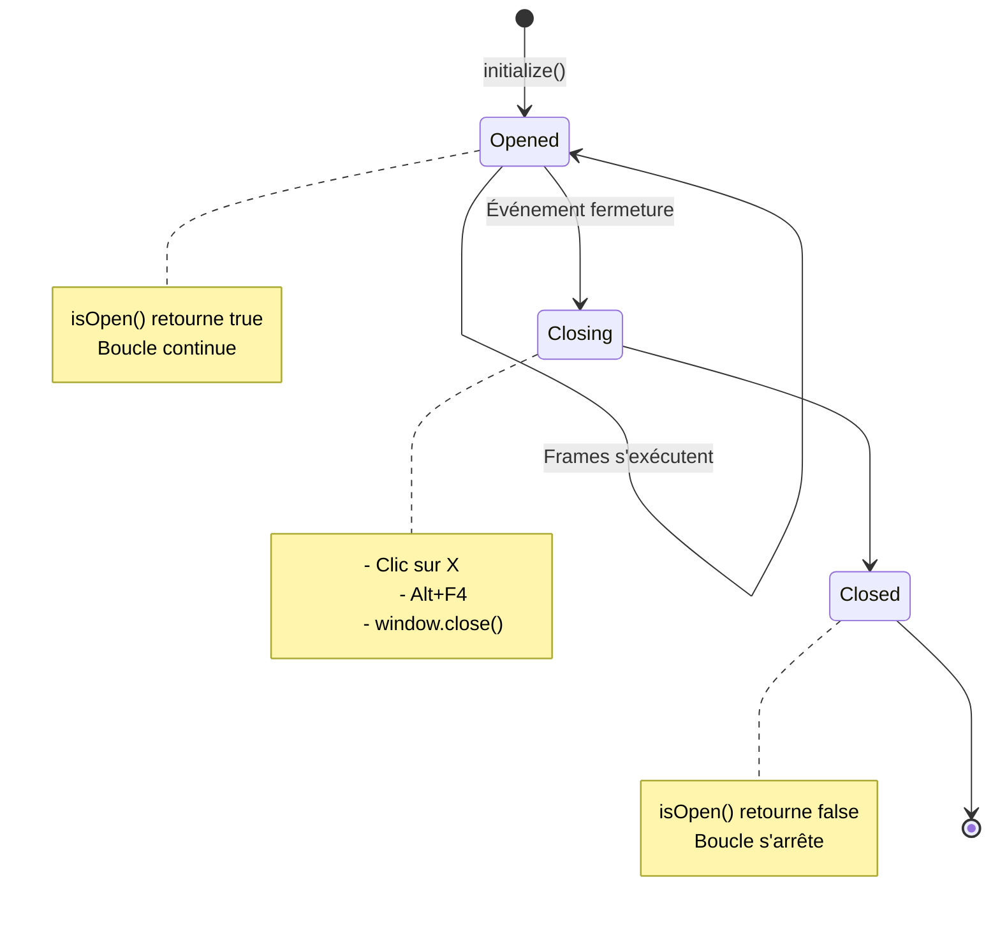

### Gestion des Événements (Futur)

> **TIP**: Actuellement, AUCUN événement n'est traité ! La fenêtre peut paraître "figée".

**Problème actuel :**

```cpp
void GameLoop::run()
{
    while (_window->isOpen()) {
        // ❌ Aucun polling d'événements !
        // La fenêtre ne répond pas aux clics, mouvements, etc.
        clear();
        _renderer->update();
        display();
    }
}
```

**Solution future :**

```cpp
void GameLoop::run()
{
    while (_window->isOpen()) {
        // ✅ Traiter les événements en premier
        sf::Event event;
        while (_window->pollEvent(event)) {
            if (event.type == sf::Event::Closed) {
                _window->close();
            }
            // Autres événements : clavier, souris, resize...
        }

        clear();
        _renderer->update();
        display();
    }
}
```

### Blocage de `run()`

> **WARNING**: `run()` est **bloquant** : le contrôle ne revient à l'appelant que quand la fenêtre est fermée.

```cpp
int main() {
    core::Engine engine;
    engine.initialize();

    std::cout << "Avant run" << std::endl;
    engine.run();  // ← BLOQUE ICI pendant toute l'exécution
    std::cout << "Après run" << std::endl;  // ← Exécuté seulement à la fermeture

    return 0;
}
```

**Trace d'exécution :**

```
Avant run
[Fenêtre s'ouvre]
[Boucle while s'exécute pendant des minutes/heures]
[Utilisateur ferme la fenêtre]
[Boucle se termine]
Après run
```

## Futures Améliorations

### 1. Delta Time (Temps Écoulé)

**Problème actuel :** Le jeu tourne à la vitesse du V-Sync (généralement 60 FPS), mais sans contrôle.

```cpp
// ❌ Vitesse dépendante du framerate
void movePlayer() {
    player.x += 5;  // 5 pixels par frame
    // À 60 FPS : 300 px/s
    // À 30 FPS : 150 px/s  ← Incohérent !
}
```

**Solution avec delta time :**

```cpp
class GameLoop {
public:
    void run() {
        sf::Clock clock;
        float deltaTime = 0.0f;

        while (_window->isOpen()) {
            deltaTime = clock.restart().asSeconds();  // Temps depuis dernière frame

            clear();
            _renderer->update(deltaTime);  // Passer deltaTime
            display();
        }
    }
};

// Mouvement indépendant du framerate
void movePlayer(float deltaTime) {
    float speed = 300.0f;  // pixels par seconde
    player.x += speed * deltaTime;
    // À 60 FPS (deltaTime ≈ 0.0166) : 300 * 0.0166 = 5 px
    // À 30 FPS (deltaTime ≈ 0.0333) : 300 * 0.0333 = 10 px
    // Vitesse réelle toujours 300 px/s !
}
```

**Diagramme avec Delta Time :**

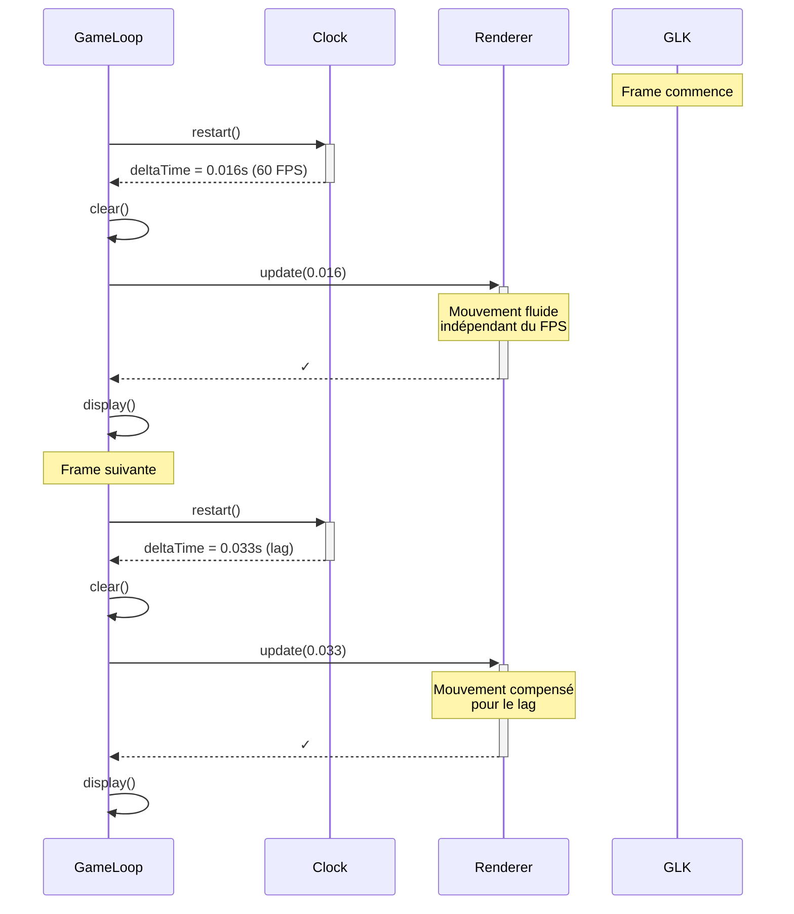

### 2. FPS Cap (Limitation de Framerate)

**Problème actuel :** Le jeu tourne à la vitesse maximale du V-Sync (peut consommer beaucoup de CPU).

```cpp
class GameLoop {
public:
    void setTargetFPS(unsigned int fps) {
        _window->setFramerateLimit(fps);  // Délégation à SFML
    }

    void run() {
        while (_window->isOpen()) {
            clear();
            _renderer->update();
            display();
            // SFML gère automatiquement le sleep pour atteindre le FPS cible
        }
    }
};
```

### 3. Gestion des Événements

**Amélioration majeure :**

```cpp
class GameLoop {
public:
    void run() {
        while (_window->isOpen()) {
            // Nouvelle étape : processEvents
            processEvents();

            clear();
            _renderer->update();
            display();
        }
    }

private:
    void processEvents() {
        sf::Event event;
        while (_window->pollEvent(event)) {
            switch (event.type) {
                case sf::Event::Closed:
                    _window->close();
                    break;

                case sf::Event::KeyPressed:
                    // Gérer les touches
                    break;

                case sf::Event::MouseButtonPressed:
                    // Gérer la souris
                    break;

                // Autres événements...
            }
        }
    }
};
```

**Nouveau cycle :**

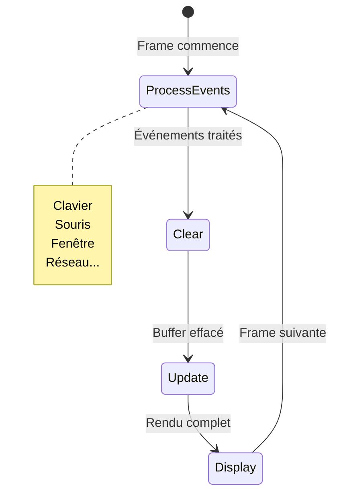

### 4. États de Jeu (Game States)

**Architecture modulaire :**

```cpp
class IGameState {
public:
    virtual void update(float deltaTime) = 0;
    virtual void render(IRenderer* renderer) = 0;
    virtual void handleEvent(const sf::Event& event) = 0;
};

class GameLoop {
public:
    void run() {
        while (_window->isOpen()) {
            processEvents();
            clear();

            // Update et render de l'état actuel
            if (_currentState) {
                _currentState->update(_deltaTime);
                _currentState->render(_renderer);
            }

            display();
        }
    }

    void changeState(std::unique_ptr<IGameState> newState) {
        _currentState = std::move(newState);
    }

private:
    std::unique_ptr<IGameState> _currentState;
};
```

**Exemples d'états :**
- `MenuState` : Menu principal
- `GameplayState` : Jeu en cours
- `PauseState` : Jeu en pause
- `GameOverState` : Fin de partie

### 5. Fixed Timestep (Pour la Physique)

**Séparation update logique / rendu :**

```cpp
class GameLoop {
public:
    void run() {
        const float FIXED_TIMESTEP = 1.0f / 60.0f;  // 60 updates/s
        float accumulator = 0.0f;
        sf::Clock clock;

        while (_window->isOpen()) {
            float deltaTime = clock.restart().asSeconds();
            accumulator += deltaTime;

            processEvents();

            // Fixed update pour la logique/physique
            while (accumulator >= FIXED_TIMESTEP) {
                updateLogic(FIXED_TIMESTEP);  // Timestep fixe
                accumulator -= FIXED_TIMESTEP;
            }

            // Rendu variable
            clear();
            _renderer->update();
            display();
        }
    }
};
```

**Avantages :**
- Physique déterministe (toujours le même timestep)
- Rendu à framerate variable (fluide)
- Replay et networking facilités

## Diagrammes de Séquence Complets

### Séquence Complète d'une Frame

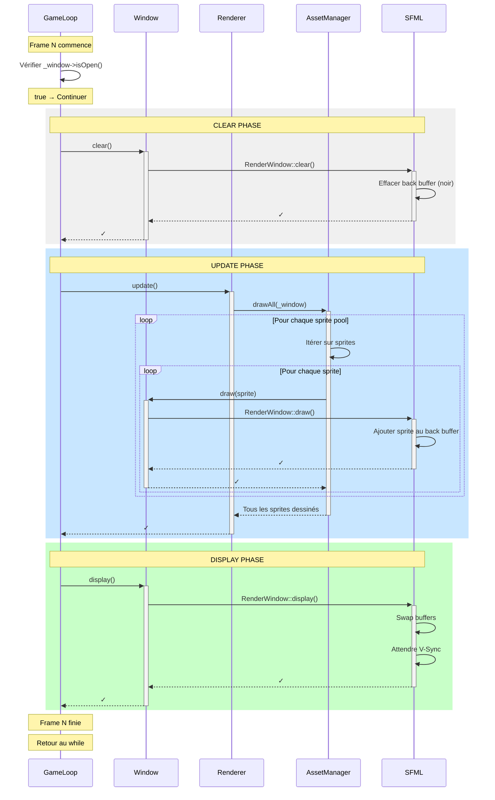

### Séquence de Fermeture

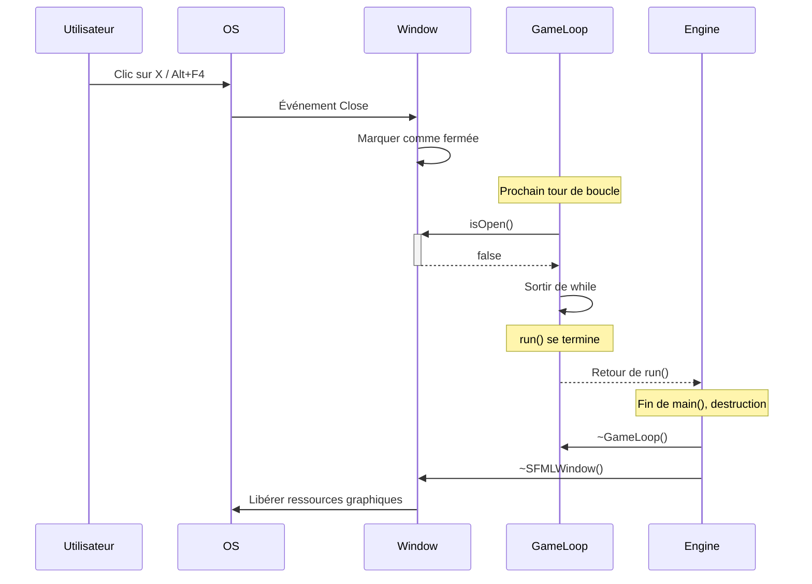

## Comparaisons et Bonnes Pratiques

### Pattern Clear-Update-Display

#### ✅ BON : Ordre correct

```cpp
void GameLoop::run()
{
    while (_window->isOpen()) {
        clear();            // 1. Nettoyer
        _renderer->update(); // 2. Dessiner
        display();          // 3. Afficher
    }
}
```

#### ❌ MAUVAIS : Ordre inversé

```cpp
void GameLoop::run()
{
    while (_window->isOpen()) {
        display();          // ❌ Afficher quoi ? Buffer vide !
        clear();            // ❌ On efface ce qu'on vient d'afficher
        _renderer->update(); // ❌ On dessine mais on n'affichera pas
    }
}
// Résultat : Rien ne s'affiche ou frames retardées d'un cycle
```

#### ❌ MAUVAIS : Oublier clear()

```cpp
void GameLoop::run()
{
    while (_window->isOpen()) {
        // Pas de clear() !
        _renderer->update(); // Dessiner PAR DESSUS le frame précédent
        display();
    }
}
// Résultat : Accumulation de sprites, image corrompue
```

#### ❌ MAUVAIS : Oublier display()

```cpp
void GameLoop::run()
{
    while (_window->isOpen()) {
        clear();
        _renderer->update();
        // Pas de display() !
    }
}
// Résultat : Image figée, rien ne s'affiche
```

### Vérification de Validité

#### ✅ BON : Vérifier les pointeurs (futur)

```cpp
void GameLoop::run()
{
    if (!_window || !_renderer) {
        throw std::runtime_error("GameLoop: pointeurs invalides");
    }

    while (_window->isOpen()) {
        clear();
        _renderer->update();
        display();
    }
}
```

#### ❌ MAUVAIS : Assumer la validité

```cpp
void GameLoop::run()
{
    // Aucune vérification
    while (_window->isOpen()) {  // Crash si _window est nullptr !
        clear();
        _renderer->update();
        display();
    }
}
```

## Questions Fréquentes (FAQ)

### Q1: Pourquoi `run()` est-elle bloquante ?

**Réponse :**

C'est le design classique d'une game loop. L'alternative serait une boucle externe :

```cpp
// ✅ Design actuel : Boucle interne (bloquante)
engine.initialize();
engine.run();  // Bloque jusqu'à fermeture

// ❌ Alternative : Boucle externe (plus complexe)
engine.initialize();
while (engine.isRunning()) {
    engine.updateFrame();  // Une frame à la fois
}
```

**Avantages de la boucle interne :**
- Simplicité
- Contrôle centralisé du timing
- Pas besoin de gérer la boucle dans le code utilisateur

### Q2: Peut-on mettre la boucle en pause ?

**Réponse (futur) :**

Oui, avec un flag de pause :

```cpp
class GameLoop {
public:
    void pause() { _paused = true; }
    void resume() { _paused = false; }

    void run() {
        while (_window->isOpen()) {
            if (_paused) {
                // Continuer à afficher mais pas à update
                display();
                continue;
            }

            clear();
            _renderer->update();
            display();
        }
    }

private:
    bool _paused = false;
};
```

### Q3: Comment mesurer les FPS ?

**Réponse :**

Avec un compteur et une clock :

```cpp
class GameLoop {
public:
    void run() {
        sf::Clock clock;
        int frameCount = 0;
        float elapsedTime = 0.0f;

        while (_window->isOpen()) {
            float deltaTime = clock.restart().asSeconds();
            elapsedTime += deltaTime;
            frameCount++;

            if (elapsedTime >= 1.0f) {  // Chaque seconde
                float fps = frameCount / elapsedTime;
                std::cout << "FPS: " << fps << std::endl;
                frameCount = 0;
                elapsedTime = 0.0f;
            }

            clear();
            _renderer->update();
            display();
        }
    }
};
```

### Q4: Pourquoi ne pas utiliser `std::thread` pour la boucle ?

**Réponse :**

SFML **exige** que le rendu se fasse sur le thread principal :

```cpp
// ❌ MAUVAIS : Renderer dans un thread séparé
void Engine::run() {
    std::thread gameThread([this]() {
        _gameLoop->run();  // ERREUR ! SFML interdit ça
    });
    gameThread.join();
}
```

**Restrictions SFML :**
- Fenêtre créée sur thread A
- Rendu DOIT se faire sur thread A
- Violer cette règle = crash ou undefined behavior

### Q5: Comment gérer plusieurs fenêtres ?

**Réponse :**

Créer plusieurs GameLoop (complexe) ou gérer manuellement :

```cpp
// Option 1: Une GameLoop par fenêtre (non recommandé)
GameLoop loop1(window1, renderer1);
GameLoop loop2(window2, renderer2);

std::thread t1([&]() { loop1.run(); });  // Thread séparé
std::thread t2([&]() { loop2.run(); });  // Thread séparé
t1.join();
t2.join();

// Option 2: Boucle manuelle (recommandé)
while (window1->isOpen() || window2->isOpen()) {
    if (window1->isOpen()) {
        window1->clear();
        renderer1->update();
        window1->display();
    }

    if (window2->isOpen()) {
        window2->clear();
        renderer2->update();
        window2->display();
    }
}
```

## Résumé des Points Clés

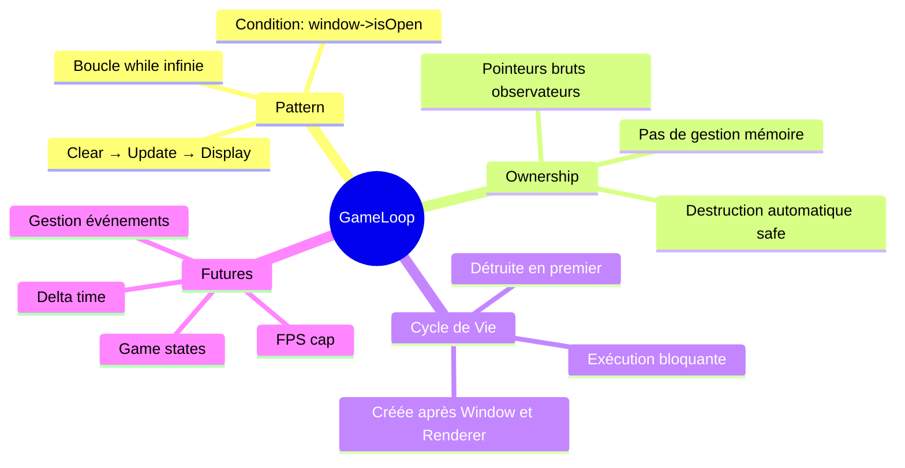

## Checklist de Compréhension

Avant de continuer, assurez-vous de comprendre :

- [ ] Le pattern Clear → Update → Display et pourquoi cet ordre est important
- [ ] Le rôle de chaque méthode (clear, update, display)
- [ ] Pourquoi GameLoop utilise des pointeurs bruts et non des unique_ptr
- [ ] Comment fonctionne la boucle while avec isOpen()
- [ ] Pourquoi run() est bloquante
- [ ] Le concept de double buffering
- [ ] L'ordre de destruction et pourquoi il est sûr
- [ ] Les limitations actuelles (pas d'événements, pas de delta time)
- [ ] Les futures améliorations possibles

## Voir Aussi

- [Scenes Documentation](./scenes.md) - Système de gestion des scènes
- [Engine Documentation](./engine.md) - Orchestrateur principal
- [Renderer Documentation](./renderer.md) - Système de rendu
- [Window Documentation](../graphics/window.md) - Gestion de la fenêtre
- [Architecture Globale](../architecture/overview.md) - Vue d'ensemble
