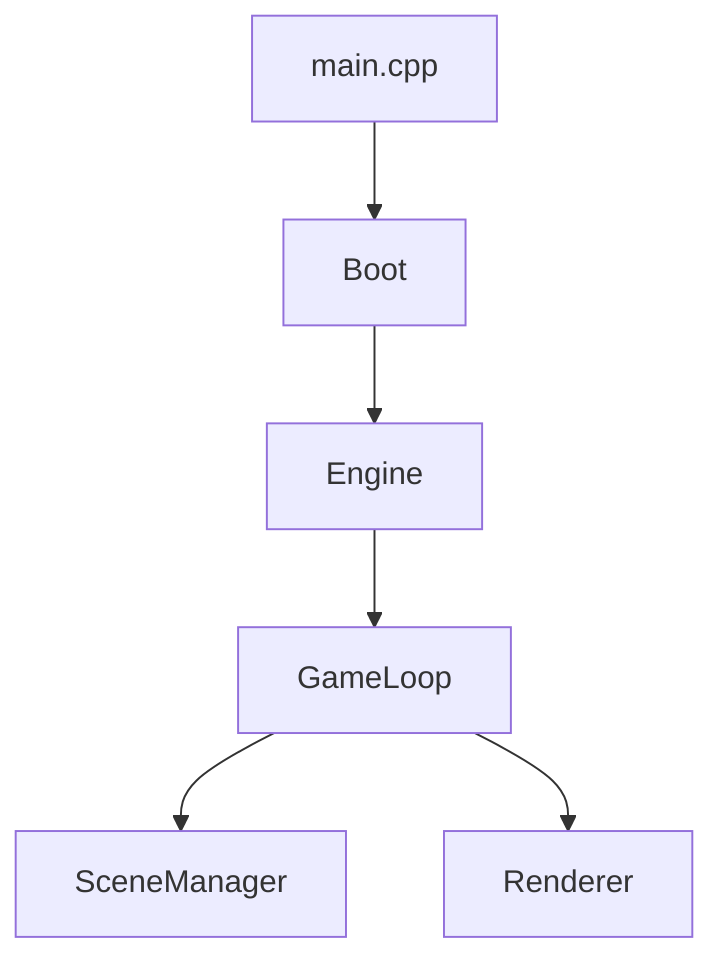
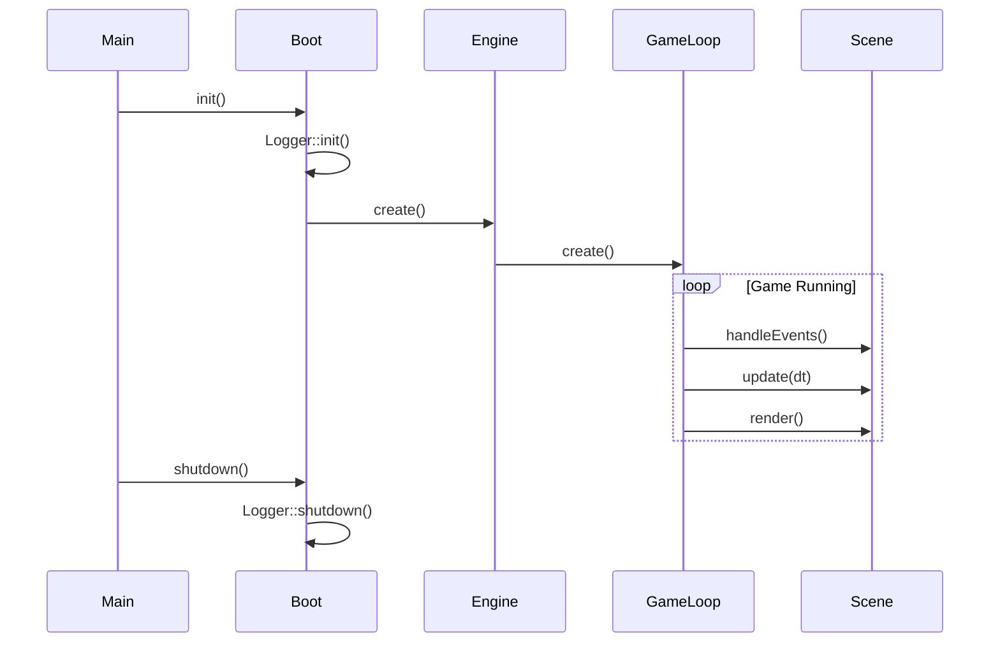

# Core Client - Composants Principaux

Le module **Core** contient les composants fondamentaux du client R-Type qui gèrent le cycle de vie de l'application, le moteur de jeu, et l'orchestration générale.

## Vue d'Ensemble



## Composants

### [Boot](boot.md) - Initialisation
**Rôle:** Point d'entrée et initialisation de l'application

- Initialisation du système de logging
- Connexion au serveur via TCPClient
- Création et lancement du moteur (Engine)
- Gestion des erreurs fatales

**Fichiers:**
- `src/client/boot/Boot.cpp`
- `src/client/include/boot/Boot.hpp`

---

### [Engine](engine.md) - Moteur Principal
**Rôle:** Orchestration générale de l'application

- Gestion du lifecycle de l'application
- Coordination entre composants
- Initialisation du GameLoop
- Interface avec le réseau (TCPClient)

**Fichiers:**
- `src/client/core/Engine.cpp`
- `src/client/include/core/Engine.hpp`

---

### [GameLoop](gameloop.md) - Boucle de Jeu
**Rôle:** Gestion du cycle Update/Render

- Boucle principale du jeu (fixe ou variable)
- Gestion des événements (input, réseau)
- Update de la logique de jeu
- Coordination du rendu

**Fichiers:**
- `src/client/core/GameLoop.cpp`
- `src/client/include/core/GameLoop.hpp`

---

### [SceneManager](scenes.md) - Gestion des Scènes
**Rôle:** Système de transitions entre écrans

- LoginScene (authentification)
- GameScene (gameplay)
- Transitions fluides
- Gestion du state

**Fichiers:**
- `src/client/scenes/SceneManager.cpp`
- `src/client/scenes/LoginScene.cpp`
- `src/client/scenes/GameScene.cpp`

---

### [Renderer](renderer.md) - Abstraction Rendu
**Rôle:** Interface de rendu indépendante du backend

- Interface IRenderer
- Implémentation SFML (SFMLRenderer)
- Gestion de la fenêtre (IWindow)

**Fichiers:**
- `src/client/implementations/sfml/SFMLRenderer.cpp`
- `src/client/implementations/sfml/SFMLWindow.cpp`

---

### [main.cpp](main.md) - Point d'Entrée
**Rôle:** Fonction main() et configuration globale

- Initialisation logging
- Création Boot
- Exception handling
- Shutdown propre

**Fichier:**
- `src/client/main.cpp`

---

## Système de Logging

Tous les composants Core utilisent le [système de logging centralisé](../../development/logging.md) avec des loggers spécialisés:

- **BootLogger**: Initialisation et connexion serveur
- **EngineLogger**: Lifecycle du moteur
- **SceneLogger**: Transitions de scènes
- **GraphicsLogger**: Fenêtre et rendu

## Diagramme de Séquence



## Architecture

### Dépendances

```
main.cpp
  └─> Boot
       └─> Engine
            ├─> GameLoop
            │    ├─> SceneManager
            │    │    └─> IScene (LoginScene, GameScene)
            │    └─> IRenderer (SFMLRenderer)
            │         └─> IWindow (SFMLWindow)
            └─> TCPClient
```

### Ownership

- **main.cpp** possède **Boot** (unique_ptr)
- **Boot** possède **Engine** (unique_ptr)
- **Engine** possède **GameLoop** (unique_ptr)
- **GameLoop** possède **SceneManager** (unique_ptr)
- **SceneManager** possède **IScene active** (unique_ptr)

## État d'Implémentation

| Composant | État | Complétude |
|-----------|------|------------|
| Boot | ✅ Implémenté | 80% |
| Engine | ✅ Implémenté | 70% |
| GameLoop | ✅ Implémenté | 60% |
| SceneManager | ✅ Implémenté | 50% |
| Scenes | 🚧 En cours | 30% |
| Renderer | ✅ Implémenté | 40% |

## Prochaines Étapes

1. **Finaliser GameLoop** - Timing précis, interpolation
2. **Enrichir Scenes** - UI complète, animations
3. **Optimiser Renderer** - Batching, culling
4. **ECS Integration** - Intégrer Entity Component System

## Voir Aussi

- [Architecture Client Complète](../architecture/overview.md)
- [Graphics - Rendu et Assets](../graphics/overview.md)
- [Network - TCPClient](../network/tcp-client.md)
- [Système de Logging](../../development/logging.md)
