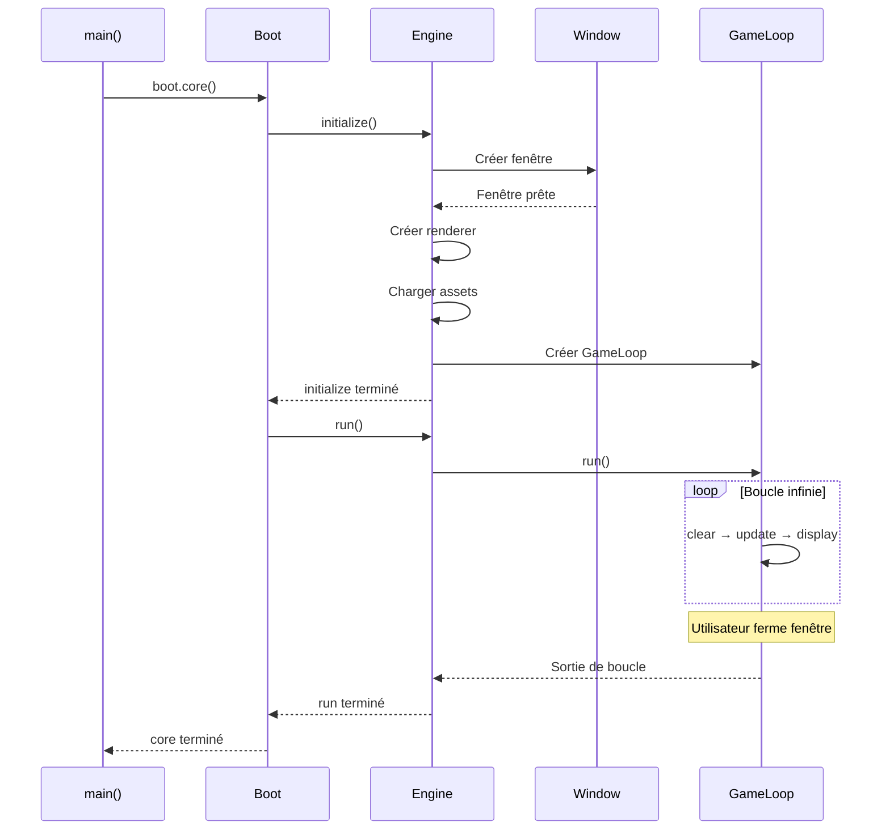

# main - Point d'Entrée de l'Application

## Vue d'Ensemble

Le fichier **main.cpp** est le **point d'entrée absolu** de l'application client R-Type. Il contient la fonction `main()` qui marque le début de l'exécution du programme et met en place la gestion globale des exceptions.

!!! info "Localisation"
    - **Fichier**: `/home/simia/epitech/second_year/projects/rtype/src/client/main.cpp`
    - **Fonction**: `int main(void)`
    - **Retour**: Code de sortie (0 = succès, 1 = erreur)

!!! success "Responsabilités"
    - **Création de Boot**: Instancie l'orchestrateur principal
    - **Lancement de l'application**: Appelle `Boot::core()`
    - **Gestion des exceptions**: Capture et affiche les erreurs fatales
    - **Code de sortie**: Retourne le statut au système d'exploitation

---

## Code Source Complet

```cpp
/*
** EPITECH PROJECT, 2025
** rtype [WSL: Ubuntu-24.04]
** File description:
** main
*/

#include "main.hpp"

int main(void)
{
    try {
        Boot boot;        // Créer l'orchestrateur
        boot.core();      // Lancer l'application (bloquant)
    }
    catch(const std::exception& e) {
        // Capture toutes les exceptions std
        std::cerr << e.what() << '\n';
        return 1;  // Code d'erreur
    }
    return 0;  // Succès
}
```

---

## Flux d'Exécution


---

## Analyse Détaillée

### Structure try-catch

```cpp
try {
    Boot boot;
    boot.core();
}
catch(const std::exception& e) {
    std::cerr << e.what() << '\n';
    return 1;
}
```

**Exceptions capturées** :

- `std::runtime_error` : Erreurs de logique
- `std::logic_error` : Erreurs de programmation
- `std::bad_alloc` : Manque de mémoire
- `boost::system::system_error` : Erreurs réseau Boost.Asio
- Toutes les exceptions dérivées de `std::exception`

**Exceptions NON capturées** :

- Types primitifs (int, char*, etc.) lancés comme exceptions
- Exceptions custom qui n'héritent pas de `std::exception`

---

### Création de Boot

```cpp
Boot boot;
```

**Que se passe-t-il ?**

1. **Constructeur Boot** appelé
2. **io_context** créé automatiquement
3. **TCPClient** créé avec `make_unique`
   - Connection async à 127.0.0.1:4123 lancée
4. **Engine** créé avec `make_unique`
5. **Boot prêt** mais pas encore initialisé

**Temps d'exécution** : ~10-50ms (dépend de la connexion réseau)

---

### Appel à `boot.core()`

```cpp
boot.core();
```

**Étapes internes** :



**Note importante** : `boot.core()` est **bloquant** jusqu'à ce que l'utilisateur ferme la fenêtre.

---

### Gestion d'Erreur

```cpp
catch(const std::exception& e) {
    std::cerr << e.what() << '\n';
    return 1;
}
```

**Exemples d'erreurs capturées** :

| Exception | Cause possible | Message typique |
|-----------|----------------|-----------------|
| `std::runtime_error` | Fichier asset manquant | "Failed to load texture: player.png" |
| `boost::system::system_error` | Serveur inaccessible | "Connection refused" |
| `std::bad_alloc` | Manque de RAM | "std::bad_alloc" |
| `std::out_of_range` | Texture non cachée | "Texture 'foo.png' not found" |

**Exemple de sortie d'erreur** :

```bash
$ ./rtype_client
Failed to load texture: assets/spaceship/bedroom.jpg
$ echo $?
1
```

---

## Codes de Retour

| Code | Signification | Quand ? |
|------|---------------|---------|
| `0` | Succès | Application fermée normalement |
| `1` | Erreur | Exception capturée |
| Autres | Erreur système | Crash, segfault, etc. (non géré) |

**Utilisation dans scripts** :

```bash
#!/bin/bash
./rtype_client
if [ $? -eq 0 ]; then
    echo "Client terminé normalement"
else
    echo "Client a rencontré une erreur"
fi
```

---

## Cycle de Vie Complet

```mermaid
stateDiagram-v2
    [*] --> OSLaunch : OS exécute binaire

    OSLaunch --> MainEntry : Entrée dans main()

    MainEntry --> TryBlock : try {

    TryBlock --> BootCreation : Boot boot
    BootCreation --> CoreCall : boot.core()

    CoreCall --> Initialize : engine->initialize()
    Initialize --> Run : engine->run()

    Run --> GameLoopRunning : Boucle de jeu active
    GameLoopRunning --> GameLoopRunning : Frames

    GameLoopRunning --> WindowClosed : Utilisateur ferme
    WindowClosed --> ReturnSuccess : return 0

    TryBlock --> Exception : Exception lancée
    Exception --> Catch : catch block
    Catch --> PrintError : std::cerr
    PrintError --> ReturnError : return 1

    ReturnSuccess --> OSExit : OS récupère code 0
    ReturnError --> OSExit : OS récupère code 1
    OSExit --> [*]

    note right of GameLoopRunning
        Point bloquant:
        main() attend ici
        jusqu'à fermeture
    end note
```

---

## Exemples d'Utilisation

### Exemple 1 : Exécution Standard

```bash
$ ./rtype_client
# Fenêtre s'ouvre
# Jeu tourne...
# Utilisateur ferme la fenêtre
$ echo $?
0
```

### Exemple 2 : Erreur de Connexion

```bash
$ ./rtype_client
boost::asio::connect: Connection refused
$ echo $?
1
```

### Exemple 3 : Avec Valgrind

```bash
$ valgrind --leak-check=full ./rtype_client
# Vérifier les fuites mémoire à la sortie
```

---

## Variantes et Extensions

### Version avec Logging

```cpp
#include "main.hpp"
#include <iostream>
#include <chrono>

int main(void)
{
    auto start = std::chrono::steady_clock::now();

    std::cout << "=== R-Type Client Starting ===" << std::endl;

    try {
        Boot boot;
        std::cout << "Boot created successfully" << std::endl;

        boot.core();
        std::cout << "Application exited normally" << std::endl;

    } catch(const std::exception& e) {
        std::cerr << "FATAL ERROR: " << e.what() << '\n';
        return 1;
    }

    auto end = std::chrono::steady_clock::now();
    auto duration = std::chrono::duration_cast<std::chrono::seconds>(end - start);
    std::cout << "Runtime: " << duration.count() << "s" << std::endl;

    return 0;
}
```

### Version avec Arguments de Ligne de Commande

```cpp
int main(int argc, char* argv[])
{
    // Analyser les arguments
    std::string serverIp = "127.0.0.1";
    int serverPort = 4123;

    if (argc > 1) serverIp = argv[1];
    if (argc > 2) serverPort = std::stoi(argv[2]);

    try {
        // Passer config à Boot (nécessite refactoring)
        Boot boot(serverIp, serverPort);
        boot.core();
    } catch(const std::exception& e) {
        std::cerr << e.what() << '\n';
        return 1;
    }
    return 0;
}

// Usage: ./rtype_client 192.168.1.10 8080
```

---

## Limitations Actuelles

!!! warning "Pas de gestion de signaux"
    Le programme ne capture pas les signaux Unix (SIGINT, SIGTERM, etc.)

    ```cpp
    // Amélioration future :
    #include <signal.h>

    void signalHandler(int signum) {
        std::cout << "Interrupt signal (" << signum << ") received." << std::endl;
        // Cleanup...
        exit(signum);
    }

    int main() {
        signal(SIGINT, signalHandler);
        signal(SIGTERM, signalHandler);
        // ...
    }
    ```

!!! warning "Pas de configuration"
    Toutes les valeurs sont hardcodées (IP serveur, port, taille fenêtre, etc.)

---

## Questions Fréquentes

**Q: Pourquoi `main(void)` et pas `main(int argc, char* argv[])` ?**

R: Actuellement, le client n'utilise pas d'arguments de ligne de commande. `void` indique explicitement qu'aucun argument n'est attendu.

**Q: Pourquoi capturer uniquement `std::exception` ?**

R: C'est la classe de base de toutes les exceptions standard C++. Elle couvre 99% des cas d'usage. Pour capturer TOUT :

```cpp
catch (...) {
    std::cerr << "Unknown exception caught" << std::endl;
    return 1;
}
```

**Q: Que se passe-t-il si une exception est lancée pendant la destruction de Boot ?**

R: Les exceptions lancées dans les destructeurs sont dangereuses. C++ appelle `std::terminate()` si une exception échappe à un destructeur. Les destructeurs doivent donc être `noexcept`.

---

## Améliorations Futures

### 1. Arguments CLI

```cpp
#include <boost/program_options.hpp>

int main(int argc, char* argv[]) {
    namespace po = boost::program_options;

    po::options_description desc("Options");
    desc.add_options()
        ("help", "Afficher l'aide")
        ("server", po::value<std::string>()->default_value("127.0.0.1"), "IP serveur")
        ("port", po::value<int>()->default_value(4123), "Port serveur");

    po::variables_map vm;
    po::store(po::parse_command_line(argc, argv, desc), vm);
    po::notify(vm);

    if (vm.count("help")) {
        std::cout << desc << std::endl;
        return 0;
    }

    // ...
}
```

### 2. Fichier de Configuration

```cpp
#include <fstream>
#include <nlohmann/json.hpp>

int main() {
    // Charger config.json
    std::ifstream configFile("config.json");
    auto config = nlohmann::json::parse(configFile);

    std::string serverIp = config["server"]["ip"];
    int serverPort = config["server"]["port"];

    // ...
}
```

### 3. Gestion de Signaux

```cpp
#include <csignal>

std::atomic<bool> shouldExit{false};

void signalHandler(int signal) {
    shouldExit = true;
}

int main() {
    std::signal(SIGINT, signalHandler);
    std::signal(SIGTERM, signalHandler);

    // Passer shouldExit à Boot pour arrêt gracieux
}
```

---

## Résumé

Le **main** du client R-Type est minimaliste mais robuste :

✅ **Simple** : 10 lignes de code
✅ **Robuste** : Gestion d'exceptions
✅ **Clair** : Responsabilités évidentes

**Flux** : `main() → Boot → Engine → GameLoop`

**Améliorations futures** : Arguments CLI, config file, signal handling

!!! tip "Voir Aussi"
    - [Boot](./boot.md) - L'orchestrateur créé par main
    - [Engine](./engine.md) - Le moteur lancé par Boot
    - [Architecture](../architecture/overview.md) - Vue d'ensemble du système
