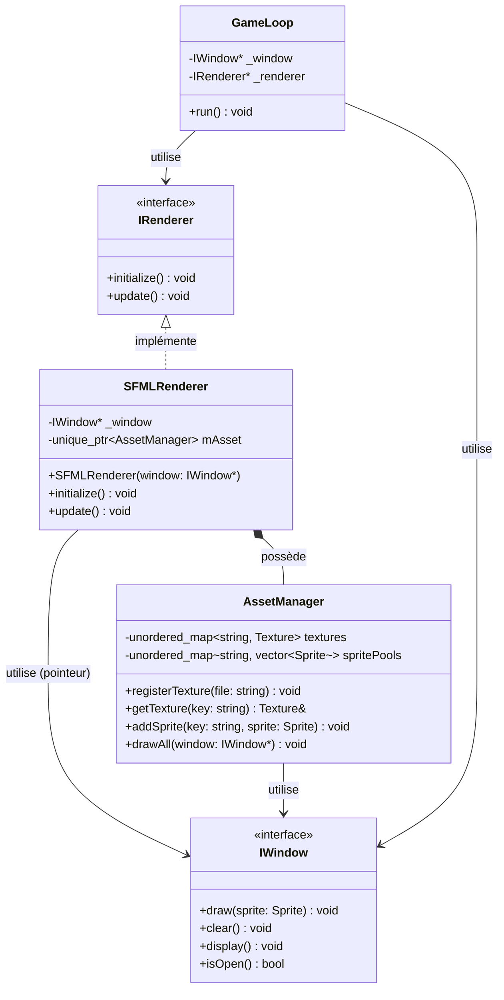
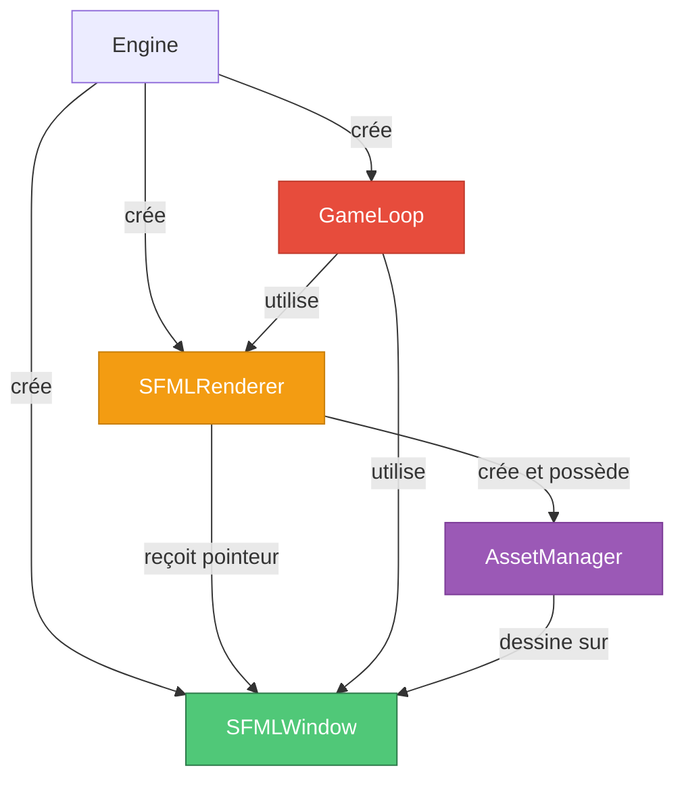
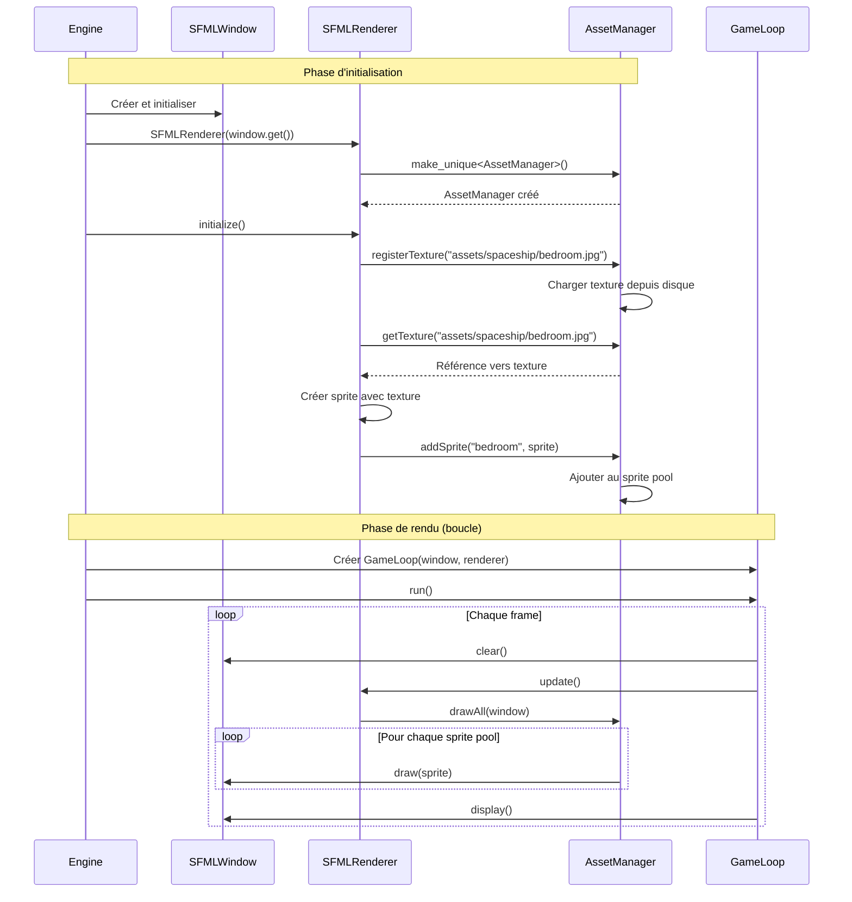

# Renderer - Système de Rendu SFML

## Vue d'ensemble

Le système de **Renderer** est responsable du rendu graphique dans le client R-Type. Il s'articule autour d'une interface abstraite `IRenderer` et d'une implémentation concrète `SFMLRenderer` utilisant la bibliothèque SFML. Le renderer gère l'**AssetManager** et orchestre l'affichage de tous les éléments graphiques du jeu.

!!! info "Localisation"
    - **Interface**: `/home/simia/epitech/second_year/projects/rtype/src/client/include/core/IRenderer.hpp`
    - **Implémentation Header**: `/home/simia/epitech/second_year/projects/rtype/src/client/include/implementations/sfml/SFMLRenderer.hpp`
    - **Implémentation Source**: `/home/simia/epitech/second_year/projects/rtype/src/client/implementations/sfml/SFMLRenderer.cpp`
    - **Namespace**: `core` (interface) / Global (implémentation)

!!! success "Avantages principaux"
    - **Abstraction**: Interface permettant de changer de backend graphique
    - **Gestion d'assets**: Intègre l'AssetManager pour le caching
    - **Séparation des responsabilités**: Focus sur le rendu uniquement
    - **Extensibilité**: Facile d'ajouter d'autres renderers (OpenGL, Vulkan, etc.)

---

## Architecture

### Diagramme de classes



### Hiérarchie de dépendances



---

## Diagramme de séquence - Cycle de vie



---

## Interface IRenderer

### Définition

```cpp
// src/client/include/core/IRenderer.hpp
#ifndef IRENDERER_HPP_
#define IRENDERER_HPP_

#include "../graphics/IWindow.hpp"
#include <SFML/Graphics.hpp>

namespace core {
    class IRenderer {
        public:
            virtual ~IRenderer() = default;

            virtual void initialize() = 0;
            virtual void update() = 0;
    };
}

#endif /* !IRENDERER_HPP_ */
```

### Design rationale

L'interface `IRenderer` définit le contrat minimal qu'un système de rendu doit respecter:

1. **initialize()**: Configuration initiale et chargement des ressources
2. **update()**: Mise à jour et rendu d'une frame

!!! tip "Pourquoi une interface?"
    - **Backend agnostique**: Permet de changer de bibliothèque graphique
    - **Testabilité**: Facilite les tests avec des mock renderers
    - **Extensibilité**: Plusieurs implémentations possibles (SFML, OpenGL, Vulkan)
    - **Découplage**: GameLoop ne dépend que de l'interface

### Implémentations possibles

| Implémentation | Backend | État | Use Case |
|----------------|---------|------|----------|
| SFMLRenderer | SFML 2.6+ | Implémenté | Rendu 2D classique |
| OpenGLRenderer | OpenGL 4.5 | À venir | Rendu accéléré GPU |
| VulkanRenderer | Vulkan | À venir | Performance maximale |
| HeadlessRenderer | Aucun | À venir | Tests automatisés |
| MockRenderer | Test | À venir | Unit tests |

!!! note "Note sur l'include SFML"
    L'interface inclut `<SFML/Graphics.hpp>`, ce qui crée un couplage avec SFML. Dans une architecture idéale, l'interface ne devrait dépendre d'aucune bibliothèque spécifique. Amélioration future: supprimer cet include.

---

## SFMLRenderer - Implémentation

### Header

```cpp
// src/client/include/implementations/sfml/SFMLRenderer.hpp
#ifndef SFMLRENDERER_HPP_
#define SFMLRENDERER_HPP_

#include "../../core/IRenderer.hpp"
#include "utils/AssetManager.hpp"
#include <unordered_map>
#include <memory>

class SFMLRenderer: public core::IRenderer {
    public:
        SFMLRenderer(graphics::IWindow* window);
        void initialize() override;
        void update() override;

    private:
        graphics::IWindow* _window;
        std::unique_ptr<AssetManager> mAsset;
};

#endif /* !SFMLRENDERER_HPP_ */
```

### Analyse de la structure

**Membres privés**:

1. **_window** (IWindow*): Pointeur raw vers la fenêtre
   - Pas d'ownership (l'Engine possède la window)
   - Utilisé pour passer à l'AssetManager lors du draw

2. **mAsset** (unique_ptr<AssetManager>): Gestionnaire d'assets
   - Ownership exclusif par le renderer
   - Gère textures et sprites
   - Lifetime lié au renderer

**Pourquoi un raw pointer pour _window?**
```cpp
// Le renderer ne possède pas la window
SFMLRenderer(graphics::IWindow* window);  // OK

// Alternative (mauvaise): ownership partagé
SFMLRenderer(std::shared_ptr<graphics::IWindow> window);  // Overkill

// Alternative (mauvaise): ownership transféré
SFMLRenderer(std::unique_ptr<graphics::IWindow> window);  // Non! Engine perd la window
```

---

## API Détaillée

### Constructeur

```cpp
SFMLRenderer::SFMLRenderer(graphics::IWindow* window)
    : _window{window},
      mAsset{std::make_unique<AssetManager>()}
{
}
```

**Description**: Construit un renderer SFML en initialisant ses membres.

**Paramètres**:
- `window` (graphics::IWindow*): Pointeur vers la fenêtre de rendu

**Comportement détaillé**:

1. **Initialisation de _window**: Stocke le pointeur vers la fenêtre
2. **Création de mAsset**: Instancie un nouvel AssetManager

**Member initializer list**:
```cpp
: _window{window},              // Initialisation uniforme C++11
  mAsset{std::make_unique<AssetManager>()}  // Création du smart pointer
```

**Pourquoi utiliser la liste d'initialisation?**
- Performance: initialisation directe vs assignation
- Membres const: seule façon de les initialiser
- Membres références: idem
- Ordre garanti: ordre de déclaration dans la classe

**État après construction**:
- `_window` pointe vers la fenêtre fournie
- `mAsset` contient un AssetManager vide (pas de textures/sprites)
- Prêt pour `initialize()`

**Exemple d'utilisation**:
```cpp
// Dans Engine::initialize()
auto window = std::make_unique<SFMLWindow>();
window->initialize({1200, 1200}, "rtype");

auto renderer = std::make_unique<SFMLRenderer>(window.get());
// À ce stade: renderer créé mais pas initialisé
```

**Gestion d'erreur**:

Actuellement, aucune validation n'est faite. Améliorations possibles:

```cpp
SFMLRenderer::SFMLRenderer(graphics::IWindow* window)
    : _window{window},
      mAsset{std::make_unique<AssetManager>()}
{
    if (!_window) {
        throw std::invalid_argument("Window pointer cannot be null");
    }
}
```

---

### initialize()

```cpp
void SFMLRenderer::initialize()
{
    // Image test
    std::string bedRoomFile = "assets/spaceship/bedroom.jpg";

    mAsset->registerTexture(bedRoomFile);

    sf::Sprite bedRoomSprite(mAsset->getTexture(bedRoomFile));
    mAsset->addSprite(bedRoomFile, bedRoomSprite);
}
```

**Description**: Initialise le renderer en chargeant les assets de démonstration.

**Comportement détaillé**:

**Ligne 1: Déclaration du chemin**
```cpp
std::string bedRoomFile = "assets/spaceship/bedroom.jpg";
```
- Chemin relatif vers l'asset de démonstration
- Convention: assets organisés par catégorie (spaceship, enemies, etc.)

**Ligne 2: Enregistrement de la texture**
```cpp
mAsset->registerTexture(bedRoomFile);
```
- Charge la texture depuis le disque
- La stocke dans le cache de l'AssetManager
- Opération I/O, peut être lente

**Ligne 3: Création du sprite**
```cpp
sf::Sprite bedRoomSprite(mAsset->getTexture(bedRoomFile));
```
- Récupère une référence vers la texture cachée
- Crée un sprite SFML lié à cette texture
- Le sprite utilise les dimensions complètes de la texture par défaut

**Ligne 4: Ajout au pool**
```cpp
mAsset->addSprite(bedRoomFile, bedRoomSprite);
```
- Ajoute le sprite au pool identifié par la clé "bedRoomFile"
- Le sprite sera automatiquement dessiné par `drawAll()`

**Complexité**:
- Charge I/O: O(n) où n = taille du fichier
- Création sprite: O(1)
- Ajout au pool: O(1) amortisé

**État actuel vs production**:

!!! warning "Code de démonstration"
    Cette implémentation est un **exemple minimal**. Dans un jeu réel:

    - Ne charger qu'une seule image hardcodée
    - Pas de gestion d'erreur si le fichier n'existe pas
    - Assets chargés synchroniquement (bloque le jeu)

**Exemple d'initialisation production-ready**:

```cpp
void SFMLRenderer::initialize()
{
    // Charger toutes les textures nécessaires
    std::vector<std::string> texturesToLoad = {
        "assets/player/ship.png",
        "assets/enemies/enemy1.png",
        "assets/enemies/enemy2.png",
        "assets/backgrounds/space.jpg",
        "assets/bullets/laser.png"
    };

    for (const auto& texturePath : texturesToLoad) {
        try {
            mAsset->registerTexture(texturePath);
        } catch (const std::exception& e) {
            std::cerr << "Failed to load " << texturePath
                      << ": " << e.what() << std::endl;
        }
    }

    // Créer les sprites initiaux (background, UI, etc.)
    createBackgroundSprite();
    createUIElements();
}

void SFMLRenderer::createBackgroundSprite()
{
    sf::Sprite bgSprite(mAsset->getTexture("assets/backgrounds/space.jpg"));
    bgSprite.setPosition(0.0f, 0.0f);
    mAsset->addSprite("background", bgSprite);
}
```

**Gestion d'erreur améliorée**:

```cpp
void SFMLRenderer::initialize()
{
    std::string bedRoomFile = "assets/spaceship/bedroom.jpg";

    // Vérifier que le fichier existe
    if (!std::filesystem::exists(bedRoomFile)) {
        throw std::runtime_error("Asset file not found: " + bedRoomFile);
    }

    // Enregistrer avec gestion d'erreur
    mAsset->registerTexture(bedRoomFile);

    try {
        sf::Sprite bedRoomSprite(mAsset->getTexture(bedRoomFile));
        mAsset->addSprite(bedRoomFile, bedRoomSprite);
    } catch (const std::out_of_range& e) {
        throw std::runtime_error("Failed to get texture: " + bedRoomFile);
    }
}
```

---

### update()

```cpp
void SFMLRenderer::update()
{
    mAsset->drawAll(_window);
}
```

**Description**: Met à jour le rendu en dessinant tous les sprites enregistrés.

**Comportement détaillé**:

Cette méthode est extrêmement simple: elle délègue tout le travail à l'AssetManager. C'est un exemple du pattern **Delegation**.

**Ce qui se passe en interne**:

```
SFMLRenderer::update()
    └─> AssetManager::drawAll(_window)
        └─> for each sprite pool
            └─> for each sprite in pool
                └─> _window->draw(sprite)
                    └─> sf::RenderWindow::draw(sprite)
```

**Fréquence d'appel**: Appelée à chaque frame par la GameLoop

**Exemple de timing**:
```
Frame 1: clear() -> update() -> display()  [~16ms @ 60 FPS]
Frame 2: clear() -> update() -> display()  [~16ms @ 60 FPS]
Frame 3: clear() -> update() -> display()  [~16ms @ 60 FPS]
...
```

**Performance**:

- **Complexité**: O(n) où n = nombre total de sprites
- **Typical timing**: 1-5ms pour 1000 sprites
- **Bottleneck**: Nombre de draw calls GPU

**État actuel vs avancé**:

Actuellement, `update()` ne fait que du rendu. Dans un renderer plus avancé:

```cpp
void SFMLRenderer::update()
{
    // 1. Mise à jour de la logique de rendu
    updateAnimations(deltaTime);
    updateParticles(deltaTime);

    // 2. Culling des objets hors écran
    cullOffscreenSprites();

    // 3. Tri des sprites par profondeur
    sortSpritesByZOrder();

    // 4. Rendu optimisé
    mAsset->drawAllBatched(_window);

    // 5. Post-processing
    applyPostEffects();
}
```

**Exemple avec delta time**:

```cpp
// Version future avec delta time
void SFMLRenderer::update(float deltaTime)
{
    // Mettre à jour les animations
    for (auto& animation : mAnimations) {
        animation.update(deltaTime);
    }

    // Mettre à jour les particules
    mParticleSystem->update(deltaTime);

    // Rendu
    mAsset->drawAll(_window);
}
```

**Debugging et profiling**:

```cpp
void SFMLRenderer::update()
{
    #ifdef DEBUG_RENDERER
    auto start = std::chrono::high_resolution_clock::now();
    #endif

    mAsset->drawAll(_window);

    #ifdef DEBUG_RENDERER
    auto end = std::chrono::high_resolution_clock::now();
    auto duration = std::chrono::duration_cast<std::chrono::microseconds>(end - start);
    std::cout << "Render time: " << duration.count() << "μs" << std::endl;
    #endif
}
```

---

## Membres Privés

### _window

```cpp
graphics::IWindow* _window;
```

**Description**: Pointeur raw vers la fenêtre de rendu.

**Type**: `graphics::IWindow*` (raw pointer, non-owning)

**Ownership**: L'Engine possède la fenêtre, le renderer l'utilise seulement

**Lifetime**: Doit survivre au moins aussi longtemps que le renderer

**Utilisation**:
- Passé à l'AssetManager pour les opérations de draw
- Jamais deleted par le renderer
- Jamais modifié (const correctness pourrait être ajoutée)

**Pourquoi pas un smart pointer?**

```cpp
// Option 1: Raw pointer (implémentation actuelle)
graphics::IWindow* _window;  // Simple, pas d'ownership

// Option 2: Shared pointer (overkill)
std::shared_ptr<graphics::IWindow> _window;  // Ownership partagé inutile

// Option 3: Weak pointer (complexité inutile)
std::weak_ptr<graphics::IWindow> _window;  // Pour éviter cycles, mais pas nécessaire ici

// Option 4: Référence (plus sûr mais moins flexible)
graphics::IWindow& _window;  // Ne peut pas être nullptr, mais moins flexible
```

**Amélioration possible: const correctness**

```cpp
class SFMLRenderer: public core::IRenderer {
private:
    graphics::IWindow* const _window;  // Pointeur constant (ne peut pas être réassigné)
};
```

---

### mAsset

```cpp
std::unique_ptr<AssetManager> mAsset;
```

**Description**: Pointeur unique vers le gestionnaire d'assets.

**Type**: `std::unique_ptr<AssetManager>` (smart pointer, owning)

**Ownership**: Le renderer possède exclusivement l'AssetManager

**Lifetime**: Créé dans le constructeur, détruit avec le renderer

**Responsabilités**:
- Cache de textures
- Gestion des sprite pools
- Rendu de tous les sprites

**Taille mémoire**:
- Le pointeur lui-même: 8 bytes (64-bit)
- L'AssetManager: variable (dépend des assets chargés)
- Exemple: 10 textures 512x512 RGBA = ~10 MB

**Pourquoi unique_ptr?**

```cpp
std::unique_ptr<AssetManager> mAsset;  // Ownership exclusif, destruction automatique

// vs

AssetManager* mAsset;  // Nécessite delete manuel, risque de leak

// vs

std::shared_ptr<AssetManager> mAsset;  // Ownership partagé inutile ici
```

**Accès et utilisation**:

```cpp
// Dans initialize()
mAsset->registerTexture("texture.png");

// Dans update()
mAsset->drawAll(_window);

// Destruction automatique dans ~SFMLRenderer()
// Pas besoin de delete explicite
```

---

## Exemples Complets

### Exemple 1: Utilisation basique

```cpp
#include "implementations/sfml/SFMLRenderer.hpp"
#include "implementations/sfml/SFMLWindow.hpp"

int main() {
    // Créer la fenêtre
    auto window = std::make_unique<SFMLWindow>();
    window->initialize({800, 600}, "Renderer Demo");

    // Créer le renderer
    auto renderer = std::make_unique<SFMLRenderer>(window.get());
    renderer->initialize();

    // Boucle de rendu
    while (window->isOpen()) {
        window->clear();
        renderer->update();  // Dessine tous les sprites
        window->display();
    }

    return 0;
}
```

---

### Exemple 2: Renderer personnalisé avec plusieurs sprites

```cpp
class GameRenderer : public SFMLRenderer {
public:
    GameRenderer(graphics::IWindow* window) : SFMLRenderer(window) {}

    void initialize() override {
        // Charger toutes les textures du jeu
        loadPlayerAssets();
        loadEnemyAssets();
        loadBackgroundAssets();
        loadUIAssets();
    }

private:
    void loadPlayerAssets() {
        mAsset->registerTexture("assets/player/ship.png");
        sf::Sprite playerSprite(mAsset->getTexture("assets/player/ship.png"));
        playerSprite.setPosition(400, 500);
        mAsset->addSprite("player", playerSprite);
    }

    void loadEnemyAssets() {
        mAsset->registerTexture("assets/enemies/alien.png");

        // Créer une vague d'ennemis
        for (int i = 0; i < 10; i++) {
            sf::Sprite enemy(mAsset->getTexture("assets/enemies/alien.png"));
            enemy.setPosition(i * 80.0f, 50.0f);
            mAsset->addSprite("enemies", enemy);
        }
    }

    void loadBackgroundAssets() {
        mAsset->registerTexture("assets/backgrounds/space.jpg");
        sf::Sprite bg(mAsset->getTexture("assets/backgrounds/space.jpg"));
        bg.setPosition(0, 0);
        mAsset->addSprite("background", bg);
    }

    void loadUIAssets() {
        mAsset->registerTexture("assets/ui/health_bar.png");
        sf::Sprite healthBar(mAsset->getTexture("assets/ui/health_bar.png"));
        healthBar.setPosition(10, 10);
        mAsset->addSprite("ui", healthBar);
    }
};
```

---

### Exemple 3: Renderer avec système d'entités

```cpp
class Entity {
public:
    virtual void render(AssetManager* assets) = 0;
};

class Player : public Entity {
private:
    sf::Vector2f position;
    std::string textureKey = "player";

public:
    Player(float x, float y) : position(x, y) {}

    void render(AssetManager* assets) override {
        sf::Sprite sprite(assets->getTexture("assets/player/ship.png"));
        sprite.setPosition(position);
        assets->addSprite(textureKey, sprite);
    }

    void move(float dx, float dy) {
        position.x += dx;
        position.y += dy;
    }
};

class EntityRenderer : public SFMLRenderer {
private:
    std::vector<std::unique_ptr<Entity>> entities;

public:
    EntityRenderer(graphics::IWindow* window) : SFMLRenderer(window) {}

    void initialize() override {
        // Charger les textures
        mAsset->registerTexture("assets/player/ship.png");
        mAsset->registerTexture("assets/enemies/alien.png");

        // Créer les entités
        entities.push_back(std::make_unique<Player>(400, 500));
    }

    void update() override {
        // Rendu de toutes les entités
        for (auto& entity : entities) {
            entity->render(mAsset.get());
        }

        // Dessiner tous les sprites
        SFMLRenderer::update();
    }

    void addEntity(std::unique_ptr<Entity> entity) {
        entities.push_back(std::move(entity));
    }
};
```

---

### Exemple 4: Renderer avec système de layers

```cpp
enum class RenderLayer {
    Background = 0,
    Entities = 1,
    Particles = 2,
    UI = 3
};

class LayeredRenderer : public SFMLRenderer {
private:
    std::map<RenderLayer, std::vector<sf::Sprite>> layers;

public:
    LayeredRenderer(graphics::IWindow* window) : SFMLRenderer(window) {}

    void addSpriteToLayer(RenderLayer layer, const sf::Sprite& sprite) {
        layers[layer].push_back(sprite);
    }

    void update() override {
        // Dessiner les layers dans l'ordre
        for (auto& [layer, sprites] : layers) {
            for (auto& sprite : sprites) {
                _window->draw(sprite);
            }
        }
    }

    void clearLayer(RenderLayer layer) {
        layers[layer].clear();
    }
};

// Utilisation
LayeredRenderer renderer(window.get());
renderer.initialize();

// Ajouter sprites à différents layers
sf::Sprite bgSprite;
renderer.addSpriteToLayer(RenderLayer::Background, bgSprite);

sf::Sprite playerSprite;
renderer.addSpriteToLayer(RenderLayer::Entities, playerSprite);

sf::Sprite uiElement;
renderer.addSpriteToLayer(RenderLayer::UI, uiElement);
```

---

### Exemple 5: Mock Renderer pour tests

```cpp
class MockRenderer : public core::IRenderer {
private:
    bool _initialized = false;
    int _updateCount = 0;

public:
    void initialize() override {
        _initialized = true;
    }

    void update() override {
        if (!_initialized) {
            throw std::runtime_error("Renderer not initialized");
        }
        _updateCount++;
    }

    bool wasInitialized() const { return _initialized; }
    int getUpdateCount() const { return _updateCount; }
};

// Test
void testRendererLifecycle() {
    MockRenderer renderer;
    assert(!renderer.wasInitialized());

    renderer.initialize();
    assert(renderer.wasInitialized());
    assert(renderer.getUpdateCount() == 0);

    renderer.update();
    assert(renderer.getUpdateCount() == 1);

    renderer.update();
    renderer.update();
    assert(renderer.getUpdateCount() == 3);
}
```

---

## Optimisations et Performances

### Analyse de performance

**Temps d'initialisation**:
```
Chargement 1 texture 1024x1024: ~50ms
Création 1 sprite: <0.1ms
Total pour asset de demo: ~50ms
```

**Temps de rendu par frame**:
```
100 sprites: ~0.5ms
1000 sprites: ~3ms
10000 sprites: ~30ms (commence à lagger)
```

**Utilisation mémoire**:
```
SFMLRenderer: 16 bytes (2 pointeurs)
AssetManager: variable
1 texture 1024x1024 RGBA: 4 MB
1 sprite: 88 bytes
```

### Bottlenecks actuels

1. **Chaque sprite = 1 draw call**: Pas de batching
2. **Pas de culling**: Tous les sprites sont dessinés
3. **Pas de tri**: Ordre arbitraire (inefficient pour GPU)
4. **Chargement synchrone**: Bloque pendant l'I/O

### Optimisations futures

!!! tip "Améliorations possibles"

**1. Sprite Batching**

Regrouper les draw calls par texture:

```cpp
void SFMLRenderer::updateBatched()
{
    // Préparer un vertex array par texture
    std::map<const sf::Texture*, sf::VertexArray> batches;

    // Grouper les sprites par texture
    // ... logique de batching ...

    // Un seul draw call par texture
    for (auto& [texture, vertices] : batches) {
        _window->draw(vertices, texture);
    }
}
```

**2. Frustum Culling**

Ne dessiner que les sprites visibles:

```cpp
void SFMLRenderer::updateWithCulling()
{
    sf::FloatRect viewport = _window->getViewport();

    for (auto& sprite : allSprites) {
        if (viewport.intersects(sprite.getGlobalBounds())) {
            _window->draw(sprite);  // Seulement si visible
        }
    }
}
```

**3. Z-Ordering**

Trier les sprites par profondeur:

```cpp
struct SpriteWithDepth {
    sf::Sprite sprite;
    int zOrder;

    bool operator<(const SpriteWithDepth& other) const {
        return zOrder < other.zOrder;
    }
};

void SFMLRenderer::updateWithZOrdering()
{
    std::vector<SpriteWithDepth> sortedSprites = getAllSprites();
    std::sort(sortedSprites.begin(), sortedSprites.end());

    for (auto& s : sortedSprites) {
        _window->draw(s.sprite);
    }
}
```

**4. Chargement asynchrone**

Charger les assets sans bloquer:

```cpp
void SFMLRenderer::initializeAsync()
{
    std::vector<std::future<void>> loadTasks;

    for (const auto& assetPath : assetsToLoad) {
        loadTasks.push_back(std::async(std::launch::async, [this, assetPath]() {
            mAsset->registerTexture(assetPath);
        }));
    }

    // Attendre que tous les chargements soient terminés
    for (auto& task : loadTasks) {
        task.wait();
    }
}
```

**5. Texture Atlas**

Combiner plusieurs textures en une:

```cpp
class TextureAtlas {
private:
    sf::Texture atlas;
    std::map<std::string, sf::IntRect> regions;

public:
    void load(const std::string& atlasFile) {
        atlas.loadFromFile(atlasFile);
        // Charger les définitions de régions depuis un JSON
    }

    sf::Sprite getSprite(const std::string& name) {
        sf::Sprite sprite(atlas);
        sprite.setTextureRect(regions[name]);
        return sprite;
    }
};
```

---

## Bonnes Pratiques

### DO - À faire

1. **Initialiser avant d'utiliser**
```cpp
renderer->initialize();
renderer->update();  // OK
```

2. **Charger les assets au démarrage**
```cpp
void SFMLRenderer::initialize() {
    // Charger tous les assets nécessaires
    loadAllTextures();
}
```

3. **Utiliser l'AssetManager pour le caching**
```cpp
// BON: texture chargée une fois
mAsset->registerTexture("sprite.png");
for (int i = 0; i < 100; i++) {
    sf::Sprite s(mAsset->getTexture("sprite.png"));
}
```

### DON'T - À éviter

1. **Ne pas charger dans update()**
```cpp
void SFMLRenderer::update() {
    mAsset->registerTexture("texture.png");  // MAUVAIS: I/O dans loop
    mAsset->drawAll(_window);
}
```

2. **Ne pas oublier initialize()**
```cpp
auto renderer = std::make_unique<SFMLRenderer>(window.get());
// renderer->initialize();  // OUBLIE!
renderer->update();  // Crash ou comportement bizarre
```

3. **Ne pas créer de copies de textures**
```cpp
sf::Texture texCopy = mAsset->getTexture("tex.png");  // MAUVAIS: copie!
sf::Texture& tex = mAsset->getTexture("tex.png");     // BON: référence
```

---

## Intégration avec le système

### Dans la GameLoop

```cpp
void GameLoop::run()
{
    while (_window->isOpen()) {
        clear();
        _renderer->update();  // Appelle SFMLRenderer::update()
        display();
    }
}
```

### Dans l'Engine

```cpp
void Engine::initialize()
{
    _window = std::make_unique<SFMLWindow>();
    _window->initialize({1200, 1200}, "rtype");

    _renderer = std::make_unique<SFMLRenderer>(_window.get());
    _renderer->initialize();

    _gameLoop = std::make_unique<GameLoop>(_window.get(), _renderer.get());
}
```

---

## État actuel vs Évolutions futures

### État actuel

| Fonctionnalité | Statut | Notes |
|----------------|--------|-------|
| Interface IRenderer | Implémenté | API minimale fonctionnelle |
| SFMLRenderer | Implémenté | Implémentation basique |
| AssetManager intégré | Implémenté | Gestion automatique |
| Asset de demo | Implémenté | Une seule image hardcodée |

### Limitations actuelles

!!! warning "Limitations connues"
    - **Pas de delta time**: update() ne prend pas le temps en compte
    - **Pas de culling**: Tous les sprites dessinés même si hors écran
    - **Pas de batching**: Chaque sprite = 1 draw call
    - **Assets hardcodés**: Pas de système de configuration
    - **Pas de gestion d'erreur robuste**: Pas de try-catch

### Roadmap future

**Version 2.0**:
- Delta time dans update()
- Configuration des assets via fichier
- Gestion d'erreur complète
- Logging structuré

**Version 3.0**:
- Frustum culling
- Z-ordering automatique
- Système de layers
- Chargement asynchrone

**Version 4.0**:
- Sprite batching
- Texture atlases
- Shaders personnalisés
- Post-processing effects

---

## Conclusion

Le système de **Renderer** du client R-Type fournit une abstraction propre pour le rendu graphique. Son design basé sur une interface permet l'extensibilité, tandis que l'implémentation SFML actuelle offre une base solide pour le développement.

### Points forts

- Interface claire et simple (2 méthodes)
- Intégration transparente avec AssetManager
- Gestion mémoire automatique
- Pattern Delegation pour la simplicité

### Points à améliorer

- Support du delta time
- Optimisations de rendu (batching, culling)
- Configuration externalisée
- Gestion d'erreur robuste

### Ressources complémentaires

- [Documentation AssetManager](../graphics/asset-manager.md)
- [Documentation IWindow](../api/index.md#iwindow)
- [Documentation Engine](engine.md)
- [Documentation GameLoop](gameloop.md)
- [Documentation SFML Graphics](https://www.sfml-dev.org/documentation/2.6.1/group__graphics.php)
