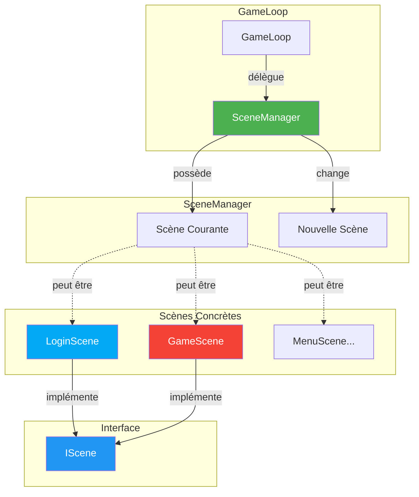
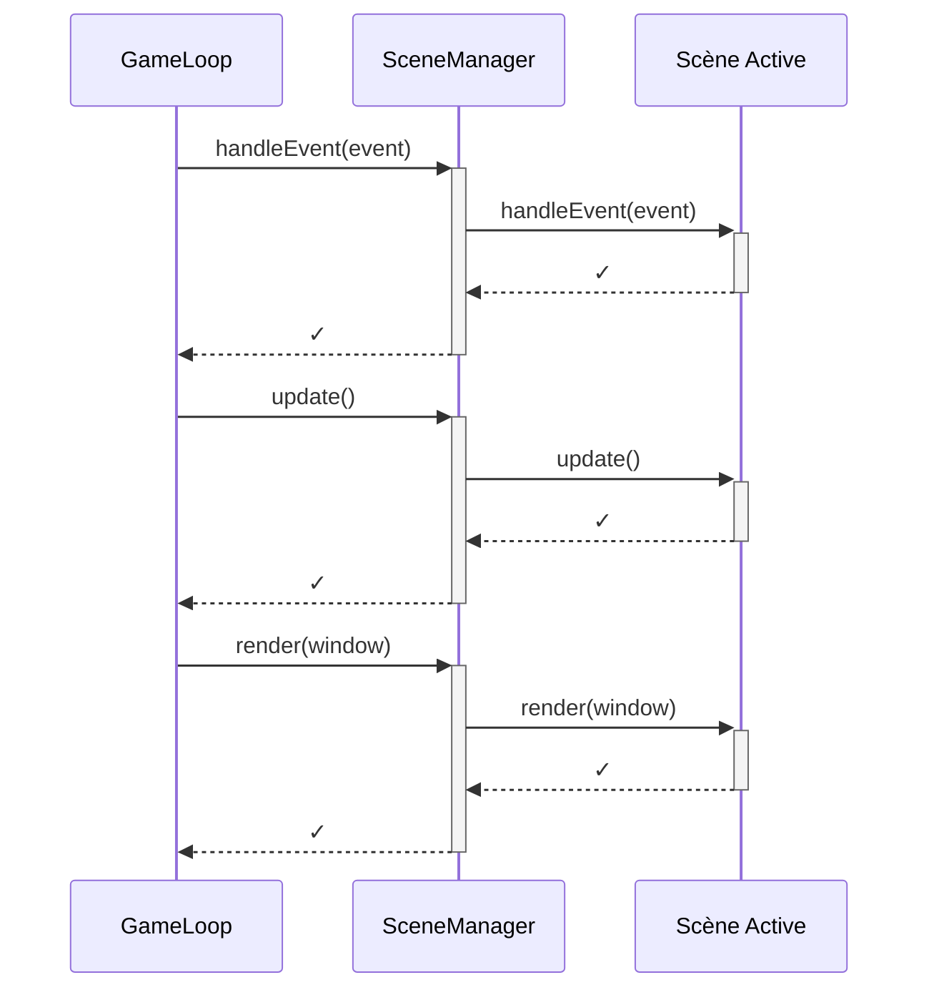
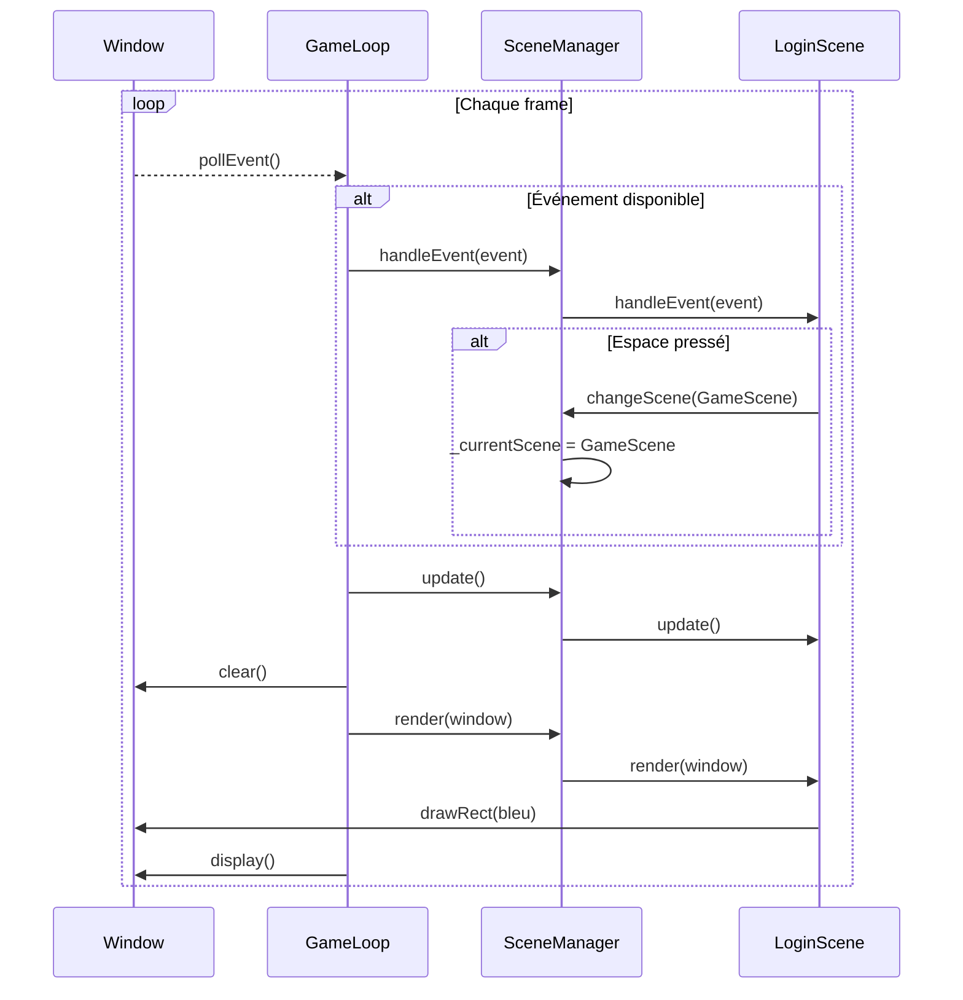
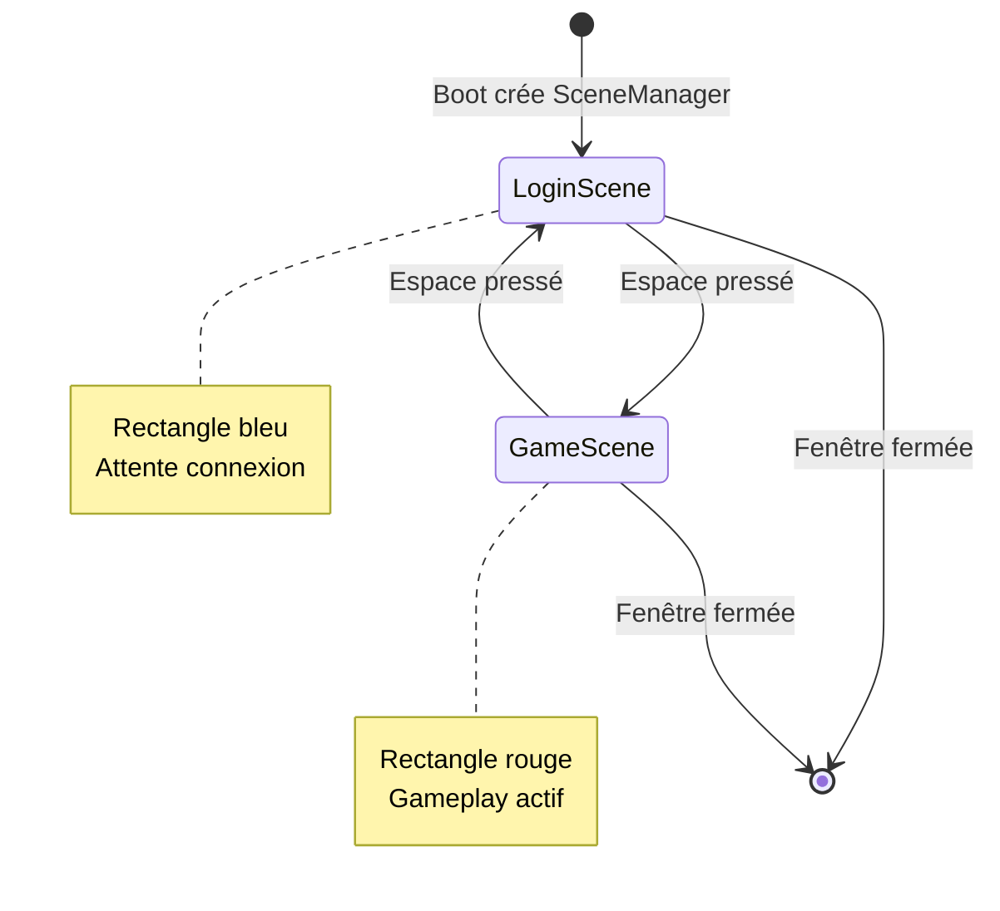

# Système de Scènes - Gestion des États du Jeu

## Vue d'Ensemble

Le **système de scènes** permet de gérer différents états du jeu (menu, jeu, pause, etc.) de manière modulaire. Chaque scène encapsule sa propre logique d'événements, de mise à jour et de rendu.

!!! info "Localisation"
    - **Interface**: `src/client/include/scenes/IScene.hpp`
    - **Manager**: `src/client/include/scenes/SceneManager.hpp`
    - **Scènes**: `src/client/scenes/`
    - **Dépendances**: SFML 3.0+

!!! success "État Actuel"
    **FONCTIONNEL** : LoginScene et GameScene implémentées avec basculement via Espace.

---

## Architecture



---

## Interface IScene

### Code Source

```cpp
/*
** EPITECH PROJECT, 2025
** rtype [WSL: Ubuntu-24.04]
** File description:
** IScene
*/

#ifndef ISCENE_HPP_
#define ISCENE_HPP_

#include "graphics/IWindow.hpp"
#include <SFML/Window/Event.hpp>

class SceneManager;

class IScene
{
public:
    virtual ~IScene() = default;

    // Gérer les événements (clavier, souris, etc.)
    virtual void handleEvent(const sf::Event &event) = 0;

    // Mettre à jour la logique de la scène
    virtual void update() = 0;

    // Dessiner la scène
    virtual void render(graphics::IWindow *window) = 0;

    // Injecter le SceneManager pour permettre les changements de scène
    void setSceneManager(SceneManager* manager) { _sceneManager = manager; }

protected:
    SceneManager* _sceneManager = nullptr;
};

#endif /* !ISCENE_HPP_ */
```

### Méthodes Virtuelles

| Méthode | Description | Appel |
|---------|-------------|-------|
| `handleEvent()` | Traite les événements SFML | À chaque événement |
| `update()` | Met à jour la logique | À chaque frame |
| `render()` | Dessine la scène | À chaque frame |

### Injection du SceneManager

```cpp
void setSceneManager(SceneManager* manager) { _sceneManager = manager; }
```

**Pourquoi cette injection ?**

Les scènes doivent pouvoir demander un changement de scène :

```cpp
// Dans LoginScene::handleEvent()
if (keyPressed->code == sf::Keyboard::Key::Space) {
    _sceneManager->changeScene(std::make_unique<GameScene>());
}
```

---

## SceneManager

### Code Source

```cpp
/*
** EPITECH PROJECT, 2025
** rtype [WSL: Ubuntu-24.04]
** File description:
** SceneManager
*/

#ifndef SCENEMANAGER_HPP_
#define SCENEMANAGER_HPP_

#include "scenes/IScene.hpp"
#include <memory>

class SceneManager
{
public:
    SceneManager();
    ~SceneManager();

    // Changer la scène active
    void changeScene(std::unique_ptr<IScene> newScene);

    // Délégation aux méthodes de la scène active
    void handleEvent(const sf::Event &event);
    void update();
    void render(graphics::IWindow *window);

private:
    std::unique_ptr<IScene> _currentScene;
};

#endif /* !SCENEMANAGER_HPP_ */
```

### Implémentation

```cpp
#include "scenes/SceneManager.hpp"

SceneManager::SceneManager()
{
}

SceneManager::~SceneManager()
{
}

void SceneManager::changeScene(std::unique_ptr<IScene> newScene)
{
    _currentScene = std::move(newScene);
    if (_currentScene)
        _currentScene->setSceneManager(this);  // Injection
}

void SceneManager::handleEvent(const sf::Event &event)
{
    if (_currentScene)
        _currentScene->handleEvent(event);
}

void SceneManager::update()
{
    if (_currentScene)
        _currentScene->update();
}

void SceneManager::render(graphics::IWindow *window)
{
    if (_currentScene)
        _currentScene->render(window);
}
```

### Pattern de Délégation

Le SceneManager agit comme un **proxy** qui délègue tout à la scène active :



---

## Scènes Implémentées

### LoginScene

**Rôle** : Écran de connexion (actuellement simplifié avec un rectangle bleu)

```cpp
/*
** EPITECH PROJECT, 2025
** rtype [WSL: Ubuntu-24.04]
** File description:
** LoginScene
*/

#include "scenes/LoginScene.hpp"
#include "scenes/SceneManager.hpp"
#include "scenes/GameScene.hpp"

LoginScene::LoginScene()
{
    std::cout << "[LoginScene] Created" << std::endl;
}

void LoginScene::handleEvent(const sf::Event &event)
{
    if (const auto* keyPressed = event.getIf<sf::Event::KeyPressed>()) {
        if (keyPressed->code == sf::Keyboard::Key::Space) {
            std::cout << "[LoginScene] Switching to GameScene" << std::endl;
            if (_sceneManager) {
                _sceneManager->changeScene(std::make_unique<GameScene>());
            }
        }
    }
}

void LoginScene::update()
{
    // Logique de mise à jour
}

void LoginScene::render(graphics::IWindow *window)
{
    // Rectangle bleu pour identifier la scène
    window->drawRect(100.f, 100.f, 200.f, 200.f, sf::Color::Blue);
}
```

### GameScene

**Rôle** : Écran de jeu (actuellement simplifié avec un rectangle rouge)

```cpp
/*
** EPITECH PROJECT, 2025
** rtype [WSL: Ubuntu-24.04]
** File description:
** GameScene
*/

#include "scenes/GameScene.hpp"
#include "scenes/SceneManager.hpp"
#include "scenes/LoginScene.hpp"

GameScene::GameScene()
{
    std::cout << "[GameScene] Created" << std::endl;
}

void GameScene::handleEvent(const sf::Event &event)
{
    if (const auto* keyPressed = event.getIf<sf::Event::KeyPressed>()) {
        if (keyPressed->code == sf::Keyboard::Key::Space) {
            std::cout << "[GameScene] Switching to LoginScene" << std::endl;
            if (_sceneManager) {
                _sceneManager->changeScene(std::make_unique<LoginScene>());
            }
        }
    }
}

void GameScene::update()
{
    // Logique de mise à jour du jeu
}

void GameScene::render(graphics::IWindow *window)
{
    // Rectangle rouge pour identifier la scène
    window->drawRect(100.f, 100.f, 200.f, 200.f, sf::Color::Red);
}
```

### Identification Visuelle

| Scène | Couleur | Touche de basculement |
|-------|---------|----------------------|
| LoginScene | Bleu | Espace → GameScene |
| GameScene | Rouge | Espace → LoginScene |

---

## API SFML 3 pour les Événements

### Nouvelle Syntaxe

SFML 3 a changé la gestion des événements :

```cpp
// ❌ SFML 2.x (ancien)
if (event.type == sf::Event::KeyPressed) {
    if (event.key.code == sf::Keyboard::Space) {
        // ...
    }
}

// ✅ SFML 3.x (nouveau)
if (const auto* keyPressed = event.getIf<sf::Event::KeyPressed>()) {
    if (keyPressed->code == sf::Keyboard::Key::Space) {
        // ...
    }
}
```

### Méthodes SFML 3

| Méthode | Usage |
|---------|-------|
| `event.is<Type>()` | Vérifie si l'événement est du type donné |
| `event.getIf<Type>()` | Retourne un pointeur vers les données si le type correspond |

### Exemple Complet

```cpp
void LoginScene::handleEvent(const sf::Event &event)
{
    // Fermeture
    if (event.is<sf::Event::Closed>()) {
        // Gérer fermeture
    }

    // Touche pressée
    if (const auto* keyPressed = event.getIf<sf::Event::KeyPressed>()) {
        switch (keyPressed->code) {
            case sf::Keyboard::Key::Space:
                _sceneManager->changeScene(std::make_unique<GameScene>());
                break;
            case sf::Keyboard::Key::Escape:
                // Quitter
                break;
            default:
                break;
        }
    }

    // Clic souris
    if (const auto* mousePressed = event.getIf<sf::Event::MouseButtonPressed>()) {
        float x = static_cast<float>(mousePressed->position.x);
        float y = static_cast<float>(mousePressed->position.y);
        // Gérer clic
    }
}
```

---

## Intégration avec GameLoop

### GameLoop Modifiée

```cpp
void GameLoop::run()
{
    while (_window->isOpen()) {
        // Boucle d'événements SFML 3
        while (auto event = _window->pollEvent()) {
            if (event->is<sf::Event::Closed>()) {
                return;
            }
            // Déléguer à la scène via SceneManager
            _sceneManager->handleEvent(*event);
        }

        // Update
        _sceneManager->update();

        // Render
        clear();
        _sceneManager->render(_window);
        display();
    }
}
```

### Flux Complet



---

## Diagramme de Changement de Scène



---

## Créer une Nouvelle Scène

### Étape 1 : Header

```cpp
// src/client/include/scenes/MenuScene.hpp

#ifndef MENUSCENE_HPP_
#define MENUSCENE_HPP_

#include "scenes/IScene.hpp"
#include <SFML/Window/Event.hpp>
#include "graphics/IWindow.hpp"
#include <iostream>

class MenuScene : public IScene
{
public:
    MenuScene();
    ~MenuScene() override = default;

    void handleEvent(const sf::Event &event) override;
    void update() override;
    void render(graphics::IWindow *window) override;

private:
    // État spécifique à la scène
    int _selectedItem = 0;
};

#endif /* !MENUSCENE_HPP_ */
```

### Étape 2 : Implementation

```cpp
// src/client/scenes/MenuScene.cpp

#include "scenes/MenuScene.hpp"
#include "scenes/SceneManager.hpp"
#include "scenes/GameScene.hpp"

MenuScene::MenuScene()
{
    std::cout << "[MenuScene] Created" << std::endl;
}

void MenuScene::handleEvent(const sf::Event &event)
{
    if (const auto* keyPressed = event.getIf<sf::Event::KeyPressed>()) {
        switch (keyPressed->code) {
            case sf::Keyboard::Key::Up:
                _selectedItem--;
                break;
            case sf::Keyboard::Key::Down:
                _selectedItem++;
                break;
            case sf::Keyboard::Key::Enter:
                if (_selectedItem == 0) {  // Play
                    _sceneManager->changeScene(std::make_unique<GameScene>());
                }
                break;
            default:
                break;
        }
    }
}

void MenuScene::update()
{
    // Animation, etc.
}

void MenuScene::render(graphics::IWindow *window)
{
    // Dessiner le menu
    window->drawRect(50.f, 50.f, 300.f, 50.f, sf::Color::Green);
}
```

### Étape 3 : CMakeLists

```cmake
# src/client/CMakeLists.txt
set(CLIENT_SOURCES
    # ... autres sources ...
    scenes/SceneManager.cpp
    scenes/LoginScene.cpp
    scenes/GameScene.cpp
    scenes/MenuScene.cpp  # Ajouter ici
)
```

---

## Bonnes Pratiques

### ✅ BON : Vérifier le SceneManager

```cpp
void MyScene::handleEvent(const sf::Event &event)
{
    if (_sceneManager) {  // Toujours vérifier
        _sceneManager->changeScene(std::make_unique<OtherScene>());
    }
}
```

### ✅ BON : Utiliser unique_ptr

```cpp
// Transfert de propriété clair
_sceneManager->changeScene(std::make_unique<GameScene>());
```

### ❌ MAUVAIS : Garder des références à l'ancienne scène

```cpp
// L'ancienne scène est détruite après changeScene()
IScene* oldScene = _currentScene.get();
changeScene(std::make_unique<NewScene>());
oldScene->doSomething();  // ❌ Dangling pointer !
```

---

## Futures Améliorations

### 1. Pile de Scènes (Scene Stack)

Pour gérer les menus pause :

```cpp
class SceneManager {
public:
    void pushScene(std::unique_ptr<IScene> scene);
    void popScene();

private:
    std::stack<std::unique_ptr<IScene>> _scenes;
};
```

### 2. Transitions

Animations entre scènes :

```cpp
class SceneManager {
public:
    void changeScene(std::unique_ptr<IScene> scene, Transition transition);

private:
    enum class Transition { None, Fade, Slide };
};
```

### 3. Données Partagées entre Scènes

```cpp
class SceneContext {
public:
    int playerScore = 0;
    std::string playerName;
};

class IScene {
protected:
    SceneContext* _context;
};
```

---

## FAQ

**Q: Pourquoi un pointeur brut pour SceneManager dans IScene ?**

R: Le SceneManager possède les scènes, pas l'inverse. Le pointeur brut évite les références circulaires.

**Q: La scène précédente est-elle automatiquement détruite ?**

R: Oui, `unique_ptr` détruit automatiquement l'ancienne scène lors de l'assignation.

**Q: Comment passer des données entre scènes ?**

R: Via un contexte partagé ou en passant des paramètres au constructeur de la nouvelle scène.

---

## Voir Aussi

- [GameLoop Documentation](./gameloop.md) - Boucle principale intégrant les scènes
- [IWindow Documentation](../graphics/overview.md) - Interface de fenêtre utilisée pour le rendu
- [Boot Documentation](./boot.md) - Initialisation du SceneManager
