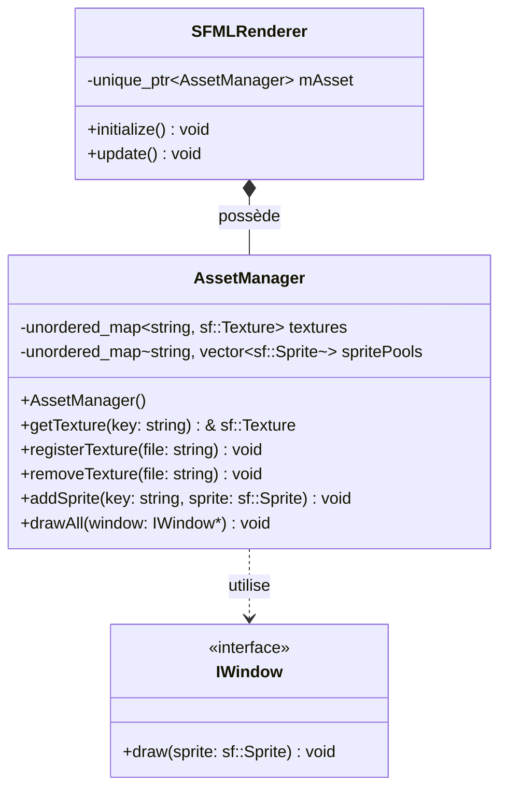
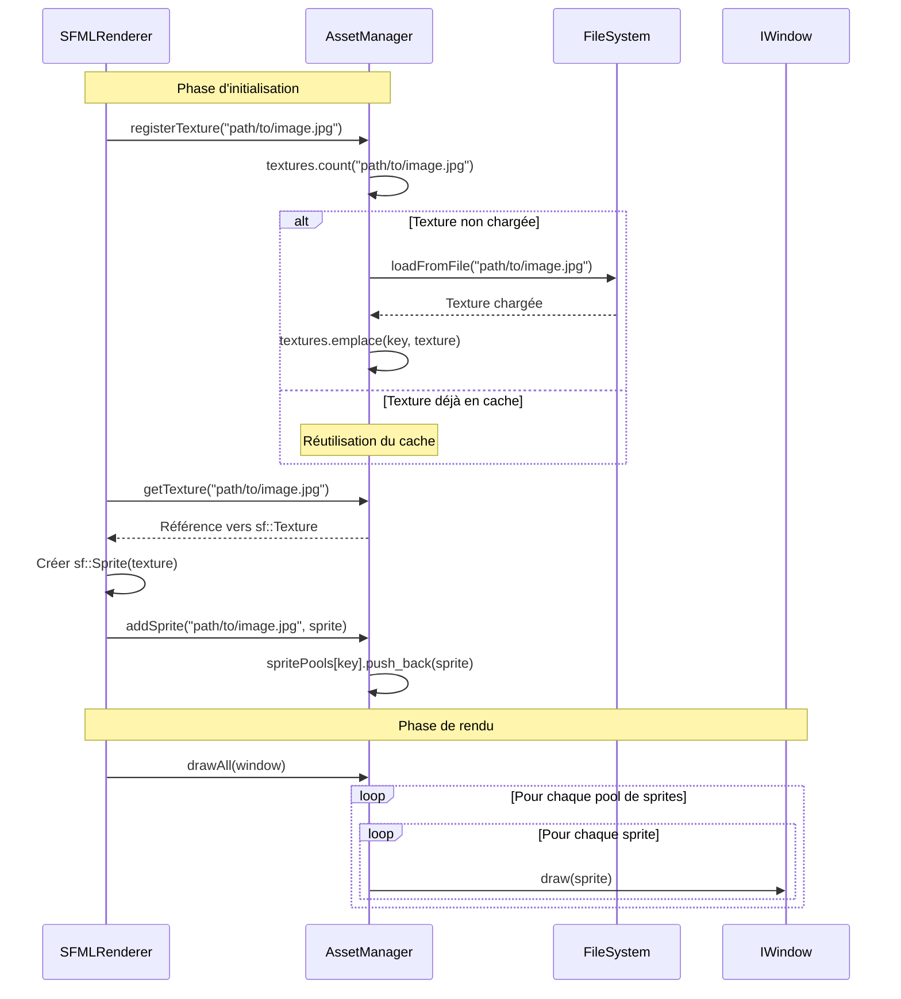
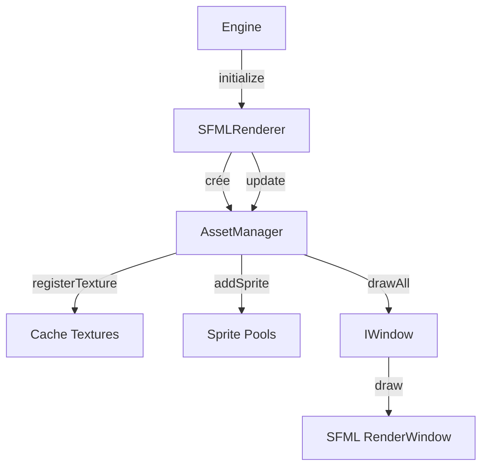

# AssetManager - Gestionnaire d'Assets Graphiques

## Vue d'ensemble

L'**AssetManager** est un composant central du système graphique du client R-Type. Il gère de manière optimisée le chargement, le stockage et le rendu des ressources graphiques (textures et sprites) en implémentant un pattern de cache et de pooling pour améliorer les performances.

!!! info "Localisation" - **Fichier source**: `/home/simia/epitech/second_year/projects/rtype/src/client/include/implementations/sfml/utils/AssetManager.hpp` - **Namespace**: Global (header-only class) - **Dépendances**: SFML Graphics, IWindow interface

!!! success "Avantages principaux" - **Cache de textures**: Évite les chargements multiples de la même ressource - **Sprite pooling**: Gestion efficace de multiples instances de sprites - **API simple**: Interface intuitive et facile à utiliser - **Gestion mémoire optimisée**: Utilisation de move semantics et références

---

## Architecture

### Diagramme de classes



### Diagramme de flux - Chargement et rendu



---

## API Détaillée

### Constructeur

```cpp
AssetManager()
```

**Description**: Constructeur par défaut. Initialise les conteneurs internes vides.

**Complexité**: O(1)

**Exemple**:

```cpp
auto assetManager = std::make_unique<AssetManager>();
```

---

### registerTexture()

```cpp
void registerTexture(const std::string& file)
```

**Description**: Charge une texture depuis le système de fichiers et l'enregistre dans le cache. Si la texture est déjà chargée, la méthode retourne immédiatement sans effectuer de nouvel I/O.

**Paramètres**:

- `file` (const std::string&): Chemin relatif ou absolu vers le fichier image

**Comportement détaillé**:

1. **Vérification du cache**: Utilise `textures.count(file)` pour vérifier si la texture existe déjà
2. **Return early**: Si trouvée, retourne immédiatement (évite le rechargement)
3. **Chargement**: Crée une nouvelle `sf::Texture` et appelle `loadFromFile()`
4. **Gestion d'erreur**: Affiche un message d'erreur si le chargement échoue
5. **Stockage**: Utilise `std::move()` pour transférer la texture dans le cache via `emplace()`

**Complexité**:

- O(1) si texture en cache
- O(n) pour le chargement depuis disque (n = taille du fichier)

**Gestion d'erreur**:

```cpp
if (!newTexture.loadFromFile(file)) {
    std::cout << "La texture n'a pas pu etre chargé correctement!" << std::endl;
    return; // Pas de throw, gestion gracieuse
}
```

**Exemple d'utilisation**:

```cpp
AssetManager assets;

// Premier appel: charge depuis le disque
assets.registerTexture("assets/spaceship/ship.png");

// Second appel: récupère depuis le cache (instantané)
assets.registerTexture("assets/spaceship/ship.png");

// Charge plusieurs assets
assets.registerTexture("assets/enemies/enemy1.png");
assets.registerTexture("assets/backgrounds/space.jpg");
```

!!! warning "Points d'attention" - Le chemin doit être valide et accessible - La méthode ne throw pas d'exception en cas d'échec - Les messages d'erreur sont affichés sur `std::cout` - Le fichier doit être dans un format supporté par SFML (PNG, JPG, BMP, etc.)

---

### getTexture()

```cpp
sf::Texture& getTexture(const std::string& key)
```

**Description**: Récupère une référence vers une texture précédemment chargée. Cette méthode retourne une référence, ce qui évite toute copie inutile.

**Paramètres**:

- `key` (const std::string&): Clé utilisée lors de l'enregistrement (généralement le chemin du fichier)

**Retour**: Référence non-const vers `sf::Texture`, permettant modifications si nécessaire

**Exception**: Throw `std::out_of_range` si la texture n'existe pas dans le cache

**Complexité**: O(1) en moyenne (accès hash map)

**Exemple d'utilisation**:

```cpp
// Enregistrement préalable
assets.registerTexture("assets/player.png");

// Récupération et utilisation
sf::Texture& playerTexture = assets.getTexture("assets/player.png");
sf::Sprite playerSprite(playerTexture);

// Modification possible de la texture
playerTexture.setSmooth(true);
playerTexture.setRepeated(false);
```

**Gestion d'erreur**:

```cpp
try {
    sf::Texture& tex = assets.getTexture("non_existent.png");
} catch (const std::out_of_range& e) {
    std::cerr << "Erreur: " << e.what() << std::endl;
    // Texture non chargée
}
```

!!! danger "Attention"
La texture doit avoir été enregistrée via `registerTexture()` avant d'appeler `getTexture()`, sinon une exception `std::out_of_range` sera levée.

---

### removeTexture()

```cpp
void removeTexture(const std::string& file)
```

**Description**: Supprime une texture du cache. Utile pour libérer de la mémoire lorsqu'une ressource n'est plus nécessaire.

**Paramètres**:

- `file` (const std::string&): Clé de la texture à supprimer

**Comportement**:

- Si la texture existe: la supprime du `unordered_map`
- Si la texture n'existe pas: affiche un message d'erreur sur `std::cerr`

**Complexité**: O(1) en moyenne

**Exemple d'utilisation**:

```cpp
// Chargement d'une texture temporaire
assets.registerTexture("assets/temp/loading_screen.png");

// Utilisation...

// Libération de la mémoire
assets.removeTexture("assets/temp/loading_screen.png");
```

!!! warning "Attention aux références pendantes"
Assurez-vous qu'aucun sprite n'utilise cette texture avant de la supprimer, sinon vous aurez des comportements indéfinis. Les sprites stockent des pointeurs internes vers la texture.

---

### addSprite()

```cpp
void addSprite(const std::string& key, const sf::Sprite& sprite)
```

**Description**: Ajoute un sprite au pool associé à une clé spécifique. Cette méthode permet de regrouper plusieurs sprites utilisant la même texture sous une même clé.

**Paramètres**:

- `key` (const std::string&): Clé pour identifier le pool (généralement le même que la texture)
- `sprite` (const sf::Sprite&): Le sprite à ajouter au pool

**Comportement**:

1. Recherche ou crée le vecteur associé à la clé dans `spritePools`
2. Ajoute le sprite via `push_back()` (copie du sprite)

**Complexité**: O(1) amortie (push_back sur vector)

**Cas d'usage typiques**:

**1. Multiples ennemis du même type**:

```cpp
// Enregistrer la texture une fois
assets.registerTexture("assets/enemies/alien.png");
sf::Texture& alienTex = assets.getTexture("assets/enemies/alien.png");

// Créer plusieurs sprites aux positions différentes
for (int i = 0; i < 10; i++) {
    sf::Sprite alienSprite(alienTex);
    alienSprite.setPosition(i * 100.0f, 200.0f);
    assets.addSprite("enemies", alienSprite);
}
```

**2. Système de particules**:

```cpp
assets.registerTexture("assets/fx/particle.png");
sf::Texture& particleTex = assets.getTexture("assets/fx/particle.png");

for (int i = 0; i < 100; i++) {
    sf::Sprite particle(particleTex);
    particle.setPosition(randomX(), randomY());
    particle.setColor(sf::Color(255, 255, 255, rand() % 255));
    assets.addSprite("particles", particle);
}
```

**3. Tuiles de niveau**:

```cpp
assets.registerTexture("assets/tiles/grass.png");
sf::Texture& grassTex = assets.getTexture("assets/tiles/grass.png");

// Créer une grille de tuiles
for (int y = 0; y < 20; y++) {
    for (int x = 0; x < 30; x++) {
        sf::Sprite tile(grassTex);
        tile.setPosition(x * 32.0f, y * 32.0f);
        assets.addSprite("level_tiles", tile);
    }
}
```

---

### drawAll()

```cpp
void drawAll(graphics::IWindow* window)
```

**Description**: Dessine tous les sprites de tous les pools sur la fenêtre fournie. Cette méthode itère sur tous les pools de sprites et dessine chaque sprite individuellement.

**Paramètres**:

- `window` (graphics::IWindow\*): Pointeur vers l'interface de fenêtre qui expose la méthode `draw()`

**Comportement détaillé**:

1. **Itération sur les pools**: Utilise structured bindings C++17 pour itérer sur `spritePools`
2. **Itération sur les sprites**: Pour chaque pool, dessine tous les sprites
3. **Délégation**: Appelle `window->draw(sprite)` pour chaque sprite

**Code interne**:

```cpp
for (auto const& [key, sprites]: spritePools) {
    for (const auto& sprite: sprites) {
        window->draw(sprite);
    }
}
```

**Complexité**: O(n) où n = nombre total de sprites dans tous les pools

**Exemple d'utilisation dans SFMLRenderer**:

```cpp
void SFMLRenderer::update()
{
    // Dessine automatiquement tous les sprites enregistrés
    mAsset->drawAll(_window);
}
```

**Pattern d'utilisation dans la boucle de jeu**:

```cpp
// Dans la GameLoop
void GameLoop::run()
{
    while (_window->isOpen()) {
        clear();
        _renderer->update();  // Appelle drawAll() en interne
        display();
    }
}
```

!!! tip "Optimisation future"
Pour améliorer les performances avec de nombreux sprites:

    - Implémenter le **sprite batching**: regrouper les draws par texture
    - Ajouter un **système de culling**: ne dessiner que les sprites visibles
    - Utiliser des **vertex arrays**: dessiner tous les sprites d'une texture en un seul draw call

---

## Membres Privés

### textures

```cpp
std::unordered_map<std::string, sf::Texture> textures;
```

**Description**: Cache des textures chargées. Utilise une hash map pour un accès O(1).

**Clé**: Chemin du fichier (string)
**Valeur**: Objet `sf::Texture` (stocké par valeur grâce à `std::move`)

**Raison du design**:

- `unordered_map` offre un accès constant vs O(log n) pour `map`
- Stockage par valeur évite l'indirection des pointeurs
- `std::move` évite les copies coûteuses lors de l'insertion

**Taille mémoire**: Une texture 1024x1024 RGBA = ~4 MB

---

### spritePools

```cpp
std::unordered_map<std::string, std::vector<sf::Sprite>> spritePools;
```

**Description**: Pools de sprites organisés par clé. Permet de regrouper logiquement les sprites.

**Clé**: Identifiant du pool (string)
**Valeur**: Vecteur de sprites

**Avantages du pooling**:

1. **Organisation logique**: Grouper par type (enemies, bullets, particles)
2. **Gestion facile**: Ajouter/supprimer des groupes entiers
3. **Batch rendering potentiel**: Tous les sprites du même pool utilisent souvent la même texture

**Exemple de structure**:

```
spritePools = {
    "enemies": [sprite1, sprite2, sprite3],
    "bullets": [sprite4, sprite5],
    "ui": [sprite6, sprite7, sprite8, sprite9]
}
```

**Taille mémoire**: Un sprite = ~88 bytes (pointeur texture + transform + color + texCoords)

---

## Exemples Complets

### Exemple 1: Chargement et affichage simple

```cpp
#include "implementations/sfml/utils/AssetManager.hpp"
#include "implementations/sfml/SFMLWindow.hpp"

int main() {
    // Création des composants
    auto window = std::make_unique<SFMLWindow>();
    window->initialize({800, 600}, "Asset Manager Demo");

    auto assetManager = std::make_unique<AssetManager>();

    // Chargement de la texture
    assetManager->registerTexture("assets/spaceship/bedroom.jpg");

    // Création et configuration du sprite
    sf::Sprite sprite(assetManager->getTexture("assets/spaceship/bedroom.jpg"));
    sprite.setPosition(100.0f, 100.0f);
    sprite.setScale(0.5f, 0.5f);

    // Ajout au pool
    assetManager->addSprite("background", sprite);

    // Boucle de rendu
    while (window->isOpen()) {
        window->clear();
        assetManager->drawAll(window.get());
        window->display();
    }

    return 0;
}
```

---

### Exemple 2: Gestion multi-textures avec plusieurs sprites

```cpp
class GameAssets {
private:
    std::unique_ptr<AssetManager> assets;

public:
    GameAssets() : assets(std::make_unique<AssetManager>()) {
        loadAllAssets();
    }

    void loadAllAssets() {
        // Chargement des textures
        assets->registerTexture("assets/player/ship.png");
        assets->registerTexture("assets/enemies/alien1.png");
        assets->registerTexture("assets/enemies/alien2.png");
        assets->registerTexture("assets/weapons/laser.png");
        assets->registerTexture("assets/backgrounds/space.jpg");
    }

    void createPlayer(float x, float y) {
        sf::Sprite playerSprite(assets->getTexture("assets/player/ship.png"));
        playerSprite.setPosition(x, y);
        playerSprite.setOrigin(32, 32); // Centre le sprite
        assets->addSprite("player", playerSprite);
    }

    void createEnemyWave(int count) {
        sf::Texture& alien1 = assets->getTexture("assets/enemies/alien1.png");
        sf::Texture& alien2 = assets->getTexture("assets/enemies/alien2.png");

        for (int i = 0; i < count; i++) {
            // Alterner entre deux types d'ennemis
            sf::Texture& tex = (i % 2 == 0) ? alien1 : alien2;
            sf::Sprite enemy(tex);
            enemy.setPosition(i * 80.0f, 50.0f);
            assets->addSprite("enemies", enemy);
        }
    }

    void createLaserBurst(float x, float y, int bulletCount) {
        sf::Texture& laserTex = assets->getTexture("assets/weapons/laser.png");

        for (int i = 0; i < bulletCount; i++) {
            sf::Sprite laser(laserTex);
            laser.setPosition(x, y + i * 10.0f);
            laser.setRotation(90.0f);
            assets->addSprite("projectiles", laser);
        }
    }

    void render(graphics::IWindow* window) {
        assets->drawAll(window);
    }

    void clearEnemies() {
        // Note: Il faudrait ajouter une méthode clearPool() à AssetManager
        // Pour l'instant, cette fonctionnalité n'est pas disponible
    }
};

// Utilisation
int main() {
    auto window = std::make_unique<SFMLWindow>();
    window->initialize({1280, 720}, "R-Type");

    GameAssets gameAssets;
    gameAssets.createPlayer(640, 600);
    gameAssets.createEnemyWave(10);
    gameAssets.createLaserBurst(640, 550, 5);

    while (window->isOpen()) {
        window->clear();
        gameAssets.render(window.get());
        window->display();
    }

    return 0;
}
```

---

### Exemple 3: Système de particules

```cpp
class ParticleSystem {
private:
    AssetManager* assets;
    std::string poolKey;

public:
    ParticleSystem(AssetManager* assetMgr, const std::string& textureFile)
        : assets(assetMgr), poolKey("particles_" + textureFile) {
        assets->registerTexture(textureFile);
    }

    void emit(sf::Vector2f position, int count) {
        sf::Texture& particleTex = assets->getTexture("assets/fx/particle.png");

        for (int i = 0; i < count; i++) {
            sf::Sprite particle(particleTex);

            // Position aléatoire autour du point d'émission
            float angle = (rand() % 360) * 3.14159f / 180.0f;
            float distance = rand() % 50;
            particle.setPosition(
                position.x + cos(angle) * distance,
                position.y + sin(angle) * distance
            );

            // Couleur et transparence aléatoire
            particle.setColor(sf::Color(
                200 + rand() % 55,
                100 + rand() % 155,
                rand() % 100,
                128 + rand() % 127
            ));

            // Taille aléatoire
            float scale = 0.5f + static_cast<float>(rand() % 100) / 100.0f;
            particle.setScale(scale, scale);

            assets->addSprite(poolKey, particle);
        }
    }
};

// Utilisation
ParticleSystem explosionFx(&assetManager, "assets/fx/spark.png");
explosionFx.emit({400, 300}, 50); // Explosion de 50 particules
```

---

## Optimisations et Performances

### Analyse de complexité

| Opération           | Complexité   | Justification                          |
| ------------------- | ------------ | -------------------------------------- |
| `registerTexture()` | O(1) ou O(n) | O(1) si en cache, O(n) pour I/O disque |
| `getTexture()`      | O(1)         | Accès hash map                         |
| `removeTexture()`   | O(1)         | Suppression hash map                   |
| `addSprite()`       | O(1) amortie | `vector::push_back()`                  |
| `drawAll()`         | O(n)         | n = nombre total de sprites            |

### Utilisation mémoire

**Exemple: Jeu avec 100 ennemis, 50 bullets, 200 particules**

```
Textures:
- Player: 256x256 RGBA = 256 KB
- Enemy: 128x128 RGBA = 64 KB
- Bullet: 32x32 RGBA = 4 KB
- Particle: 16x16 RGBA = 1 KB
Total textures: ~325 KB

Sprites:
- 100 ennemis × 88 bytes = 8.8 KB
- 50 bullets × 88 bytes = 4.4 KB
- 200 particules × 88 bytes = 17.6 KB
Total sprites: ~30.8 KB

TOTAL: ~356 KB (très léger!)
```

### Optimisations actuelles

1. **Cache de textures**: Évite les rechargements multiples
2. **Move semantics**: Pas de copies inutiles lors de l'insertion
3. **Références**: `getTexture()` retourne une référence, pas une copie
4. **Hash map**: Accès O(1) vs O(log n) pour `std::map`

### Optimisations futures recommandées

!!! tip "Améliorations possibles"

**1. Sprite Batching**

```cpp
// Regrouper les draws par texture pour minimiser les changements d'état GPU
void drawAllBatched(graphics::IWindow* window) {
    for (auto const& [key, sprites]: spritePools) {
        if (sprites.empty()) continue;

        // Un seul bind de texture pour tous les sprites
        // Nécessite d'exposer une API de batch rendering
        window->drawBatch(sprites);
    }
}
```

**2. Frustum Culling**

```cpp
// Ne dessiner que les sprites visibles
void drawAllCulled(graphics::IWindow* window, const sf::FloatRect& viewport) {
    for (auto const& [key, sprites]: spritePools) {
        for (const auto& sprite: sprites) {
            if (viewport.intersects(sprite.getGlobalBounds())) {
                window->draw(sprite);
            }
        }
    }
}
```

**3. Clear Pool**

```cpp
// Ajouter la capacité de vider un pool spécifique
void clearPool(const std::string& key) {
    auto it = spritePools.find(key);
    if (it != spritePools.end()) {
        it->second.clear();
    }
}
```

**4. Texture Atlas**

```cpp
// Combiner plusieurs petites textures en une grande
// Réduit les changements de texture
void loadAtlas(const std::string& atlasFile,
               const std::map<std::string, sf::IntRect>& regions) {
    registerTexture(atlasFile);
    sf::Texture& atlas = getTexture(atlasFile);

    for (const auto& [name, rect] : regions) {
        // Stocker les régions pour créer des sprites plus tard
        textureRegions[name] = rect;
    }
}
```

**5. Async Loading**

```cpp
// Charger les textures de manière asynchrone
std::future<bool> registerTextureAsync(const std::string& file) {
    return std::async(std::launch::async, [this, file]() {
        sf::Texture newTexture;
        if (!newTexture.loadFromFile(file)) {
            return false;
        }

        std::scoped_lock lock(textureMutex);
        textures.emplace(file, std::move(newTexture));
        return true;
    });
}
```

---

## Bonnes Pratiques

### DO - À faire

1. **Enregistrer les textures une seule fois**

```cpp
// Bon: chargement une fois au démarrage
void GameInit::loadAssets(AssetManager* assets) {
    assets->registerTexture("player.png");
    assets->registerTexture("enemy.png");
}
```

2. **Utiliser des clés cohérentes**

```cpp
// Bon: convention de nommage claire
assets->registerTexture("assets/sprites/player.png");
assets->addSprite("assets/sprites/player.png", playerSprite);
```

3. **Vérifier les erreurs de chargement**

```cpp
// Bon: validation post-chargement
assets->registerTexture("important.png");
try {
    sf::Texture& tex = assets->getTexture("important.png");
    // Texture chargée avec succès
} catch (const std::out_of_range&) {
    // Gérer l'échec du chargement
}
```

### DON'T - À éviter

1. **Ne pas charger dans la boucle de jeu**

```cpp
// MAUVAIS: I/O dans la game loop
while (gameRunning) {
    assets->registerTexture("enemy.png"); // Ralentit le jeu!
    // ...
}
```

2. **Ne pas oublier de supprimer les textures inutilisées**

```cpp
// MAUVAIS: fuite mémoire
for (int level = 1; level <= 100; level++) {
    assets->registerTexture("level_" + std::to_string(level) + ".png");
    // Jamais supprimé -> 100 textures en mémoire!
}

// BON: nettoyage après usage
void loadLevel(int level) {
    if (previousLevel > 0) {
        assets->removeTexture("level_" + std::to_string(previousLevel) + ".png");
    }
    assets->registerTexture("level_" + std::to_string(level) + ".png");
}
```

3. **Ne pas créer de copies inutiles**

```cpp
// MAUVAIS: copie de la texture
sf::Texture texCopy = assets->getTexture("player.png"); // Copie complète!

// BON: utiliser une référence
sf::Texture& tex = assets->getTexture("player.png");
```

---

## Intégration avec le reste du système

### Utilisation dans SFMLRenderer

Le `SFMLRenderer` est le principal utilisateur de l'`AssetManager`:

```cpp
// src/client/implementations/sfml/SFMLRenderer.cpp
SFMLRenderer::SFMLRenderer(graphics::IWindow* window)
    : _window{window},
      mAsset{std::make_unique<AssetManager>()}
{
}

void SFMLRenderer::initialize()
{
    // Chargement des assets au démarrage
    std::string bedRoomFile = "assets/spaceship/bedroom.jpg";

    mAsset->registerTexture(bedRoomFile);

    sf::Sprite bedRoomSprite(mAsset->getTexture(bedRoomFile));
    mAsset->addSprite(bedRoomFile, bedRoomSprite);
}

void SFMLRenderer::update()
{
    // Rendu de tous les sprites
    mAsset->drawAll(_window);
}
```

### Flux de données dans l'architecture



---

## État actuel vs Évolutions futures

### État actuel

| Fonctionnalité          | Statut     | Notes                   |
| ----------------------- | ---------- | ----------------------- |
| Cache de textures       | Implémenté | Fonctionne parfaitement |
| Sprite pooling          | Implémenté | Organisation par clé    |
| Chargement synchrone    | Implémenté | Bloquant, mais simple   |
| Suppression de textures | Implémenté | Gestion mémoire basique |
| Rendu groupé            | Implémenté | Via `drawAll()`         |

### Limitations actuelles

!!! warning "Limitations connues" - **Pas de gestion des sprites individuels**: Impossible de modifier/supprimer un sprite spécifique dans un pool - **Pas de culling**: Tous les sprites sont dessinés, même hors écran - **Pas de batching GPU**: Chaque sprite = un draw call - **Pas de méthode clearPool()**: Impossible de vider un pool sans recréer l'AssetManager - **Messages d'erreur en français**: Non internationalisé - **Pas de logging**: Utilise `std::cout` directement

### Roadmap future

**Version 2.0**:

- Ajouter `clearPool(key)` et `removeSprite(key, index)`
- Implémenter le frustum culling
- Ajouter des statistiques (nombre de textures, taille mémoire)

**Version 3.0**:

- Sprite batching pour optimiser le rendu
- Chargement asynchrone des textures
- Support des texture atlases
- Système de logging structuré

**Version 4.0**:

- Intégration avec le système ECS
- Animation sprites
- Gestion automatique du LOD (Level of Detail)

---

## Conclusion

L'**AssetManager** est un composant simple mais efficace qui pose les bases d'un système de gestion de ressources graphiques. Son design basé sur le caching et le pooling offre de bonnes performances pour un jeu de type R-Type.

### Points forts

- API intuitive et facile à utiliser
- Cache efficace évitant les rechargements
- Pooling permettant une organisation logique
- Gestion mémoire optimisée avec move semantics

### Points à améliorer

- Ajout de fonctionnalités de gestion fine des sprites
- Optimisations de rendu (batching, culling)
- Meilleure gestion d'erreur et logging
- Support du multithreading pour le chargement

### Ressources complémentaires

- [Documentation SFML Textures](https://www.sfml-dev.org/documentation/2.6.1/classsf_1_1Texture.php)
- [Documentation SFML Sprites](https://www.sfml-dev.org/documentation/2.6.1/classsf_1_1Sprite.php)
- [Référence IWindow](../api/index.md#iwindow)
- [Référence SFMLRenderer](renderer.md)
