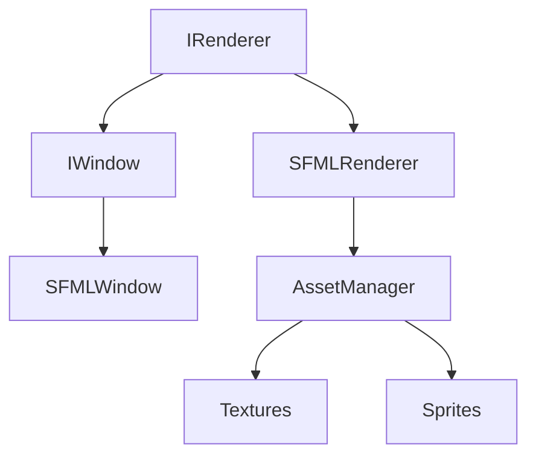
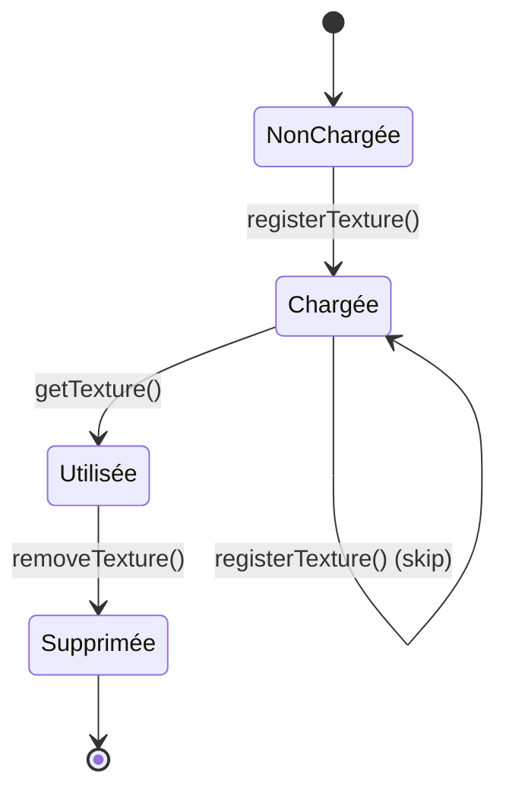

# Graphics - Rendu et Gestion des Assets

Le module **Graphics** gère tout ce qui concerne le rendu visuel du client R-Type, incluant la fenêtre, les textures, les sprites, et l'abstraction du backend graphique.

## Vue d'Ensemble



## Composants

### [Interfaces Graphiques](overview.md)
**Abstraction du backend de rendu**

- **IRenderer**: Interface de rendu générique
- **IWindow**: Interface de fenêtre générique
- Permet de changer de backend (SFML → SDL → Vulkan)

**Avantages:**
- Code client indépendant du backend
- Tests facilitée avec mocks
- Flexibilité technologique

---

### [Implémentation SFML](sfml-implementation.md)
**Backend graphique actuel**

- **SFMLRenderer**: Implémentation concrète du rendu
- **SFMLWindow**: Gestion fenêtre SFML 3.x
- **SFMLTexture**: Wrapper autour de sf::Texture

**Caractéristiques:**
- SFML 3.0+ (dernière version)
- OpenGL moderne
- Cross-platform (Linux, Windows, macOS)

---

### [AssetManager](asset-manager.md)
**Gestionnaire centralisé des ressources**

- Chargement et cache de textures
- Système de sprite pools
- Gestion mémoire automatique
- **Logging intégré** (GraphicsLogger)

**Fonctionnalités:**
```cpp
// Chargement texture avec logging
bool registerTexture(const std::string& file);

// Récupération (exception si absente)
sf::Texture& getTexture(const std::string& key);

// Suppression avec logs
void removeTexture(const std::string& file);

// Sprite pools
void addSprite(const std::string& key, const sf::Sprite& sprite);
void drawAll(std::shared_ptr<graphics::IWindow> window);
```

---

## Architecture

### Hiérarchie des Classes

```
IRenderer (interface)
  └─> SFMLRenderer (implémentation)
       ├─> IWindow* (référence)
       │    └─> SFMLWindow (implémentation)
       └─> AssetManager* (composition)
            ├─> std::map<string, sf::Texture>
            └─> std::map<string, vector<sf::Sprite>>
```

### Ownership

- **GameLoop** possède **IRenderer** (via Engine)
- **SFMLRenderer** possède **AssetManager**
- **AssetManager** possède les **textures** et **sprites**

## Système de Logging

Le module Graphics utilise **GraphicsLogger** pour tous ses logs:

```cpp
#include "core/Logger.hpp"

auto logger = client::logging::Logger::getGraphicsLogger();
logger->debug("Texture '{}' registered successfully", file);
logger->error("Failed to load texture from file: {}", file);
logger->info("Window created: {}x{}", width, height);
```

[Documentation complète du logging](../../development/logging.md)

## Gestion des Ressources

### Cycle de Vie des Textures



### Exemple d'Utilisation

```cpp
AssetManager assets;

// 1. Chargement
if (!assets.registerTexture("assets/player.png")) {
    // Déjà chargée ou erreur (voir logs)
}

// 2. Utilisation
sf::Sprite playerSprite(assets.getTexture("assets/player.png"));
playerSprite.setPosition(100, 100);
assets.addSprite("player", playerSprite);

// 3. Rendu
assets.drawAll(window);

// 4. Cleanup (automatique à la destruction)
assets.removeTexture("assets/player.png");
```

## Performance

### Optimisations

- **Cache textures**: Pas de rechargement inutile
- **Sprite pools**: Regroupement par type
- **Move semantics**: Pas de copies inutiles
- **Logging conditionnel**: Debug seulement si activé

### Métriques

| Opération | Complexité | Notes |
|-----------|------------|-------|
| registerTexture() | O(log n) | map lookup + I/O |
| getTexture() | O(log n) | map lookup |
| removeTexture() | O(log n) | map erase |
| drawAll() | O(n*m) | n pools, m sprites/pool |

## État d'Implémentation

| Composant | État | Complétude | Priorité |
|-----------|------|------------|----------|
| IRenderer | ✅ Implémenté | 80% | - |
| IWindow | ✅ Implémenté | 90% | - |
| SFMLRenderer | ✅ Implémenté | 70% | Moyenne |
| SFMLWindow | ✅ Implémenté | 85% | Moyenne |
| AssetManager | ✅ Implémenté | 90% | Haute |
| Textures | ✅ Fonctionnel | 95% | - |
| Sprites | ✅ Fonctionnel | 80% | - |
| Fonts | 📋 Planifié | 0% | Basse |
| Shaders | 📋 Planifié | 0% | Basse |
| Animations | 📋 Planifié | 0% | Haute |

## Formats Supportés

### Textures (via SFML)
- ✅ PNG (recommandé)
- ✅ JPG/JPEG
- ✅ BMP
- ✅ TGA
- ✅ PSD (limité)

### Fonts (planifié)
- 📋 TTF
- 📋 OTF

## Gestion d'Erreurs

### registerTexture()

```cpp
// Retourne false si:
// 1. Texture déjà enregistrée (pas une erreur)
// 2. Fichier introuvable
// 3. Format invalide
// 4. Mémoire insuffisante

if (!assets.registerTexture("invalid.png")) {
    // Voir logs pour cause exacte
    auto logger = client::logging::Logger::getGraphicsLogger();
    // logger->error("Failed to load texture from file: invalid.png")
}
```

### getTexture()

```cpp
// Lance std::out_of_range si texture non chargée
try {
    auto& texture = assets.getTexture("missing.png");
} catch (const std::out_of_range& e) {
    // Texture n'existe pas
    logger->error("Texture not found: {}", e.what());
}
```

## Debugging

### Logs de Débogage

```cpp
// Activer debug pour voir tous les chargements
client::logging::Logger::getGraphicsLogger()->set_level(spdlog::level::debug);

// Exemple de sortie:
// [2025-11-20 22:45:12.345] [debug] [Graphics] Texture 'player.png' registered successfully
// [2025-11-20 22:45:12.456] [debug] [Graphics] Texture 'enemy.png' already registered
// [2025-11-20 22:45:12.567] [error] [Graphics] Failed to load texture from file: invalid.png
```

### Inspection Mémoire

```bash
# Avec LeakSanitizer (après compilation avec -fsanitize=address)
LSAN_OPTIONS=suppressions=lsan.supp ./rtype_client

# Vérifier pas de fuites de textures
```

## Prochaines Étapes

### Court Terme
1. **Sprite Batching** - Regrouper draw calls
2. **Texture Atlas** - Réduire nombre de textures
3. **Animation System** - Sprites animés

### Moyen Terme
4. **Font System** - Texte avec TTF
5. **Particle System** - Effets visuels
6. **Shader Support** - Post-processing

### Long Terme
7. **Backend Vulkan** - Performance maximale
8. **Hot Reload** - Rechargement assets à chaud
9. **Asset Pipeline** - Optimisation automatique

## Voir Aussi

- [Core Client - Composants Principaux](../core/index.md)
- [Architecture Client](../architecture/overview.md)
- [Système de Logging](../../development/logging.md)
- [SFML 3.0 Documentation](https://www.sfml-dev.org/documentation/3.0.0/)
