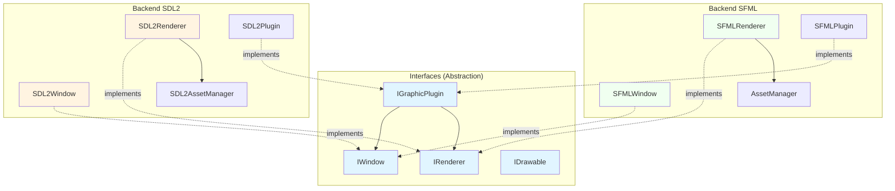
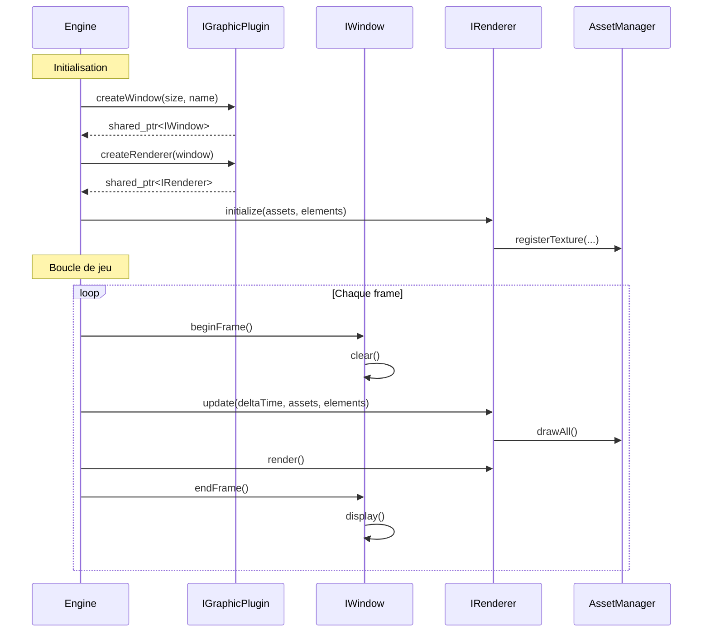

# Graphics - Système de Rendu Multi-Backend

!!! abstract "Résumé"
    Le module **Graphics** gère le rendu visuel du client R-Type avec une architecture multi-backend (SDL2/SFML) permettant de changer de bibliothèque graphique sans modifier le code métier.

## Vue d'Ensemble

Le système graphique utilise une architecture basée sur des **interfaces abstraites** et un **système de plugins** pour supporter plusieurs backends graphiques.



## Backends Disponibles

### SDL2 (Backend par défaut)

| Caractéristique | Valeur |
|-----------------|--------|
| **Bibliothèque** | SDL2 + SDL2_image + SDL2_ttf |
| **Shaders** | Non supportés |
| **Post-processing** | Non disponible |
| **Performance** | Excellente |
| **Compatibilité** | Maximale |

### SFML

| Caractéristique | Valeur |
|-----------------|--------|
| **Bibliothèque** | SFML 3.0+ |
| **Shaders** | Supportés (GLSL) |
| **Post-processing** | Pipeline complet |
| **Performance** | Très bonne |
| **Compatibilité** | Bonne |

## Composants Principaux

### [Interfaces Graphiques](overview.md)

Définitions des contrats que tout backend doit respecter :

- **IWindow** - Gestion fenêtre, événements, rendu, shaders
- **IRenderer** - Pipeline de rendu avec assets
- **IDrawable** - Interface pour objets dessinables
- **IGraphicPlugin** - Factory pour création dynamique

### [Backend SDL2](sdl2-implementation.md)

Implémentation complète avec SDL2 :

- **SDL2Window** - Fenêtre SDL2 avec gestion textures/fonts
- **SDL2Renderer** - Renderer avec AssetManager
- **SDL2AssetManager** - Cache textures et sprite pools

### [Backend SFML](sfml-implementation.md)

Implémentation complète avec SFML :

- **SFMLWindow** - Fenêtre avec support shaders natif
- **SFMLRenderer** - Renderer avec AssetManager
- **AssetManager** - Cache textures et sprites avec logging

### [AssetManager](asset-manager.md)

Gestionnaire centralisé des ressources graphiques :

- Chargement et cache de textures
- Sprite pools par catégorie
- Gestion mémoire automatique
- Logging intégré (spdlog)

---

## Architecture Détaillée

### Hiérarchie des Classes

```
graphics::IWindow (interface)
├── SDL2Window (SDL2)
│   ├── SDL_Window*
│   ├── SDL_Renderer*
│   └── std::unordered_map<textures/fonts>
│
└── SFMLWindow (SFML)
    ├── sf::RenderWindow
    ├── sf::RenderTexture (post-processing)
    └── std::unordered_map<textures/fonts/shaders>

core::IRenderer (interface)
├── SDL2Renderer
│   └── SDL2AssetManager
│
└── SFMLRenderer
    └── AssetManager

graphics::IGraphicPlugin (interface)
├── SDL2Plugin
└── SFMLPlugin
```

### Cycle de Vie du Rendu



---

## Système de Layers

Les éléments graphiques sont organisés en couches pour gérer l'ordre de rendu :

```cpp
enum class Layer : int {
    Background = 0,    // Arrière-plan (étoiles, parallax)
    Entities = 10,     // Entités de base (ennemis)
    Player = 20,       // Joueur
    Projectiles = 30,  // Missiles et projectiles
    Effects = 40,      // Effets visuels (explosions)
    UI = 100           // Interface utilisateur
};
```

---

## Système de Plugins

Le système de plugins permet de charger dynamiquement le backend graphique au démarrage :

```cpp
// Définition du plugin
typedef graphics::IGraphicPlugin* (*create_t)();
typedef void (*destroy_t)(graphics::IGraphicPlugin*);

// Utilisation
auto plugin = loadPlugin("libsdl2_plugin.so");
auto window = plugin->createWindow({1920, 1080}, "R-Type");
auto renderer = plugin->createRenderer(window);
```

---

## Fonctionnalités par Backend

| Fonctionnalité | SDL2 | SFML |
|----------------|------|------|
| Fenêtre | ✅ | ✅ |
| Rendu 2D | ✅ | ✅ |
| Textures | ✅ | ✅ |
| Fonts (TTF) | ✅ | ✅ |
| Événements | ✅ | ✅ |
| Shaders GLSL | ❌ | ✅ |
| Post-processing | ❌ | ✅ |
| Sprite Batching | ✅ | ✅ |

---

## Performance

### Optimisations Implémentées

- **Cache de textures** - Pas de rechargement inutile
- **Sprite pools** - Regroupement par catégorie
- **Move semantics** - Pas de copies inutiles
- **Logging conditionnel** - Debug seulement si activé

### Métriques

| Opération | Complexité |
|-----------|------------|
| loadTexture() | O(log n) + I/O |
| drawSprite() | O(1) |
| drawAll() | O(n) |

---

## Voir Aussi

- [Vue d'ensemble technique](overview.md) - Architecture détaillée
- [Backend SDL2](sdl2-implementation.md) - Documentation SDL2
- [Backend SFML](sfml-implementation.md) - Documentation SFML
- [AssetManager](asset-manager.md) - Gestion des ressources
- [Documentation du logging](../../development/logging.md) - Système de logs
