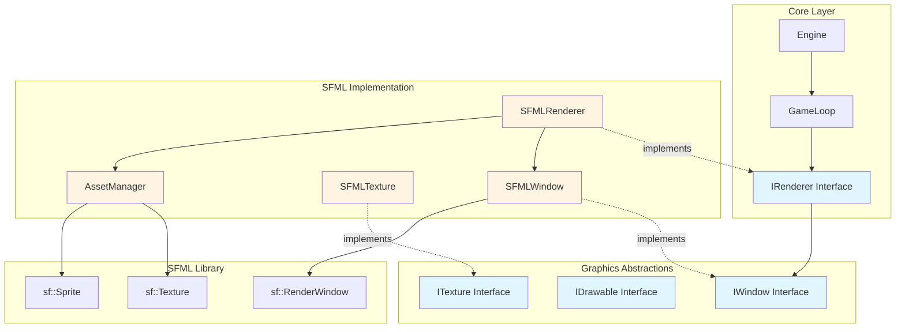
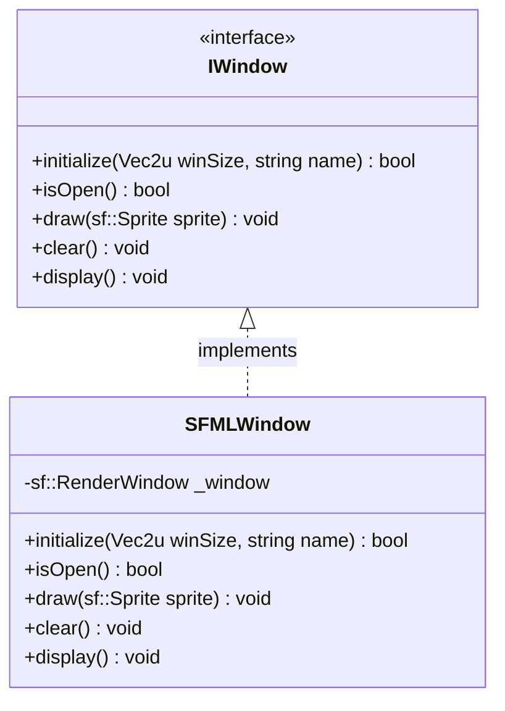
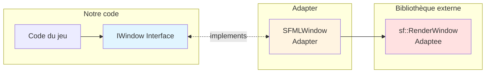
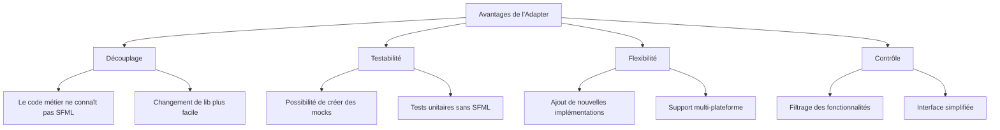
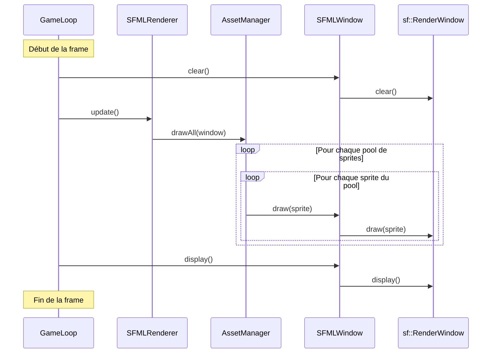
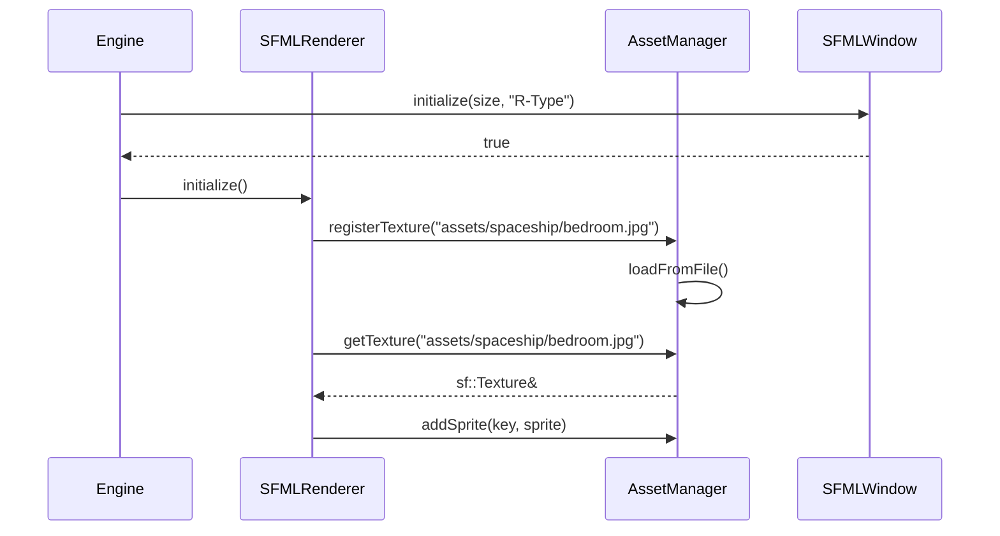
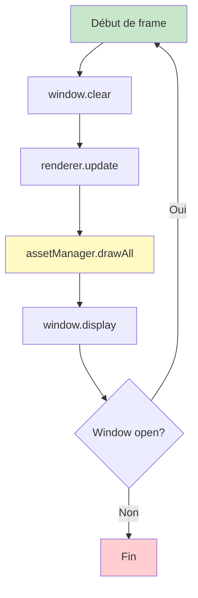
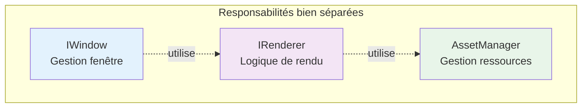

# Vue d'ensemble du système graphique R-Type

## Table des matières

1. [Introduction](#introduction)
2. [Architecture générale](#architecture-générale)
3. [Les interfaces principales](#les-interfaces-principales)
4. [Le pattern Adapter](#le-pattern-adapter)
5. [Flux de rendu](#flux-de-rendu)
6. [Exemples concrets](#exemples-concrets)
7. [Bonnes pratiques](#bonnes-pratiques)

---

## Introduction

Le système graphique du client R-Type est conçu selon une architecture modulaire et extensible qui sépare les abstractions graphiques de leurs implémentations concrètes. Cette approche permet de changer facilement de bibliothèque graphique (actuellement SFML) sans modifier le code métier du jeu.

### Objectifs du système

- **Abstraction** : Isoler le code métier des détails d'implémentation graphique
- **Flexibilité** : Permettre le changement de bibliothèque graphique (SFML, SDL, etc.)
- **Performance** : Optimiser le rendu avec un système de cache et de pools
- **Maintenabilité** : Faciliter l'ajout de nouvelles fonctionnalités graphiques

!!! tip "Pourquoi cette architecture ?"
    En séparant les interfaces des implémentations, on applique le principe SOLID de **Dependency Inversion** : le code haut niveau (logique du jeu) ne dépend pas du code bas niveau (SFML), mais tous deux dépendent d'abstractions (interfaces).

---

## Architecture générale

### Diagramme de l'architecture complète



### Couches de l'architecture

#### 1. Core Layer (Noyau)

Cette couche contient la logique principale du moteur de jeu :

- **Engine** : Point d'entrée principal, gère l'initialisation
- **GameLoop** : Boucle de jeu, gère le timing et les updates
- **IRenderer** : Interface pour le système de rendu

#### 2. Graphics Abstractions (Abstractions graphiques)

Cette couche définit les contrats que toute implémentation graphique doit respecter :

- **IWindow** : Gestion de la fenêtre d'affichage
- **IDrawable** : Objets pouvant être dessinés
- **ITexture** : Gestion des textures/images

#### 3. SFML Implementation (Implémentation SFML)

Cette couche fournit les implémentations concrètes utilisant SFML :

- **SFMLRenderer** : Implémentation du renderer avec SFML
- **SFMLWindow** : Wrapper autour de `sf::RenderWindow`
- **SFMLTexture** : Wrapper autour de `sf::Texture`
- **AssetManager** : Gestionnaire de ressources avec cache

#### 4. SFML Library (Bibliothèque SFML)

Les classes natives de SFML utilisées directement.

---

## Les interfaces principales

### IWindow : L'interface de fenêtre



**Fichier source** : `/home/simia/epitech/second_year/projects/rtype/src/client/include/graphics/IWindow.hpp`

```cpp
namespace graphics {
    class IWindow {
        public:
            virtual ~IWindow() = default;

            // Initialise la fenêtre avec une taille et un titre
            virtual bool initialize(Vec2u winSize, const std::string& name) = 0;

            // Vérifie si la fenêtre est ouverte
            virtual bool isOpen() = 0;

            // Dessine un sprite dans la fenêtre
            virtual void draw(const sf::Sprite& sprite) = 0;

            // Efface le contenu de la fenêtre
            virtual void clear() = 0;

            // Affiche le buffer à l'écran
            virtual void display() = 0;
    };
}
```

#### Responsabilités de IWindow

| Méthode | Responsabilité | Quand l'utiliser |
|---------|---------------|------------------|
| `initialize()` | Créer et configurer la fenêtre | Au démarrage de l'application |
| `isOpen()` | Vérifier l'état de la fenêtre | Dans la boucle de jeu |
| `draw()` | Envoyer un objet au buffer de rendu | Pour chaque objet à afficher |
| `clear()` | Nettoyer le buffer | Au début de chaque frame |
| `display()` | Afficher le buffer à l'écran | À la fin de chaque frame |

!!! note "Double buffering"
    Les méthodes `clear()`, `draw()` et `display()` implémentent le pattern **double buffering** :
    1. `clear()` efface le back buffer
    2. `draw()` dessine dans le back buffer
    3. `display()` swap les buffers (le back buffer devient visible)

### IDrawable : L'interface d'objet dessinable

**Fichier source** : `/home/simia/epitech/second_year/projects/rtype/src/client/include/graphics/IDrawable.hpp`

```cpp
namespace graphics {
    class IDrawable {
        public:
            virtual ~IDrawable() = default;

            // Dessine l'objet dans une fenêtre SFML
            virtual void draw(sf::RenderWindow& window) = 0;
    };
}
```

!!! warning "Couplage avec SFML"
    Cette interface utilise directement `sf::RenderWindow`, ce qui crée un couplage avec SFML. Dans une architecture parfaitement découplée, on passerait plutôt une référence à `IWindow`.

### ITexture : L'interface de texture

**Fichier source** : `/home/simia/epitech/second_year/projects/rtype/src/client/include/graphics/ITexture.hpp`

```cpp
namespace graphics {
    class ITexture {
        public:
            virtual ~ITexture() = default;

            // Obtient la taille de la texture
            virtual Vec2u getSize() const = 0;

            // Charge une texture depuis un fichier
            virtual void loadFile() = 0;
    };
}
```

#### Le type Vec2u

**Fichier source** : `/home/simia/epitech/second_year/projects/rtype/src/client/include/utils/Vecs.hpp`

```cpp
struct Vec2u {
    unsigned int x;
    unsigned int y;
};
```

C'est un simple conteneur pour représenter des vecteurs 2D avec des entiers non signés, utilisé pour les tailles et positions en pixels.

---

## Le pattern Adapter

### Qu'est-ce qu'un Adapter ?

Le pattern **Adapter** (ou Wrapper) permet d'utiliser une interface existante (SFML) à travers une interface que nous définissons (IWindow, ITexture, etc.). C'est comme un adaptateur électrique qui permet de brancher une prise américaine sur une prise européenne.



### Exemple concret : SFMLWindow comme Adapter

**Fichier header** : `/home/simia/epitech/second_year/projects/rtype/src/client/include/implementations/sfml/SFMLWindow.hpp`

```cpp
class SFMLWindow: public graphics::IWindow {
    public:
        bool initialize(Vec2u winSize, const std::string& name) override;
        bool isOpen() override;
        void draw(const sf::Sprite& sprite) override;
        void clear() override;
        void display() override;

    private:
        sf::RenderWindow _window;  // L'objet SFML adapté
};
```

**Fichier implémentation** : `/home/simia/epitech/second_year/projects/rtype/src/client/implementations/sfml/SFMLWindow.cpp`

```cpp
bool SFMLWindow::initialize(Vec2u winSize, const std::string& name)
{
    if (_window.isOpen())
        return false;

    // Adaptation : notre Vec2u → sf::VideoMode de SFML
    _window.create(sf::VideoMode({winSize.x, winSize.y}), name);
    return true;
}

bool SFMLWindow::isOpen()
{
    // Délégation directe à SFML
    return _window.isOpen();
}

void SFMLWindow::draw(const sf::Sprite& sprite) {
    // Délégation directe à SFML
    _window.draw(sprite);
}

void SFMLWindow::clear() {
    // Délégation directe à SFML
    _window.clear();
}

void SFMLWindow::display() {
    // Délégation directe à SFML
    _window.display();
}
```

### Avantages de l'Adapter



!!! tip "Quand utiliser un Adapter ?"
    - Quand vous voulez utiliser une bibliothèque externe
    - Quand vous voulez protéger votre code des changements externes
    - Quand vous avez besoin de plusieurs implémentations d'une même fonctionnalité
    - Quand vous voulez simplifier une API complexe

---

## Flux de rendu

### Cycle de vie d'une frame



### Détails du processus

#### 1. Initialisation (une seule fois)



#### 2. Boucle de rendu (chaque frame)



---

## Exemples concrets

### Exemple 1 : Créer et afficher une fenêtre

```cpp
#include "implementations/sfml/SFMLWindow.hpp"

int main() {
    // 1. Créer une instance de fenêtre
    SFMLWindow window;

    // 2. Définir la taille de la fenêtre
    Vec2u windowSize{.x = 1920, .y = 1080};

    // 3. Initialiser la fenêtre
    if (!window.initialize(windowSize, "Mon jeu R-Type")) {
        std::cerr << "Erreur : Impossible de créer la fenêtre" << std::endl;
        return 1;
    }

    // 4. Boucle principale
    while (window.isOpen()) {
        // Nettoyer la fenêtre (fond noir par défaut)
        window.clear();

        // Ici : dessiner des objets avec window.draw()

        // Afficher le contenu
        window.display();
    }

    return 0;
}
```

!!! note "Pourquoi initialiser séparément ?"
    La méthode `initialize()` peut échouer (retourner `false`). Séparer la construction de l'initialisation permet une meilleure gestion d'erreurs.

### Exemple 2 : Utiliser le renderer complet

```cpp
#include "implementations/sfml/SFMLRenderer.hpp"
#include "implementations/sfml/SFMLWindow.hpp"

int main() {
    // 1. Créer la fenêtre
    SFMLWindow window;
    Vec2u windowSize{.x = 1920, .y = 1080};
    window.initialize(windowSize, "R-Type");

    // 2. Créer le renderer (injecte la fenêtre)
    SFMLRenderer renderer(&window);

    // 3. Initialiser le renderer (charge les assets)
    renderer.initialize();

    // 4. Boucle de jeu
    while (window.isOpen()) {
        window.clear();

        // Le renderer gère tout le dessin
        renderer.update();

        window.display();
    }

    return 0;
}
```

### Exemple 3 : Charger et afficher plusieurs textures

```cpp
#include "implementations/sfml/utils/AssetManager.hpp"
#include "implementations/sfml/SFMLWindow.hpp"

int main() {
    SFMLWindow window;
    window.initialize({1920, 1080}, "R-Type");

    AssetManager assetManager;

    // Charger plusieurs textures
    assetManager.registerTexture("assets/player.png");
    assetManager.registerTexture("assets/enemy.png");
    assetManager.registerTexture("assets/background.png");

    // Créer des sprites pour chaque texture
    sf::Sprite playerSprite(assetManager.getTexture("assets/player.png"));
    playerSprite.setPosition(100, 100);

    sf::Sprite enemySprite(assetManager.getTexture("assets/enemy.png"));
    enemySprite.setPosition(500, 200);

    // Ajouter les sprites aux pools
    assetManager.addSprite("player", playerSprite);
    assetManager.addSprite("enemy", enemySprite);

    // Boucle de rendu
    while (window.isOpen()) {
        window.clear();

        // Dessiner tous les sprites en une seule commande
        assetManager.drawAll(&window);

        window.display();
    }

    return 0;
}
```

### Exemple 4 : Polymorphisme avec IWindow

```cpp
#include "graphics/IWindow.hpp"
#include "implementations/sfml/SFMLWindow.hpp"

// Fonction qui travaille avec n'importe quelle implémentation de IWindow
void renderGame(graphics::IWindow* window) {
    window->clear();

    // Logique de rendu ici...
    // Cette fonction ne sait pas qu'elle utilise SFML !

    window->display();
}

int main() {
    // On peut facilement changer l'implémentation
    graphics::IWindow* window = new SFMLWindow();
    // Demain : graphics::IWindow* window = new SDLWindow();

    window->initialize({1920, 1080}, "R-Type");

    while (window->isOpen()) {
        renderGame(window);  // Polymorphisme
    }

    delete window;
    return 0;
}
```

!!! warning "Gestion de la mémoire"
    Dans un vrai projet, utilisez des smart pointers (`std::unique_ptr`, `std::shared_ptr`) plutôt que `new`/`delete` :
    ```cpp
    auto window = std::make_unique<SFMLWindow>();
    ```

---

## Bonnes pratiques

### 1. Injection de dépendances

```cpp
// ❌ Mauvais : création directe dans le constructeur
class SFMLRenderer {
    SFMLRenderer() {
        _window = new SFMLWindow();  // Dépendance forte
    }
};

// ✅ Bon : injection via le constructeur
class SFMLRenderer {
    SFMLRenderer(graphics::IWindow* window) : _window(window) {
        // La fenêtre est fournie de l'extérieur
    }
};
```

### 2. Programmez vers les interfaces, pas les implémentations

```cpp
// ❌ Mauvais
void processWindow(SFMLWindow* window) {
    window->clear();
}

// ✅ Bon
void processWindow(graphics::IWindow* window) {
    window->clear();
}
```

### 3. Utilisez const pour les getters

```cpp
class ITexture {
    // ✅ const car getSize ne modifie pas l'objet
    virtual Vec2u getSize() const = 0;
};
```

### 4. Gérez les erreurs proprement

```cpp
// ✅ Vérifiez toujours le retour de initialize()
if (!window.initialize(size, name)) {
    throw std::runtime_error("Failed to initialize window");
}

// ✅ L'AssetManager lève des exceptions pour les textures manquantes
try {
    auto& texture = assetManager.getTexture("inexistant.png");
} catch (const std::out_of_range& e) {
    std::cerr << "Texture non trouvée : " << e.what() << std::endl;
}
```

### 5. Séparez les responsabilités



---

## Résumé

Le système graphique du R-Type repose sur trois piliers :

1. **Abstraction via interfaces** : IWindow, ITexture, IDrawable définissent les contrats
2. **Implémentation via adapters** : SFMLWindow, SFMLTexture adaptent SFML à nos interfaces
3. **Optimisation via AssetManager** : Cache et pools pour des performances optimales

Cette architecture permet :
- De changer de bibliothèque graphique facilement
- De tester le code sans dépendre de SFML
- De maintenir un code propre et modulaire
- D'optimiser les performances avec un système de cache

!!! tip "Prochaines étapes"
    - Lisez [sfml-implementation.md](./sfml-implementation.md) pour les détails d'implémentation SFML
    - Consultez [asset-manager.md](./asset-manager.md) pour comprendre le système de cache
