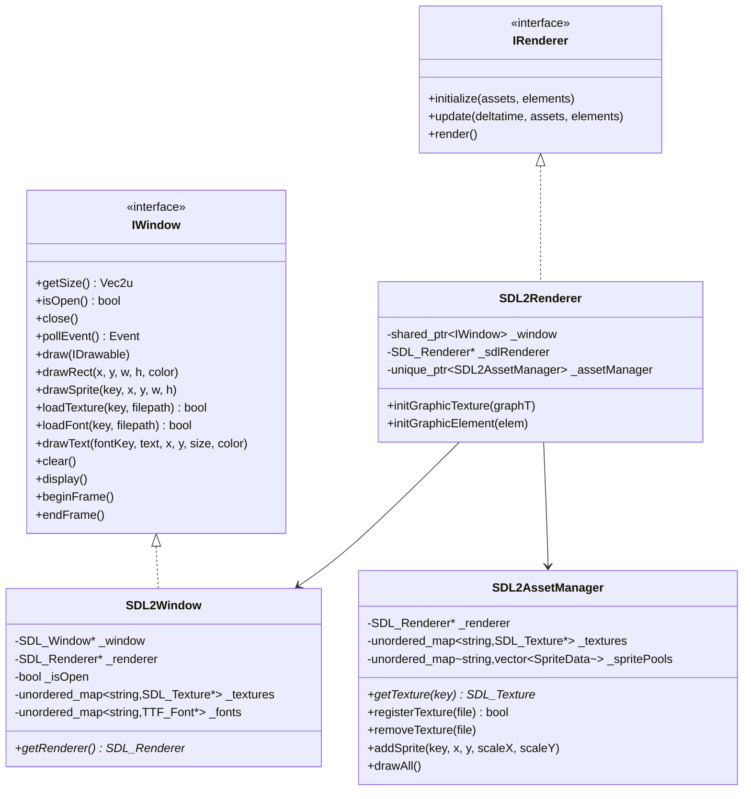

# Backend SDL2

!!! abstract "API Reference"
    **Module** : `src/client/lib/sdl2/`
    **Backend** : SDL2 + SDL2_image + SDL2_ttf
    **Statut** : Backend par défaut

## Vue d'ensemble

Le backend SDL2 fournit une implémentation complète du système graphique utilisant la bibliothèque SDL2. C'est le backend par défaut du projet, offrant une excellente compatibilité et performance.



---

## SDL2Window

### Description

`SDL2Window` est l'implémentation de l'interface `IWindow` utilisant SDL2. Elle gère :
- La fenêtre de rendu
- Le contexte de rendu SDL2
- Le cache de textures et fonts
- Les événements d'entrée

### Constructeur

```cpp
SDL2Window(Vec2u winSize, const std::string& name);
```

| Paramètre | Type | Description |
|-----------|------|-------------|
| `winSize` | `Vec2u` | Dimensions de la fenêtre (largeur, hauteur) |
| `name` | `std::string` | Titre de la fenêtre |

### Méthodes Principales

#### Gestion de la Fenêtre

```cpp
Vec2u getSize() const override;
bool isOpen() override;
void close() override;
```

#### Événements

```cpp
events::Event pollEvent() override;
```

Retourne le prochain événement dans la file d'attente. Les types d'événements supportés :

| Type | Description |
|------|-------------|
| `KeyPressed` | Touche appuyée |
| `KeyReleased` | Touche relâchée |
| `WindowClosed` | Fenêtre fermée |
| `None` | Aucun événement |

#### Rendu

```cpp
void draw(const graphics::IDrawable& drawable) override;
void drawRect(float x, float y, float width, float height, rgba color) override;
void drawSprite(const std::string& textureKey, float x, float y, float width, float height) override;
void drawText(const std::string& fontKey, const std::string& text,
              float x, float y, unsigned int size, rgba color) override;
void clear() override;
void display() override;
```

#### Ressources

```cpp
bool loadTexture(const std::string& key, const std::string& filepath) override;
bool loadFont(const std::string& key, const std::string& filepath) override;
```

#### Frame Management

```cpp
void beginFrame() override;  // Début de frame (clear)
void endFrame() override;    // Fin de frame (display)
```

### Exemple d'Utilisation

```cpp
#include "SDL2Window.hpp"

int main() {
    // Création de la fenêtre
    SDL2Window window({1920, 1080}, "R-Type");

    // Chargement des ressources
    window.loadTexture("player", "assets/player.png");
    window.loadFont("main", "assets/fonts/arial.ttf");

    // Boucle de jeu
    while (window.isOpen()) {
        // Gestion des événements
        auto event = window.pollEvent();
        if (std::holds_alternative<events::WindowClosed>(event)) {
            window.close();
        }

        // Rendu
        window.beginFrame();
        window.drawSprite("player", 100, 200, 64, 64);
        window.drawText("main", "Score: 1000", 10, 10, 24, {255, 255, 255, 255});
        window.endFrame();
    }

    return 0;
}
```

---

## SDL2Renderer

### Description

`SDL2Renderer` implémente l'interface `IRenderer` et orchestre le rendu via `SDL2AssetManager`.

### Constructeur

```cpp
SDL2Renderer(std::shared_ptr<graphics::IWindow> window);
```

### Méthodes

```cpp
void initialize(GraphicAssets& assets, GraphicAssetsE& elements) override;
void update(float deltatime, GraphicAssets& assets, GraphicAssetsE& elements) override;
void render() override;

void initGraphicTexture(const graphic::GraphicTexture& graphT);
void initGraphicElement(const graphic::GraphicElement& elem);
```

### Pipeline de Rendu


---

## SDL2AssetManager

### Description

Gestionnaire de ressources SDL2 avec cache de textures et sprite pools.

### Constructeur

```cpp
SDL2AssetManager(SDL_Renderer* renderer);
```

### Méthodes

```cpp
// Gestion des textures
SDL_Texture* getTexture(const std::string& key);
bool registerTexture(const std::string& file);
void removeTexture(const std::string& file);

// Gestion des sprites
void addSprite(const std::string& key, float x, float y, float scaleX, float scaleY);
void drawAll();
```

### Structure SpriteData

```cpp
struct SpriteData {
    SDL_Texture* texture;      // Texture source
    SDL_FRect destRect;        // Rectangle destination (position, taille)
    SDL_Rect srcRect;          // Rectangle source (portion de texture)
    bool useFullTexture;       // Utiliser toute la texture
};
```

---

## SDL2Plugin

### Description

Plugin pour le chargement dynamique du backend SDL2.

### Interface

```cpp
class SDL2Plugin : public graphics::IGraphicPlugin {
public:
    const char* getName() const override;

    std::shared_ptr<IWindow> createWindow(
        Vec2u winSize, const std::string& name
    ) override;

    std::shared_ptr<core::IRenderer> createRenderer(
        std::shared_ptr<graphics::IWindow> window
    ) override;
};
```

### Fonctions d'Export

```cpp
// Point d'entrée du plugin
extern "C" graphics::IGraphicPlugin* create_plugin();
extern "C" void destroy_plugin(graphics::IGraphicPlugin* plugin);
```

### Chargement Dynamique

```cpp
// Chargement du plugin SDL2
void* handle = dlopen("libsdl2_plugin.so", RTLD_LAZY);
auto create = (create_t)dlsym(handle, "create_plugin");
auto plugin = create();

// Utilisation
auto window = plugin->createWindow({1920, 1080}, "R-Type");
auto renderer = plugin->createRenderer(window);
```

---

## Limitations

!!! warning "Fonctionnalités Non Supportées"
    Le backend SDL2 ne supporte pas :

    - **Shaders GLSL** - Les méthodes `loadShader()`, `setPostProcessShader()`, etc. sont des stubs
    - **Post-processing** - Pas de pipeline de post-traitement
    - **RenderTexture** - Pas de rendu vers texture

### Stubs de Shaders

```cpp
bool SDL2Window::loadShader(const std::string& key,
    const std::string& vertexPath, const std::string& fragmentPath) override
{
    return false;  // Non supporté
}

void SDL2Window::setPostProcessShader(const std::string& key) override {
    // Stub - aucun effet
}

bool SDL2Window::supportsShaders() const override {
    return false;
}
```

---

## Dépendances

| Bibliothèque | Version | Usage |
|--------------|---------|-------|
| SDL2 | 2.x | Fenêtre, rendu, événements |
| SDL2_image | 2.x | Chargement images (PNG, JPG, etc.) |
| SDL2_ttf | 2.x | Rendu de texte avec fonts TTF |

### Installation (Ubuntu/Debian)

```bash
sudo apt install libsdl2-dev libsdl2-image-dev libsdl2-ttf-dev
```

### Installation (vcpkg)

```bash
vcpkg install sdl2 sdl2-image sdl2-ttf
```

---

## Voir Aussi

- [Vue d'ensemble Graphics](index.md)
- [Backend SFML](sfml-implementation.md)
- [AssetManager](asset-manager.md)
- [Documentation SDL2](https://wiki.libsdl.org/)
