# Documentation des implémentations SFML

## Table des matières

1. [Introduction](#introduction)
2. [SFMLWindow : L'implémentation de fenêtre](#sfmlwindow--limplémentation-de-fenêtre)
3. [SFMLTexture : L'implémentation de texture](#sfmltexture--limplémentation-de-texture)
4. [SFMLRenderer : Le moteur de rendu](#sfmlrenderer--le-moteur-de-rendu)
5. [Diagrammes de séquence détaillés](#diagrammes-de-séquence-détaillés)
6. [Exemples pratiques avancés](#exemples-pratiques-avancés)
7. [Debugging et troubleshooting](#debugging-et-troubleshooting)

---

## Introduction

Cette documentation détaille les implémentations concrètes du système graphique R-Type utilisant la bibliothèque **SFML** (Simple and Fast Multimedia Library). Chaque classe implémente une interface définie dans le layer d'abstraction.

### Vue d'ensemble des classes

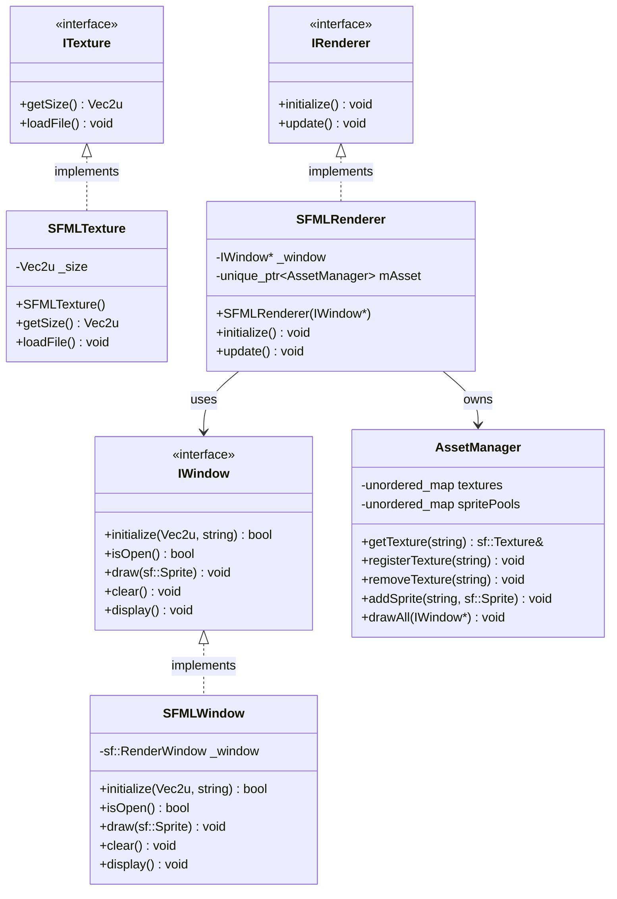

---

## SFMLWindow : L'implémentation de fenêtre

### Architecture de SFMLWindow

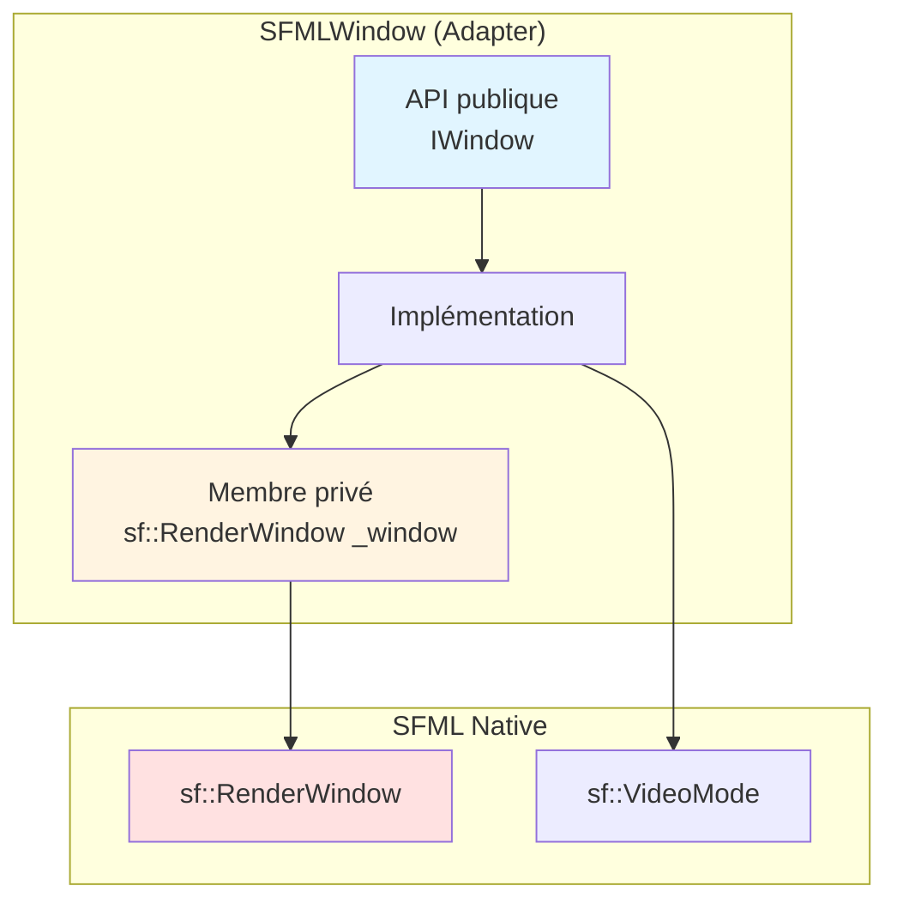

### Fichier header

**Chemin** : `/home/simia/epitech/second_year/projects/rtype/src/client/include/implementations/sfml/SFMLWindow.hpp`

```cpp
#ifndef SFMLWINDOW_HPP_
#define SFMLWINDOW_HPP_

#include "../../graphics/IWindow.hpp"
#include <SFML/Graphics.hpp>

class SFMLWindow: public graphics::IWindow {
    public:
        // Initialise la fenêtre avec une taille et un titre
        bool initialize(Vec2u winSize, const std::string& name) override;

        // Vérifie si la fenêtre est ouverte
        bool isOpen() override;

        // Dessine un sprite dans la fenêtre
        void draw(const sf::Sprite& sprite) override;

        // Efface le contenu de la fenêtre (fond noir)
        void clear() override;

        // Affiche le buffer à l'écran (swap buffers)
        void display() override;

    private:
        sf::RenderWindow _window;  // L'objet SFML encapsulé
};

#endif /* !SFMLWINDOW_HPP_ */
```

### Fichier implémentation

**Chemin** : `/home/simia/epitech/second_year/projects/rtype/src/client/implementations/sfml/SFMLWindow.cpp`

```cpp
#include "implementations/sfml/SFMLWindow.hpp"

bool SFMLWindow::initialize(Vec2u winSize, const std::string& name)
{
    // Vérification : éviter de recréer une fenêtre déjà ouverte
    if (_window.isOpen())
        return false;

    // Conversion de notre Vec2u vers sf::VideoMode de SFML
    _window.create(sf::VideoMode({winSize.x, winSize.y}), name);
    return true;
}

bool SFMLWindow::isOpen()
{
    // Délégation simple à l'objet SFML
    return _window.isOpen();
}

void SFMLWindow::draw(const sf::Sprite& sprite) {
    // Dessine le sprite dans le back buffer
    _window.draw(sprite);
}

void SFMLWindow::clear() {
    // Remplit le back buffer avec du noir
    _window.clear();
}

void SFMLWindow::display() {
    // Swap des buffers : le back buffer devient visible
    _window.display();
}
```

### Analyse détaillée des méthodes

#### initialize()

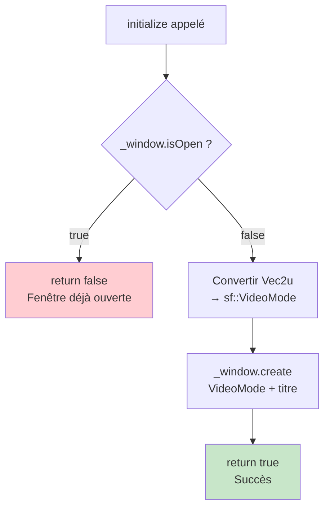

**Pourquoi vérifier `isOpen()` ?**

```cpp
SFMLWindow window;
window.initialize({800, 600}, "Fenêtre 1");  // ✅ OK
window.initialize({1920, 1080}, "Fenêtre 2"); // ❌ Échoue, retourne false
```

!!! warning "Réinitialisation de fenêtre"
    Si vous voulez changer la taille de la fenêtre, vous devez d'abord fermer l'ancienne :
    ```cpp
    window._window.close();  // Mais _window est privé !
    ```
    **Problème** : Il n'y a pas de méthode `close()` dans l'interface `IWindow`. C'est une limitation de l'abstraction actuelle.

**Conversion Vec2u → sf::VideoMode**

```cpp
// Notre structure
Vec2u winSize{.x = 1920, .y = 1080};

// Conversion vers SFML (C++20 designated initializers)
sf::VideoMode({winSize.x, winSize.y})

// Équivalent à :
sf::VideoMode(1920, 1080)
```

#### draw()

```cpp
void SFMLWindow::draw(const sf::Sprite& sprite) {
    _window.draw(sprite);
}
```

!!! note "Double buffering en action"
    La méthode `draw()` ne dessine **PAS** directement à l'écran. Elle dessine dans un **back buffer** (tampon arrière). Le contenu n'est visible qu'après l'appel à `display()`.

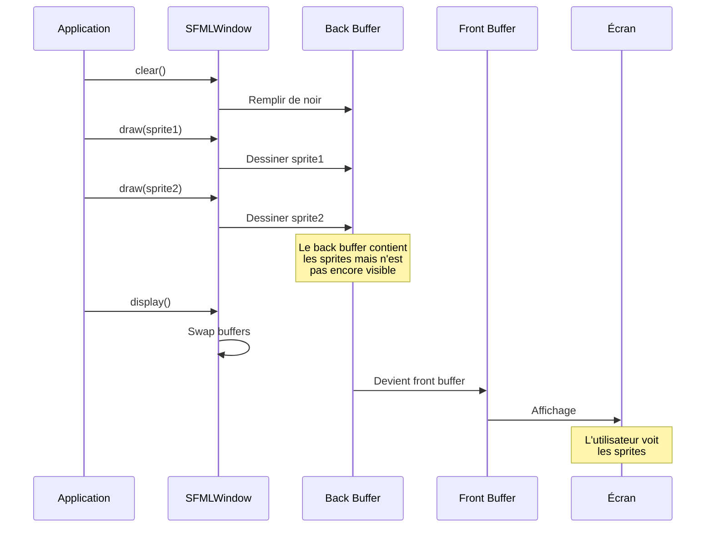

**Pourquoi le double buffering ?**

Sans double buffering, on verrait les objets se dessiner un par un (effet de scintillement). Avec le double buffering, tout est préparé en coulisses puis affiché d'un coup.

#### clear()

```cpp
void SFMLWindow::clear() {
    _window.clear();
}
```

Par défaut, `clear()` remplit le back buffer avec du noir. SFML permet aussi de spécifier une couleur :

```cpp
// Dans la vraie SFML (pas dans notre wrapper)
_window.clear(sf::Color::Red);    // Fond rouge
_window.clear(sf::Color(50, 50, 50)); // Gris foncé
```

!!! tip "Amélioration possible"
    On pourrait ajouter un paramètre de couleur à notre interface :
    ```cpp
    virtual void clear(Color color = Color::Black) = 0;
    ```

#### display()

```cpp
void SFMLWindow::display() {
    _window.display();
}
```

C'est la méthode qui effectue réellement le **swap des buffers**. Après cet appel :
- Le back buffer devient le front buffer (visible)
- L'ancien front buffer devient le back buffer (prêt pour le prochain frame)

### Diagramme de séquence complet d'une frame

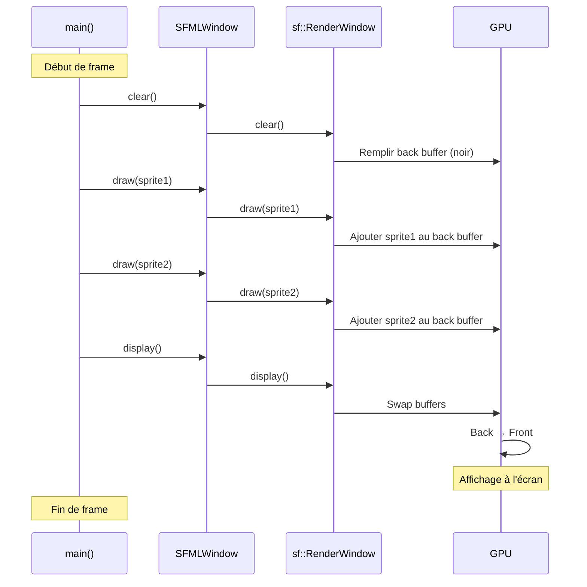

### Exemple d'utilisation complet

```cpp
#include "implementations/sfml/SFMLWindow.hpp"
#include <SFML/Graphics.hpp>

int main() {
    // 1. Création de la fenêtre
    SFMLWindow window;

    // 2. Configuration de la taille
    Vec2u size{.x = 1920, .y = 1080};

    // 3. Initialisation
    if (!window.initialize(size, "R-Type Client")) {
        std::cerr << "Erreur : Impossible d'initialiser la fenêtre" << std::endl;
        return 1;
    }

    // 4. Chargement d'une texture (SFML pur pour l'exemple)
    sf::Texture texture;
    if (!texture.loadFromFile("assets/spaceship.png")) {
        std::cerr << "Erreur : Texture non trouvée" << std::endl;
        return 1;
    }

    // 5. Création d'un sprite
    sf::Sprite sprite(texture);
    sprite.setPosition(100.f, 100.f);

    // 6. Boucle de rendu
    while (window.isOpen()) {
        // Effacer
        window.clear();

        // Dessiner
        window.draw(sprite);

        // Afficher
        window.display();
    }

    return 0;
}
```

!!! warning "Gestion des événements manquante"
    Le code ci-dessus a un problème : **la fenêtre ne peut pas se fermer** ! Il manque la gestion des événements (fermeture, clavier, etc.). Cette fonctionnalité n'est pas encore dans l'interface `IWindow`.

---

## SFMLTexture : L'implémentation de texture

### Architecture de SFMLTexture

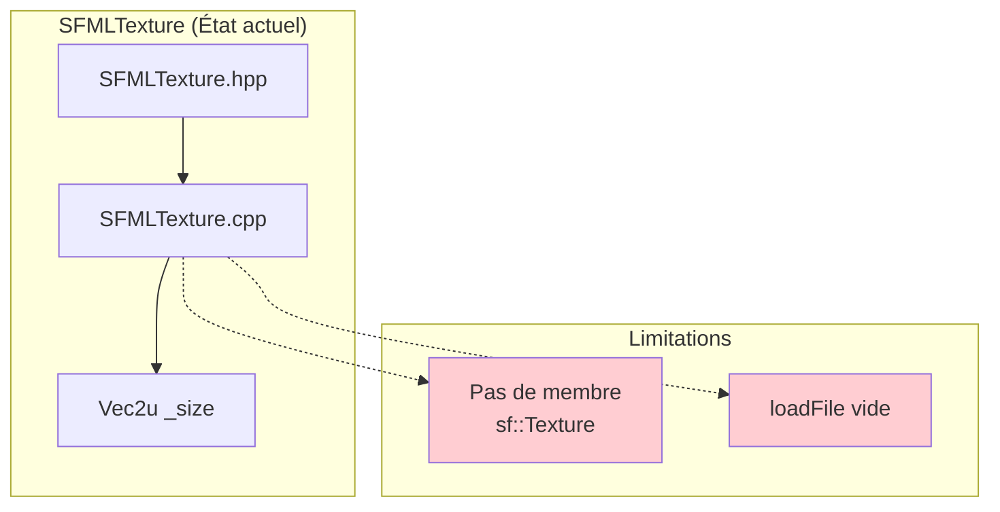

### Fichier header

**Chemin** : `/home/simia/epitech/second_year/projects/rtype/src/client/include/implementations/sfml/SFMLTexture.hpp`

```cpp
#ifndef SFMLTEXTURE_HPP_
#define SFMLTEXTURE_HPP_

#include "../../graphics/ITexture.hpp"

class SFMLTexture: public graphics::ITexture {
    public:
        SFMLTexture();

        // Retourne la taille de la texture
        Vec2u getSize() const override;

        // Charge une texture depuis un fichier
        void loadFile() override;

    private:
        Vec2u _size;  // Taille de la texture
};

#endif /* !SFMLTEXTURE_HPP_ */
```

### Fichier implémentation

**Chemin** : `/home/simia/epitech/second_year/projects/rtype/src/client/implementations/sfml/SFMLTexture.cpp`

```cpp
#include "implementations/sfml/SFMLTexture.hpp"

SFMLTexture::SFMLTexture(): _size{.x = 0, .y = 0}
{
    // Initialisation de la taille à (0, 0)
}

Vec2u SFMLTexture::getSize() const
{
    return _size;
}

void SFMLTexture::loadFile()
{
    // TODO : Implémentation vide pour le moment
}
```

### Analyse et limitations

!!! danger "Implémentation incomplète"
    La classe `SFMLTexture` est actuellement **incomplète** et **non fonctionnelle** :

    1. **Pas de membre `sf::Texture`** : Il n'y a aucun objet SFML pour stocker la texture
    2. **`loadFile()` vide** : La méthode ne fait rien
    3. **Pas de paramètre de chemin** : `loadFile()` ne prend aucun argument
    4. **`_size` jamais mis à jour** : Reste toujours (0, 0)

### Implémentation suggérée (non présente dans le code)

Voici comment `SFMLTexture` **devrait** être implémentée :

```cpp
// SFMLTexture.hpp (version améliorée)
class SFMLTexture: public graphics::ITexture {
    public:
        SFMLTexture();

        Vec2u getSize() const override;
        void loadFile() override;  // ❌ Signature problématique

        // ✅ Méthode supplémentaire nécessaire
        bool loadFromFile(const std::string& filepath);
        sf::Texture& getTexture();  // Pour l'utiliser avec sf::Sprite

    private:
        sf::Texture _texture;  // ✅ L'objet SFML
        Vec2u _size;
};

// SFMLTexture.cpp (version améliorée)
SFMLTexture::SFMLTexture(): _size{.x = 0, .y = 0}
{
}

Vec2u SFMLTexture::getSize() const
{
    return _size;
}

bool SFMLTexture::loadFromFile(const std::string& filepath)
{
    if (!_texture.loadFromFile(filepath)) {
        std::cerr << "Erreur : Impossible de charger " << filepath << std::endl;
        return false;
    }

    // Mettre à jour la taille
    auto sfSize = _texture.getSize();
    _size.x = sfSize.x;
    _size.y = sfSize.y;

    return true;
}

sf::Texture& SFMLTexture::getTexture()
{
    return _texture;
}

void SFMLTexture::loadFile()
{
    // Cette méthode est inutile sans paramètre
    // On devrait revoir l'interface ITexture
}
```

### Pourquoi SFMLTexture n'est pas utilisée ?

En analysant le code, on constate que **SFMLTexture n'est jamais utilisée** dans le projet. À la place, c'est **AssetManager** qui gère directement les `sf::Texture` de SFML.

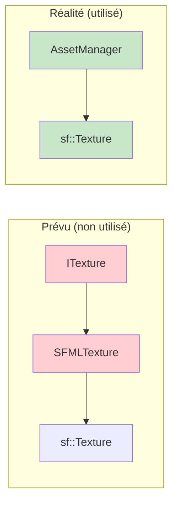

!!! info "Pourquoi cette duplication ?"
    C'est probablement un reste de refactoring. Deux approches coexistent :
    1. **Approche abstraite** : ITexture → SFMLTexture (incomplet)
    2. **Approche pragmatique** : AssetManager utilise directement SFML (fonctionnel)

---

## SFMLRenderer : Le moteur de rendu

### Architecture de SFMLRenderer

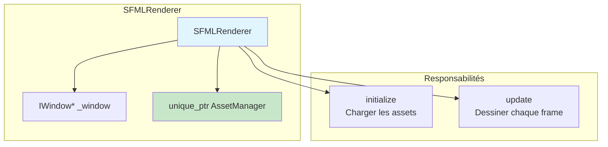

### Fichier header

**Chemin** : `/home/simia/epitech/second_year/projects/rtype/src/client/include/implementations/sfml/SFMLRenderer.hpp`

```cpp
#ifndef SFMLRENDERER_HPP_
#define SFMLRENDERER_HPP_

#include "../../core/IRenderer.hpp"
#include "utils/AssetManager.hpp"
#include <unordered_map>
#include <memory>

class SFMLRenderer: public core::IRenderer {
    public:
        // Constructeur avec injection de dépendance
        SFMLRenderer(graphics::IWindow* window);

        // Initialisation : charge les ressources
        void initialize() override;

        // Update : dessine tous les sprites
        void update() override;

    private:
        graphics::IWindow* _window;           // Pointeur vers la fenêtre (non possédé)
        std::unique_ptr<AssetManager> mAsset; // AssetManager (possédé)
};

#endif /* !SFMLRENDERER_HPP_ */
```

### Fichier implémentation

**Chemin** : `/home/simia/epitech/second_year/projects/rtype/src/client/implementations/sfml/SFMLRenderer.cpp`

```cpp
#include "implementations/sfml/SFMLRenderer.hpp"

SFMLRenderer::SFMLRenderer(graphics::IWindow* window)
    : _window{window}, mAsset{std::make_unique<AssetManager>()}
{
    // Initialisation de l'AssetManager via make_unique
}

void SFMLRenderer::initialize()
{
    // Exemple de chargement d'une image de test
    std::string bedRoomFile = "assets/spaceship/bedroom.jpg";

    // 1. Enregistrer la texture dans le cache
    mAsset->registerTexture(bedRoomFile);

    // 2. Créer un sprite avec cette texture
    sf::Sprite bedRoomSprite(mAsset->getTexture(bedRoomFile));

    // 3. Ajouter le sprite au pool
    mAsset->addSprite(bedRoomFile, bedRoomSprite);
}

void SFMLRenderer::update()
{
    // Dessine tous les sprites enregistrés
    mAsset->drawAll(_window);
}
```

### Analyse détaillée

#### Constructeur : Injection de dépendance

```cpp
SFMLRenderer::SFMLRenderer(graphics::IWindow* window)
    : _window{window}, mAsset{std::make_unique<AssetManager>()}
```

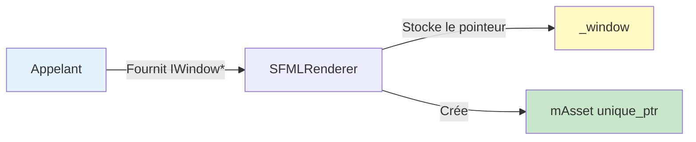

**Pourquoi `unique_ptr` pour AssetManager ?**

```cpp
std::unique_ptr<AssetManager> mAsset;
```

- **Possession exclusive** : Le `SFMLRenderer` possède l'`AssetManager`
- **Destruction automatique** : Pas besoin de `delete` manuel
- **Sémantique de mouvement** : On peut transférer la possession

**Pourquoi un pointeur brut pour la fenêtre ?**

```cpp
graphics::IWindow* _window;
```

- **Non possédé** : La fenêtre appartient à quelqu'un d'autre
- **Référence faible** : Le renderer ne doit pas détruire la fenêtre
- **Injection** : Permet de changer de fenêtre facilement

!!! tip "Règle d'or des pointeurs"
    - `unique_ptr` : Je possède cet objet
    - `shared_ptr` : Nous possédons cet objet ensemble
    - `T*` (pointeur brut) : Je ne possède PAS cet objet

#### initialize() : Chargement des ressources

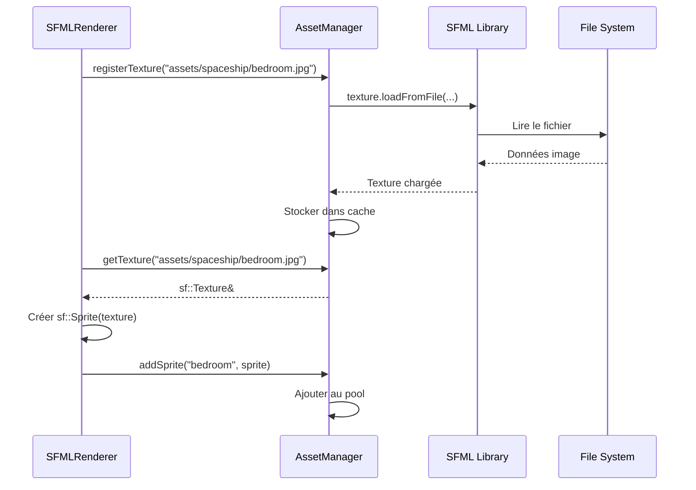

**Détails de l'implémentation :**

```cpp
// 1. Chemin du fichier
std::string bedRoomFile = "assets/spaceship/bedroom.jpg";

// 2. Enregistrer la texture
mAsset->registerTexture(bedRoomFile);
// → Charge le fichier et le met en cache

// 3. Récupérer la texture du cache
sf::Sprite bedRoomSprite(mAsset->getTexture(bedRoomFile));
// → Crée un sprite qui utilise la texture

// 4. Ajouter au pool de sprites
mAsset->addSprite(bedRoomFile, bedRoomSprite);
// → Le sprite sera dessiné automatiquement par update()
```

!!! note "Pourquoi deux étapes (register puis get) ?"
    C'est une garantie de sécurité :
    1. `registerTexture()` charge et met en cache
    2. `getTexture()` retourne une référence à la texture cachée
    3. Si la texture n'existe pas, `getTexture()` lève une exception

#### update() : Rendu de tous les sprites

```cpp
void SFMLRenderer::update()
{
    mAsset->drawAll(_window);
}
```

Simple délégation à l'AssetManager. C'est lui qui connaît tous les sprites à dessiner.

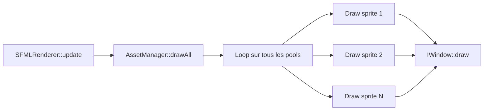

### Exemple d'utilisation complète

```cpp
#include "implementations/sfml/SFMLRenderer.hpp"
#include "implementations/sfml/SFMLWindow.hpp"

int main() {
    // 1. Créer la fenêtre
    SFMLWindow window;
    window.initialize({1920, 1080}, "R-Type");

    // 2. Créer le renderer (injection de la fenêtre)
    SFMLRenderer renderer(&window);

    // 3. Initialiser le renderer (charge les assets)
    renderer.initialize();

    // 4. Boucle de jeu
    while (window.isOpen()) {
        // Effacer le back buffer
        window.clear();

        // Dessiner tous les sprites via le renderer
        renderer.update();

        // Afficher (swap buffers)
        window.display();
    }

    return 0;
}
```

### Pattern Observable/Observer potentiel

Le `SFMLRenderer` pourrait évoluer vers un pattern Observer pour notifier des changements :

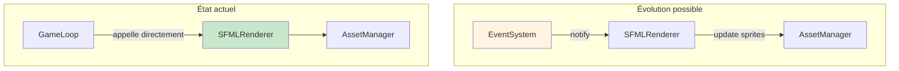

---

## Diagrammes de séquence détaillés

### Séquence complète : De main() au rendu

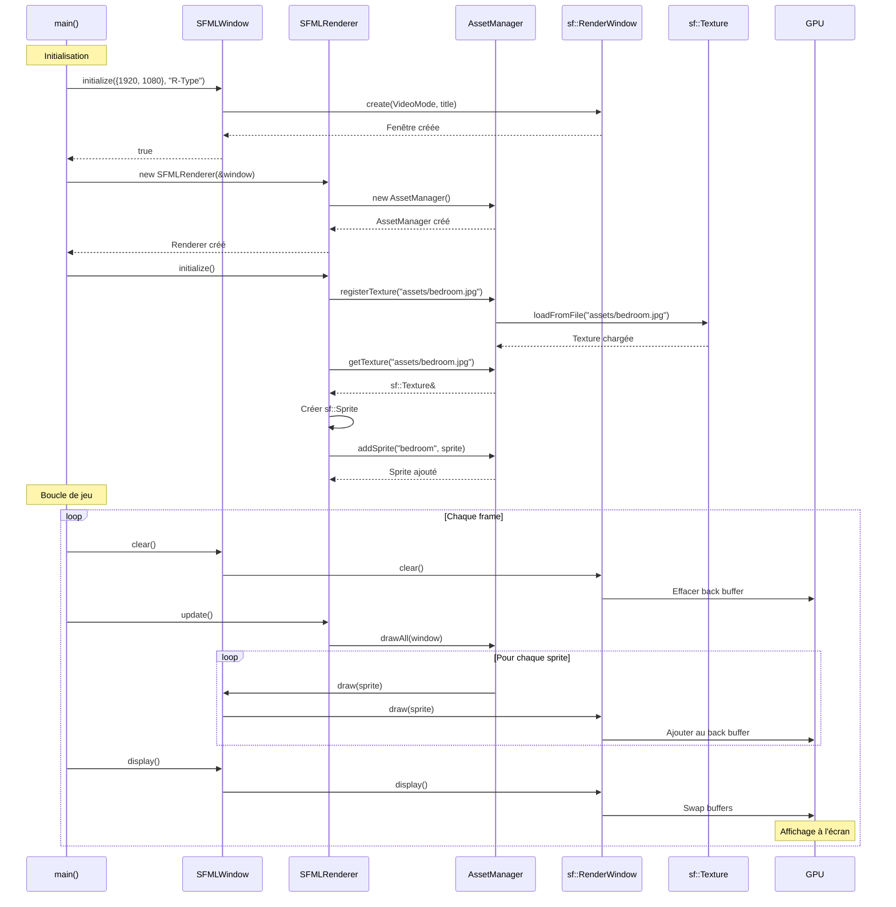

### Séquence de chargement de texture avec cache

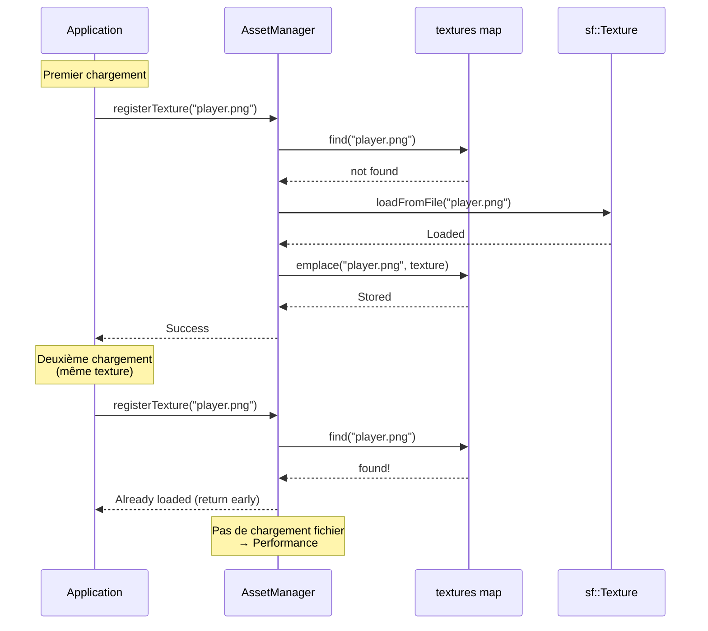

---

## Exemples pratiques avancés

### Exemple 1 : Charger plusieurs sprites animés

```cpp
#include "implementations/sfml/SFMLRenderer.hpp"

class GameRenderer : public SFMLRenderer {
public:
    GameRenderer(graphics::IWindow* window) : SFMLRenderer(window) {}

    void initialize() override {
        // Charger les textures de différents objets
        mAsset->registerTexture("assets/player/idle.png");
        mAsset->registerTexture("assets/player/move.png");
        mAsset->registerTexture("assets/enemies/boss.png");
        mAsset->registerTexture("assets/background/space.png");

        // Créer le background
        sf::Sprite bgSprite(mAsset->getTexture("assets/background/space.png"));
        bgSprite.setPosition(0, 0);
        mAsset->addSprite("background", bgSprite);

        // Créer le joueur
        sf::Sprite playerSprite(mAsset->getTexture("assets/player/idle.png"));
        playerSprite.setPosition(100, 500);
        mAsset->addSprite("player", playerSprite);

        // Créer plusieurs ennemis
        for (int i = 0; i < 5; i++) {
            sf::Sprite enemySprite(mAsset->getTexture("assets/enemies/boss.png"));
            enemySprite.setPosition(300 + i * 150, 200);
            mAsset->addSprite("enemies", enemySprite);
        }
    }
};
```

### Exemple 2 : Animation de sprites

```cpp
class AnimatedRenderer : public SFMLRenderer {
private:
    float playerX = 100.f;
    float playerY = 500.f;

public:
    AnimatedRenderer(graphics::IWindow* window) : SFMLRenderer(window) {}

    void initialize() override {
        mAsset->registerTexture("assets/player.png");
    }

    void update() override {
        // Déplacer le joueur
        playerX += 2.f;
        if (playerX > 1920) playerX = 0;

        // Recréer le sprite à la nouvelle position
        // Note : Ce n'est pas optimal, voir "Problème de performance" ci-dessous
        sf::Sprite playerSprite(mAsset->getTexture("assets/player.png"));
        playerSprite.setPosition(playerX, playerY);

        // Ajouter au pool (écrase l'ancien)
        mAsset->addSprite("player", playerSprite);

        // Dessiner
        SFMLRenderer::update();
    }
};
```

!!! danger "Problème de performance"
    L'exemple ci-dessus recrée le sprite à chaque frame. C'est inefficace ! Voir la section [asset-manager.md](./asset-manager.md) pour une meilleure approche avec les pools de sprites.

### Exemple 3 : Gestion d'erreurs robuste

```cpp
class SafeRenderer : public SFMLRenderer {
public:
    SafeRenderer(graphics::IWindow* window) : SFMLRenderer(window) {}

    void initialize() override {
        std::vector<std::string> requiredAssets = {
            "assets/player.png",
            "assets/background.png",
            "assets/enemies/alien.png"
        };

        bool allLoaded = true;

        for (const auto& assetPath : requiredAssets) {
            try {
                mAsset->registerTexture(assetPath);
                std::cout << "✓ Loaded: " << assetPath << std::endl;
            } catch (const std::exception& e) {
                std::cerr << "✗ Failed to load: " << assetPath << std::endl;
                std::cerr << "  Error: " << e.what() << std::endl;
                allLoaded = false;
            }
        }

        if (!allLoaded) {
            throw std::runtime_error("Failed to load all required assets");
        }

        // Créer les sprites seulement si tout est chargé
        createSprites();
    }

private:
    void createSprites() {
        sf::Sprite bgSprite(mAsset->getTexture("assets/background.png"));
        mAsset->addSprite("background", bgSprite);

        sf::Sprite playerSprite(mAsset->getTexture("assets/player.png"));
        playerSprite.setPosition(100, 500);
        mAsset->addSprite("player", playerSprite);
    }
};
```

---

## Debugging et troubleshooting

### Problèmes courants

#### 1. Fenêtre noire (rien ne s'affiche)

**Symptômes** : La fenêtre s'ouvre mais reste noire.

**Causes possibles** :

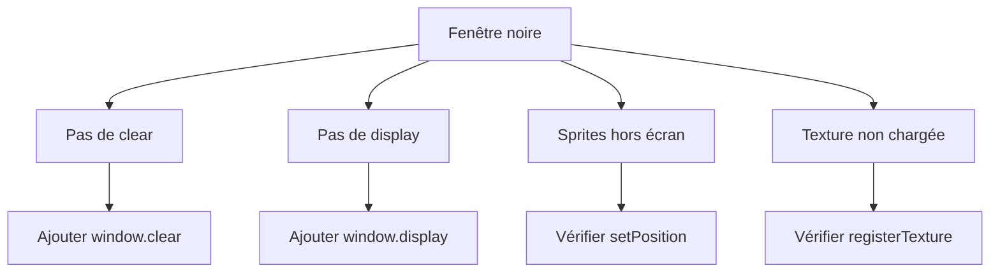

**Solution** :

```cpp
// ✅ Cycle complet de rendu
while (window.isOpen()) {
    window.clear();        // 1. Effacer
    renderer.update();     // 2. Dessiner
    window.display();      // 3. Afficher
}

// ❌ Manque display()
while (window.isOpen()) {
    window.clear();
    renderer.update();
    // Pas de display() → Rien ne s'affiche !
}
```

#### 2. Texture not found / Crash

**Symptômes** : Exception `std::out_of_range` ou message d'erreur.

**Cause** : Texture non enregistrée avant utilisation.

```cpp
// ❌ Mauvais ordre
sf::Sprite sprite(assetManager.getTexture("player.png"));  // CRASH !
assetManager.registerTexture("player.png");  // Trop tard

// ✅ Bon ordre
assetManager.registerTexture("player.png");  // D'abord charger
sf::Sprite sprite(assetManager.getTexture("player.png"));  // Ensuite utiliser
```

#### 3. Performance dégradée (FPS bas)

**Causes possibles** :

1. **Rechargement de textures chaque frame**
   ```cpp
   // ❌ Très mauvais
   while (running) {
       assetManager.registerTexture("texture.png");  // Recharge à chaque frame !
   }

   // ✅ Bon
   assetManager.registerTexture("texture.png");  // Une seule fois
   while (running) {
       // Utilise la texture cachée
   }
   ```

2. **Trop de sprites créés**
   ```cpp
   // ❌ Crée 1000 sprites chaque frame
   void update() {
       for (int i = 0; i < 1000; i++) {
           sf::Sprite s(texture);
           assetManager.addSprite("enemy", s);
       }
   }
   ```

#### 4. Fenêtre ne se ferme pas

**Cause** : Pas de gestion des événements.

**Solution** : L'interface `IWindow` ne gère pas les événements. Il faut ajouter cette fonctionnalité :

```cpp
// Extension nécessaire (pas dans le code actuel)
class SFMLWindow : public graphics::IWindow {
public:
    void processEvents() {
        sf::Event event;
        while (_window.pollEvent(event)) {
            if (event.type == sf::Event::Closed)
                _window.close();
        }
    }
};

// Utilisation
while (window.isOpen()) {
    window.processEvents();  // Gérer les événements
    window.clear();
    renderer.update();
    window.display();
}
```

### Outils de debugging

#### Vérifier les textures chargées

```cpp
class DebugAssetManager : public AssetManager {
public:
    void printLoadedTextures() {
        std::cout << "=== Textures chargées ===" << std::endl;
        for (const auto& [key, texture] : textures) {
            auto size = texture.getSize();
            std::cout << "- " << key
                      << " (" << size.x << "x" << size.y << ")"
                      << std::endl;
        }
    }
};
```

#### Afficher les FPS

```cpp
#include <SFML/System/Clock.hpp>

class FPSCounter {
private:
    sf::Clock clock;
    int frameCount = 0;
    float fps = 0.f;

public:
    void update() {
        frameCount++;
        if (clock.getElapsedTime().asSeconds() >= 1.0f) {
            fps = frameCount / clock.getElapsedTime().asSeconds();
            std::cout << "FPS: " << fps << std::endl;
            frameCount = 0;
            clock.restart();
        }
    }

    float getFPS() const { return fps; }
};
```

---

## Résumé

Les trois classes principales de l'implémentation SFML sont :

| Classe | Rôle | État |
|--------|------|------|
| **SFMLWindow** | Wrapper autour de `sf::RenderWindow` | Fonctionnelle |
| **SFMLTexture** | Wrapper autour de `sf::Texture` | Incomplète, non utilisée |
| **SFMLRenderer** | Orchestrateur du rendu | Fonctionnelle |

**Points clés** :

1. **SFMLWindow** implémente le pattern Adapter de manière propre
2. **SFMLTexture** est une abstraction prévue mais non utilisée (AssetManager la remplace)
3. **SFMLRenderer** coordonne la fenêtre et l'AssetManager
4. Le système utilise le double buffering pour un rendu fluide
5. AssetManager gère le cache des textures (voir [asset-manager.md](./asset-manager.md))

!!! tip "Prochaines étapes"
    Consultez [asset-manager.md](./asset-manager.md) pour comprendre le système de cache et d'optimisation des ressources graphiques.
