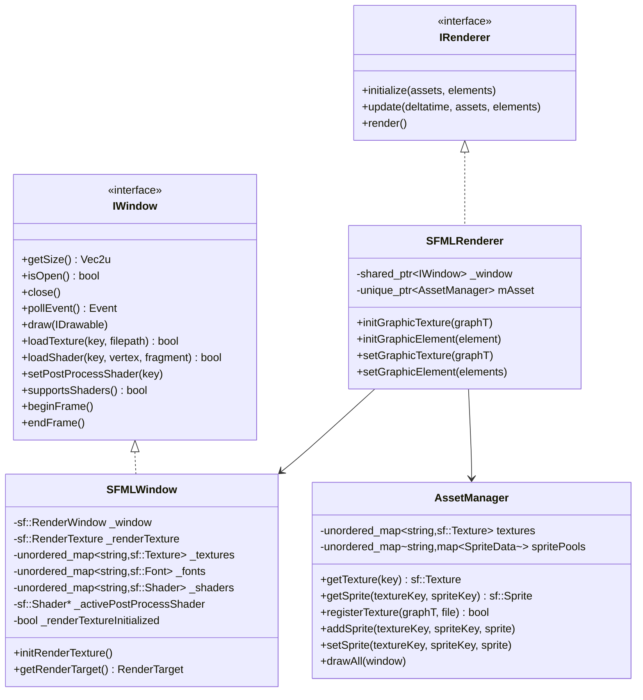
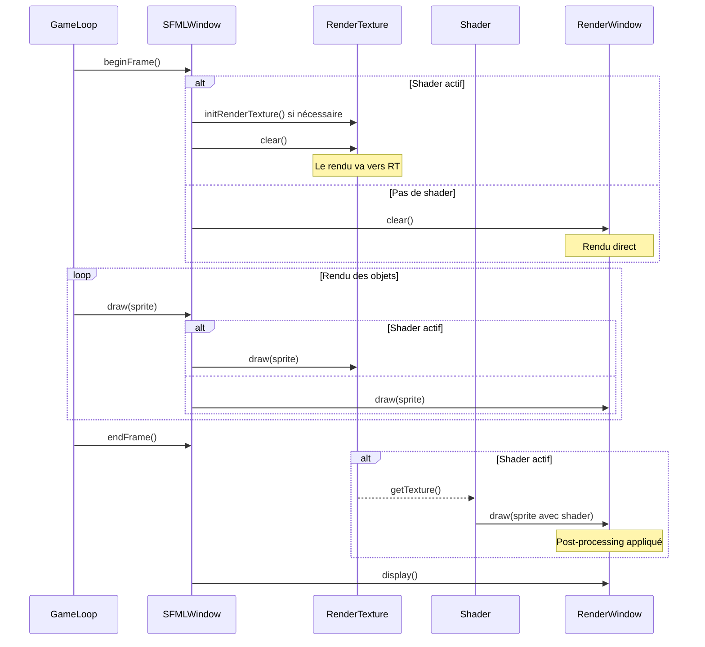

# Backend SFML

!!! abstract "API Reference"
    **Module** : `src/client/lib/sfml/`
    **Backend** : SFML 3.0+
    **Statut** : Backend alternatif avec support shaders

## Vue d'ensemble

Le backend SFML fournit une implémentation complète du système graphique avec support natif des shaders GLSL et du post-processing. C'est le backend recommandé pour les fonctionnalités d'accessibilité (filtres daltonisme).



---

## SFMLWindow

### Description

`SFMLWindow` est l'implémentation de l'interface `IWindow` utilisant SFML 3.0+. Elle offre :

- Support natif des shaders GLSL
- Pipeline de post-processing complet via `sf::RenderTexture`
- Cache de textures, fonts et shaders
- Gestion des événements

### Constructeur

```cpp
SFMLWindow(Vec2u winSize, const std::string& name);
```

| Paramètre | Type | Description |
|-----------|------|-------------|
| `winSize` | `Vec2u` | Dimensions de la fenêtre (largeur, hauteur) |
| `name` | `std::string` | Titre de la fenêtre |

### Membres Privés

```cpp
private:
    sf::RenderWindow _window;                              // Fenêtre principale
    std::unordered_map<std::string, sf::Texture> _textures; // Cache textures
    std::unordered_map<std::string, sf::Font> _fonts;       // Cache fonts

    // Post-processing pipeline
    sf::RenderTexture _renderTexture;                       // Texture de rendu
    std::unordered_map<std::string, sf::Shader> _shaders;   // Cache shaders
    sf::Shader* _activePostProcessShader = nullptr;         // Shader actif
    bool _renderTextureInitialized = false;
```

### Méthodes Principales

#### Gestion de la Fenêtre

```cpp
Vec2u getSize() const override;     // Retourne les dimensions
bool isOpen() override;             // Vérifie si ouverte
void close() override;              // Ferme la fenêtre
events::Event pollEvent() override; // Récupère le prochain événement
```

#### Rendu de Base

```cpp
void draw(const graphics::IDrawable& drawable) override;
void draw(sf::Sprite& sprite);  // Surcharge SFML native (non-override)

void drawRect(float x, float y, float width, float height, rgba color) override;
void drawSprite(const std::string& textureKey, float x, float y, float width, float height) override;
void drawText(const std::string& fontKey, const std::string& text,
              float x, float y, unsigned int size, rgba color) override;

void clear() override;
void display() override;
```

#### Gestion des Ressources

```cpp
bool loadTexture(const std::string& key, const std::string& filepath) override;
bool loadFont(const std::string& key, const std::string& filepath) override;
void* getNativeHandle() override;  // Retourne un pointeur vers sf::RenderWindow
```

#### Support Shaders (SFML exclusif)

```cpp
bool loadShader(const std::string& key,
                const std::string& vertexPath,
                const std::string& fragmentPath) override;
void setPostProcessShader(const std::string& key) override;
void clearPostProcessShader() override;
void setShaderUniform(const std::string& name, int value) override;
bool supportsShaders() const override;  // Retourne true
```

#### Frame Management avec Post-Processing

```cpp
void beginFrame() override;  // Redirige le rendu vers RenderTexture si shader actif
void endFrame() override;    // Applique le post-processing et affiche
```

### Pipeline de Post-Processing

Quand un shader de post-processing est actif, le rendu est redirigé vers une `sf::RenderTexture` :



### Méthodes Internes

```cpp
private:
    void initRenderTexture();           // Initialise la RenderTexture à la taille de la fenêtre
    sf::RenderTarget& getRenderTarget(); // Retourne RT si shader actif, sinon window
```

---

## SFMLRenderer

### Description

`SFMLRenderer` implémente l'interface `IRenderer` et orchestre le pipeline de rendu SFML via l'AssetManager.

### Constructeur

```cpp
SFMLRenderer(std::shared_ptr<graphics::IWindow> window);
```

### Méthodes

```cpp
void initialize(GraphicAssets& assets, GraphicAssetsE& elements) override;
void update(float deltatime, GraphicAssets& assets, GraphicAssetsE& elements) override;
void render() override;

// Initialisation des assets graphiques
void initGraphicTexture(graphic::GraphicTexture& graphT);
void initGraphicElement(graphic::GraphicElement& element);

// Mise à jour des assets
void setGraphicTexture(graphic::GraphicTexture& graphT);
void setGraphicElement(graphic::GraphicElement& elements);
```

### Membres Privés

```cpp
private:
    std::shared_ptr<graphics::IWindow> _window;
    std::unique_ptr<AssetManager> mAsset;
```

---

## AssetManager (SFML)

### Description

Gestionnaire de ressources SFML avec cache de textures, sprite pools et logging intégré (spdlog).

**Fichier** : `src/client/lib/sfml/include/utils/AssetManager.hpp`

### Structure SpriteData

```cpp
struct SpriteData {
    sf::Sprite sprite;
};
```

### Constructeur

```cpp
AssetManager();
```

### Méthodes

#### Gestion des Textures

```cpp
sf::Texture& getTexture(const std::string& key);
bool registerTexture(graphic::GraphicTexture& graphT, const std::string& file);
void removeTexture(const std::string& file);
```

#### Gestion des Sprites

```cpp
sf::Sprite& getSprite(const std::string& textureKey, const std::string& spriteKey);
void addSprite(const std::string& textureKey, const std::string& spriteKey, const sf::Sprite& sprite);
void setSprite(const std::string& textureKey, const std::string& spriteKey, const sf::Sprite& sprite);
void removeSprite(const std::string& textureKey, const std::string& spriteKey);
```

#### Rendu

```cpp
void drawAll(sf::RenderWindow* window);
```

### Logging Intégré

L'AssetManager utilise le système de logging spdlog :

```cpp
#include "core/Logger.hpp"

auto logger = client::logging::Logger::getGraphicsLogger();
logger->debug("Texture '{}' registered successfully", file);
logger->error("Failed to load texture from file: {}", file);
```

---

## SFMLPlugin

### Description

Plugin pour le chargement dynamique du backend SFML.

**Fichier** : `src/client/lib/sfml/include/plugins/SFMLPlugin.hpp`

### Interface

```cpp
class SFMLPlugin : public graphics::IGraphicPlugin {
public:
    const char* getName() const override;

    std::shared_ptr<IWindow> createWindow(
        Vec2u winSize, const std::string& name
    ) override;

    std::shared_ptr<core::IRenderer> createRenderer(
        std::shared_ptr<graphics::IWindow> window
    ) override;
};
```

### Fonctions d'Export

```cpp
extern "C" graphics::IGraphicPlugin* create_plugin();
extern "C" void destroy_plugin(graphics::IGraphicPlugin* plugin);
```

---

## Shaders GLSL

### Shaders de Post-Processing

Le backend SFML supporte les shaders GLSL pour le post-processing.

**Exemple : Shader Passthrough (Vertex)**

```glsl
// passthrough.vert
void main()
{
    gl_Position = gl_ModelViewProjectionMatrix * gl_Vertex;
    gl_TexCoord[0] = gl_TextureMatrix[0] * gl_MultiTexCoord0;
    gl_FrontColor = gl_Color;
}
```

**Exemple : Shader Grayscale (Fragment)**

```glsl
// grayscale.frag
uniform sampler2D texture;

void main()
{
    vec4 pixel = texture2D(texture, gl_TexCoord[0].xy);
    float gray = dot(pixel.rgb, vec3(0.299, 0.587, 0.114));
    gl_FragColor = vec4(gray, gray, gray, pixel.a);
}
```

### Shaders d'Accessibilité (Daltonisme)

Le projet inclut des shaders pour différents types de daltonisme :

| Shader | Type | Description |
|--------|------|-------------|
| `protanopia.frag` | Protanopie | Correction pour cécité au rouge |
| `deuteranopia.frag` | Deutéranopie | Correction pour cécité au vert |
| `tritanopia.frag` | Tritanopie | Correction pour cécité au bleu |

### Utilisation des Shaders

```cpp
#include "SFMLWindow.hpp"

// Charger le shader
window.loadShader("colorblind",
    "shaders/passthrough.vert",
    "shaders/protanopia.frag");

// Activer le post-processing
window.setPostProcessShader("colorblind");

// Boucle de rendu
while (window.isOpen()) {
    window.beginFrame();  // Redirige vers RenderTexture

    // Rendu normal
    window.drawSprite("player", 100, 200, 64, 64);

    window.endFrame();    // Applique le shader et affiche
}

// Désactiver le shader
window.clearPostProcessShader();
```

---

## Exemple Complet

```cpp
#include "SFMLWindow.hpp"
#include "SFMLRenderer.hpp"

int main() {
    // Création de la fenêtre SFML
    auto window = std::make_shared<SFMLWindow>(Vec2u{1920, 1080}, "R-Type");

    // Création du renderer
    auto renderer = std::make_shared<SFMLRenderer>(window);

    // Chargement des ressources
    window->loadTexture("player", "assets/player.png");
    window->loadTexture("background", "assets/background.png");
    window->loadFont("main", "assets/fonts/arial.ttf");

    // Optionnel : Charger un shader de post-processing
    if (window->supportsShaders()) {
        window->loadShader("accessibility",
            "shaders/passthrough.vert",
            "shaders/deuteranopia.frag");
        // window->setPostProcessShader("accessibility");
    }

    // Boucle de jeu
    while (window->isOpen()) {
        // Gestion des événements
        auto event = window->pollEvent();
        if (std::holds_alternative<events::WindowClosed>(event)) {
            window->close();
        }

        // Rendu
        window->beginFrame();

        window->drawSprite("background", 0, 0, 1920, 1080);
        window->drawSprite("player", 100, 200, 64, 64);
        window->drawText("main", "Score: 1000", 10, 10, 24, {255, 255, 255, 255});

        window->endFrame();
    }

    return 0;
}
```

---

## Comparaison avec SDL2

| Fonctionnalité | SDL2 | SFML |
|----------------|------|------|
| Fenêtre | ✅ | ✅ |
| Rendu 2D | ✅ | ✅ |
| Textures | ✅ | ✅ |
| Fonts (TTF) | ✅ | ✅ |
| Événements | ✅ | ✅ |
| Shaders GLSL | ❌ | ✅ |
| Post-processing | ❌ | ✅ |
| RenderTexture | ❌ | ✅ |
| API C++ moderne | Partiel | ✅ |

---

## Dépendances

| Bibliothèque | Version | Usage |
|--------------|---------|-------|
| SFML | 3.0+ | Fenêtre, rendu, audio, réseau |

### Installation (vcpkg)

```bash
vcpkg install sfml
```

### Installation (depuis les sources)

```bash
git clone https://github.com/SFML/SFML.git
cd SFML && mkdir build && cd build
cmake .. && make && sudo make install
```

---

## Troubleshooting

!!! warning "Shader ne fonctionne pas"
    Vérifiez que votre carte graphique supporte OpenGL 2.0+ et que les fichiers shader existent.

!!! warning "Texture blanche/noire"
    Vérifiez le chemin du fichier et que la texture a été chargée avec `loadTexture()` avant utilisation.

!!! warning "Post-processing ne s'applique pas"
    Assurez-vous d'utiliser `beginFrame()`/`endFrame()` et non `clear()`/`display()` directement.

---

## Voir Aussi

- [Vue d'ensemble Graphics](index.md)
- [Backend SDL2](sdl2-implementation.md)
- [AssetManager](asset-manager.md)
- [Accessibilité](../../guides/accessibility.md)
- [Documentation SFML](https://www.sfml-dev.org/documentation/3.0.0/)
